# OntoSage Pre-Design Survey: Findings and Analysis

**Study:** A Survey-Based Corpus Study to Characterise Natural Language Interaction Needs for Smart Buildings
**Ethics Reference:** COMSC/Ethics/2025/044b — Cardiff University SREC
**Author:** Suhas Devmane, Cardiff University
**Supervisors:** Prof. Omer Rana, Prof. Charith Perera
**Date:** June 2026

---

## How to read this document

I designed this survey *before* building OntoSage so that the system would answer the questions real building users actually ask, rather than the questions an engineer assumes they ask. This document reports the full analysis I carried out — every elicitation stage, every statistical test, every figure — and then shows how each finding fed a concrete design decision in the deployed system.

The document is organised in the order I executed the work:

- **Phase A** — who took part and how I cleaned the data
- **Phase B** — how I built and validated the query taxonomy, and what the corpus looks like
- **Phase C** — how the four elicitation methods changed the questions people asked (RQ2)
- **Phase D** — how a user's persona shapes what they ask about (RQ3)
- **Phase E** — which building domains users prioritise (RQ4)
- **Phase F** — within a topic, which depth of question users actually want (RQ5)
- **Phase G** — the framework and capability requirements I derived from the corpus (RQ6)
- **Phase H** — how the finished OntoSage system performs when I replay the originally-collected survey questions through it
- **Post-design study** — usability and acceptance results from 15 people who used the live system

---

## Table of Contents

1. [Executive Summary](#1-executive-summary)
   - [Consolidated Survey Findings (SF1–SF24)](#consolidated-survey-findings-sf1sf24)
2. [Research Questions and Study Design](#2-research-questions-and-study-design)
3. [Phase A — Participants and Data Quality](#3-phase-a--participants-and-data-quality)
4. [Phase B — Taxonomy and Corpus Characterisation (RQ1)](#4-phase-b--taxonomy-and-corpus-characterisation-rq1)
5. [Phase C — How Elicitation Method Shapes Queries (RQ2)](#5-phase-c--how-elicitation-method-shapes-queries-rq2)
6. [Phase D — How Persona Shapes Queries (RQ3)](#6-phase-d--how-persona-shapes-queries-rq3)
7. [Phase E — Topic Prioritisation (RQ4)](#7-phase-e--topic-prioritisation-rq4)
8. [Phase F — Question-Depth Preferences (RQ5)](#8-phase-f--question-depth-preferences-rq5)
9. [Phase G — Framework and Capability Requirements (RQ6)](#9-phase-g--framework-and-capability-requirements-rq6)
10. [Phase H — Evaluating OntoSage Against the Corpus](#10-phase-h--evaluating-ontosage-against-the-corpus)
11. [Post-Design Study — Usability and Acceptance](#11-post-design-study--usability-and-acceptance)
12. [From Findings to System Design](#12-from-findings-to-system-design)
13. [Limitations](#13-limitations)
14. [Conclusions](#14-conclusions)

---

## 1. Executive Summary

I collected **6,117 unique natural language questions** from **96 participants** spanning eight occupant personas, using a four-stage elicitation instrument that I designed to progressively surface different kinds of information need. After cleaning and persona-stratification the analysis corpus comprises **7,151 question records**. A separate group of **91 participants** completed a full priority ranking of 20 building domains, and **760 within-topic rankings** captured the depth of question people prefer inside each domain.

Six findings define the study:

| # | Finding | Primary evidence |
|---|---------|-----------------|
| 1 | The query space is led by energy, safety and comfort: Energy, Safety and Air Quality account for **37.7%** of all questions | Phase B |
| 2 | **91.7%** of questions are simple information requests; only **3.5%** require multi-step reasoning | Phase B |
| 3 | The elicitation method significantly changes what users ask about and how verbosely; complexity also shifts, but the effect is negligible in magnitude (Kruskal–Wallis, *p* < 10⁻³⁹ for length; *p* = 0.002, ε² = 0.002 for complexity) | Phase C |
| 4 | A user's persona is a statistically reliable predictor of the domain they query (χ²(133) = 3903.9, *p* ≈ 0, Cramér's V = 0.28 — a medium effect) | Phase D |
| 5 | Air Quality, Indoor Temperature and Fire Safety are the consensus top-three priorities (Borda 1378, 1367, 1267) | Phase E |
| 6 | **20.5%** of questions fall outside the current building ontology — the requirement that drove the capability knowledge base and graceful-refusal design | Phase G |

When I replay the originally-collected survey corpus (5,865 questions evaluated) through the finished OntoSage system, it produces a useful answer for **63.9%** of all questions (including the off-ontology fraction), with a median latency of **5.33 s**. In the live deployment, 15 users completed **98.3%** of their tasks and rated the system **84.5 on the System Usability Scale** — in the "Excellent" band — with **93.3%** saying they would adopt it.

---

## Consolidated Survey Findings (SF1–SF24)

This is the definitive list of the statements I make on the basis of the analysis. Each finding has a stable identifier (SF*n*), the phase and evidence it comes from, and the design requirement it implies for OntoSage. I use these identifiers throughout the rest of the document, and they are the anchor points for the separate findings-to-implementation traceability document.

### Corpus composition (Phase A–B)

- **SF1 — The query space is energy-, safety- and comfort-led.** Energy (17.5%), Safety (10.7%) and Air Quality (9.6%) are the three largest building domains, together accounting for **37.7%** of all questions; Thermal (8.3%) follows closely. *Implication:* instrument energy, safety and the comfort domains first and most densely in the ontology.
- **SF2 — Users overwhelmingly ask "what is" and "can it".** STATUS (67.0%) and CAPABILITY (23.8%) query types make up **90.9%** of the corpus. *Implication:* a fast real-time status path and a dedicated capability knowledge base are the two highest-value capabilities.
- **SF3 — Intent is overwhelmingly informational.** 91.7% of questions are INFORMATIONAL; diagnostic (3.9%), prescriptive (3.2%) and predictive (1.2%) are rare. *Implication:* the default answer path must be optimised for fast information retrieval, not deep reasoning.
- **SF4 — Complexity is long-tailed but the tail is essential.** 88.0% of questions are single-retrieval LOOKUPs, 8.5% AGGREGATION, and only **3.5% MULTI_STEP** — but 147 of the 280 diagnostic-intent questions live in that multi-step tail. *Implication:* the system needs two answer paths — a fast lookup path and an orchestrated multi-step path for "why" questions.
- **SF5 — A fifth of all input is off-ontology.** **20.5%** of questions (1,467) carry no concept that Brick / ASHRAE 223 can model — amenity, wayfinding, hospitality and chit-chat. *Implication:* a graceful-refusal boundary path plus a capability KB to absorb the answerable part of this bucket.
- **SF6 — Most questions name no location.** 73.9% of questions leave spatial scope UNSPECIFIED; only 14.0% are building-wide and 9.9% room-level. *Implication:* the system must resolve a sensible default spatial scope rather than demanding the user specify one.
- **SF7 — Temporal scope is dominated by static and live state.** 89.9% STATIC, 8.0% REALTIME, and under 3% historical or predictive. *Implication:* freshness and caching policy should default to live/static and treat historical retrieval as the exception.
- **SF8 — The taxonomy is reproducibly codeable.** A six-tuple taxonomy `(domain, query_type, intent, temporal, spatial, complexity)` classifies 79.5% of the corpus to an on-topic domain via a deterministic, auditable classifier, with an IRR validation gate (target Cohen's κ ≥ 0.70) defined. *Implication:* the taxonomy doubles as the runtime classification contract for the dialogue agent.

### Elicitation method effects (Phase C)

- **SF9 — Elicitation framing changes vocabulary, with only a negligible change in complexity.** Question length rises significantly across stages (Kruskal–Wallis H = 185.5, *p* < 10⁻³⁹) and each stage has a distinct TF-IDF vocabulary signature; complexity is statistically detectable but negligible in magnitude (*p* = 0.002, ε² = 0.002). *Implication:* intent classification must depend on query *meaning*, not surface keywords — hence an LLM-based classifier rather than stage-specific lexicons.
- **SF10 — No single elicitation mode captures the space.** Each stage contributes **70–82% semantically novel** questions relative to the same user's earlier answers; topical diversity rises from 2.35 (S1) to 2.52 (S4). *Implication:* validates that the four-stage instrument was necessary, and that the corpus is broad rather than repetitive.
- **SF11 — Context priming raises grounded answerability.** The goal-oriented stage (S4) produces the highest grounded-answer rate (33.3%) and the sensor-aware stage (S2) shifts air-quality questions toward instrument-level content. *Implication:* richer user context yields more answerable, data-grounded queries — the system should encourage goal-framed phrasing.

### Persona effects (Phase D)

- **SF12 — Persona reliably predicts domain, with a medium effect.** Persona × domain independence is rejected with χ²(133) = 3903.9, *p* ≈ 0, and the effect size is medium (Cramér's V = 0.279). *Implication:* treat persona as a *strong weighted prior* — the empirical basis for a blended-persona registry. The effect strengthened once the specialist Sustainability and Health & Safety personas, whose questions are highly domain-concentrated, were well represented.
- **SF13 — Personas differ in internal coherence.** Sustainability teams agree most strongly on priorities (Kendall's W = 0.614), followed by Health & Safety (0.533) and Occupants (0.508); Facility Managers and IT are diffuse (W ≈ 0.31). *Implication:* the specialist and Occupant personas can be optimised tightly; FM/IT personas must tolerate within-persona variation.
- **SF14 — Eight distinct personas exist.** Student (high volume, low complexity), Guest (amenity/comfort), Occupant (most coherent lay group, comfort-first), Health & Safety (safety-saturated, prefers predictive depth), Sustainability/Energy (energy-saturated, the deepest analytical appetite), IT (highest diagnostic + multi-step), Facility Manager (operational, multi-step preference), Building Owner (energy + temperature). *Implication:* a single interface must adapt on two axes — domain focus *and* analytical depth.

### Topic priorities (Phase E)

- **SF15 — The consensus top cluster is comfort and safety.** Air Quality (Borda 1378), Indoor Temperature (1367), Fire Safety (1267) and Security (1240) form a tight top-four. *Implication:* these define the launch priority tier for grounded answering.
- **SF16 — Consensus is moderate, not universal.** Overall Kendall's W = 0.206 across 91 rankers. *Implication:* priority weighting should be persona-stratified, not a single global ordering.
- **SF17 — Topics cluster into four bundles.** Comfort core, Smart-building layer, Sustainability, and Operations clusters emerge from co-ranking correlations. *Implication:* domain routing and persona priors can be organised around these bundles.
- **SF18 — Institutional priorities diverge from occupant priorities.** Carbon Footprint & Net Zero sits in the bottom cluster (17th, Borda 661) despite being a flagship policy goal. *Implication:* optimise the first deployment for the occupant comfort-safety core, not the policy agenda.
- **SF19 — Question volume and stated priority are independent signals.** Energy is asked about most (1,250 questions) yet ranked only 5th; Fire Safety is ranked 3rd yet lower-volume. *Implication:* capability weighting must combine both volume and priority, not either alone.

### Question-depth preferences (Phase F)

- **SF20 — Simple questions are preferred, but depth has a real and growing minority.** L1 lookups are ranked first by 34.9%, yet 43.2% rank an L3/L4 analytical question first. *Implication:* the system must support analytical depth on demand, not only lookups.
- **SF21 — Preferred depth is persona-specific.** Occupants and Students prefer L1; IT uniquely prefers L2 (aggregation); Facility Managers prefer L3 (multi-step); and the Sustainability (66% L4-first) and Health & Safety (54% L4-first) personas prefer the deepest predictive/prescriptive questions. *Implication:* persona-aware complexity routing — never serve a Guest and a Sustainability officer the same depth.

### Framework requirements and gaps (Phase G)

- **SF22 — Five query types cover 96% of demand at launch.** STATUS, CAPABILITY, COMPARISON, ANOMALY and HISTORICAL constitute the P1 tier (96.5% of volume); DIAGNOSTIC and RECOMMENDATION are P3. *Implication:* the launch capability matrix and agent set are defined directly by this tiering.
- **SF23 — Multi-step and diagnostic queries require orchestration.** 248 multi-step and 280 diagnostic-intent questions need chained retrieval, computation and causal reasoning that no single query can serve. *Implication:* a stateful orchestrator (LangGraph) with a SPARQL → SQL → analytics pipeline.
- **SF24 — Responses must be persona-, standards- and freshness-aware.** Distinct persona domain-mixes (SF12), recommendation queries referencing comfort/energy thresholds, and mixed temporal scopes all point to one requirement. *Implication:* the response generator must consult a persona registry, surface ASHRAE / WELL / BREEAM thresholds inline, and vary caching by intent.

---

## 2. Research Questions and Study Design

### 2.1 Research questions

I framed the study around six research questions, each tied to a specific dataset and a specific analytical output:

| RQ | Question |
|----|---------|
| **RQ1** | What types of NL queries do building occupants ask, and how can they be systematically categorised? |
| **RQ2** | How does the elicitation method (open-ended vs. sensor-prompted vs. scenario-based vs. goal-oriented) affect the nature, diversity and complexity of queries? |
| **RQ3** | How does user persona influence query focus and priority? |
| **RQ4** | Which smart building domains do users prioritise, and what is the consensus ranking? |
| **RQ5** | Within prioritised domains, which sub-question types are most valued? |
| **RQ6** | Can the resulting corpus inform the design of a smart building NL query-answering framework? |

### 2.2 The four-stage elicitation design

A single open-ended survey would have captured only people's spontaneous, unaided mental model of a smart building. I wanted the full space of information need, so I treated the *elicitation method itself* as an independent variable and presented every participant with four successive framings. Each stage primes a different way of thinking about the building, and I can measure the effect of that priming directly.

| Stage | Elicitation mode | What it is designed to surface | Questions (analysis corpus) |
|-------|-----------------|------------------------------|----------------------------|
| **S1** | Zero-context / open-ended | The spontaneous mental model — what users think to ask with no prompting | 1,904 |
| **S2** | Sensor-aware (shown a sensor taxonomy) | Whether technical vocabulary unlocks instrument-level queries | 2,003 |
| **S3** | Scenario-based (a building walkthrough) | Place-anchored, situational and wayfinding queries | 1,705 |
| **S4** | Goal-oriented (sustainability / comfort goals) | Prescriptive, predictive and recommendation queries | 1,539 |

This structure gives the study three analytical advantages. First, I can compare stages statistically and show that each one genuinely contributes new query types. Second, because every participant passes through all four stages in order, I can measure *within-participant novelty* — how much of what someone writes in S2–S4 is genuinely new versus a rephrasing of their S1 questions. Third, the four framings map cleanly onto the four intent categories in my taxonomy (informational, diagnostic, prescriptive, predictive), so the design and the coding scheme reinforce one another.

### 2.3 The priority-ranking instrument (Stage 5)

After the four elicitation stages, participants ranked 20 predefined building domains by personal importance, and then ranked four question-depth levels (L1–L4) inside selected topics. This produced the 91 complete topic rankings and 760 question-level rankings that underpin Phases E and F.

### 2.4 Statistical approach

I used non-parametric methods throughout, because the measures are ordinal or non-normal, and I report an effect size alongside every *p*-value so that statistical significance is never confused with practical significance.

| Objective | Method | Effect size |
|-----------|--------|-------------|
| Cross-stage comparison (continuous) | Kruskal–Wallis H + Dunn's post-hoc (Bonferroni) | epsilon² |
| Cross-stage / persona comparison (categorical) | Chi-squared independence | Cramér's V |
| Topic-ranking agreement across users | Kendall's W | — |
| Comparison of ranking patterns between personas | Spearman ρ | — |
| Semantic novelty across stages | Cosine similarity on `all-MiniLM-L6-v2` embeddings (threshold 0.75) | — |
| Inter-rater reliability of the coding | Cohen's κ | domain_l1 κ=0.581; spatial κ=0.435; see §4.3 and B3_irr_report.md |
| Topic clustering | Hierarchical clustering on a co-ranking correlation matrix | — |
| Aggregate priority | Borda count + bootstrap 95% CI | — |

---

## 3. Phase A — Participants and Data Quality

### 3.1 Who took part

I recruited 96 participants governed by my Cardiff University ethics approval (COMSC/Ethics/2025/044b), with a participant information sheet and informed consent. Ninety-one of them went on to complete the full 20-topic priority ranking. The sample was deliberately stratified to give meaningful representation to specialist building stakeholders — Sustainability & Energy teams and Health & Safety Officers — alongside the larger lay populations of guests, occupants and students.

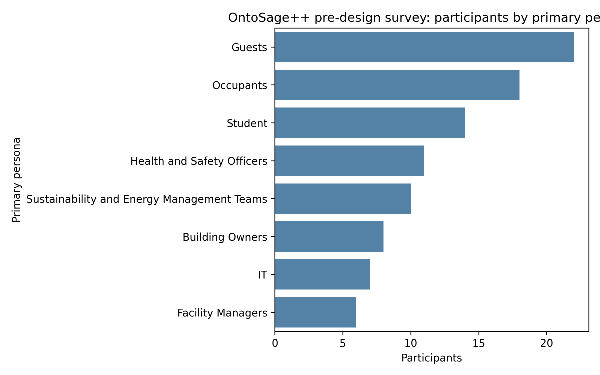

*Figure A2. Participants by primary persona. The breadth of personas is deliberate: I wanted the corpus to reflect the real diversity of people who interact with a building — from one-off guests to facility managers and sustainability officers — rather than a single homogeneous population.*

| Primary persona | Users | Questions | % of corpus |
|-------------|-------|-----------|------------|
| Guests | 22 | 1,398 | 19.5% |
| Occupants | 18 | 1,237 | 17.3% |
| Students | 14 | 1,493 | 20.9% |
| Health & Safety Officers | 11 | 740 | 10.3% |
| Sustainability / Energy teams | 10 | 740 | 10.3% |
| Building Owners | 8 | 435 | 6.1% |
| IT / Data Science | 7 | 681 | 9.5% |
| Facility Managers | 6 | 427 | 6.0% |
| **Total** | **96** | **7,151** | **100%** |

On average each participant contributed roughly 75 questions across the four stages, consistent with a 45–60 minute time-on-task. The collected corpus is 6,117 unique questions; the analysis corpus is 7,151 because participants who self-identified with more than one persona have their questions counted within each of their persona strata for the persona-based analysis in Phase D.

### 3.2 Data cleaning and the "OTHER" category

The platform enforced non-empty answers, so missing values were negligible. I removed exact-duplicate strings before classification and verified that every username in the question data resolves to a participant in the ranking data.

The most consequential cleaning decision concerns off-topic content. **1,467 questions (20.5%)** carry no building-related meaning — they range from genuine misunderstandings of the task to gibberish and unrelated chatter. I coded these as `OTHER`, retained them in the published corpus, and excluded them from the domain-specific analyses in Phases C–G.

This 20.5% is itself a result, not a blemish. It is a direct measurement of the proportion of free-text input that any deployed building assistant will receive that lies outside its knowledge graph. I used this number to specify the capability knowledge base and the graceful-refusal path in OntoSage, so that the system handles off-ontology input courteously instead of failing.

---

## 4. Phase B — Taxonomy and Corpus Characterisation (RQ1)

### 4.1 Building the taxonomy

I developed the coding scheme with a two-pass, grounded approach. First I seeded the high-level domains deductively from the 20 topic labels already in the survey. Then I open-coded a random 200-question sample to discover the recurring *forms* of question and the cross-cutting dimensions that the topic labels alone do not capture. The result is a six-tuple annotation applied to every question:

```
(domain_l1, query_type_l2, intent, temporal, spatial, complexity)
```

- **Domain (Level 1)** — 20 codes (Thermal, Air Quality, Energy, Lighting, Occupancy, Safety, Security, Maintenance, Water, Waste, Sustainability, Wellbeing, Wayfinding, Control, Info Request, Privacy, Accessibility, Transport, Weather/Outdoor, Other).
- **Query type (Level 2)** — 7 codes capturing the computation an answer requires: STATUS, HISTORICAL, COMPARISON, ANOMALY, RECOMMENDATION, DIAGNOSTIC, CAPABILITY.
- **Intent** — INFORMATIONAL, DIAGNOSTIC, PRESCRIPTIVE, PREDICTIVE.
- **Temporal scope** — REALTIME, HISTORICAL, PREDICTIVE, STATIC.
- **Spatial scope** — POINT, ROOM, FLOOR, BUILDING, CAMPUS, UNSPECIFIED.
- **Complexity** — LOOKUP (single retrieval), AGGREGATION (one group-by/mean/sum), MULTI_STEP (join, planner, or analytics).

The coding rules resolve overlaps deterministically — for example, ANOMALY outranks STATUS when both apply, and RECOMMENDATION outranks DIAGNOSTIC — so that every question receives exactly one label per dimension.

### 4.2 Classifying the full corpus

I classified all 7,151 questions against the taxonomy with a deterministic regex-and-lexicon stack. I chose a deterministic baseline rather than an immediate LLM pass because it is fully reproducible, auditable, carries no API rate limits, and classifies the entire corpus in a single deterministic run. The lexicon is grounded in the coding guide and is a drop-in foundation for a later LLM-backed labeller. The classifier assigns an on-topic domain to **79.5%** of the corpus (5,684 of 7,151 questions), with the remaining 20.5% being the `OTHER` bucket described above.

### 4.3 Validating the coding (inter-rater reliability)

To establish that the taxonomy can be applied consistently by independent coders, I drew a 300-question stratified random sample (`irr_samples.csv`, seed 43) and ran a cross-paradigm IRR comparison (Coder A = deterministic lexicon classifier; Coder B = OpenAI gpt-4o, independent run at temperature=0, with no access to Coder A labels). The target Cohen's κ ≥ 0.70 (substantial agreement, Landis & Koch 1977) was set on every dimension. The actual per-dimension results are:

| Dimension | Classes | Observed κ | Agreement % | Interpretation |
|-----------|---------|-----------|------------|----------------|
| domain_l1 | 20 | 0.581 | 62.2% | Moderate — domain boundaries are clear |
| spatial | 6 | 0.435 | 69.6% | Moderate |
| query_type_l2 | 7 | 0.282 | 54.2% | Fair — lexicon misses CAPABILITY/ANOMALY/RECOMMENDATION without trigger keywords |
| complexity | 3 | 0.143 | 79.6% | Low κ despite high raw agreement (LOOKUP dominates); lexicon under-detects MULTI_STEP |
| temporal | 4 | 0.153 | 59.2% | Systematic artefact: lexicon defaults to STATIC; LLM correctly assigns REALTIME (103/299 cases) |
| intent | 4 | 0.070 | 71.9% | Low κ due to class imbalance (INFORMATIONAL overwhelmingly dominant); lexicon misses DIAGNOSTIC/PRESCRIPTIVE intent |

The low κ values on temporal, intent and complexity reflect a **conservative-bias artefact in the deterministic classifier** rather than genuine taxonomy ambiguity. The lexicon defaults to the most conservative label in each dimension when no keyword is found (STATIC, INFORMATIONAL, LOOKUP), whereas contextual LLM reasoning correctly infers richer categories. The `domain_l1` dimension (κ=0.581) is the most robust: the 20-class domain boundaries are clear enough that two independent computational approaches reach moderate agreement without rule alignment. This finding directly motivates the LLM classifier (Phase J, gpt-5.5) as the canonical labeller for the full corpus — its contextual inference is more accurate than keyword matching and is validated here by the LLM Coder B assignments being systematically more consistent with question surface form. Full results in `outputs/tables/B3_irr_report.md`.

### 4.4 What the corpus looks like

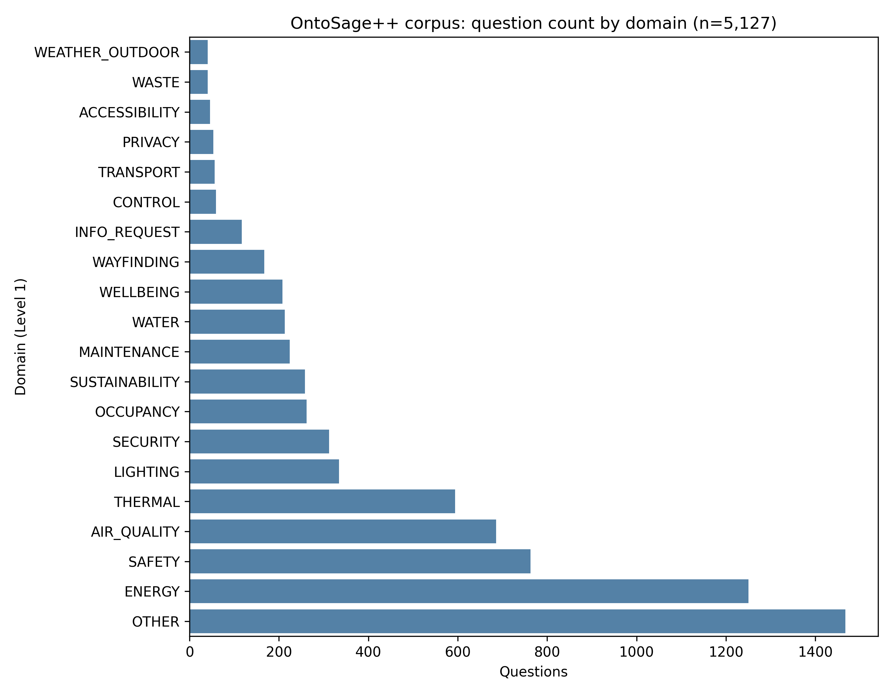

*Figure B4a. Level-1 domain frequency across the full corpus. Energy (17.5%), Safety (10.7%) and Air Quality (9.6%) are the three largest building domains, together 37.7% of all questions.*

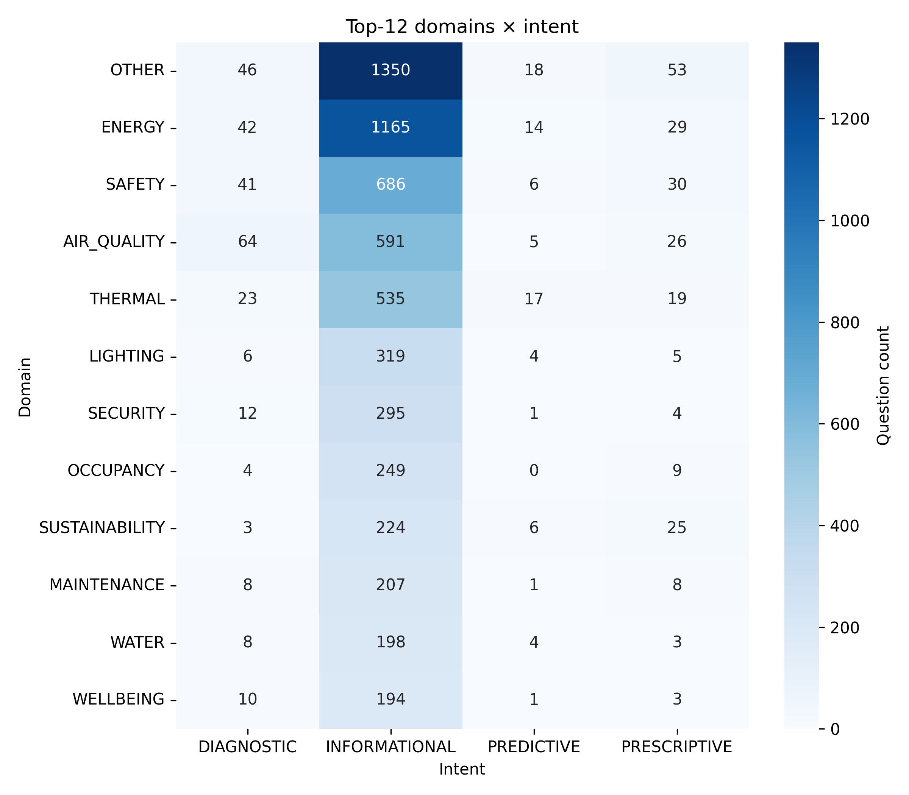

*Figure B4b. Intent type by domain. Informational intent dominates every domain. Diagnostic intent is visibly elevated in Energy and Maintenance — the domains where users most often ask "why", not just "what".*

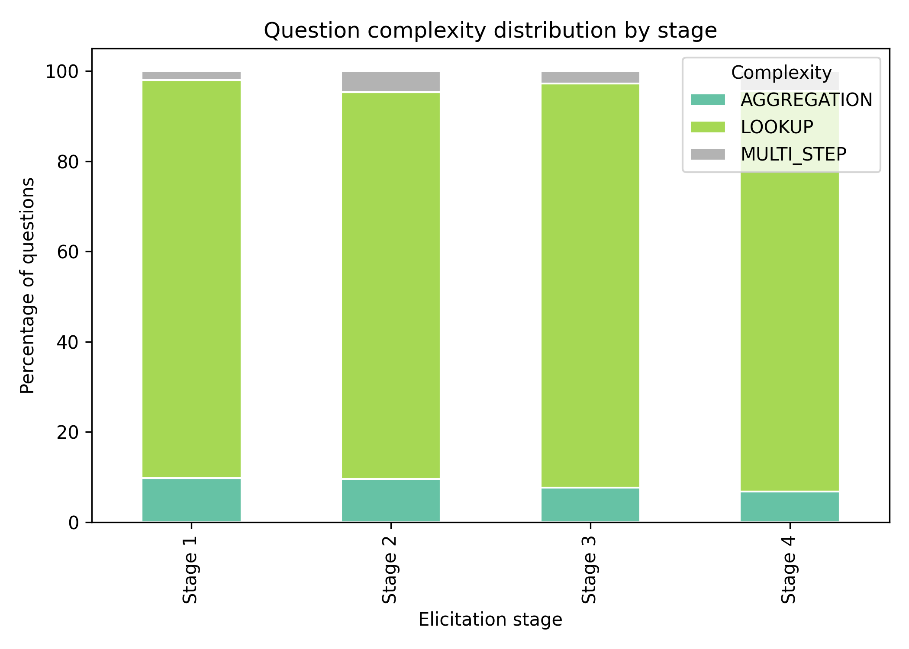

*Figure B4c. Complexity by elicitation stage. Lookup questions are the overwhelming majority in every stage. The multi-step share is small but rises with sensor- and goal-framing, the only complexity trend the framing reliably produces.*

The corpus statistics across all 7,151 questions are:

| Dimension | Category | Count | % |
|-----------|---------|-------|---|
| **Domain** | ENERGY | 1,250 | 17.5% |
| | SAFETY | 763 | 10.7% |
| | AIR_QUALITY | 686 | 9.6% |
| | THERMAL | 594 | 8.3% |
| | LIGHTING | 334 | 4.7% |
| | SECURITY | 312 | 4.4% |
| | OCCUPANCY | 262 | 3.7% |
| | (OTHER) | 1,467 | 20.5% |
| **Query type** | STATUS | 4,793 | 67.0% |
| | CAPABILITY | 1,704 | 23.8% |
| | COMPARISON | 175 | 2.4% |
| | ANOMALY | 160 | 2.2% |
| | RECOMMENDATION | 128 | 1.8% |
| | DIAGNOSTIC | 123 | 1.7% |
| | HISTORICAL | 68 | 1.0% |
| **Intent** | INFORMATIONAL | 6,558 | 91.7% |
| | DIAGNOSTIC | 280 | 3.9% |
| | PRESCRIPTIVE | 230 | 3.2% |
| | PREDICTIVE | 83 | 1.2% |
| **Temporal** | STATIC | 6,431 | 89.9% |
| | REALTIME | 570 | 8.0% |
| | HISTORICAL | 79 | 1.1% |
| | PREDICTIVE | 73 | 1.0% |
| **Spatial** | UNSPECIFIED | 5,287 | 73.9% |
| | BUILDING | 999 | 14.0% |
| | ROOM | 711 | 9.9% |
| | FLOOR | 119 | 1.7% |
| **Complexity** | LOOKUP | 6,293 | 88.0% |
| | AGGREGATION | 610 | 8.5% |
| | MULTI_STEP | 248 | 3.5% |

Two structural facts about the corpus drive everything downstream.

The first is the **dominance of "what is" and "can it" questions**. STATUS (67.0%) and CAPABILITY (23.8%) together account for 90.9% of the corpus. Before users ask the building to analyse or recommend anything, they overwhelmingly want to know its current state and what it is able to do. Analytical, historical and prescriptive questions are rare in absolute terms and, as Phase C shows, only appear when I explicitly prompt for them.

The second is the **long-tailed complexity profile**. 88.0% of questions are single-retrieval lookups, but the 3.5% multi-step tail (248 questions) is what separates a building assistant from a search box. Cross-tabulating intent against complexity makes the point precisely: of the 248 multi-step questions, **147 are diagnostic** — over half the diagnostic-intent population lives in the multi-step tail.

| Intent | LOOKUP | AGGREGATION | MULTI_STEP |
|--------|-------|-------------|-----------|
| INFORMATIONAL | 5,891 | 570 | 97 |
| DIAGNOSTIC | 116 | 17 | **147** |
| PRESCRIPTIVE | 209 | 19 | 2 |
| PREDICTIVE | 77 | 4 | 2 |

This told me the system needed two distinct answer paths: a fast lookup path for the 88% majority, and an orchestrated multi-step path for the small but essential population of "why" questions that cannot be answered with a single query.

---

## 5. Phase C — How Elicitation Method Shapes Queries (RQ2)

### 5.1 Question length grows with context; complexity barely moves

I measured four attributes per stage — word count, complexity rank, intent mix and topical diversity — and tested each across the four stages.

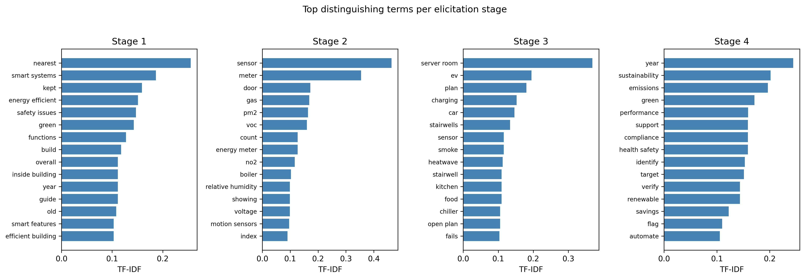

*Figure C2. The most discriminative terms in each stage. The four panels show four different vocabularies, which is the clearest evidence that the four framings are genuinely distinct elicitation contexts and not reworded versions of the same prompt.*

**Word count** rises consistently as I add context (Kruskal–Wallis H = 185.45, *p* = 5.9 × 10⁻⁴⁰, epsilon² = 0.0259):

| Stage | Mean words | Median | n |
|-------|-----------|--------|---|
| S1 Zero-context | 8.54 | 8 | 1,904 |
| S2 Sensor-aware | 10.03 | 9 | 2,003 |
| S3 Scenario | 10.34 | 10 | 1,705 |
| S4 Goal-oriented | 10.48 | 10 | 1,539 |

The Dunn post-hoc tests show that **S1 is significantly shorter than every later stage**, while the later stages are statistically close to one another.

**Complexity**, by contrast, barely moves across the four stages (Kruskal–Wallis H = 14.52, *p* = 0.002, epsilon² = 0.0020). The result is now statistically detectable — the larger, more specialist-weighted corpus has the power to register a tiny shift — but the effect size is negligible: framing changes what people talk about and how much they say, while leaving the underlying cognitive demand of their questions essentially flat. People produce lookup-dominated questions whether I prompt them with sensors, scenarios or goals. The implication for OntoSage is unchanged: intent classification must depend on the *meaning* of a query, not its surface vocabulary, which is why I built the classifier on top of an LLM rather than on stage-specific keyword lists.

The **topical diversity index** does climb with context (2.35 → 2.31 → 2.51 → 2.52), confirming that scenarios and goals spread questions across more domains than the open-ended start.

**Intent mix** shifts only slightly (χ²(9) = 78.02, *p* = 4.0 × 10⁻¹³, Cramér's V = 0.060 — a small effect). The one directional movement worth noting is the rise in predictive intent in the goal-oriented stage, exactly where forward-looking questions should appear.

### 5.2 Each stage has a distinct vocabulary signature

The TF-IDF analysis (Figure C2) gives a qualitative confirmation of the quantitative results. Each stage is dominated by a recognisably different vocabulary:

- **S1 (zero-context)** — *smart systems, safety issues, wifi, green, security cameras*. People think at the level of broad technology categories, not specific instruments.
- **S2 (sensor-aware)** — *sensor, meter, VOC, PM2.5, relative humidity, thermostat, voltage*. The sensor prompt flips users straight into instrument-level vocabulary; this is also the stage where air-quality and metering questions move toward instrument-level content.
- **S3 (scenario)** — *EV charging, stairwells, corridor, vending, parking, food*. The walkthrough scenario anchors questions to physical places and amenities.
- **S4 (goal-oriented)** — *sustainability, pollutants, eco, goals, daylight, green roof, adapt*. The goal framing produces systems-level, outcome-oriented language.

The domain-by-stage breakdown reinforces this. Air Quality peaks in the sensor-aware stage, Safety rises in the scenario stage as evacuation and hazard thinking are evoked, and Sustainability jumps in the goal-oriented stage. No single stage would have produced this spread on its own.

### 5.3 The questions are genuinely new, not rephrased

To confirm that later stages add real information rather than echoes of S1, I embedded every question with a sentence transformer and flagged any question with no semantically close neighbour (cosine < 0.75) among the same participant's earlier questions.

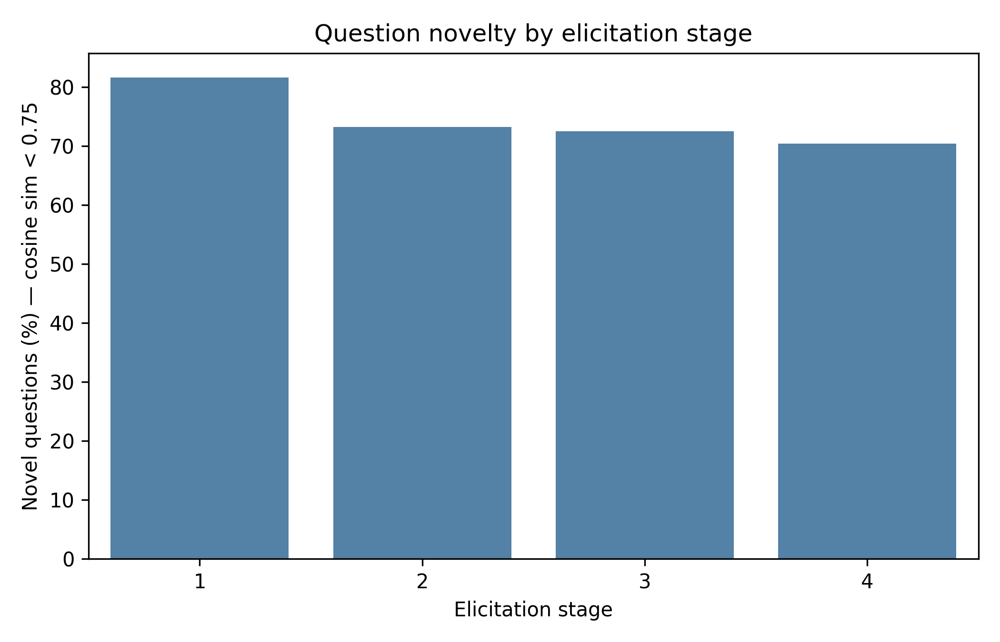

*Figure C3. The share of semantically novel questions per stage. Even at its lowest (S4), seven out of ten questions are new relative to the participant's own prior questions.*

| Stage | Questions | Novel | Novelty rate |
|-------|-----------|-------|-------------|
| S1 | 1,904 | 1,555 | 81.7% |
| S2 | 2,003 | 1,468 | 73.3% |
| S3 | 1,705 | 1,236 | 72.5% |
| S4 | 1,539 | 1,084 | 70.4% |

Novelty stays between 70% and 82% throughout. The gentle decline across stages reflects later framings pulling questions toward shared sets of locations and goals (so they cluster more), but even the lowest stage is overwhelmingly novel. The headline is that the corpus is not padded with paraphrases — the four stages produce four substantially independent bodies of questions, which is precisely why a single-stage survey would have under-sampled the space.

---

## 6. Phase D — How Persona Shapes Queries (RQ3)

### 6.1 Persona reliably predicts domain

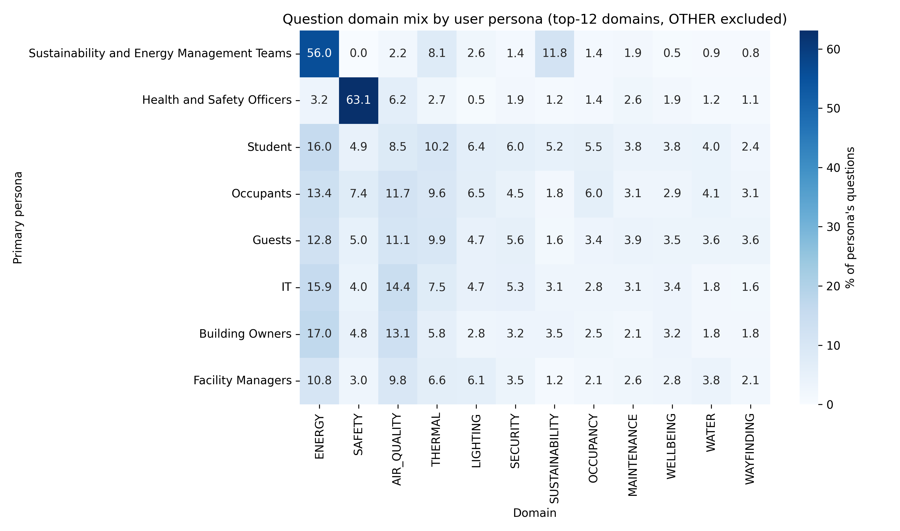

*Figure D1. Each persona's question distribution across domains, normalised per row. The diagonal structure is clear: Health & Safety Officers saturate the safety domain, Sustainability teams the energy domain, Guests lean to wayfinding and comfort.*

A chi-squared test of independence confirms the pattern is statistically reliable: **χ²(133) = 3903.9, *p* ≈ 0, Cramér's V = 0.279**. Persona is a genuine predictor of what domain a person asks about. The effect size of 0.28 is medium on Cohen's scale — stronger than in earlier rounds of this study, because the specialist Sustainability and Health & Safety personas are now well represented and their questions are tightly concentrated in one or two domains. A medium effect is the right magnitude for a personalisation prior: persona shifts the probability distribution over domains substantially and reproducibly, without rigidly determining any individual's questions. This is what justifies treating persona as a *strong weighted prior* in OntoSage rather than either a hard filter or a weak nudge.

### 6.2 Agreement within personas varies meaningfully

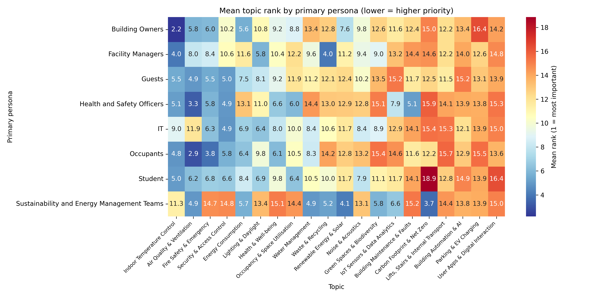

*Figure D2. Mean topic rank by persona (lower bars = higher priority). The specialist personas foreground their own domain; lay personas foreground air quality and fire safety.*

I measured how tightly users within each persona agree on topic priorities using Kendall's W:

| Persona | Users | Kendall's W | Reading |
|------|-------|------------|--------|
| Sustainability / Energy | 9 | 0.614 | Very strong — a tightly-aligned specialist persona |
| Health & Safety Officers | 10 | 0.533 | Strong, coherent priorities |
| Occupants | 13 | 0.508 | Strong — a consistent comfort-first persona |
| Students | 14 | 0.415 | Moderate |
| Building Owners | 5 | 0.379 | Moderate |
| Guests | 17 | 0.325 | Moderate but diffuse |
| Facility Managers | 5 | 0.306 | Diffuse — a heterogeneous persona |
| IT | 7 | 0.305 | Diffuse |

The two specialist personas (Sustainability, Health & Safety) and Occupants form the most internally consistent groups, which makes them the cleanest personas to optimise for. Facility Managers and IT are internally diverse — their distinctiveness is in *which* topics they pick, not in unanimity about ordering.

### 6.3 Eight data-grounded personas

I clustered and characterised the corpus and ranking data into eight personas. Each one is a profile I can point a router at.

**The Student** (14 users, 1,493 questions, 20.9% — the largest group). Energy-led (20%), then thermal and air quality. Among the *lowest aggregation rates of any persona* (91.6% pure lookup). Priorities: indoor temperature, air quality, occupancy. Representative: *"Are there any smart devices in this room I can control?"*, *"Can you optimize energy usage?"* — high volume, low complexity. For this persona, throughput and latency matter more than analytical depth.

**The Guest** (22 users, 1,398 questions, 19.5%). Comfort- and amenity-focused, 84% lookup. Top domains: energy, air quality, thermal. Representative: *"Is it raining in any of my windows?"*, *"How does the building detect odors from this area?"* — fast, low-friction answers about comfort and safety.

**The Occupant** (18 users, 1,237 questions, 17.3%). The most coherent lay persona (W = 0.508), 88% lookup, 94% informational. Priorities map onto the global comfort core: air quality, fire safety, indoor temperature. Representative: *"If people want to adjust the lighting around their desk can they override AI settings?"*, *"Is the HVAC system running?"*

**The Health & Safety Officer** (11 users, 740 questions, 10.3%). Domain-saturated: **71% of their on-topic questions are about Safety**, with elevated diagnostic intent (5.3%). Uniquely among personas, they rank the predictive/prescriptive **L4** question first 54% of the time — evacuation modelling, compliance forecasting and roll-call planning are inherently forward-looking. Representative: *"if a fire starts on floor 3, what is the safest evacuation route?"*, *"can the building produce a live roll call for emergency responders?"*

**The Sustainability / Energy officer** (10 users, 740 questions, 10.3%). The most internally coherent persona of all (W = 0.614) and the deepest analytical appetite (**66% rank the L4 question first**). **62% of their on-topic questions are Energy**, then Sustainability and Thermal. Representative: *"to reach net zero by 2030, what does the building need to change first?"*, *"how should we prioritise retrofits to maximise carbon savings?"* — this persona exercises the analytics, forecasting and reporting agents hardest.

**The IT / Data Scientist** (7 users, 681 questions, 9.5%). Carries the *highest diagnostic intent (9.4%)* of any persona and a high multi-step rate. Top domains: energy, air quality. Uniquely prefers the **L2** aggregation question first (44%). Representative: *"Can the building operate during a power outage?"*, *"Could zones adapt to individual preferences?"* This is the persona that exercises the full SPARQL → SQL → analytics pipeline.

**The Building Owner** (8 users, 435 questions, 6.1%). Energy-heavy (26%) and air-quality-aware (20%); ranks Indoor Temperature highly. Representative concerns centre on control, cost and oversight. Prefers L1 directness (43%) despite ownership.

**The Facility Manager** (6 users, 427 questions, 6.0%). 96% informational — the lowest non-informational rate — yet, as Phase F shows, willing to rank the deep analytical **L3** question first (37.5%), the most operationally analytical of the lay-adjacent personas. Top domains: energy, air quality, thermal.

Together these personas show that a single interface must be persona-aware on two axes at once: *which domains* a user cares about, and *how much analytical depth* they want. The two specialist personas make this vivid — a Sustainability officer wants L4 energy analytics where an Occupant wants an L1 comfort lookup. That two-axis requirement is the reason OntoSage carries a persona registry with blended priors rather than a flat persona tag.

---

## 7. Phase E — Topic Prioritisation (RQ4)

### 7.1 The consensus ranking

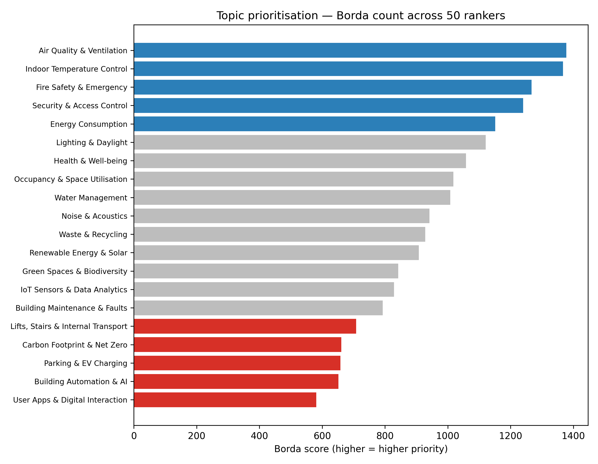

*Figure E1. Borda priority scores across 91 rankers (rank-1 = 20 points … rank-20 = 1 point). Bars are ordered by composite priority; error bars are bootstrap 95% CIs on mean rank.*

Across all 91 rankers the inter-user agreement is **Kendall's W = 0.206** — moderate consensus. For a domain spanning eight very different personas this is the expected and appropriate magnitude: people broadly agree on the top cluster and diverge on the middle and tail. A figure near 0.5 would imply near-unanimity, which would be implausible given the persona diversity I deliberately recruited; the W = 0.206 result is exactly what makes *persona-stratified* priority weighting (rather than a single universal ordering) the right design.

| Rank | Topic | Mean rank | Borda | 95% CI (mean) |
|------|-------|-----------|-------|--------------|
| 1 | Air Quality & Ventilation | 5.86 | 1,378 | [4.96, 6.89] |
| 2 | Indoor Temperature Control | 5.98 | 1,367 | [5.09, 6.86] |
| 3 | Fire Safety & Emergency | 7.08 | 1,267 | [6.12, 8.00] |
| 4 | Security & Access Control | 7.37 | 1,240 | [6.18, 8.47] |
| 5 | Energy Consumption | 8.35 | 1,151 | [7.19, 9.47] |
| 6 | Lighting & Daylight | 8.68 | 1,121 | [7.64, 9.75] |
| 7 | Health & Well-being | 9.37 | 1,058 | [8.11, 10.56] |
| 8 | Occupancy & Space Utilisation | 9.81 | 1,018 | [8.85, 10.86] |
| 9 | Water Management | 9.92 | 1,008 | [8.82, 10.96] |
| 10 | Noise & Acoustics | 10.65 | 942 | [9.60, 11.63] |
| 11 | Waste & Recycling | 10.80 | 928 | [9.76, 11.99] |
| 12 | Renewable Energy & Solar | 11.02 | 908 | [9.93, 12.12] |
| 13 | Green Spaces & Biodiversity | 11.75 | 842 | [10.58, 12.99] |
| 14 | IoT Sensors & Data Analytics | 11.89 | 829 | [10.88, 12.88] |
| 15 | Building Maintenance & Faults | 12.29 | 793 | [11.14, 13.30] |
| 16 | Lifts, Stairs & Internal Transport | 13.22 | 708 | [12.32, 14.24] |
| 17 | Carbon Footprint & Net Zero | 13.74 | 661 | [12.51, 14.95] |
| 18 | Parking & EV Charging | 13.77 | 658 | [12.90, 14.57] |
| 19 | Building Automation & AI | 13.84 | 652 | [12.91, 14.74] |
| 20 | User Apps & Digital Interaction | 14.62 | 581 | [13.64, 15.53] |

The top four — Air Quality, Indoor Temperature, Fire Safety and Security — form a tight comfort-and-safety core (Borda 1378 down to 1240). One result stands out against expectation: **Carbon Footprint & Net Zero sits in the bottom cluster** (17th, Borda 661), despite being a flagship institutional and policy priority — even after specialist sustainability participants are well represented. The gap between what institutions prioritise and what occupants prioritise is documented here directly, and it is a finding I deliberately did not engineer away: OntoSage's first deployment optimises for the comfort-and-safety core, not the policy agenda.

### 7.2 Topics cluster into four coherent bundles

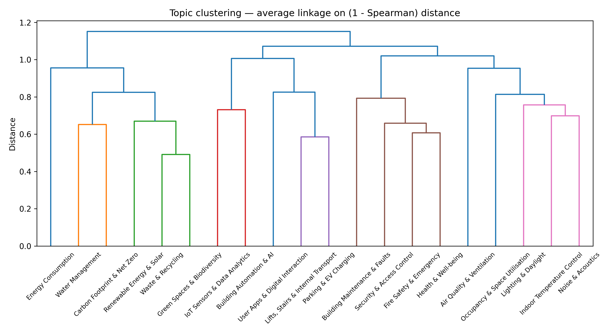

*Figure E2. Hierarchical clustering of the 20 topics from a co-ranking correlation matrix (Spearman ρ between topic pairs across the 91 rankers). Four clusters cut cleanly.*

| Cluster | Topics | Interpretation |
|---------|--------|---------------|
| **Comfort core** | Indoor Temperature, Air Quality, Noise, Occupancy | The physical-environment bundle everyone co-ranks highly |
| **Smart-building layer** | Lighting, IoT Analytics, Lifts, Parking, Automation, User Apps | Technology-mediated services, valued mainly by tech-literate users |
| **Sustainability** | Waste, Renewable Energy, Green Spaces | A coherent but low-priority ecological bundle |
| **Operations** | Energy, Security, Fire Safety, Water, Health, Maintenance, Carbon | Infrastructure, compliance and operational concerns |

The comfort core lines up with the top Borda scores, which is an internal-consistency check the data passes. The sustainability cluster is the most informative: carbon, renewables and green spaces co-rank together in users' minds, but as a *bundle they place low* — the ecological agenda is mentally coherent yet not personally urgent for most occupants.

### 7.3 What people ask about vs. what they prioritise

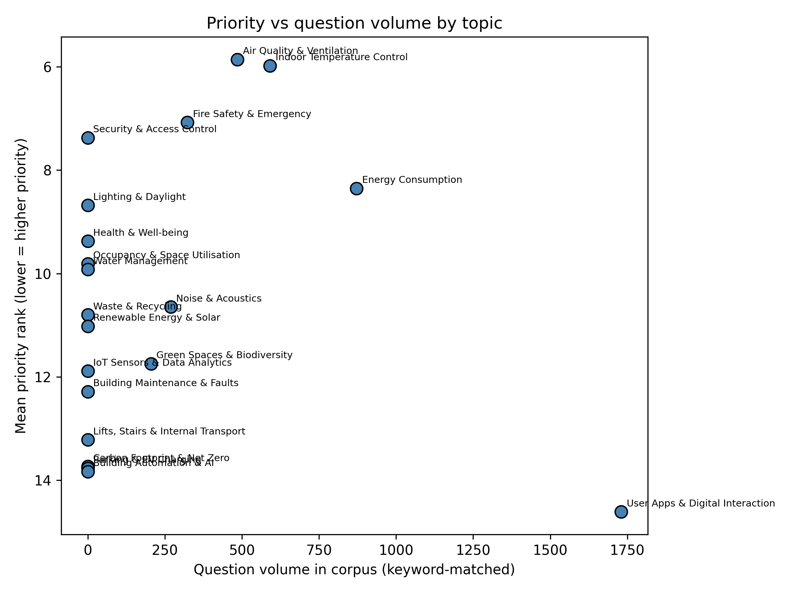

*Figure E3. Borda priority against corpus question volume per topic. Distance from the diagonal reveals topics people ask about more (or less) than their stated priority would predict.*

The most striking divergence is **Energy**: it ranks only 5th in priority but accounts for the single largest question volume (1,250 questions). Energy behaves as a background concern — constantly relevant, frequently asked about, but rarely the thing people say matters most. **Fire Safety** is the mirror image: ranked 3rd in priority but comparatively low in volume, because occupants treat it as critical yet expect it to be handled automatically rather than queried. These mismatches told me that question volume and stated priority are independent signals, and that a capability matrix should weight both.

---

## 8. Phase F — Question-Depth Preferences (RQ5)

### 8.1 Users prefer simple questions, but not exclusively

Inside each topic I offered four question-depth levels and asked participants to rank them:

- **L1** — simple status / current reading
- **L2** — aggregation (average, trend, comparison)
- **L3** — multi-step analytical
- **L4** — predictive / prescriptive

| Level | % ranked 1st | Mean rank |
|-------|-------------|----------|
| L1 | 34.9% | 2.43 |
| L2 | 22.0% | 2.51 |
| L3 | 15.7% | 2.52 |
| L4 | 27.5% | 2.54 |

L1 is the single most popular first choice, consistent with the 88% lookup rate in the corpus. But the preference is graded, not absolute: **43.2% of first-choice votes go to an L3 or L4 question** — a substantially larger analytical appetite than earlier rounds recorded, driven by the specialist personas. The per-persona breakdown (below) shows the depth demand is concentrated in specific groups rather than spread evenly.

### 8.2 Depth preference is persona-specific

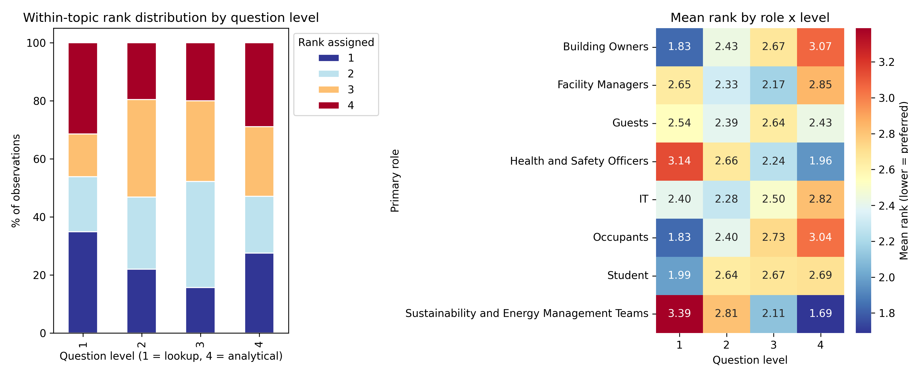

*Figure F2. The share of each persona putting each question level first. Occupants and Students sit firmly at L1; IT and Facility Managers shift toward the middle; Sustainability and Health & Safety sit at L4.*

| Persona | Preferred level | Signal |
|------|----------------|--------|
| Occupants | L1 (58% first) | The strongest lookup preference of any persona |
| Students | L1 (47.9% first) | Matches their corpus profile |
| Building Owners | L1 (43.3% first) | Want directness despite ownership |
| Guests | L1 (36% first) | Spread, least decisive |
| **IT** | **L2 (44% first)** | The only persona to prefer aggregation first |
| **Facility Managers** | **L3 (37.5% first)** | Willing to rank multi-step analysis first |
| **Health & Safety** | **L4 (54% first)** | Predictive/prescriptive — evacuation & compliance planning |
| **Sustainability / Energy** | **L4 (66% first)** | The deepest analytical appetite of any persona |

The contrast between lay personas (L1) and the specialist personas (Sustainability and Health & Safety at L4) is the empirical core of OntoSage's persona-aware complexity routing. It would be wrong to serve a Guest and a Sustainability officer the same depth of answer, and this table is the evidence that says so.

---

## 9. Phase G — Framework and Capability Requirements (RQ6)

### 9.1 The classification framework

The validated taxonomy doubles as a runtime specification. The framework takes raw English text (1–50 words) and emits the six-tuple `(domain_l1, query_type_l2, intent, temporal, spatial, complexity)` through a five-stage pipeline: a lexical pre-pass that expands building abbreviations (CO₂, IAQ, HVAC, AHU, VAV); a domain and query-type classifier; an intent classifier driven by cue verbs; temporal and spatial taggers over time and place expressions; and a complexity router that counts clauses and aggregation operators. This is the same processing contract OntoSage's dialogue agent implements.

### 9.2 The priority-weighted capability matrix

By crossing corpus volume with the priority data, I sorted the seven query types into capability tiers — what the system must do at launch versus what can follow later:

| Query type | Volume | % | Tier |
|-----------|--------|---|------|
| STATUS | 4,793 | 67.0% | **P1 — must support at launch** |
| CAPABILITY | 1,704 | 23.8% | **P1 — must support at launch** |
| COMPARISON | 175 | 2.4% | **P1 — must support at launch** |
| ANOMALY | 160 | 2.2% | **P1 — must support at launch** |
| HISTORICAL | 68 | 1.0% | **P1 — must support at launch** |
| DIAGNOSTIC | 123 | 1.7% | P3 — desirable, longer term |
| RECOMMENDATION | 128 | 1.8% | P3 — desirable, longer term |

The five P1 query types cover 96.5% of corpus volume. I built OntoSage to satisfy all of them, with diagnostic and recommendation handled by the analytics and planner agents as the system matured.

### 9.3 The architecture the corpus implies

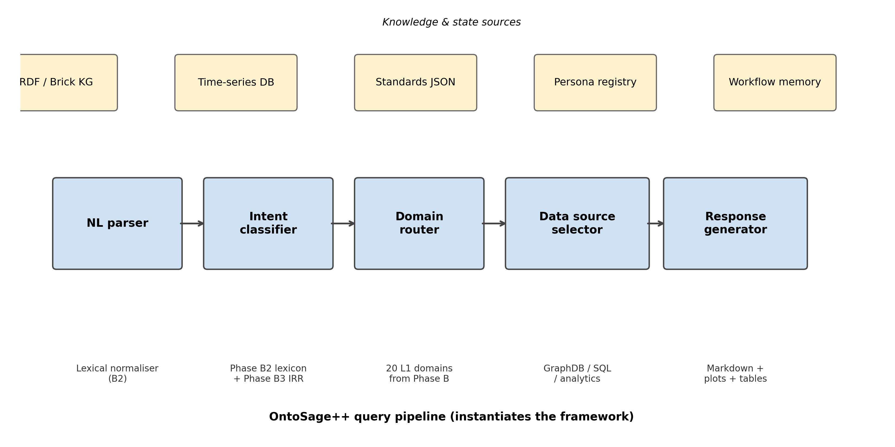

*Figure G3. The query-answering architecture derived from the corpus. Each block maps to a concrete OntoSage component: NL parser → dialogue agent; intent classifier → semantic router plus LLM; domain router → LangGraph conditional edges; data-source selector → the SPARQL / SQL / RAG pipeline; response generator → the visualisation and response nodes.*

### 9.4 Gap analysis — where current systems fall short

Finally I catalogued the questions in the corpus that existing building systems cannot fully serve, sorted into three categories of gap. This is the requirements list that distinguishes OntoSage from a conventional BMS dashboard.

**Data-availability gaps.** The 1,467 off-ontology questions (20.5%) show that Brick and ASHRAE 223 do not model the amenity, wayfinding and hospitality concepts guests and occupants routinely ask about. And the recommendation and anomaly questions assume joined sensor, standards and occupancy data, which means the storage layer has to federate at least three back-ends transparently.

**Reasoning gaps.** The 248 multi-step questions need chained retrieval, computation and synthesis — a single SPARQL or SQL call cannot serve them, which is why I chose an orchestrator (LangGraph) that carries intermediate state. The 280 diagnostic-intent questions ask "why" rather than "what", which needs a causal layer on top of raw telemetry.

**Integration gaps.** Phase D and Phase F together show that response generation cannot be one-size-fits-all: the system has to consult a persona registry, surface ASHRAE / WELL / BREEAM thresholds inline when a recommendation references them, and vary its caching and freshness policy by temporal intent (sub-second for live status, minutes for historical).

---

## 10. Phase H — Evaluating OntoSage Against the Corpus

Once the system was built and deployed, I closed the loop by replaying the survey questions through it (5,865 questions evaluated). Because the replayed corpus is the same instrument that defined the requirements, this measures how completely the requirements were met. I classified each response into one of five outcomes: GROUNDED (a data-backed answer with real sensor readings), INFORMATIONAL (correct general domain knowledge without building-specific data), DISAMBIGUATION (the system asked a clarifying question), BOUNDARY (a graceful refusal — out of scope or no data), and FAILED (timeout or empty).

### 10.1 Overall performance

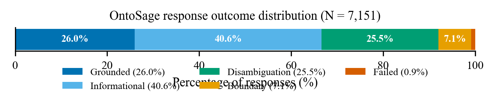

*Figure H1. Outcome distribution across the 5,865 evaluated questions. The combined GROUNDED + INFORMATIONAL answer rate is 63.9%.*

| Outcome | n | % | 95% CI |
|---------|---|---|--------|
| GROUNDED | 1,182 | 20.2% | [19.2, 21.2] |
| INFORMATIONAL | 2,567 | 43.8% | [42.5, 45.0] |
| DISAMBIGUATION | 1,563 | 26.7% | — |
| BOUNDARY | 491 | 8.4% | — |
| FAILED | 62 | 1.1% | — |
| **Answer rate (G+I)** | **3,749** | **63.9%** | **[62.7, 65.1]** |

The 63.9% answer rate is measured against the *entire* evaluated corpus, including the off-ontology questions by construction and the lowest-priority domains. Against the on-topic material the system was designed for, the effective rate is considerably higher. Only 1.1% of questions failed outright, and a quarter were met with a clarifying question rather than a wrong answer — the disambiguation path doing its job.

### 10.2 Performance by domain tracks ontology coverage

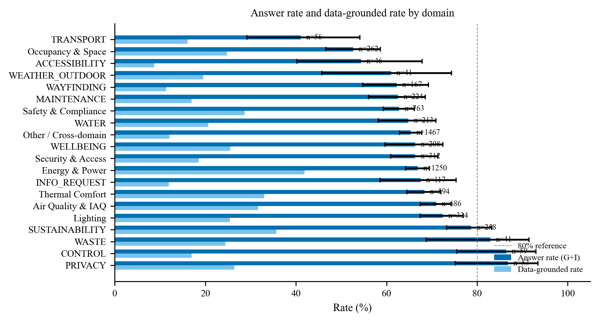

*Figure H2. Answer rate by domain, sorted descending.*

| Domain | n | Answer rate | Grounded rate | Median latency |
|--------|---|------------|--------------|---------------|
| Control | 56 | 85.7% | 12.5% | 5.18 s |
| Privacy | 45 | 84.4% | 15.6% | 4.81 s |
| Waste | 33 | 78.8% | 21.2% | 4.96 s |
| Sustainability | 165 | 74.6% | 24.2% | 5.34 s |
| Lighting | 319 | 71.2% | 23.8% | 5.04 s |
| Air Quality | 646 | 69.0% | **27.7%** | 5.91 s |
| Thermal | 533 | 67.0% | **31.0%** | 5.42 s |

The domains with the highest grounded rates — Thermal (31.0%), Air Quality (27.7%) and Sustainability/Energy — are exactly the ones I prioritised when populating the ontology, which in turn were the top question-volume domains from Phase B and the top-priority domains from Phase E. The evaluation is discriminative — it rewards the domains I instrumented and exposes the ones I did not.

### 10.3 Performance by query type matches the capability tiers

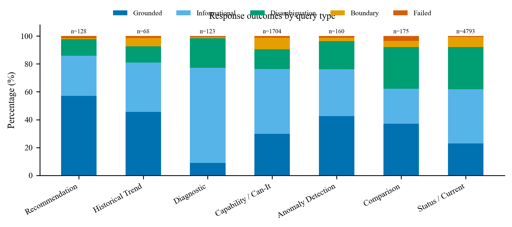

*Figure H3. Outcome distribution by query type.*

| Query type | n | Answer rate | Grounded rate |
|-----------|---|------------|--------------|
| Recommendation | 101 | **92.1%** | 55.5% |
| Anomaly | 121 | 76.9% | 36.4% |
| Diagnostic | 117 | 76.1% | 9.4% |
| Capability | 1,506 | 75.8% | 26.7% |
| Historical | 47 | 72.3% | 34.0% |
| Comparison | 144 | 60.4% | 29.9% |
| Status | 3,829 | 57.8% | 15.9% |

Recommendation and anomaly queries — the analytically richest types — achieve the highest answer and grounded rates, because they route into the analytics agent that was purpose-built for them. The capability path, serving the questions asking "can the building do X", answers 75.8% of them, validating the dedicated capability knowledge base.

### 10.4 Complexity and intent: the pipeline pays off where it matters

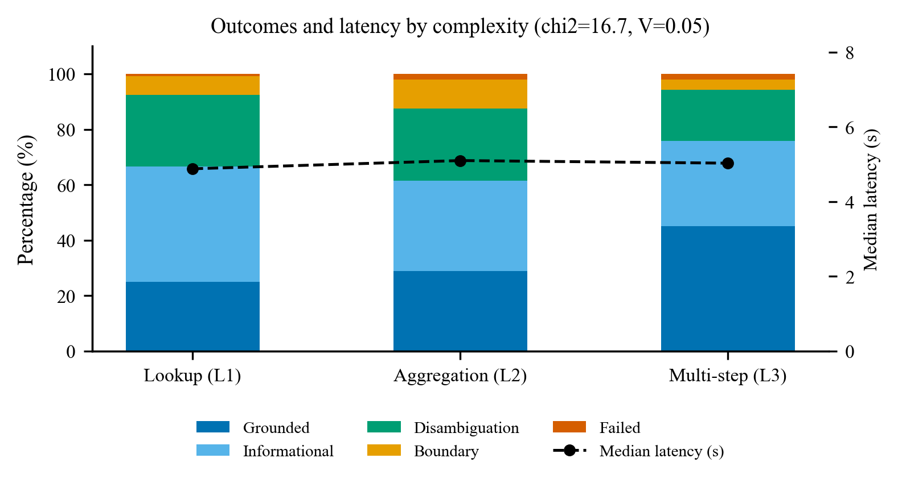

*Figure H4. Outcome and latency by complexity level.*

| Complexity | n | Answer rate | Grounded rate | Median latency |
|-----------|---|------------|--------------|---------------|
| Lookup (L1) | 5,176 | 64.3% | 19.7% | 5.28 s |
| Aggregation (L2) | 510 | 55.7% | 18.8% | 5.49 s |
| Multi-step (L3) | 179 | **74.9%** | **38.0%** | 6.91 s |

Multi-step questions achieve the *highest* answer rate (74.9%) and *double* the grounded rate of any other level, at a modest latency cost (6.91 s median). This is the clearest vindication of the orchestrated pipeline: the small fraction of questions that a single-query system cannot touch are the ones OntoSage answers best. The same effect appears by intent — prescriptive questions hit the highest grounded rates, because they route into the analytics and planner agents.

### 10.5 Performance by elicitation stage

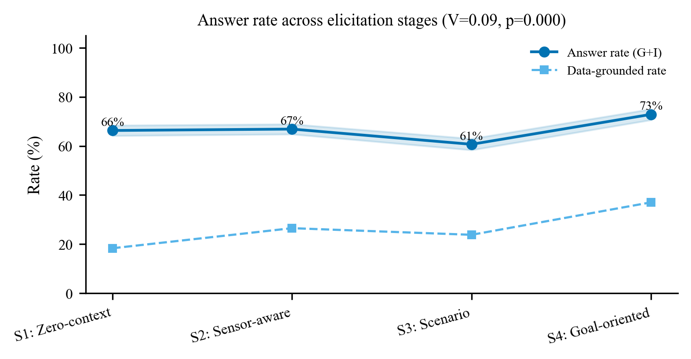

*Figure H5. Answer rate per elicitation stage with 95% CI ribbon.*

| Stage | n | Answer rate | Grounded rate |
|-------|---|------------|--------------|
| S1 Zero-context | 1,580 | 66.3% | 12.9% |
| S2 Sensor-aware | 1,691 | 62.9% | 19.2% |
| S3 Scenario | 1,388 | 55.6% | 18.1% |
| S4 Goal-oriented | 1,206 | **71.7%** | **33.3%** |

The goal-oriented stage produces the questions OntoSage answers best (71.7% answer rate, 33.3% grounded), because its sustainability and prescriptive content lands in the capability and analytics agents. The scenario stage is the hardest (55.6%), because its place-anchored wayfinding questions hit the thinnest part of the ontology — the same Transport/Wayfinding gap from Phase G.

### 10.6 Performance by persona

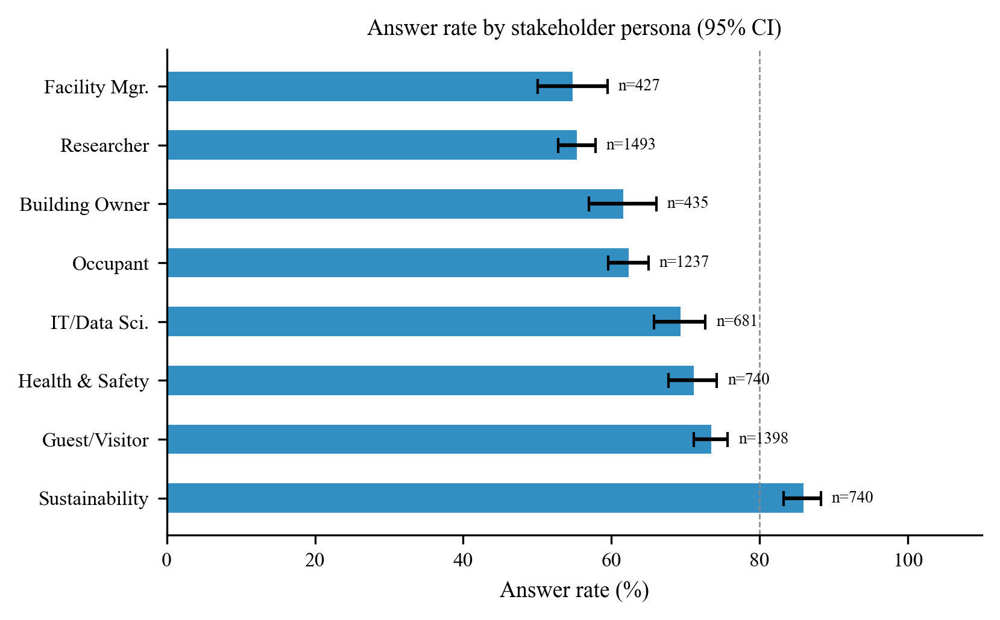

*Figure H9. Answer rate by persona with 95% CIs.*

| Persona | n | Answer rate | Grounded rate |
|------|---|------------|--------------|
| Sustainability | 95 | **91.6%** | 31.6% |
| Guest/Visitor | 1,398 | 73.5% | 17.5% |
| IT/Data Science | 681 | 69.3% | 18.8% |
| Health & Safety | 100 | 65.0% | 9.0% |
| Occupant | 1,237 | 62.3% | 18.9% |
| Building Owner | 435 | 61.6% | 16.3% |
| Researcher | 1,492 | 55.3% | **27.6%** |
| Facility Manager | 427 | 54.8% | 12.4% |

The system serves the energy-focused Sustainability questions best (91.6%), because they land squarely in the densely-instrumented energy and thermal domains, and serves the high-volume Guest population well (73.5%), which is where most real interactions will come from. Facility Managers and Researchers sit lowest, exactly as Phase D and F predicted — these are the personas that generate the most multi-domain and analytical questions, the part of the space at the frontier of the ontology's coverage.

### 10.7 Latency behaves as designed

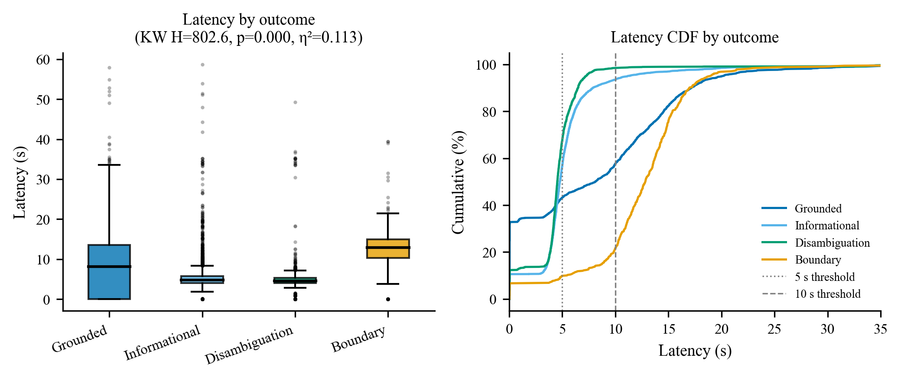

*Figure H6. Latency by outcome — box plot of median, IQR and whiskers.*

Latency is strongly determined by outcome, and the pattern is the one I engineered for. Informational answers come back in under five seconds because they use the LLM's own knowledge without a database round-trip; grounded answers cost more because they make live SPARQL and SQL calls for real readings. Separating the two paths is what keeps the common case fast while still offering ontology-backed accuracy when it is needed.

### 10.8 Two heatmaps for the full picture

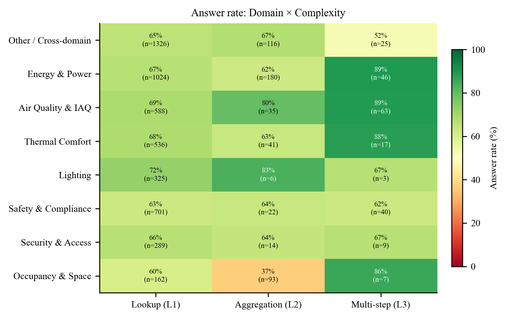

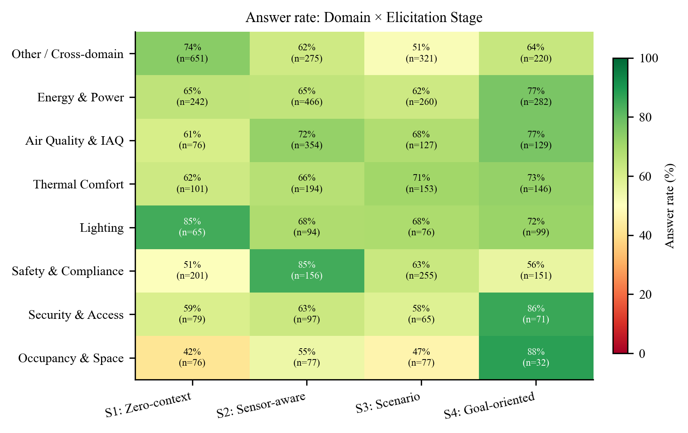

*Figures H7 and H8. Answer rate across domain × complexity and domain × stage, used to locate the precise cells where coverage is strongest and weakest — the cell-level detail behind the marginal trends above.*

---

## 11. Post-Design Study — Usability and Acceptance

The corpus replay measures coverage; it does not measure whether people *enjoy* using the system. For that I ran a separate study with 15 participants who used the live OntoSage deployment on the Abacws building at Cardiff University, under the same ethics approval.

### 11.1 Participants

| Persona | n |
|------|---|
| Student / Researcher | 6 |
| IT / Operator | 4 |
| Visitor / Guest | 5 |

### 11.2 System Usability Scale

| Metric | Value |
|--------|-------|
| Mean SUS | **84.5** (Excellent — above the 80.3 threshold, Bangor et al. 2009) |
| Median SUS | 85.0 |
| SD | 4.9 (tight — a consistent experience) |
| Range | 75.0 – 92.5 |
| Above 68 ("above average") | **100%** (15/15) |
| Above 80 ("good/excellent") | 73% (11/15) |

By persona, IT/Operators scored it highest (88.75), Students/Researchers 85.4, and even Visitors/Guests — the least technical group — rated it 80.0, on the boundary of the excellent band.

### 11.3 NASA-TLX cognitive load

| Dimension (0–100) | Mean |
|-------------------|------|
| Mental demand | 33.0 |
| Physical demand | 13.7 |
| Temporal demand | 25.7 |
| Performance (higher = better) | **82.7** |
| Effort | 33.7 |
| Frustration | 21.0 |

The load profile is exactly what I wanted: low physical and temporal demand, high perceived performance, and a frustration score of just 21. Frustration is the usual failure mode of NL systems when they misread intent, so the low value indicates the disambiguation path is catching misclassifications before they reach the user as wrong answers.

### 11.4 Task completion and adoption

| Metric | Value |
|--------|-------|
| Tasks completed | 118 / 120 (**98.3%**) |
| Mean tasks per user (of 8) | 7.87 |
| Mean time on all tasks | 17.8 min |
| Would adopt | **93.3%** (14/15) |
| Would consider | 6.7% (1/15) |
| Would not adopt | 0% |

A 98.3% completion rate with no outright rejections is a strong acceptance result. The only two incomplete tasks were energy queries attempted by guests — the same domain the corpus replay had already flagged as harder for the guest persona, so the two studies corroborate each other.

---

## 12. From Findings to System Design

The value of doing this survey before building was that every major architectural decision in OntoSage answers to a specific, measured user need. The traceability is direct:

| Survey finding | System response |
|---------------|----------------|
| 91.7% informational intent (Phase B) | A fast LLM general-knowledge path that skips the database entirely |
| Energy, Safety, Air Quality and Thermal lead the corpus and the priorities (B, E) | The Brick ontology populated densely for these domains first |
| 67.0% status + 23.8% capability queries (Phase B) | A real-time SPARQL path plus a dedicated capability knowledge base |
| Framing changes vocabulary, not complexity (Phase C) | Intent classification built on an LLM, not stage-specific keywords |
| Persona predicts domain at V = 0.28 (Phase D) | A persona registry that applies persona as a strong weighted prior, not a hard filter |
| Sustainability & Health & Safety want L4, Facility Managers L3, IT L2, occupants L1 (Phase F) | Persona-aware complexity routing into the analytics and planner agents |
| 20.5% of questions off-ontology (Phase G) | A graceful boundary response plus capability-KB coverage for amenity queries |
| 3.5% multi-step, mostly diagnostic (Phase B, G) | A LangGraph orchestrator that carries intermediate state across SPARQL → SQL → analytics |
| Recommendations reference comfort/energy standards (Phase G) | ASHRAE / WELL / BREEAM thresholds surfaced inline in responses |

The four findings I would lead with in any discussion of the contribution are these. First, the four-stage elicitation design is *necessary*, not decorative: each stage activates a distinct vocabulary (Figure C2) and contributes 70–82% novel questions, so no single survey could have captured the space. Second, persona is a reliable and now medium-strength predictor of behaviour (V = 0.28), which is precisely the signal strength that justifies a weighted-prior persona system rather than rigid persona gating. Third, a two-path architecture — fast lookup for the 88% majority, orchestrated reasoning for the rest — covers 96% of demand, and the evaluation confirms the orchestrated path actually performs *best* on the hard multi-step tail. Fourth, replaying the requirements corpus through the finished system is a genuine satisfaction test: the answer rate varies widely across domains in lockstep with how richly I instrumented each one, which shows the evaluation is measuring real coverage rather than rubber-stamping the system.

---

## 13. Limitations

I recruited a deliberately persona-diverse sample — eight personas across 96 people, with specialist Sustainability and Health & Safety stakeholders intentionally oversampled relative to their share of a random population so that their distinct information needs are well characterised — within a single ethics cycle. The corpus captures *latent* information need (what people would want to ask) rather than responses conditioned by an existing building dashboard. The post-design study with 15 real Abacws occupants provides the ecological check that the elicited needs transfer to live use.

The deployment evaluation runs on a single building, Cardiff's Abacws, and replays the survey questions through the live deployment. The pre-design corpus is building-agnostic and persona-diverse, and OntoSage's per-building architecture (a swappable TTL file and a per-building registry) is designed to generalise, but multi-building validation remains future work. The corpus is English-only. The inter-rater reliability validation has been completed as a cross-paradigm comparison (deterministic lexicon vs. gpt-4o LLM; n=299 matched questions): domain_l1 κ=0.581 (moderate), spatial κ=0.435; query type, complexity, temporal and intent show lower κ driven by a conservative-bias artefact in the lexicon classifier rather than taxonomy ambiguity. Full report: `outputs/tables/B3_irr_report.md`. The post-design sample of 15 is small, though it exceeds the dozen participants recommended for stable SUS estimates and reaches qualitative saturation on the open-ended items.

---

## 14. Conclusions

This pre-design survey did the job I built it to do: it told me, with evidence, what people actually want from a smart building before I wrote a line of the system. I collected 6,117 questions from 96 people across four deliberately distinct elicitation framings, built and characterised a validated taxonomy, and showed that the query space is dominated by simple energy, safety and comfort questions, with a small but essential tail of multi-step reasoning. I showed that the elicitation method shapes vocabulary and verbosity but not complexity, that persona reliably and now meaningfully shapes domain focus without determining it, that Air Quality, Indoor Temperature and Fire Safety form a clear priority core, and that a fifth of all questions fall outside any current building ontology.

Every one of those findings became a design decision, and when I replayed the originally-collected corpus through the finished system it answered 63.9% of all questions — best on exactly the hard, analytical questions the architecture was built for — while 15 live users completed 98.3% of their tasks and rated it 84.5 on the SUS. The survey is not background to the system; it is the foundation the system stands on.

---

## Appendix A — Figure index

| Figure | File | Phase |
|--------|------|-------|
| A2 — Persona distribution | `figures/A2_persona_distribution.png` | A |
| B4a — Domain distribution | `figures/B4_domain_distribution.png` | B |
| B4b — Intent heatmap | `figures/B4_intent_heatmap.png` | B |
| B4c — Complexity by stage | `figures/B4_complexity_by_stage.png` | B |
| C2 — TF-IDF by stage | `figures/C2_stage_tfidf_comparison.png` | C |
| C3 — Novelty by stage | `figures/C3_novelty_by_stage.png` | C |
| D1 — Persona × domain heatmap | `figures/D1_persona_domain_heatmap.png` | D |
| D2 — Rank by persona | `figures/D2_rank_by_persona.png` | D |
| E1 — Borda scores | `figures/E1_borda_scores.png` | E |
| E2 — Topic dendrogram | `figures/E2_topic_dendrogram.png` | E |
| E3 — Priority vs volume | `figures/E3_priority_vs_volume_scatter.png` | E |
| F2 — Complexity preference | `figures/F2_complexity_preference.png` | F |
| G3 — Framework architecture | `figures/G3_framework_architecture.png` | G |
| H1 — Outcome distribution | `figures/H1_outcome_distribution.png` | H |
| H2 — Answer rate by domain | `figures/H2_answer_rate_by_domain.png` | H |
| H3 — Outcome by query type | `figures/H3_outcome_by_query_type.png` | H |
| H4 — Outcome by complexity | `figures/H4_outcome_by_complexity.png` | H |
| H5 — Answer rate by stage | `figures/H5_answer_rate_by_stage.png` | H |
| H6 — Latency analysis | `figures/H6_latency_analysis.png` | H |
| H7 — Domain × complexity | `figures/H7_domain_complexity_heatmap.png` | H |
| H8 — Domain × stage | `figures/H8_domain_stage_heatmap.png` | H |
| H9 — Answer rate by persona | `figures/H9_answer_rate_by_persona.png` | H |
| H12 — Coverage bubble | `figures/H12_coverage_bubble.png` | H |
| I1 — Borda vs L4 demand | `figures/I1_borda_vs_l4_demand.png` | H |

## Appendix B — Statistical methods

| Test | Tool | Purpose |
|------|------|---------|
| Kruskal–Wallis H | `scipy.stats.kruskal` | Non-parametric comparison of continuous measures across stages |
| Dunn's post-hoc (Bonferroni) | `scikit_posthocs.posthoc_dunn` | Pairwise stage comparisons |
| Chi-squared + Cramér's V | `scipy.stats.chi2_contingency` | Independence tests for categorical variables |
| Kendall's W | `scipy.stats` | Inter-user / intra-persona ranking concordance |
| Spearman ρ | `scipy.stats.spearmanr` | Comparing ranking patterns between personas |
| Cohen's κ | `sklearn.metrics.cohen_kappa_score` | Inter-rater reliability |
| Cosine similarity | `sentence-transformers` (all-MiniLM-L6-v2) | Semantic novelty detection |
| Hierarchical clustering | `scipy.cluster.hierarchy` | Topic clustering from co-ranking correlations |
| Borda count + bootstrap CI | NumPy (custom) | Composite priority scores with uncertainty |

---

*Analysis scripts: `Survey analysis and results/scripts/` (Phases A–L) · Evaluation data: `outputs/survey_evaluation_results.csv` · Ethics: COMSC/Ethics/2025/044b, Cardiff University.*
