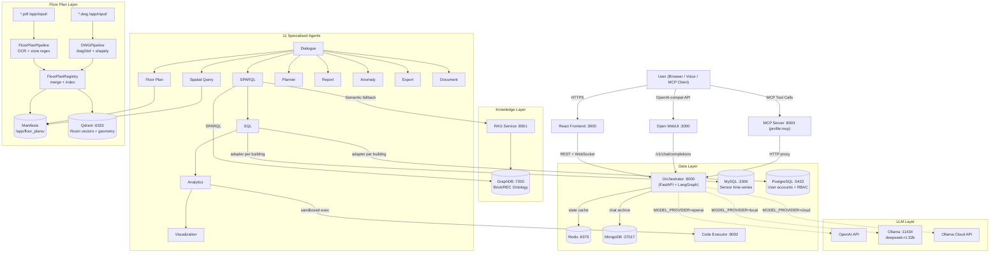

# OntoSage — Complete System Reference

**Agentic AI Framework for Smart Buildings**

[](https://www.python.org/)
[](https://fastapi.tiangolo.com/)
[](https://langchain-ai.github.io/langgraph/)
[](https://brickschema.org/)
[](https://opensource.org/licenses/MIT)
[](https://github.com/suhasdevmane/OntoSage/actions/workflows/ci.yml)

> **Author:** Suhas Devmane · Cardiff University
> **Version:** 3.0 · **License:** MIT
> **Repository:** [github.com/suhasdevmane/OntoSage](https://github.com/suhasdevmane/OntoSage)

---

## Table of Contents

1. [Executive Summary](#1-executive-summary)
2. [Key Metrics](#2-key-metrics)
3. [Architecture](#3-architecture)
4. [Service Map](#4-service-map)
5. [Multi-Agent System](#5-multi-agent-system)
6. [16 Intent Types](#6-16-intent-types)
7. [Persona System](#7-persona-system)
8. [Knowledge Layer — Ontology & GraphDB](#8-knowledge-layer--ontology--graphdb)
9. [Floor Plan Intelligence](#9-floor-plan-intelligence)
10. [RAG Systems](#10-rag-systems)
11. [Data Layer — All Storage Systems](#11-data-layer--all-storage-systems)
12. [LLM Provider Flexibility](#12-llm-provider-flexibility)
13. [End-to-End Query Flow](#13-end-to-end-query-flow)
14. [API Reference](#14-api-reference)
15. [MCP Server Integration](#15-mcp-server-integration)
16. [Security & RBAC](#16-security--rbac)
17. [Monitoring & Observability](#17-monitoring--observability)
18. [Quick Start](#18-quick-start)
19. [Building Onboarding](#19-building-onboarding)
20. [Building Datasets](#20-building-datasets)
21. [Configuration Reference](#21-configuration-reference)
22. [Technology Stack](#22-technology-stack)
23. [Project Structure](#23-project-structure)
24. [Development Guide](#24-development-guide)
25. [Troubleshooting](#25-troubleshooting)
26. [Operations Runbook](#26-operations-runbook)
27. [User Guide & FAQ](#27-user-guide--faq)
28. [Whisper STT — Voice Input](#28-whisper-stt--voice-input)
29. [Research Background](#29-research-background)
30. [Contributing](#30-contributing)

---

## 1. Executive Summary

**OntoSage** is a production-grade agentic AI platform that enables **Zero-Knowledge Human-Building Interaction (HBI)**. Users — occupants, facility managers, researchers, sustainability officers, executives — ask questions about their buildings in plain natural language and receive accurate, persona-appropriate answers sourced from a semantic knowledge graph and live sensor databases. No SQL, no SPARQL, no schema knowledge required.

**Core technical approach:**

- **LangGraph hub-and-spoke orchestration** — 11 specialised agents, each responsible for a single stage of the query pipeline. Every request flows through a state machine from intent detection to final response.
- **Ontology-driven knowledge** — your building's Turtle (`.ttl`) RDF file *is* the sensor catalogue. GraphDB ingests it; SPARQL queries traverse it; `ref:storedAt` links automatically route to the right time-series database.
- **Floor plan intelligence** — PDF and DWG files are ingested at startup. Room polygons, areas, adjacency graphs, and sensor block locations are extracted and made queryable in natural language.
- **Persona-aware responses** — the same underlying data is rewritten for each of 10 persona types (occupant, executive, researcher, facility manager, etc.) via a post-processing adapter.
- **Compliance standards** — deterministic checking against ASHRAE 55, ASHRAE 62.1, WELL v2, BREEAM Hea 02, EN 15251, ISO 50001.
- **Multi-building, multi-database** — 8 database backends, unlimited buildings, all routing driven by the TTL file.

---

## 2. Key Metrics

| Metric | Value |
|--------|-------|
| Ontology triples (GraphDB, Building 1) | 365,944 |
| Unique sensors | 680 across 20 sensor types |
| Time-series records (MySQL) | 576,000+ |
| LLM providers supported | 3 (Ollama local, OpenAI, Ollama Cloud) |
| REST + WebSocket endpoints | 25+ |
| LangGraph agent nodes | 11 + DocumentAgent |
| Intent types | 16 |
| Persona types | 10 |
| Compliance standards checked | 6 |
| MCP tools | 9 |
| Self-correction strategies (SPARQL) | 4 |
| Languages supported (i18n) | 30+ |
| Supported database backends | 8 |

---

## 3. Architecture

### 3.1 Hub-and-Spoke Agent Architecture

```
User (any language, any persona)
        |
        | Natural language  [i18n: auto-detect + translate to English]
        v
+------------------------------------------------------------+
|               OntoSage Orchestrator (FastAPI + LangGraph)  |
|                                                            |
|  [Dialogue Agent]  ─intent classification + entity extract |
|        |                                                   |
|  [Routing] ─────────────────────────────────────────────  |
|    │  ├── sparql  → sql → analytics → visualization       |
|    │  ├── floor_plan → manifest + PNG render               |
|    │  ├── spatial_query → DWG geometry (no LLM)           |
|    │  ├── anomaly → threshold + Z-score + spike detect     |
|    │  ├── report / planner → multi-section report          |
|    │  ├── export → CSV / JSON / HTML download              |
|    │  └── response → general / clarification               |
|                                                            |
|  [PersonaAdapter] → i18n translate back → [Response]      |
+------------------------------------------------------------+
        |
        v (in user's language, persona-framed)
```

### 3.2 Architecture Diagram



### 3.3 State Machine: LangGraph Workflow

Every request is a single `ConversationState` object flowing through the graph:

```
[START]
    ↓
[dialogue_node]       ← intent detection, entity extraction, time range, persona resolution
    ↓ (conditional routing)
    ├──[sparql_node]  ← SPARQL generation + GraphDB execution + RAG fallback
    │       ↓
    │  [sql_node]     ← UUID-based SQL fetch + Text-to-SQL fallback
    │       ↓
    │  [analytics_node] ← deterministic engine → LLM-generated Python → Code Executor
    │       ↓
    │  [visualization_node] ← chart generation, base64 embed
    │
    ├──[floor_plan_node]    ← manifest load, PNG render, room list
    ├──[spatial_query_node] ← area, adjacency, block counts from DWG geometry
    ├──[anomaly_node]       ← threshold + Z-score + spike detection
    ├──[report_node]        ← structured multi-section report
    ├──[planner_node]       ← multi-step decomposition
    ├──[export_node]        ← CSV/JSON/HTML file generation
    ├──[document_node]      ← PDF/Word/HTML formal document
    └──[response_node]      ← PersonaAdapter + i18n + cache store + memory save
    ↓
[END]
```

---

## 4. Service Map

| # | Service | Port | Profile | Purpose |
|---|---------|------|---------|---------|
| 1 | `orchestrator` | 8000 | default | Central AI orchestration (FastAPI + LangGraph) |
| 2 | `graphdb` | 7200 | default | RDF Knowledge Graph (Ontotext GraphDB 10.7.4) — bound to `127.0.0.1` |
| 3 | `redis` | 6379 | default | Conversation state, session tokens, SPARQL cache (2 GB, allkeys-lru) |
| 4 | `postgres-user-data` | 5433 | default | User accounts, Argon2id hashes, RBAC roles |
| 5 | `rag-service` | 8001 | default | Semantic entity retrieval via GraphDB Similarity Index |
| 6 | `code-executor` | 8002 | default | Sandboxed Python execution (analytics + charts) |
| 7 | `qdrant` | 6333 | default | `floor_plans` (room vectors + DWG geometry) + `user_memory` |
| 8 | `mongodb` | 27017 | default | Full chat history archive (Open WebUI storage) |
| 9 | `open-webui` | 3000 | default | **Active chat interface** — OpenAI-compatible UI with voice support |
| 10 | `file-server` (nginx) | 8080 | default | Static file server — floor plan PDFs/PNGs, plots, reports, exports |
| 11 | `data-publisher` | — | default | Inserts realistic dummy sensor readings every 30 s into MySQL |
| 12 | `mysql` | 3306 | HOST | Time-series sensor data — runs on host via `host.docker.internal` |
| 13 | `ollama` | 11434 | HOST / `local-gpu` | Local LLM inference (deepseek-r1:32b) — host or GPU profile |
| 14 | `mcp-server` | 8003 | `mcp` | MCP server (stdio + SSE) — enable with `--profile mcp` |
| 15 | `prometheus` | 9090 | `monitoring` | Metrics collection — enable with `--profile monitoring` |
| 16 | `grafana` | 3002 | `monitoring` | Monitoring dashboards — enable with `--profile monitoring` |
| 17 | `whisper-stt` | 8003 | disabled | Faster-Whisper voice transcription (commented out in compose) |
| 18 | `frontend` | — | disabled | React 19 web app (commented out; Open WebUI used instead) |

### 4.1 Docker Networks

| Network | Type | Purpose |
|---------|------|---------|
| `ontobot-agentic` | Internal bridge | All container-to-container traffic within OntoSage |
| `ontobot-network` | External bridge | Connects containers to host-side MySQL and Ollama via `host.docker.internal` |

### 4.2 Public Deployment

The system is accessible externally via **Cloudflare Tunnel** at `https://talk2futurebuildings.systems`. This tunnels traffic to the local Open WebUI and Orchestrator without exposing raw ports.

### 4.3 Active Chat Interface

**Open WebUI** (port 3000) is the production chat interface. It connects to the orchestrator via the OpenAI-compatible `/v1/chat/completions` endpoint. The React frontend (`frontend/`) is in the repository but disabled by default in `docker-compose.yml`.

---

## 5. Multi-Agent System

### 5.1 Dialogue Agent

**File:** `orchestrator/agents/dialogue_agent.py`

The entry point for every query. It:

1. **Detects language** via `langdetect` and optionally translates to English via the i18n service
2. **Classifies intent** into one of 16 types using a few-shot LLM prompt with `INTENT_DEFINITIONS`
3. **Extracts entities** — building names, zones, rooms, sensor types
4. **Parses time ranges** — handles relative ("last week") and absolute ("2024-01-15 to 2024-01-22") dates
5. **Resolves persona** — from the RBAC role or explicit request field
6. **Retrieves agent memory** — per-user Qdrant vectors from previous sessions improve routing accuracy

### 5.2 SPARQL Agent

**File:** `orchestrator/agents/sparql_agent.py`

- Builds SPARQL queries using `PromptBuilder` (building-agnostic hints + examples)
- Retrieves ontology context via the RAG service before generating SPARQL
- **Self-Correction Engine** with 4 escalating strategies around every execution:
  1. `SyntaxFixStrategy` — brace matching, duplicate SELECT removal
  2. `PrefixRepairStrategy` — injects missing PREFIX declarations
  3. `LLMRegenerationStrategy` — sends error + bad query to LLM for rewrite
  4. `TemplateSchemaFallbackStrategy` — guaranteed sensor-discovery fallback query
- Extracts sensor UUIDs (UUID4 regex) for downstream SQL queries
- Result caching (SHA-256 hash, 1-hour Redis TTL)
- LIMIT 1000 cap enforced before every GraphDB call

### 5.3 SQL Agent

**File:** `orchestrator/agents/sql_agent.py`

- **Primary path:** UUID-based column lookup in the sensor time-series table
- **Fallback:** Text-to-SQL generation for complex aggregations
- Column validation before querying (prevents `Unknown column` errors)
- Auto-expands time window on zero results (1-day → 7-day → 30-day)
- SELECT-only enforcement (SQL injection prevention via `_FORBIDDEN_KEYWORDS`)
- Multi-database adapter routing via `services/adapters/registry.py`

### 5.4 Analytics Agent

**File:** `orchestrator/agents/analytics_agent.py`

**Deterministic Analytics Engine** (no LLM for known computation types):

| Analyser | What it computes |
|----------|-----------------|
| `ComfortAnalyser` | ASHRAE 55 / WELL v2 / EN 15251 thermal comfort bands |
| `EnergyAnalyser` | Peak demand detection, load factor, consumption delta |
| `AirQualityAnalyser` | CO2 bands (good/moderate/poor/critical), PM2.5 IAQ score |
| `TrendAnalyser` | Mann-Kendall test + linear regression slope |
| `ComplianceChecker` | Multi-standard rollup across all 6 standards |

When the deterministic engine cannot handle the query, it falls back to LLM-generated Python code executed in the sandboxed Code Executor.

### 5.5 Visualization Agent

**File:** `orchestrator/agents/visualization_agent.py`

- Executes SPARQL → SQL first to ensure data is available before rendering
- Supported chart types: line, bar, scatter, histogram, heatmap, pie
- Outputs base64-embedded PNG in the response
- Saves charts to `/app/outputs/static/` for the file server

### 5.6 Floor Plan Agent

**File:** `orchestrator/agents/floor_plan_agent.py`

- Reads `FloorPlanManifest` JSON from `/app/floor_plans/`
- Returns the rendered PNG image (from PDF pipeline) + structured room list
- No SPARQL or SQL — geometry-only data source

### 5.7 Spatial Query Agent

**File:** `orchestrator/agents/spatial_agent.py`

- Pure manifest analysis — no LLM calls, sub-second responses
- Answers: area queries, room counts by type, adjacency lookups, block counts
- Loads manifests with `_load_manifests()` at `spatial_agent.py:440`

### 5.8 Anomaly Detection Agent

**File:** `orchestrator/agents/anomaly_agent.py`

| Strategy | Mechanism |
|----------|-----------|
| Threshold | Compare readings against `COMFORT_RANGES` for 10 sensor types |
| Z-score | Flag \|z\| > 2.5 standard deviations from column mean |
| Spike | Flag step-changes > 40% of previous value |

Produces a structured anomaly digest with timestamps, values, and severity.

### 5.9 Report Agent

**File:** `orchestrator/agents/report_agent.py`

Generates structured reports: `summary`, `anomaly`, `comparison`, `trend`, `full`. Detects comfort-range violations for 8 sensor types. LLM narrates findings over detected patterns.

### 5.10 Data Export Agent

**File:** `orchestrator/agents/data_export_agent.py`

JSON / CSV / HTML / Markdown export. XSS-safe (`html.escape()` applied to all data values). Auto-timestamped filenames. Returns a `download_url` in the response.

### 5.11 Planner Agent

**File:** `orchestrator/agents/planner_agent.py`

Decomposes complex multi-step queries into ordered sub-plans:
`sparql → sql → analytics → anomaly → report → export`.
Each sub-plan executes as a separate graph branch; results are aggregated at the response node.

### 5.12 Document Agent

**File:** `orchestrator/agents/document_agent.py`

Generates formal PDF / Word / HTML documents from pipeline state using `DocumentBuilder` + Jinja2 templates.

| Document Type | Template | Use Case |
|--------------|---------|---------|
| `executive_kpi` | `executive_kpi.html` | Hero KPIs, gradient card layout, executive brief |
| `weekly_summary` | `weekly_summary.html` | KPIs table, anomalies, operational highlights |
| `compliance_report` | `compliance_report.html` | Standards cards, evidence data, violations |
| `anomaly_digest` | `anomaly_digest.html` | Anomaly summary, outlier details |
| `energy_report` | `energy_report.html` | Consumption trends, EUI vs target |
| `iaq_report` | `iaq_compliance.html` | Indoor air quality evidence pack |
| `research_export` | `research_export.md` | Provenance + methodology + data |

---

## 6. 16 Intent Types

The Dialogue Agent classifies every query into one of the following intents, which determines the exact agent pipeline that runs:

| Intent | Trigger Examples | Pipeline |
|--------|-----------------|---------|
| `sensor_data` | "CO₂ level in zone 3 right now" | Dialogue → SPARQL → SQL → Response |
| `analytics` | "Average temperature last 24h" | Dialogue → SPARQL → SQL → Analytics → Response |
| `discovery` | "What sensors do you have?" | Dialogue → SPARQL → Response |
| `report` | "Generate weekly building report" | Dialogue → Planner → Report → Response |
| `anomaly` | "Any CO₂ spikes in the last 48h?" | Dialogue → SPARQL → SQL → Anomaly → Response |
| `comparison` | "Compare zones 1 and 2 temperatures" | Dialogue → SPARQL → SQL → Analytics → Response |
| `export` | "Export sensor data as CSV" | Dialogue → SPARQL → SQL → Export → Response |
| `recommend` | "How can I improve air quality?" | Dialogue → SPARQL → SQL → Analytics → Response |
| `planner` | "Analyse CO₂ then export as PDF" | Dialogue → Planner → multi-step → Response |
| `forecast` | "Predict temperature for tomorrow" | Dialogue → SPARQL → SQL → Analytics → Response |
| `floor_plan` | "Show me floor 3", "where is room 3.01?" | Dialogue → Floor Plan → Response |
| `spatial_query` | "How many rooms on floor 4 > 50 m²?" | Dialogue → Spatial Query → Response |
| `compliance` | "Are we within ASHRAE 62.1 limits?" | Dialogue → SPARQL → SQL → Analytics + StandardsEngine → Response |
| `control` | "Turn off HVAC zone 4" | Dialogue → Response (graceful decline — reserved) |
| `general` | "Hello", "What is HVAC?" | Dialogue → Response (no DB needed) |
| `clarification` | Ambiguous query | Dialogue → Response (follow-up question) |

**Disambiguation rule:** "show me / where is / find" → `floor_plan`. "how many / area / size / adjacent" → `spatial_query`.

---

## 6.1 Intent → Route Source Code

Key navigation anchors:

| Task | File | Line |
|------|------|------|
| All routing branches | `orchestrator/workflow.py` | 1521 (`_route_from_dialogue`) |
| Register a new node | `orchestrator/workflow.py` | 132 (`_build_graph`) |
| Intent definitions + few-shot | `orchestrator/agents/dialogue_agent.py` | search `INTENT_DEFINITIONS` |

---

## 7. Persona System

Ten persona types, each producing different response framing over the same underlying data:

| Persona | Typical User | Response Style |
|---------|-------------|---------------|
| `occupant` | Building guest | Simple language, comfort focus, emoji |
| `student` | Student / learner | Educational, explanatory, step-by-step |
| `facility_manager` | Building manager | Technical KPIs, actionable maintenance tasks |
| `energy_manager` | Energy manager | Cost/carbon metrics, EUI vs target |
| `sustainability_officer` | Sustainability lead | Standards citations, BREEAM/WELL evidence |
| `safety_officer` | H&S / fire safety | Alert digest, threshold compliance |
| `executive` | Senior manager | Headline KPIs, £/$ figures, narrative |
| `researcher` | Academic / PhD | Provenance, confidence intervals, methodology |
| `it_admin` | IT / BMS admin | Sensor UUIDs, connection status, schema dumps |
| `general` | Any other user | Balanced, professional |

**PersonaAdapter** (`orchestrator/services/persona_adapter.py`) post-processes every assistant response through an LLM reframing prompt tailored to the active persona.

**Few-Shot Library** (`orchestrator/data/few_shot_library.json`) stores `(persona, intent)` → example Q&A pairs, injected into the intent detection prompt to improve classification accuracy without retraining.

---

## 8. Knowledge Layer — Ontology & GraphDB

### 8.1 How the Ontology Works

Your building's Turtle (`.ttl`) file is the **single source of truth** for:

- Spatial hierarchy: Site → Building → Floor → Zone → Room
- Sensor instances: type, UUID, location, unit
- Equipment: HVAC systems, AHUs, VAV boxes
- Relationships: "sensor X measures zone Y on floor Z"
- Database routing: `ref:storedAt` links each sensor to its time-series database

The system never maintains a separate sensor catalogue. The TTL file **is** the catalogue.

### 8.2 Minimum TTL Structure for Sensor Data

```turtle
PREFIX brick: <https://brickschema.org/schema/Brick#>
PREFIX ref:   <https://brickschema.org/schema/Brick/ref#>
PREFIX rdfs:  <http://www.w3.org/2000/01/rdf-schema#>

bldg:TempSensor_Room301 a brick:Air_Temperature_Sensor ;
    rdfs:label "Temperature Sensor Room 301" ;
    brick:isPartOf bldg:Zone_3_North ;
    brick:hasExternalReference [
        ref:hasTimeseriesId "a8df8757-009a-4c3b-b1f2-ec59f8ce3e21" ;
        ref:storedAt bldg:database1
    ] .
```

- `ref:hasTimeseriesId` — the UUID column name in your sensor database
- `ref:storedAt` — maps to a named adapter in `config/database_registry.yaml`

### 8.3 Standard SPARQL Prefixes (Always Include)

```sparql
PREFIX rdf:    <http://www.w3.org/1999/02/22-rdf-syntax-ns#>
PREFIX rdfs:   <http://www.w3.org/2000/01/rdf-schema#>
PREFIX owl:    <http://www.w3.org/2002/07/owl#>
PREFIX brick:  <https://brickschema.org/schema/Brick#>
PREFIX bacnet: <http://data.ashrae.org/bacnet/#>
PREFIX xsd:    <http://www.w3.org/2001/XMLSchema#>
PREFIX s223:   <http://data.ashrae.org/standard223#>
```

### 8.4 GraphDB Similarity Index

GraphDB's built-in Similarity Indexing (`bldg_index`) enables semantic ontology search:

1. **Entity retrieval** — vector similarity search matches natural language terms to ontology entity labels
2. **Bounded context** — 1–2 hop SPARQL expands the matched entities to their neighbourhood (type, relationships, properties)

This 2-step approach is the primary RAG strategy. No external vector database needed for this path.

#### Creating the Similarity Index (Step-by-Step)

1. Open the GraphDB Workbench at `http://localhost:7200`
2. Select the `ontosage` repository (top-right dropdown)
3. Navigate to **Explore → Similarity → Create text similarity index**
4. Set **Index Name**: `bldg_index` (must match `GRAPHDB_SIMILARITY_INDEX` in `.env`)
5. Paste this **Data Query**:

```sparql
PREFIX rdfs: <http://www.w3.org/2000/01/rdf-schema#>
PREFIX rdf:  <http://www.w3.org/1999/02/22-rdf-syntax-ns#>
PREFIX brick: <https://brickschema.org/schema/Brick#>

SELECT ?documentID ?documentText {
    ?documentID rdf:type ?type .
    FILTER(ISIRI(?documentID))
    OPTIONAL { ?documentID rdfs:label ?label }
    BIND(REPLACE(STR(?type), "^.*[#/]([^#/]+)$", "$1") as ?typeName)
    BIND(REPLACE(STR(?documentID), "^.*[#/]([^#/]+)$", "$1") as ?entityName)
    BIND(CONCAT(
        COALESCE(?label, ""), " ",
        COALESCE(?typeName, ""), " ",
        COALESCE(?entityName, "")
    ) as ?documentText)
}
```

6. Under **More options** set:
   - **Analyzer Class**: `org.apache.lucene.analysis.en.EnglishAnalyzer`
   - **Semantic Vectors parameters**: `-termweight idf -dimension 300 -minfrequency 2`
7. Click **Create** — indexing takes 1–20 minutes depending on ontology size

**Rebuild after ontology updates:**

```bash
curl -X POST "http://localhost:7200/repositories/ontosage/statements" \
  -H "Content-Type: application/sparql-update" \
  -d 'PREFIX similarity-index: <http://www.ontotext.com/graphdb/similarity/instance/>
      PREFIX similarity: <http://www.ontotext.com/graphdb/similarity/>
      INSERT DATA { similarity-index:bldg_index similarity:rebuildIndex "" . }'
```

| Triple Count | Estimated Index Build Time |
|-------------|--------------------------|
| < 10,000 | < 30 seconds |
| 10,000 – 100,000 | 1–5 minutes |
| 100,000 – 500,000 | 5–20 minutes |
| > 500,000 | 20+ minutes (increase `GDB_HEAP_SIZE=8g`) |

### 8.5 Querying GraphDB Directly

```bash
# SPARQL via HTTP
curl -s -X POST http://localhost:7200/repositories/ontosage/sparql \
  -H "Content-Type: application/sparql-query" \
  -H "Accept: application/sparql-results+json" \
  -d "SELECT ?s WHERE { ?s a <https://brickschema.org/schema/Brick#Building> } LIMIT 5"

# Web UI / Workbench
open http://localhost:7200

# Health check
curl http://localhost:7200/rest/repositories
```

---

## 9. Floor Plan Intelligence

OntoSage auto-ingests architectural drawings at startup and makes them queryable via natural language — no manual import steps required.

### 9.1 How It Works

Drop files into `/app/input/` and the system does the rest:

```
/app/input/
  Abacws floor 0.pdf      ← rendered image + room labels via OCR
  Abacws floor 0.dwg      ← AutoCAD geometry: polygons, areas, adjacency
  Abacws floor 1.pdf
  Abacws floor 1.dwg
  ...
```

Two pipelines run in parallel on every startup via `FloorPlanRegistry`:

| Pipeline | Input | What it extracts |
|----------|-------|-----------------|
| **PDF pipeline** | `*.pdf` | Room labels (OCR fallback for vector-path text), zone IDs, rendered PNG |
| **DWG pipeline** | `*.dwg` | Room polygons (shapely), area (m²), perimeter, adjacency graph, door/sensor/HVAC block locations |

The outputs are merged per floor: DWG wins for geometry, PDF wins for the rendered image. The result is written to `floor_plans/<building_id>/floor_N.manifest.json` and upserted into Qdrant (`floor_plans` collection).

**Idempotent:** SHA-256 fingerprinted — unchanged files skip reprocessing on restart.

**Live file watching:** `floor_plan_watcher.py` monitors `/app/input/` at runtime — drop a new `.pdf` or `.dwg` and it is ingested within 3 seconds, no restart required.

**Graceful degradation:** if `dwg2dxf` (libredwg-utils) is not installed, the DWG pipeline logs a warning and produces PDF-only `schema_version="1.0"` manifests. The rest of the system continues normally.

### 9.2 Natural Language Spatial Queries

Once floor plans are ingested, these questions are answered from manifests with no LLM call:

```
"How many meeting rooms are on floor 3?"           → count by room type
"Show rooms larger than 50 m² on floor 4"          → sorted area table
"What spaces are adjacent to zone 3.01?"            → adjacency graph lookup
"How many fire exits are on floor 2?"               → DWG block count by type
"Total usable area across all floors"               → sum of all space areas
"Where are the CO₂ sensors on floor 5?"            → sensor block locations by type
```

### 9.3 Floor Plan REST API

```bash
# List all ingested manifests
GET /api/v1/floor-plans

# Full manifest JSON for a specific floor
GET /api/v1/floor-plans/abacws/3/manifest

# Room polygon coordinates (normalised 0–1)
GET /api/v1/floor-plans/abacws/3/polygons

# Inline SVG floor plan (colour-coded by room type)
GET /api/v1/floor-plans/abacws/3/svg?width=1200&show_labels=true

# Force re-ingest all files
POST /api/v1/floor-plans/reingest
```

### 9.4 Per-Building Configuration

Override zone ID patterns, AIA/NCS layer names, DPI, and floor labels via YAML:

```yaml
# /app/input/<building_id>/building.yaml
building_id: cardiff_eng
building_name: Cardiff School of Engineering
zone_id_pattern: "R{floor}{nn}"    # matches R301, R415
default_dpi: 200
floors_label_override:
  0: "Ground Floor"
  1: "First Floor"
```

**Source:** `shared/floor_plan_config.py:69` — `class BuildingConfig`

---

## 10. RAG Systems

OntoSage supports 4 RAG approaches for ontology context retrieval. The active system is selected via `RAG_SYSTEM` in `.env`.

### 10.1 graphdbRAG (Default — Active)

**Location:** `rag-service/graphdbRAG/`

2-step retrieval against GraphDB's built-in Similarity Indexing:
1. Vector similarity search → matching ontology entity labels
2. 1–2 hop SPARQL expansion → entity neighbourhood (types, relationships, properties)

| Strength | Note |
|----------|------|
| Native RDF/SPARQL support | No separate vector DB needed |
| Preserves graph relationships | Structured context for SPARQL generation |
| Fast entity retrieval | Via pre-built similarity index `bldg_index` |

**Best for:** sensor metadata, relationship queries, UUID/property lookups.

```env
RAG_SYSTEM=graphdbRAG
GRAPHDB_URL=http://graphdb:7200
GRAPHDB_REPOSITORY=bldg
GRAPHDB_SIMILARITY_INDEX=bldg_index
```

### 10.2 Advanced Community RAG (LanceDB)

**Location:** `rag-service/RAG system advance/`

Community-based clustering approach using LanceDB:

1. `advanced_rag_builder.py` parses your TTL, detects hub entities (zones, equipment, sensors), and builds community clusters
2. Clusters are stored in `output/lancedb_advanced/ontology_communities.lance`
3. At query time, the top-k relevant communities (by vector similarity) are retrieved
4. Hierarchical context from each community is formatted for LLM SPARQL generation

```bash
# One-time setup: build LanceDB communities
cd rag-service/RAG\ system\ advance/
python advanced_rag_builder.py

# Enable in config
USE_ADVANCED_RAG=true
```

**Performance vs graphdbRAG:**

| Metric | graphdbRAG | Advanced Community RAG |
|--------|-----------|----------------------|
| Retrieval time | 2–5s | 0.5–1s |
| SPARQL accuracy | 60–70% | 75–85% |
| Memory usage | ~2GB | ~500MB |
| Requires GraphDB index | Yes | No |

**Fallback chain (recommended):** `advanced → graphdb → template`

### 10.3 Microsoft GraphRAG

**Location:** `rag-service/GraphRAG/`

Microsoft's GraphRAG library builds entity-relationship-community graphs from unstructured text (documentation, manuals). Suited for multi-document synthesis and complex multi-hop reasoning over prose. Less suited for structured RDF ontologies.

```env
RAG_SYSTEM=GraphRAG
# Swap service in docker-compose.yml: replace graphdb-rag-service with graphrag-service
```

### 10.4 Traditional Vector RAG (Qdrant)

**Location:** `rag-service/RAG system/`

Chunk-based dense embedding retrieval via Qdrant. Simple and fast; best for general document similarity. Less accurate for structured ontology queries because it breaks graph relationships into flat text chunks.

```env
RAG_SYSTEM=RAG_system
QDRANT_URL=http://qdrant:6333
EMBEDDING_PROVIDER=local   # or openai
```

### 10.5 Choosing a RAG System

| Scenario | Recommended System |
|----------|-------------------|
| Production (structured Brick TTL) | graphdbRAG or Advanced Community RAG |
| Large ontology, fastest retrieval | Advanced Community RAG (LanceDB) |
| Documentation + prose corpus | Microsoft GraphRAG |
| Simple prototype | Traditional Vector RAG |

---

## 11. Data Layer — All Storage Systems

### 11.1 GraphDB — RDF Knowledge Graph

- **Version:** Ontotext GraphDB 10.7.4
- **Schema:** Brick Schema v1.3 + ASHRAE 223P
- Stores building topology, sensor instances, equipment, and the UUID→database mapping
- Built-in Similarity Indexing for semantic search
- **Lightweight alternative:** Jena Fuseki (usable for deployments without a GraphDB license)

### 11.2 MySQL — Sensor Time-Series

- **Format:** Wide-format table — one column per sensor UUID
- **Records:** 576,000+ rows in the Abacws Building 1 dataset
- **Data Publisher:** `data-publisher` container continuously inserts realistic dummy sensor readings every 30 seconds, simulating live IoT ingestion
- SQL Agent pivots to long format for analytics

### 11.3 Redis — State & Cache

| Key Pattern | Purpose | TTL |
|-------------|---------|-----|
| `conversation:{id}` | Full `ConversationState` JSON | 1 hour |
| `session:{token}` | User session (32-byte random token) | 7 days |
| `cache:sparql:{hash}` | SPARQL query results | 1 hour |
| `cache:intent:{hash}` | Intent detection results | 1 hour |
| `cache:response:{hash}` | Full response cache (fuzzy 85% match) | 1 hour |
| `user:prefs:{id}` | User preferences | 30 days |

### 11.4 PostgreSQL — User Data & History

Three tables auto-created on startup: `users → conversations → messages`.
Stores Argon2id password hashes, RBAC roles, session metadata.

### 11.5 Qdrant — Vector Memory

**Two collections:**

| Collection | Contents |
|------------|---------|
| `floor_plans` | Room description vectors + DWG geometry payload for semantic spatial search |
| `user_memory` | Per-user successful (query, intent, entities, answer) tuples for cross-session personalisation |

### 11.6 MongoDB — Chat Archive

Full chat history transcripts per session, used by Open WebUI for conversation display.

### 11.7 Sensor Map Cache

**File:** `data/sensor_map.json` (2,040 entries)

Pre-computed map: `sensor name/label/URI → {uri, uuid, storage, label}`. Generated by `scripts/cache_sensor_map.py`. Used for sensor discovery and UUID-to-human-name translation.

### 11.8 Supported Database Backends

The `config/database_registry.yaml` maps TTL `ref:storedAt` identifiers to adapters:

| Backend | Technology | Use case |
|---------|------------|---------|
| `mysql` | MySQL, MariaDB, TiDB | Standard IoT sensor stores |
| `postgresql` | PostgreSQL, Aurora, Neon | Enterprise deployments |
| `timescaledb` | TimescaleDB hypertables | High-frequency time-series |
| `mongodb` | MongoDB, Atlas, DocumentDB | Document-model sensor data |
| `influxdb` | InfluxDB 2.x | Native time-series platforms |
| `sqlite` | SQLite, DuckDB | Local / embedded deployments |
| `cassandra` | Cassandra, ScyllaDB | High-write IoT at scale |
| `redis_timeseries` | Redis + RedisTimeSeries | Real-time edge data |

Multiple buildings can use different backends simultaneously — routing is automatic.

---

## 12. LLM Provider Flexibility

Switch providers with a single environment variable, no rebuild required:

```bash
MODEL_PROVIDER=openai   # OpenAI API (gpt-4o-mini default)
MODEL_PROVIDER=local    # Ollama local GPU (deepseek-r1:32b default)
MODEL_PROVIDER=cloud    # Ollama Cloud API
```

### 12.1 Provider Comparison

| Feature | Local Ollama | Ollama Cloud | OpenAI |
|---------|-------------|-------------|--------|
| **Speed** | 2–3 min/query | 5–10 sec | 5–10 sec |
| **Cost** | FREE | Pay/token | ~$0.01/1K tokens |
| **Privacy** | 100% local | Cloud | Cloud |
| **GPU required** | Yes (NVIDIA, ≥8GB VRAM) | No | No |
| **Default model** | `deepseek-r1:32b` | `gpt-oss:120b-cloud` | `gpt-4o-mini` |

### 12.2 Switching Providers

```bash
# Live switch (orchestrator only restarts — 15 seconds)
MODEL_PROVIDER=openai docker compose restart orchestrator
MODEL_PROVIDER=local  docker compose restart orchestrator

# Windows PowerShell
.\switch-provider.ps1 openai
.\switch-provider.ps1 local
.\switch-provider.ps1 cloud
```

### 12.3 LLM Usage Points in the Pipeline

| # | Stage | Agent |
|---|-------|-------|
| 1 | Intent detection | Dialogue Agent |
| 2 | SPARQL generation | SPARQL Agent |
| 3 | SQL generation / Text-to-SQL | SQL Agent |
| 4 | Analytics code generation | Analytics Agent |
| 5 | Result narration | Response node |
| 6 | Chart type detection | Visualization Agent |
| 7 | Matplotlib/Plotly code generation | Visualization Agent |
| 8 | Context summarisation | Context Manager |
| 9 | Persona-aware response reframing | PersonaAdapter |
| 10 | i18n translation (fallback backend) | i18n Service |

### 12.4 GPU Configuration (Local Mode)

```env
# In .env — optimised for RTX 4090 (16GB VRAM)
OLLAMA_GPU_LAYERS=33       # All layers on GPU
OLLAMA_NUM_GPU=1
OLLAMA_KEEP_ALIVE=24h      # Keep model in VRAM between queries
OLLAMA_NUM_CTX=32768       # Full context window
LLM_TEMPERATURE=0.1        # More deterministic
LLM_MAX_TOKENS=4096

# For 8GB VRAM GPU
OLLAMA_GPU_LAYERS=20
```

---

## 13. End-to-End Query Flow

### 13.1 Example: Compliance Check

**User asks:** *"Does the building meet BREEAM Hea 02 indoor air quality requirements?"*

```
Step 1 — Dialogue Agent
    intent:           "compliance"
    entities:         ["CO2", "PM2.5"]
    time_range:       { start: "now-24h", end: "now" }
    persona:          "sustainability_officer"

Step 2 — SPARQL Agent  (GraphDB port 7200)
    generated query:
        SELECT ?sensor ?uuid ?storedAt WHERE {
            ?sensor a brick:CO2_Sensor ;
                    brick:hasExternalReference ?ref .
            ?ref ref:hasTimeseriesId ?uuid ;
                 ref:storedAt ?storedAt .
        } LIMIT 100
    result:  uuid="5bb3...", storedAt="bldg:database1"

Step 3 — SQL Agent  (MySQL via adapter registry)
    query:   SELECT Datetime AS timestamp, `5bb3-...` AS value
             FROM sensor_data
             WHERE Datetime >= NOW() - INTERVAL 24 HOUR
             LIMIT 10000;
    result:  2,016 rows of CO2 readings

Step 4 — Analytics Agent  (deterministic ComplianceChecker)
    BREEAM Hea 02 threshold:  CO2 < 1000 ppm
    measured mean:            712 ppm
    max:                      987 ppm
    result:                   COMPLIANT — no threshold breaches in 24h

Step 5 — StandardsEngine  (checks all 6 standards)
    BREEAM Hea 02:   ✅ PASS (CO2 712 ppm < 1000 ppm)
    ASHRAE 62.1:     ✅ PASS (CO2 712 ppm < 1100 ppm)
    WELL v2 Feature 29: ✅ PASS

Step 6 — PersonaAdapter  (sustainability_officer voice)
    adds: standards citation, evidence metadata, carbon context

Step 7 — Response node
    i18n translate back to user's language (if not English)
    follow-up suggestions: "Export compliance evidence? | Check WELL v2? | View trend?"
    save to Redis: conversation state preserved for follow-up

Total wall-clock time: ~4–8 seconds end-to-end
```

### 13.2 Example: Floor Plan

**User asks:** *"Show me floor 3 and where the CO₂ sensors are"*

```
Step 1 — Dialogue Agent
    intent:  "floor_plan"
    floor:   3

Step 2 — Floor Plan Agent
    reads:  floor_plans/abacws/floor_3.manifest.json
    returns: rendered PNG (from PDF pipeline) + room list
             CO₂ sensor blocks from DWG manifest (type=co2_sensor)
    no SPARQL, no SQL, no LLM call

Response: PNG image + table of CO₂ sensor locations by room

Total wall-clock time: ~0.3 seconds
```

### 13.3 Example: Multi-Hop Reasoning

**User asks:** *"Which floor has the highest average CO₂ this week?"*

```
ReasoningEngine detects multi-hop pattern
Sub-plan 1: SPARQL → get floor→zone→CO₂sensor hierarchy
Sub-plan 2: SQL    → fetch weekly CO₂ readings per sensor
Sub-plan 3: Aggregate → group by floor, compute mean per floor
Sub-plan 4: Synthesise → LLM ranks floors and narrates result

Response: "Floor 5 had the highest average CO₂ at 867 ppm — 22% above the building mean..."
```

### 13.4 Detailed 14-Step Request Lifecycle

Every request — from the user pressing Enter to receiving a response — passes through exactly these 14 steps:

```
 1. User input (text or voice via Faster-Whisper STT)
 2. HTTP/WebSocket → FastAPI Orchestrator
 3. Trace ID injected into request.state.trace_id
 4. Auth middleware validates Bearer token against Redis
 5. RBAC dependency checks required permission for the endpoint
 6. ConversationState loaded from Redis (new session = fresh state)
 7. LangGraph graph.run(state) invoked
 8. Dialogue Agent: intent classification + entity extraction + time range + persona
 9. _route_from_dialogue() selects next node based on intent
10. SPARQL Agent (if needed): context retrieval → query generation → validation → GraphDB execution
11. SQL Agent (if needed): storage routing → time range → query → standardised result
12. Analytics / Report / Anomaly / Export Agent (if needed)
13. Visualization Agent (if needed): chart type detection → LLM code → Code Executor
14. Response Node: UUID→label substitution → PersonaAdapter → i18n → Redis save → return
```

**Typical timing by query type:**

| Query Type | Typical Wall-Clock Time |
|------------|------------------------|
| Simple sensor reading (cache hit) | 0.8 seconds |
| Simple sensor reading (cold) | 2.5 seconds |
| Analytics with chart | 6–8 seconds |
| Metadata discovery | 1.8 seconds |
| Anomaly detection (47 sensors) | ~5 seconds |
| Floor plan render | 0.3 seconds |
| Compliance check (full pipeline) | 4–8 seconds |

**Trace example A — Simple sensor reading:**

```
dialogue      intent=sensor_data, entities=[Zone_5_01], time_range=now
    ↓
sparql        → uuid="abc-123", storage="mysql"
    ↓
sql           SELECT last 5 min for uuid abc-123 → 22.4°C at 14:32
    ↓
response      "The current temperature in Zone 5.01 is 22.4°C (measured at 14:32)."
```

**Trace example B — Analytics discovery:**

```
dialogue      intent=discovery, entities=[Building_Management_Room]
    ↓
sparql        SELECT ?sensor ?type WHERE { ?sensor brick:isPartOf :BMS_Room }
              → 4 sensors: CO₂, Temperature, Humidity, Occupancy
    ↓
response      (no SQL needed — discovery routes directly to response)
              "Zone 1.08 contains 4 sensors: ..."
```

---

## 14. API Reference

### 14.1 Core Endpoints

| Endpoint | Method | Auth | Description |
|----------|--------|------|-------------|
| `/chat` | POST | session | Main synchronous chat (full LangGraph pipeline) |
| `/chat/stream` | POST | session | SSE streaming chat with progress events |
| `/stream` | WebSocket | session | Real-time streaming with per-node progress |
| `/v1/chat/completions` | POST | session | OpenAI-compatible endpoint (for Open WebUI) |
| `/auth/register` | POST | none | User registration |
| `/auth/login` | POST | none | Login → session token |
| `/auth/logout` | POST | session | Invalidate session |
| `/conversations/{user_id}` | GET | session | List user's conversations |
| `/health` | GET | none | Service health (no auth required) |
| `/health/aggregate` | GET | none | All downstream services health |

### 14.2 Chat Request / Response

```json
// POST /chat
{
  "message": "What is the average CO2 in zone 5 this week?",
  "conversation_id": "conv_abc123",
  "user_id": "testuser",
  "persona": "facility_manager",
  "building_id": "abacws"
}

// Response
{
  "success": true,
  "data": {
    "conversation_id": "conv_abc123",
    "response": "The average CO₂ in Zone 5 over the past 7 days was 712 ppm...",
    "intent": "analytics",
    "entities": ["CO2", "zone 5"],
    "time_range": {"start": "2026-05-04", "end": "2026-05-11"},
    "media": [{"type": "image", "url": "data:image/png;base64,..."}],
    "follow_up_suggestions": ["View trend?", "Check ASHRAE limits?", "Export data?"],
    "trace_id": "abc-123-def"
  }
}
```

### 14.3 Floor Plan Endpoints

```bash
GET  /api/v1/floor-plans                     # list all manifests
GET  /api/v1/floor-plans/{bldg}/{floor}/manifest   # full manifest JSON
GET  /api/v1/floor-plans/{bldg}/{floor}/polygons   # room polygon coords
GET  /api/v1/floor-plans/{bldg}/{floor}/svg        # inline SVG
POST /api/v1/floor-plans/reingest                  # force re-ingest
```

### 14.3b RAG Service API

The RAG Service (`http://rag-service:8001`) provides the semantic entity retrieval backend:

```bash
# Semantic entity retrieval
POST http://localhost:8001/graphdb/retrieve
{
  "query": "temperature sensors in zone 5",
  "top_k": 10,
  "hops": 2,
  "min_score": 0.5
}

# Response
{
  "prefixes": "PREFIX brick: <...>",
  "entities": ["http://building.org/Temp_Sensor_5_01"],
  "triples": ["<Temp_Sensor_5_01> a brick:Air_Temperature_Sensor ."],
  "labels": {"Temp_Sensor_5_01": "Air Temperature Sensor 5.01"},
  "summary": "Found 3 temperature sensors in Zone 5...",
  "metadata": {"entity_count": 3, "triple_count": 47}
}
```

### 14.4 Response Envelope

All endpoints return a consistent envelope:

```json
// Success
{
  "status": "success",
  "data": { ... },
  "trace_id": "..."
}

// Error
{
  "status": "error",
  "message": "Human-readable description",
  "trace_id": "..."
}
```

---

## 15. MCP Server Integration

OntoSage exposes a **Model Context Protocol (MCP) server** enabling Claude Desktop, Cursor, and other MCP clients to query building data as AI tool calls.

**Location:** `mcp-server/main.py`

**Transport modes:**
- `MCP_TRANSPORT=stdio` (default) — Claude Desktop / local tools
- `MCP_TRANSPORT=sse` — remote/web integration

### 15.1 Available MCP Tools (9)

| Tool | Description |
|------|-------------|
| `query_building` | Natural language question about the building |
| `get_sensor_list` | Discover available sensors (with optional type filter) |
| `get_sensor_data` | Fetch time-series data for a specific sensor |
| `generate_report` | Generate a building report (summary/anomaly/compliance) |
| `check_compliance` | Check compliance against a specific standard |
| `check_standards_batch` | Check against all 6 standards at once |
| `generate_document` | Generate formal PDF/Word/HTML document |
| `multi_hop_query` | Complex cross-entity reasoning queries |
| `get_building_info` | Building health status and metadata |

### 15.2 Connecting Claude Desktop

Add to `~/.claude/config/mcp.json`:

```json
{
  "mcpServers": {
    "ontosage": {
      "command": "docker",
      "args": ["exec", "-i", "ontosage-mcp-server", "python", "main.py"],
      "env": { "MCP_TRANSPORT": "stdio" }
    }
  }
}
```

---

## 16. Security & RBAC

### 16.1 Authentication

**File:** `orchestrator/auth_manager.py`

- **Password hashing:** Argon2id (memory: 64 MB, iterations: 3, parallelism: 4) with random salt per user — transparent migration from legacy SHA-256 on first login
- **Sessions:** 32-byte cryptographically random tokens (`os.urandom(32)`), 7-day TTL, Redis-backed
- **JWT:** HS256 signed tokens enforced by RBAC middleware
- **Brute force protection:** After 5 consecutive failed login attempts, account is locked for 15 minutes. All authentication events (success, failure, lockout) are logged with trace IDs.

### 16.2 RBAC — 6 Roles, 20 Permissions

**File:** `orchestrator/middleware/rbac.py:78` — `ROLE_PERMISSIONS`

| Role | Permissions |
|------|------------|
| `admin` | All 20 permissions |
| `facility_manager` | sensor:read, analytics:read, report:read, anomaly:read, config:read |
| `analyst` | sensor:read, analytics:read, export:read, comparison:read, trend:read |
| `operator` | sensor:read, anomaly:read, alert:read |
| `occupant` | sensor:read (own building only), metadata:read |
| `readonly` | metadata:read, system:health |

Use `create_rbac_dependency(token_manager, "sensor:read")` FastAPI dependency to protect endpoints.

### 16.3 Code Execution Security

The Code Executor sandbox applies multiple layers:

| Layer | Mechanism |
|-------|-----------|
| Import whitelist | `pandas, numpy, matplotlib, seaborn, plotly` only |
| Import blacklist | `os, sys, subprocess, socket, requests, pickle, eval, exec` |
| Static analysis | Regex blocks forbidden patterns before execution |
| Resource limits | Docker: 1 CPU, 1 GB RAM, `no-new-privileges` security option |
| Timeout | `asyncio.wait_for()` enforced per code execution request |

### 16.4 Input Validation

- All API inputs use Pydantic models — never raw `request.json()`
- `ChatRequest.message` field: `min_length=1, max_length=2000`
- SQL Agent: SELECT-only validation + `_FORBIDDEN_KEYWORDS` blocklist
- SPARQL Agent: `LIMIT 1000` safety cap before every GraphDB call

### 16.5 Network Security

OntoSage uses two Docker networks for isolation:

| Network | Purpose | Exposed to Host |
|---------|---------|-----------------|
| `ontobot-agentic` | Internal container-to-container traffic | No |
| `ontobot-network` | External integration with host MySQL/Ollama | Via mapped ports only |

**Exposed ports (default):** 3000 (Open WebUI), 8000 (Orchestrator), 7200 (GraphDB — restrict in production). All other services (Redis, MySQL, PostgreSQL, Qdrant, MongoDB) are internal-only.

**Production hardening:**
- Remove GraphDB host port mapping (admin workbench only — never public)
- Restrict orchestrator to localhost: `"127.0.0.1:8000:8000"` if only used via Open WebUI
- Place Nginx or Caddy reverse proxy in front of all external services
- Enable TLS at the reverse proxy layer

### 16.6 SQL Injection Prevention

User input never enters query templates. The pipeline is: Natural language → Dialogue Agent (entities) → LLM generates SPARQL/SQL using structured entities as context — user text never touches the query string. The SQL agent additionally blocks DDL/DML keywords:

```python
BLOCKED_SQL_KEYWORDS = ["DROP", "DELETE", "INSERT", "UPDATE", "CREATE",
                        "ALTER", "TRUNCATE", "EXEC", "EXECUTE", "GRANT",
                        "REVOKE", "MERGE"]
```

### 16.7 Production Security Checklist

Before deploying to production, verify all 13 items:

- [ ] Changed all default passwords (`MYSQL_PASSWORD`, `POSTGRES_USER_PASSWORD`, `API_KEY`)
- [ ] Generated a strong `SECRET_KEY` (`openssl rand -hex 32`)
- [ ] Moved secrets to Docker Secrets (not environment variables)
- [ ] Removed host port mappings for internal-only services (Redis, MySQL, PostgreSQL, GraphDB)
- [ ] Placed nginx/Caddy reverse proxy in front of Open WebUI and Orchestrator
- [ ] Enabled TLS on the reverse proxy with a valid certificate
- [ ] Restricted GraphDB Workbench to admin network or removed host port
- [ ] Confirmed `.env` is in `.gitignore` and never committed
- [ ] Set `LOG_LEVEL=INFO` (never DEBUG in production — it logs query parameters)
- [ ] Reviewed RBAC role assignments (principle of least privilege)
- [ ] Enabled Docker resource limits for code executor
- [ ] Scheduled regular base image updates (`docker compose pull`)
- [ ] Configured MongoDB TTL index for conversation history retention

**Using Docker Secrets in production:**

```yaml
# docker-compose.prod.yml
services:
  orchestrator:
    secrets:
      - openai_api_key
      - mysql_password
secrets:
  openai_api_key:
    external: true
  mysql_password:
    external: true
```

```bash
echo "sk-your-key" | docker secret create openai_api_key -
echo "your-password" | docker secret create mysql_password -
```

---

## 17. Monitoring & Observability

### 17.1 Health Endpoints

```bash
curl http://localhost:8000/health           # Orchestrator health
curl http://localhost:8000/health/aggregate # All downstream services
curl http://localhost:8001/health           # RAG Service
curl http://localhost:8002/health           # Code Executor
```

Health endpoints require **no authentication** — used by Docker health checks.

### 17.2 Prometheus + Grafana

Enable via the `monitoring` Docker Compose profile:

```bash
docker compose --profile monitoring up -d
```

Prometheus scrapes: Orchestrator (10s), RAG (10s), Code Executor (10s), Redis (15s), Qdrant (15s), MySQL (15s).
Grafana dashboards at `http://localhost:3002`.

### 17.3 Trace IDs

Every request receives a `trace_id` injected by middleware. All agent logs include it:

```python
logger.info(f"[{trace_id}] Processing request: session={session_id}, intent={intent}")
```

All API responses include `"trace_id"` in the envelope for end-to-end request tracing.

### 17.4 Logs

```bash
docker compose logs -f orchestrator        # Live orchestrator logs
docker compose logs --tail=50 orchestrator # Last 50 lines
docker compose logs -f rag-service
```

Log levels: `DEBUG` (verbose), `INFO` (state changes), `WARNING` (recoverable errors), `ERROR` (failures with stack traces).

---

## 18. Quick Start

### 18.1 Prerequisites

| Mode | Requirements |
|------|-------------|
| **OpenAI (recommended for getting started)** | Docker Desktop, 8 GB RAM, internet, OpenAI API key |
| **Local GPU (fully private)** | NVIDIA GPU ≥ 8 GB VRAM, 32 GB RAM, NVIDIA Container Toolkit |

### 18.2 Five-Minute Setup

```bash
# 1. Clone
git clone https://github.com/suhasdevmane/OntoSage.git
cd OntoSage

# 2. Configure
cp .env.example .env
# Edit .env — minimum required:
#   MODEL_PROVIDER=openai
#   OPENAI_API_KEY=sk-your-key-here
#   OPENAI_MODEL=gpt-4o-mini
#   MYSQL_ROOT_PASSWORD=yourpassword
#   MYSQL_PASSWORD=yourpassword
#   POSTGRES_USER_PASSWORD=yourpassword

# 3. Start
docker compose up -d

# 4. Verify
curl http://localhost:8000/health

# 5. Open the active chat interface (Open WebUI)
open http://localhost:3000
# Note: The first user to register becomes admin automatically
```

First run pulls images (~2–5 minutes). Subsequent starts: under 30 seconds.

**Public access:** The system is deployable via Cloudflare Tunnel at a custom domain (e.g., `https://talk2futurebuildings.systems`) without port forwarding. See [Cloudflare Tunnel docs](https://developers.cloudflare.com/cloudflare-one/connections/connect-networks/).

### 18.3 Local GPU Mode (Fully Private / Offline)

```bash
# Install NVIDIA Container Toolkit (Ubuntu/Debian)
sudo apt-get install nvidia-container-toolkit
sudo systemctl restart docker

# Start with GPU profile
docker compose --profile local-gpu up -d

# Pull model (first run only — ~20 GB download)
docker exec ollama ollama pull deepseek-r1:32b

# Update .env
MODEL_PROVIDER=local
OLLAMA_MODEL=deepseek-r1:32b
```

Model size options:
- `llama3.2:7b` — 8 GB VRAM minimum
- `deepseek-r1:14b` — 16 GB VRAM recommended
- `deepseek-r1:32b` — 16 GB VRAM (RTX 4090 / A100)

### 18.4 Development Mode (Hot Reload)

```bash
# Create virtual environment
python -m venv .venv
source .venv/bin/activate          # Linux/macOS
.venv\Scripts\activate             # Windows

# Install dependencies
pip install -r orchestrator/requirements.txt
pip install pytest pytest-asyncio black isort flake8

# Start infrastructure only (no orchestrator container)
docker compose up -d graphdb redis mysql postgres-user-data code-executor rag-service

# Run orchestrator locally with hot reload
PYTHONPATH=. uvicorn orchestrator.main:app --reload --port 8000
```

### 18.5 Common Operations

```bash
# Rebuild one service after code changes
docker compose build orchestrator && docker compose up -d orchestrator

# View live logs
docker compose logs -f orchestrator
docker compose logs -f rag-service

# Health checks
curl http://localhost:8000/health
curl http://localhost:8001/health
curl http://localhost:8002/health

# Stop everything
docker compose down

# Stop and remove all volumes (clean slate)
docker compose down -v
```

---

## 19. Building Onboarding

### 19.1 Two Independent Knowledge Domains

You can connect either or both, independently:

| Domain | Files | What it enables |
|--------|-------|----------------|
| **Sensor data** | `.ttl` ontology + time-series database | CO₂/temperature/etc. queries, trends, anomalies, reports, exports |
| **Floor plans** | `.pdf` and/or `.dwg` drawings | "Show me floor 3", room areas, adjacency, block/MEP locations |

### 19.2 Supported Ontology Schemas

The onboarding CLI auto-detects your schema via `OntologyDetector`. All major smart building ontologies are supported:

| Schema | Description | Prefix |
|--------|-------------|--------|
| **Brick Schema** | BAS/HVAC-centric, sensor-to-space relationships | `brick:` |
| **RealEstateCore (REC)** | Commercial real estate, W3C-aligned | `rec:` |
| **ASHRAE 223P** | Mechanical systems, HVAC equipment | `s223:` |
| **Project Haystack (RDF)** | Tag-based, widely used in BMS | `ph:` |
| **Custom / Proprietary** | Any RDF vocabulary | Configurable |

### 19.3 Onboarding CLI

```bash
# Interactive wizard mode
python scripts/onboard_building.py

# Non-interactive (CI/CD mode)
python scripts/onboard_building.py --non-interactive \
  --id mybuilding --name "My Building" \
  --namespace "http://mybuilding.example.com/building#" \
  --abox ./data/mybuilding.ttl \
  --output ./config/mybuilding_config.yaml
```

The wizard:
1. Validates your TTL file (SHACL check)
2. Detects ontology schema (Brick/ASHRAE/REC/Haystack via `OntologyDetector`)
3. Runs schema discovery on your database
4. Generates `building_config.yaml`
5. Generates `data/sensor_map.json`
6. Tests database connectivity
7. Prints readiness report: sensors found, intent coverage, warnings

### 19.4 Loading into GraphDB

```bash
# Load ontology
curl -X POST http://localhost:7200/repositories/ontosage/statements \
  -H "Content-Type: text/turtle" \
  --data-binary @mybuilding.ttl

# Create similarity index (GraphDB Workbench)
# → GraphDB Admin → Similarity → Create index → set index name = bldg_index
# Or via API:
curl -X POST "http://localhost:7200/rest/similarity/index/create" \
  -H "Content-Type: application/json" \
  -d '{"name": "bldg_index", "selectQuery": "SELECT ?subject ?object WHERE {...}"}'
```

### 19.5 Multi-Building Configuration

Add additional buildings in `config/building_config.yaml`:

```yaml
buildings:
  abacws:
    ttl_file: input/bldg1_protege.ttl
    graphdb_repository: bldg1
    storage_adapters:
      database1: mysql://host.docker.internal:3306/sensordb

  cardiff_eng:
    ttl_file: input/cardiff_eng.ttl
    graphdb_repository: cardiff_eng
    storage_adapters:
      database1: postgresql://postgres:5433/sensordb_cardiff
```

A query with `building_id=cardiff_eng` automatically routes SPARQL to the correct GraphDB repository and SQL to the correct adapter — no code changes required.

### 19.6 Building Onboarding Checklist

Before declaring a building fully onboarded, verify:

- [ ] ABox TTL file validated (no parse errors — use `python -c "from rdflib import Graph; g = Graph(); g.parse('file.ttl'); print(len(g), 'triples')"`)
- [ ] All sensors have `ref:hasTimeseriesId` linking to database UUIDs
- [ ] All `ref:storedAt` values match entries in `config/database_registry.yaml`
- [ ] Spatial relationships present (sensor → zone → floor → building hierarchy)
- [ ] GraphDB repository created and TTL loaded
- [ ] Triple count matches expected (check `SELECT (COUNT(*) AS ?n) WHERE { ?s ?p ?o }`)
- [ ] Similarity index created (`bldg_index`) and built successfully
- [ ] `GRAPHDB_REPOSITORY` and `GRAPHDB_SIMILARITY_INDEX` set in `.env`
- [ ] Database credentials in `.env` tested and working
- [ ] `BUILDING_CONFIG_FILE` pointing to correct YAML
- [ ] Orchestrator restarted after all config changes
- [ ] Discovery query returns expected sensor classes
- [ ] Sensor data query returns live readings
- [ ] Analytics query returns computed results

### 19.7 Replacing the Ontology (Zero Code Changes)

```bash
# 1. Copy new TTL
cp /path/to/new_building.ttl ./data/bldg1/trial/dataset/

# 2. Update config if needed (shared/config.py)
BLDG1_ABOX_FILE = "trial/dataset/new_building.ttl"

# 3. Re-ingest
docker compose run --rm rag-service python -m scripts.ingest_ontology --abox-only

# 4. Restart orchestrator
docker compose restart orchestrator
```

---

## 20. Building Datasets

Three building knowledge graphs are included or documented in the repository:

### 20.1 Building 1 — ABACWS (Real Testbed)

**Base IRI:** `http://abacwsbuilding.cardiff.ac.uk/abacws#`
**Nature:** Real university building (Cardiff University)
**Triples:** 365,944 | **Sensors:** 680 across 20 types

**Spatial hierarchy:** 6 floors (Floor 0–5), dozens of rooms per floor (e.g., `bldg:Room5.17`), composite zones aggregating related rooms.

**Sensor portfolio — highest density IEQ dataset:**
- Air quality: CO, CO₂, NO₂, TVOC, Formaldehyde, Oxygen, LPG/Natural Gas (MQ5), CO/Coal Gas (MQ9)
- Particulates: PM1, PM2.5, PM10
- Thermal: Air Temperature, Zone Air Humidity
- Illumination: Illuminance
- Occupancy: PIR motion sensors
- Acoustic: MEMS sound/noise sensors

**TTL file:** `input/bldg1_enhancements.ttl` (enhanced with floor plan metadata)

### 20.2 Building 2 — Synthetic Office (AHU + Zones)

**Base IRI:** `http://buildsys.org/ontologies/bldg2#`
**Nature:** Synthetically generated office-style building
**Focus:** Air Handling Unit performance + distributed zone temperatures

**Representative sensors:**
- AHU process: Mixed Air Temp, Outside Air Temp, Return Air Temp, Supply Air Temp
- Chilled water: Supply/Return/Discharge temperatures, flows, differential pressure
- Zone temperatures and CO₂ levels per room (e.g., `bldg2.ZONE.AHU01.RM203`)

**Strengths for NL→SPARQL training:** HVAC operational parameters complement Building 1's environmental focus — process/control queries (setpoints, differential pressures, chilled water performance).

### 20.3 Building 3 — Synthetic Data Centre

**Base IRI:** `http://buildsys.org/ontologies/bldg3#`
**Nature:** Synthetically generated data centre
**Focus:** Critical cooling reliability + broad Brick class taxonomy

**Sensor portfolio includes:**
- Alarms: Air Flow Loss Alarm, Alarm Delay Parameter
- Environmental: Average Cooling/Heating Demand, Average Zone Air Temperature, Exhaust Air Static Pressure
- Equipment: Absorption Chiller, Active Chilled Beam, Access Control Equipment, Energy Storage System
- Classes: 200+ distinct Brick class definitions and custom subclass expansions

**Strengths:** Expands vocabulary surface (alarms, parameters, storage, access control) — produces harder generalization tasks beyond purely HVAC/IEQ queries.

### 20.4 Multi-Building Synergy

| Query Type | Best Source |
|------------|-------------|
| "CO₂ level in room 5.17?" | Building 1 (per-room gas sensors) |
| "Supply air temperature AHU01" | Building 2 (explicit AHU instrumentation) |
| "Average cooling demand status" | Building 3 (demand sensor classes) |
| "Any exhaust static pressure alarms?" | Building 3 (alarm class taxonomy) |
| "Zone 203 temperature" | Building 2 (ZONE.AHU01.RM203 path) |

The three datasets support curriculum-style fine-tuning: start with environmental queries (B1), introduce HVAC process complexity (B2), broaden to taxonomy and alarm semantics (B3).

---

## 21. Configuration Reference

All configuration lives in `shared/config.py` (reads from `.env`). Copy `.env.example` to `.env` and edit.

### 21.1 Required Variables

```env
# LLM Provider (choose one)
MODEL_PROVIDER=openai        # openai | local | cloud

# OpenAI (if MODEL_PROVIDER=openai)
OPENAI_API_KEY=sk-...
OPENAI_MODEL=gpt-4o-mini     # or gpt-4o, gpt-4-turbo

# Local Ollama (if MODEL_PROVIDER=local)
OLLAMA_BASE_URL=http://ollama:11434
OLLAMA_MODEL=deepseek-r1:32b

# Cloud Ollama (if MODEL_PROVIDER=cloud)
OLLAMA_CLOUD_API_KEY=your-api-key
OLLAMA_CLOUD_BASE_URL=https://api.ollama.ai/v1
OLLAMA_CLOUD_MODEL=gpt-oss:120b-cloud

# Security — CHANGE THESE FROM DEFAULTS
SECRET_KEY=your-random-64-char-secret
MYSQL_ROOT_PASSWORD=yourpassword
MYSQL_PASSWORD=yourpassword
POSTGRES_USER_PASSWORD=yourpassword
```

### 21.2 Service URLs (Defaults)

```env
GRAPHDB_URL=http://graphdb:7200
GRAPHDB_REPOSITORY=bldg
RAG_SERVICE_URL=http://rag-service:8001
CODE_EXECUTOR_URL=http://code-executor:8002
REDIS_URL=redis://redis:6379
QDRANT_URL=http://qdrant:6333
MONGODB_URL=mongodb://mongodb:27017
```

### 21.3 Feature Flags

```env
RBAC_ENABLED=true                  # Enable role-based access control
USE_ADVANCED_RAG=false             # Use LanceDB community RAG (vs graphdbRAG)
RAG_SYSTEM=graphdbRAG              # graphdbRAG | GraphRAG | RAG_system | RAG_system_advance
ENABLE_AGENT_MEMORY=true           # Enable Qdrant per-user memory
ENABLE_RESPONSE_CACHE=true         # Enable Redis response cache
ENABLE_I18N=true                   # Enable multilingual support
ENABLE_FLOOR_PLAN=true             # Enable floor plan pipeline at startup
```

### 21.4 Performance Tuning

```env
WORKFLOW_TIMEOUT_SECONDS=120       # Max time for full pipeline
LLM_TIMEOUT_SECONDS=60             # Max time per LLM call
SPARQL_LIMIT=1000                  # Safety cap on all SPARQL queries
SQL_MAX_ROWS=10000                 # Max SQL result rows
CACHE_SIMILARITY_THRESHOLD=0.85    # Fuzzy match threshold for response cache
AGENT_MEMORY_MAX_RESULTS=5         # Max past interactions retrieved from Qdrant
PLANNER_MAX_STEPS=6                # Max steps in a planner sub-plan
AGENT_MEMORY_EMBED_MODEL=text-embedding-3-large  # Qdrant memory embedding model
```

### 21.5 Rate Limiting & CORS

```env
RATE_LIMIT_REQUESTS=60             # Max requests per window per user
RATE_LIMIT_WINDOW_S=60             # Window duration in seconds
CORS_ALLOWED_ORIGINS=http://localhost:3000,https://yourdomain.com
```

### 21.6 GraphDB Performance

```env
GDB_HEAP_SIZE=4g                   # Java heap minimum (increase to 8g for >500K triples)
GDB_MAX_MEM=6g                     # Java heap maximum
GRAPHDB_SIMILARITY_INDEX=bldg_index
```

### 21.7 Redis Configuration (docker-compose defaults)

```bash
# Redis is started with these flags in docker-compose.yml:
--appendonly yes              # Persistence (survives container restart)
--maxmemory 2gb               # 2 GB memory cap
--maxmemory-policy allkeys-lru  # Evict least-recently-used when full
--appendfsync everysec        # Fsync every second (durability/performance balance)
```

---

## 22. Technology Stack

### 22.1 Backend

| Technology | Version | Purpose |
|------------|---------|---------|
| Python | 3.11 | Primary language |
| FastAPI | 0.115+ | REST API framework |
| LangGraph | 0.2+ | Multi-agent state machine |
| LangChain | 0.3+ | LLM abstraction layer |
| Pydantic | 2.10+ | Data validation + settings |
| httpx | 0.28+ | Async HTTP client |
| aiomysql | 0.2+ | Async MySQL driver |
| asyncpg | 0.29+ | Async PostgreSQL driver |
| redis | 5.2+ | Async Redis client |
| rdflib | 7.0+ | RDF/TTL parsing |
| qdrant-client | latest | Qdrant vector DB client |
| mcp | latest | MCP server SDK |
| langdetect | latest | Language detection for i18n |
| scipy | latest | Mann-Kendall trend test |
| WeasyPrint | latest | PDF document generation |
| python-docx | latest | Word document generation |
| Jinja2 | 3.1+ | HTML template rendering |

### 22.2 Frontend

| Technology | Version | Purpose |
|------------|---------|---------|
| React | 19 | UI framework |
| Bootstrap | 5.3 | CSS framework |
| Axios | 1.8+ | HTTP client |
| Dexie | 4.0+ | IndexedDB (offline storage) |

### 22.3 Data Analytics

| Library | Purpose |
|---------|---------|
| Pandas 2.1+ | Data manipulation |
| NumPy 1.26+ | Numerical computing |
| Matplotlib 3.8+ | Chart generation |
| Seaborn 0.13+ | Statistical visualization |
| Plotly 5.18+ | Interactive charts |

### 22.4 Infrastructure

| Technology | Version | Purpose |
|------------|---------|---------|
| Docker Compose v2 | — | Container orchestration |
| GraphDB | 10.7.4 | RDF Knowledge Graph |
| MySQL | 8 | Sensor time-series data |
| PostgreSQL | 15 | User data + history |
| Redis | 7 | State cache + sessions |
| Qdrant | latest | Vector memory |
| Prometheus + Grafana | — | Monitoring |

---

## 23. Project Structure

```
OntoSage/
├── orchestrator/                    # Core AI orchestration service
│   ├── main.py                     # FastAPI app, 25+ endpoints, startup lifecycle
│   ├── workflow.py                  # LangGraph state machine, all routing logic
│   ├── llm_manager.py               # Provider-agnostic LLM (OpenAI / Ollama)
│   ├── auth_manager.py              # Authentication + Argon2id session management
│   ├── redis_manager.py             # Conversation state + cache management
│   ├── postgres_manager.py          # User data + conversation history
│   ├── Dockerfile                   # Container build (Python 3.11 + tesseract-ocr)
│   ├── requirements.txt             # Python dependencies
│   ├── agents/
│   │   ├── dialogue_agent.py        # Intent detection, entity extraction, persona
│   │   ├── sparql_agent.py          # Ontology queries + RAG + self-correction
│   │   ├── sql_agent.py             # Time-series data retrieval + Text-to-SQL
│   │   ├── analytics_agent.py       # Deterministic engine + code generation
│   │   ├── visualization_agent.py   # Chart generation (matplotlib + plotly)
│   │   ├── floor_plan_agent.py      # Floor plan manifest + PNG render
│   │   ├── spatial_agent.py         # DWG geometry queries (no LLM)
│   │   ├── planner_agent.py         # Multi-step decomposition
│   │   ├── report_agent.py          # Structured report generation
│   │   ├── anomaly_agent.py         # Threshold + Z-score + spike detection
│   │   ├── data_export_agent.py     # JSON/CSV/HTML/Markdown export
│   │   └── document_agent.py        # PDF/Word/HTML formal documents
│   ├── services/
│   │   ├── analytics_engine.py      # 5 deterministic analysers
│   │   ├── self_correction_engine.py # 4-strategy SPARQL repair
│   │   ├── smart_cache.py           # 5-strategy cache invalidation
│   │   ├── persona_adapter.py       # Persona-aware response reframing
│   │   ├── standards_engine.py      # 6-standard compliance checking
│   │   ├── reasoning_engine.py      # Multi-hop query decomposition
│   │   ├── i18n_service.py          # 30+ language support
│   │   ├── floor_plan_pipeline.py   # PDF → manifest → Qdrant
│   │   ├── floor_plan_registry.py   # DWG + PDF merge orchestrator
│   │   ├── dwg_pipeline.py          # DWG → DXF → shapely geometry
│   │   ├── floor_plan_watcher.py    # Live file watcher for /app/input/
│   │   ├── database_adapter.py      # Polyglot DB routing from TTL
│   │   ├── plugin_registry.py       # Plugin auto-discovery
│   │   ├── prompt_builder.py        # Building-agnostic prompt construction
│   │   ├── circuit_breaker.py       # Fault tolerance (CLOSED/OPEN/HALF_OPEN)
│   │   ├── agent_memory.py          # Qdrant-backed per-user memory
│   │   ├── multi_building_manager.py # Tenant isolation + building switching
│   │   ├── hybrid_retrieval.py      # Combined SPARQL + vector search fallback
│   │   ├── response_cache.py        # LRU + TTL response deduplication
│   │   ├── ontology_detector.py     # Auto-detect Brick/ASHRAE/REC schema
│   │   ├── ontology_introspector.py # Extract building topology from TTL
│   │   └── ontology_validator.py    # Validate TTL against SHACL shapes
│   ├── middleware/
│   │   └── rbac.py                  # 6 roles, 20 permissions, JWT enforcement
│   ├── data/
│   │   └── few_shot_library.json    # (persona, intent) → example Q&A pairs
│   └── templates/                   # Jinja2 HTML report templates
│
├── mcp-server/                      # MCP server (9 tools, stdio + SSE transport)
│   └── main.py
├── rag-service/
│   ├── graphdbRAG/                  # Active RAG: GraphDB Similarity Index
│   ├── GraphRAG/                    # Microsoft GraphRAG (community detection)
│   ├── RAG system/                  # Traditional vector RAG (Qdrant)
│   └── RAG system advance/          # Advanced community RAG (LanceDB)
├── code-executor/                   # Sandboxed Python execution container
├── frontend/                        # React 19 web application
├── shared/
│   ├── config.py                    # All env vars — single source of truth
│   ├── models.py                    # ConversationState, FloorPlanManifest, etc.
│   ├── floor_plan_config.py         # Per-building YAML config, layer maps
│   ├── constants.py                 # COMFORT_RANGES, Z_SCORE_THRESHOLD, etc.
│   └── utils.py                     # get_logger, shared utilities
├── data/
│   └── sensor_map.json              # Pre-computed sensor map (2,040 entries)
├── input/                           # TTL files + PDF/DWG floor plans
├── scripts/
│   ├── onboard_building.py          # Interactive building onboarding wizard
│   ├── cache_sensor_map.py          # Regenerate sensor_map.json
│   └── verify_services.sh           # Health check script
├── tests/                           # Test suite (pytest)
├── benchmarks/
│   └── eval_ontosage.py             # 25-case evaluation suite
├── monitoring/                      # Prometheus + Grafana configs
├── docker-compose.yml               # Unified Docker Compose
├── .env.example                     # Configuration template
└── CLAUDE.md                        # AI assistant project instructions
```

---

## 24. Development Guide

### 24.1 The `_safe_node` Wrapper

**Every** LangGraph agent node must be wrapped with `_safe_node()` — never registered bare:

```python
# CORRECT
workflow.add_node("my_node", self._safe_node(self._my_node_fn, "my_node"))

# WRONG — never register bare
workflow.add_node("my_node", self._my_node_fn)
```

`_safe_node` (at `workflow.py:191`) catches all exceptions, logs them with the trace ID, sets `state.intermediate_results["error"]`, and returns state so the pipeline continues gracefully to the response node instead of crashing.

**Reserved state keys — never overwrite:**
- `intent`, `entities`, `time_range` — set by dialogue node
- `sparql_results`, `uuids` — set by SPARQL node
- `sql_data` — set by SQL node
- `analytics_output` — set by analytics node
- `visualization_path` — set by visualization node
- `error` — set by `_safe_node` on failure

### 24.2 Adding a New Agent Node

Follow all 5 steps — see `.claude/rules/agent-patterns.md` for the full contract.

```python
# Step 1: Implement node function
async def _my_node_fn(self, state: ConversationState) -> ConversationState:
    """One-line description."""
    logger.info(f"[my_node] intent={state.intent}")
    try:
        result = await some_service_call()
        state.intermediate_results["my_result"] = result
    except Exception as e:
        logger.error(f"[my_node] Failed: {e}", exc_info=True)
        state.intermediate_results["error"] = f"my_node: {str(e)}"
    return state

# Step 2: Register in _build_graph() — workflow.py:132
workflow.add_node("my_node", self._safe_node(self._my_node_fn, "my_node"))

# Step 3: Add outgoing edge
workflow.add_edge("my_node", "response")

# Step 4: Add routing in _route_from_dialogue() — workflow.py:1521
elif intent == "my_intent":
    return "my_node"   # MUST exactly match add_node() name

# Step 5: Write test
def test_workflow_routes_my_intent():
    content = Path("orchestrator/workflow.py").read_text()
    assert 'elif intent == "my_intent"' in content
    assert 'workflow.add_node("my_node"' in content
```

### 24.2 Running Tests

```bash
pytest tests/ -v                                              # all tests
pytest tests/test_phase3_4_services.py -v                    # single file
pytest tests/test_phase3_4_services.py::test_ontology_validator -v  # single test
pytest tests/ --cov=orchestrator --cov-report=html           # with coverage
pytest -m unit                                                # by marker
pytest -m integration                                         # requires Docker
```

### 24.3 Code Style

```bash
# Format
black --line-length 100 orchestrator/ shared/ scripts/ tests/

# Sort imports
isort --profile black orchestrator/ tests/

# Lint
flake8 orchestrator/ shared/ --max-line-length 110 --extend-ignore=E203,E501,W503

# Security scan
bandit -r orchestrator/ shared/ -ll --exclude orchestrator/tests
```

### 24.4 CI/CD Pipeline

The GitHub Actions workflow (`.github/workflows/ci.yml`) runs 8 jobs on every push:

| Job | What it checks |
|-----|---------------|
| `lint` | black, isort, flake8 formatting |
| `security` | bandit security scan |
| `unit-tests` | `pytest -m unit` — no Docker required |
| `integration-tests` | `pytest -m integration` — spins up Docker stack |
| `workflow-wiring` | Verifies all 16 intents have routing branches |
| `sparql-validation` | Tests SPARQL query templates against a real GraphDB |
| `floor-plan-pipeline` | Tests PDF + DWG ingestion with sample files |
| `docker-build` | Builds all service images |

Run tests locally before submitting a PR:

```bash
pytest -m unit       # fast, no Docker
pytest -m integration  # requires docker compose up -d
```

### 24.5 Debugging Common Issues

**Orchestrator won't start:**
```bash
docker compose logs --tail=50 orchestrator
# Common: ImportError or missing module in orchestrator/__init__.py
```

**Intent routed to wrong node:**
```
1. Check INTENT_DEFINITIONS in dialogue_agent.py
2. Check _route_from_dialogue at workflow.py:1521 — verify elif branch exists
3. Verify add_node() name exactly matches return value
```

**Floor plan missing / manifest empty:**
```
1. Check /app/input/ has matching filenames: "Abacws floor N.pdf" / "Abacws floor N.dwg"
2. Check SHA-256 cache: unchanged files are skipped (use POST /api/v1/floor-plans/reingest)
3. DWG pipeline: "dwg2dxf not found" warning → libredwg-utils missing → PDF-only mode
```

**SPARQL returns empty:**
```bash
# Test directly against GraphDB
curl -s -X POST http://localhost:7200/repositories/ontosage/sparql \
  -H "Content-Type: application/sparql-query" \
  -H "Accept: application/sparql-results+json" \
  -d "SELECT ?s WHERE { ?s a <https://brickschema.org/schema/Brick#Building> } LIMIT 5"
# Empty → ontology not loaded → run onboard_building.py
```

**Qdrant floor_plans missing geometry:**
```bash
# Spaces show area_m2=null → DWG pipeline not running
curl http://localhost:8000/api/v1/floor-plans/abacws/3/manifest | python -m json.tool | grep schema_version
# Should be "2.0" for DWG-enriched, "1.0" for PDF-only
```

---

## 25. Troubleshooting

### 25.1 Service Startup

| Symptom | Diagnosis | Fix |
|---------|-----------|-----|
| Orchestrator exits immediately | ImportError | `docker compose logs orchestrator` — check for missing modules |
| Redis connection refused | Redis not ready | Wait 10 seconds; Redis is healthy before orchestrator |
| GraphDB not found | Container not started | `docker compose up -d graphdb` |
| MySQL connection refused | Wrong port | Use internal port 3306, not host port 3307 |
| Port already in use | Conflicting service | `netstat -ano \| findstr :PORT` (Windows) or `lsof -i :PORT` (Linux) |

### 25.2 LLM / Ollama

| Symptom | Fix |
|---------|-----|
| Chat API times out | Check if model is downloaded: `docker exec ollama ollama list` |
| GPU not detected | Install NVIDIA Container Toolkit, restart Docker daemon |
| Out of memory (GPU) | Reduce `OLLAMA_GPU_LAYERS` from 33 to 20 |
| Cloud Ollama 401 error | Verify `OLLAMA_CLOUD_API_KEY` in `.env` |
| OpenAI quota exceeded | Check usage at platform.openai.com/usage |

### 25.3 Data / Ontology

| Symptom | Fix |
|---------|-----|
| SPARQL returns empty | TTL not loaded — run `python scripts/onboard_building.py` |
| "Dataset not found" | GraphDB repository not created — check GraphDB Workbench at `:7200` |
| SQL returns empty | UUID not in sensor_map.json — regenerate with `scripts/cache_sensor_map.py` |
| RAG returns empty communities | Rebuild LanceDB: `python advanced_rag_builder.py --rebuild` |
| Qdrant corrupted | `docker compose stop qdrant`, remove volume, restart, re-init |

### 25.4 Floor Plans

| Symptom | Fix |
|---------|-----|
| Floor plan intent not triggered | Check intent routing — "show/where/find" maps to `floor_plan` |
| Manifest empty | File not ingested — check filename format: `"Abacws floor N.pdf"` |
| No room geometry | DWG pipeline not running — install `libredwg-utils` for full geometry |
| Stale manifest | Force re-ingest: `POST /api/v1/floor-plans/reingest` |

### 25.5 Open WebUI / Frontend

| Symptom | Fix |
|---------|-----|
| Open WebUI cannot reach orchestrator | URL must use container name: `OPENAI_API_BASE_URL=http://ontosage-orchestrator:8000/v1` (not `localhost`) |
| Login page loops | Clear browser cookies; check Redis is running (`docker exec ontosage-redis redis-cli ping`) |
| Chat responses not streaming | Ensure `ENABLE_WEBSOCKET_SUPPORT=true` in Open WebUI env vars |
| Voice input not working | Enable the `whisper-stt` service in docker-compose (currently commented out) |

### 25.6 Circuit Breaker

If a downstream service is unavailable, the circuit breaker opens after repeated failures:

```
[circuit_breaker] Circuit OPEN for mysql_adapter — failing fast
```

The breaker automatically moves to `HALF_OPEN` after 60 seconds and resets if the next probe succeeds. To force a reset immediately:

```bash
docker compose restart orchestrator
```

### 25.7 Redis Issues

```bash
docker exec ontosage-redis redis-cli ping   # should return PONG
docker exec ontosage-redis redis-cli info memory | grep used_memory_human

# Clear all sessions (last resort — users will be logged out)
docker exec ontosage-redis redis-cli FLUSHALL
```

---

## 26. Operations Runbook

### 26.1 Backup Procedures

| Data | Service | Criticality | Recommended Frequency |
|------|---------|-------------|----------------------|
| Building ontology (TTL) | GraphDB | Critical | After every ontology update |
| GraphDB repository | GraphDB | Critical | Daily |
| User accounts + RBAC | PostgreSQL | Critical | Daily |
| Sensor time-series | MySQL | High | Per BMS data retention policy |
| Chat history | MongoDB | Medium | Weekly |
| Redis state | Redis | Low | Not needed (ephemeral, 1h TTL) |

```bash
# GraphDB — full backup
docker exec graphdb tar czf - /opt/graphdb/home/data > \
  graphdb-backup-$(date +%Y%m%d-%H%M).tar.gz

# GraphDB — export single repository as N-Quads
curl -s "http://localhost:7200/repositories/ontosage/statements?infer=false" \
  -H "Accept: application/n-quads" > ontosage-export-$(date +%Y%m%d).nq

# PostgreSQL — user accounts
docker exec postgres-user-data pg_dump -U ontosage ontosage_users > \
  users-backup-$(date +%Y%m%d).sql

# MySQL — sensor data
docker exec ontosage-mysql mysqldump -u root -p"${MYSQL_ROOT_PASSWORD}" \
  --single-transaction sensordb > sensordb-backup-$(date +%Y%m%d).sql

# MongoDB — chat history
docker exec ontosage-mongodb mongodump --db=ontosage_chat --out=/tmp/mongo-backup
docker cp ontosage-mongodb:/tmp/mongo-backup ./mongo-backup-$(date +%Y%m%d)
```

### 26.2 Restore Procedures

```bash
# GraphDB restore
docker compose stop graphdb
docker run --rm -v $(pwd)/volumes/graphdb:/opt/graphdb/home/data \
  busybox tar xzf - < graphdb-backup-20240101-1200.tar.gz
docker compose start graphdb

# PostgreSQL restore
docker exec postgres-user-data psql -U ontosage -c "DROP DATABASE IF EXISTS ontosage_users;"
docker exec postgres-user-data psql -U ontosage -c "CREATE DATABASE ontosage_users;"
docker exec -i postgres-user-data psql -U ontosage ontosage_users < users-backup-20240101.sql

# MySQL restore
docker exec -i ontosage-mysql mysql \
  -u root -p"${MYSQL_ROOT_PASSWORD}" sensordb < sensordb-backup-20240101.sql
```

### 26.3 Disaster Recovery

**Complete Recovery Sequence:**

1. `docker compose up -d`
2. Restore GraphDB from `graphdb-backup-*.tar.gz`
3. Restore PostgreSQL from `users-backup-*.sql`
4. Restore MySQL from `sensordb-backup-*.sql`
5. Rebuild GraphDB similarity index (see Section 8.4)
6. `docker compose restart`

**RTO / RPO Targets:**

| Component | Recovery Time | Recovery Point |
|-----------|--------------|----------------|
| Orchestrator | < 5 min | No data to recover |
| GraphDB ontology | 10–30 min | Last backup |
| User accounts | < 5 min | Last backup |
| Sensor time-series | < 30 min | Last backup |
| Conversation history | < 10 min | Last backup |

### 26.4 Performance Tuning Operations

```bash
# GraphDB heap (for large ontologies > 500K triples)
GDB_HEAP_SIZE=8g GDB_MAX_MEM=12g docker compose restart graphdb

# Orchestrator workers (for > 50 concurrent users)
# In docker-compose.yml → command: uvicorn orchestrator.main:app --workers 4

# Analytics sandbox memory (for complex analytics on large datasets)
CODE_EXECUTOR_MEMORY_LIMIT=2g CODE_EXECUTOR_TIMEOUT=60 docker compose restart code-executor

# Update OntoSage (rolling restart)
git pull origin main
docker compose build orchestrator rag-service
docker compose up -d --no-deps orchestrator rag-service
```

---

## 27. User Guide & FAQ

### 27.1 Query Types Supported

OntoSage understands 14 natural language query types:

| Query Type | Example | What you get |
|------------|---------|-------------|
| Current readings | "CO₂ in Zone 5 right now?" | Most recent sensor value + timestamp |
| Historical trends | "Temperature trend, last 7 days" | Time-series chart + min/max/mean |
| Analytics | "Average temp across all zones, Floor 3" | Computed statistic + Python code used |
| Anomaly detection | "Any CO₂ spikes in 48h?" | Flagged events with severity + timestamp |
| Discovery | "What sensors are in the building?" | Structured asset list from ontology |
| Comparisons | "Compare Zone 1 vs Zone 2 temperatures" | Side-by-side table or chart |
| Reports | "Weekly building performance report" | Multi-section formatted report |
| Forecasting | "Temperature forecast, tomorrow" | Trend-based prediction + confidence band |
| Data export | "Export last 30 days as CSV" | Download link in response |
| Recommendations | "How to improve air quality in Zone 4?" | Evidence-based advice from sensor data |
| Alerts | "Which sensors exceeded limits today?" | Threshold-breach event list |
| Floor plans | "Show me floor 3" | PNG render + room list |
| Spatial queries | "How many rooms > 50 m² on floor 4?" | Geometry-based count/area results |
| Compliance | "Are we ASHRAE 62.1 compliant?" | Standard-checked pass/fail with evidence |

### 27.2 Example Conversations by Role

**Facility Manager — Comfort Investigation:**

> "Which zones on Floor 3 are outside their temperature comfort range?"
>
> Response: "Three zones on Floor 3 are outside 20–24°C: Zone 3.01 (26.2°C), Zone 3.04 (18.1°C), Zone 3.07 (25.6°C). The remaining 5 zones are within range."

**Health & Safety Officer — CO₂ Audit:**

> "Have any CO₂ sensors exceeded 1000 ppm for more than 15 minutes this week?"
>
> Response: Table of 4 breach events with zone, peak ppm, duration, and timestamp.

**Data Scientist — Statistical Query:**

> "Calculate the Pearson correlation between outdoor temperature and HVAC energy consumption over 90 days."
>
> Response: "r = 0.84 (strong positive, p < 0.001). R² = 0.71. [Scatter plot attached]"

**Occupant — Comfort Query:**

> "It's cold in my office — what's the temperature versus setpoint?"
>
> Response: "Zone 3.04: current 17.8°C, setpoint 21°C, deviation −3.2°C since 07:30 (4.5h). Flagged for facility manager."

### 27.3 Interaction Tips

- **No sensor knowledge needed** — say "the conference room", "CO₂ level", "this week" — OntoSage resolves them semantically
- **Context persists within a conversation** — follow-up with "What about yesterday?" or "And Zone 3?"
- **Be explicit about time ranges** — "last 15 minutes", "between 8am–6pm today", "last Monday"
- **Charts are automatic** — trend/comparison queries always include an inline chart
- **Complex multi-part questions work** — "Which zones had CO₂ > 1000 ppm for > 2h yesterday?"

### 27.4 Frequently Asked Questions

**Q: Can I ask about a sensor I don't know the name of?**
Yes. Describe it: "the sensor near the entrance", "the CO₂ sensor in the boardroom". Semantic search finds the closest match.

**Q: Can I ask in languages other than English?**
OntoSage auto-detects your language and translates to English for processing, then back to your language for the response. 30+ languages are supported.

**Q: How fresh is the data?**
OntoSage always queries the live database. Freshness depends on your BMS write frequency (typically 1–15 minutes for most systems).

**Q: What if OntoSage cannot find my data?**
It will say so explicitly rather than fabricating an answer. Possible causes: sensor not in ontology, no data for that time range, or ambiguous query. OntoSage never invents sensor readings.

**Q: Why did I get a different answer to the same question?**
Responses are mostly deterministic. Small variations can occur if the LLM is running with non-zero temperature or if sensor data changed between queries. Use the same exact phrasing for reproducible results.

**Q: Can I export my conversation?**
Not directly from the chat UI. Conversation logs are stored in MongoDB and can be exported by an administrator.

**Q: Are sensor readings sent to OpenAI?**
No. Only the task specification (e.g., "compute mean of these values") goes to OpenAI. Raw sensor numbers are processed locally. For full privacy, use `MODEL_PROVIDER=local` (Ollama — all inference stays on your server).

**Q: What does "permission denied" mean?**
Your RBAC role does not have the required permission for this query type. Contact your administrator to upgrade your role.

---

## 28. Whisper STT — Voice Input

OntoSage supports voice input through a **Faster-Whisper** speech-to-text service. Users can speak queries directly into the Open WebUI microphone; audio is transcribed locally and treated identically to typed text.

### 28.1 Service Details

| Property | Value |
|----------|-------|
| Container | `whisper-stt` |
| Host port | 8003 |
| Container port | 10300 |
| Image | `lscr.io/linuxserver/faster-whisper` |
| Status | Defined in `docker-compose.yml` (currently commented out) |

### 28.2 Enabling Voice Input

Uncomment the `whisper-stt` service block in `docker-compose.yml`, then:

```bash
docker compose up -d whisper-stt
```

### 28.3 Configuration

```env
WHISPER_MODEL=tiny-int8     # tiny-int8 | base | small-int8 | medium | large
WHISPER_BEAM=1               # 1 = fast, 5 = most accurate
WHISPER_LANG=en              # language code (auto for auto-detect)
```

| Model | VRAM | Speed | Accuracy |
|-------|------|-------|---------|
| `tiny-int8` | ~200 MB | Fastest | Good for short queries |
| `base` | ~400 MB | Fast | Better for accents |
| `small-int8` | ~500 MB | Medium | Recommended default |
| `medium` | ~1.5 GB | Slower | High accuracy |
| `large` | ~3 GB | Slowest | Best accuracy |

All transcription happens locally — no audio data leaves the server.

---

## 29. Research Background

OntoSage was developed as part of PhD research at **Cardiff University** (Devmane, Rana, Perera) investigating zero-knowledge interaction with built environments.

**Research methodology:**
- Evaluated across three real and synthetic buildings
- 81 participants across 5 stakeholder groups
- 5,916 pre-development survey questions analysing how different building stakeholders ask questions about their buildings
- LangGraph agent architecture evaluated against 7 architectural intentions

**Key academic contributions:**

1. **Ontology-driven RAG** — hybrid retrieval combining GraphDB Similarity Index with LanceDB community clustering for structured knowledge graph traversal
2. **Building-agnostic deployment** — TTL-driven auto-discovery of sensors and databases eliminates per-building code changes
3. **Zero-knowledge HBI** — 16-intent classifier covering the full range of building stakeholder query types, validated through corpus analysis
4. **Compliance standards integration** — deterministic checking against 6 industry standards (ASHRAE, WELL, BREEAM, ISO, EN) embedded in the analytics pipeline
5. **Floor plan intelligence** — automated geometric extraction from PDF + AutoCAD DWG enabling spatial geometry queries without GIS expertise

**Paper in preparation:** ACM IMWUT (*Proceedings of the ACM on Interactive, Mobile, Wearable and Ubiquitous Technologies*).

**LangGraph Evaluation Summary:**

| Criterion | Score | Notes |
|-----------|-------|-------|
| Multi-agent orchestration | Excellent | StateGraph with conditional edges maps directly to intent routing |
| Stateful workflows | Excellent | Built-in state management, checkpointing, persistence |
| Conditional branching | Excellent | `add_conditional_edges()` models intent → agent routing perfectly |
| Error recovery | Good | Retry individual nodes without restarting pipeline |
| Streaming | Good | Native per-node streaming events |

**Conclusion:** LangGraph is the correct framework for OntoSage. Alternatives (CrewAI, AutoGen, raw asyncio) lack the stateful conditional routing required.

---

## 30. Contributing

Contributions are welcome. Please:

1. **Fork** the repository and create a feature branch from `main`
2. **Follow** the Python style rules in `.claude/rules/python-style.md`:
   - Line length: 100 characters (`black --line-length 100`)
   - All async functions in agents
   - Type hints on all public functions
   - One-line docstrings on public methods
3. **Add tests** for any new agent nodes, services, or endpoints
4. **Run** the full test suite and linters before submitting
5. **Open a pull request** against `main` with a clear description

```bash
# Before submitting
black --line-length 100 orchestrator/ shared/ scripts/ tests/
isort --profile black orchestrator/ tests/
flake8 orchestrator/ shared/ --max-line-length 110
pytest tests/ -v
bandit -r orchestrator/ shared/ -ll
```

For bug reports and feature requests, open a [GitHub Issue](https://github.com/suhasdevmane/OntoSage/issues).

---

## Appendix A: Compliance Standards Reference

| Standard | Parameters | Thresholds |
|----------|-----------|-----------|
| **ASHRAE 55** | Operative temperature, relative humidity | 20–26°C, 30–60% RH |
| **ASHRAE 62.1** | CO₂ concentration, ventilation rate | CO₂ < 1100 ppm |
| **WELL v2 Feature 29** | Temperature, humidity, CO₂, PM2.5, TVOC, illuminance | Multiple parameters |
| **BREEAM Hea 02** | CO₂, PM2.5, TVOC | CO₂ < 1000 ppm, PM2.5 < 25 µg/m³ |
| **EN 15251** | Operative temperature bands | Category I/II/III depending on activity |
| **ISO 50001** | Energy intensity | ≤ 150 kWh/m² |

---

## Appendix B: Key File Navigation Index

| Task | File | Line | Symbol |
|------|------|------|--------|
| Intent routing (all 16 branches) | `orchestrator/workflow.py` | 1521 | `_route_from_dialogue` |
| Add/register a new graph node | `orchestrator/workflow.py` | 132 | `_build_graph` |
| SPARQL generation + execution | `orchestrator/agents/sparql_agent.py` | 174 | `generate_query()` |
| SPARQL context retrieval | `orchestrator/agents/sparql_agent.py` | 324 | `_retrieve_context()` |
| Floor plan manifest load | `orchestrator/services/floor_plan_pipeline.py` | 126 | `class FloorPlanPipeline` |
| Floor plan Qdrant indexing | `orchestrator/services/floor_plan_pipeline.py` | 522 | `_embed_and_index()` |
| DWG+PDF merge orchestrator | `orchestrator/services/floor_plan_registry.py` | 30 | `class FloorPlanRegistry` |
| DWG ingestion pipeline | `orchestrator/services/dwg_pipeline.py` | 156 | `class DWGPipeline` |
| File watcher (PDF + DWG) | `orchestrator/services/floor_plan_watcher.py` | 26 | `watch_forever()` |
| Spatial geometry queries | `orchestrator/agents/spatial_agent.py` | 101 | `class SpatialAgent` |
| Intent classification | `orchestrator/agents/dialogue_agent.py` | — | search `INTENT_DEFINITIONS` |
| Storage adapter routing | `orchestrator/services/adapters/registry.py` | 1 | `maps building_id → MySQL/PostgreSQL` |
| Auth / session management | `orchestrator/auth_manager.py` | 65 | `class AuthManager` |
| RBAC role → permission map | `orchestrator/middleware/rbac.py` | 78 | `ROLE_PERMISSIONS` |
| All env vars / service URLs | `shared/config.py` | 1 | `class Settings` |
| ConversationState fields | `shared/models.py` | 222 | `class ConversationState` |
| FloorPlanManifest schema | `shared/models.py` | 449 | `class FloorPlanManifest` |
| Circuit breaker | `orchestrator/services/circuit_breaker.py` | 41 | `class CircuitBreaker` |
| FastAPI startup lifecycle | `orchestrator/main.py` | 278 | `async def lifespan` |
| Health endpoint | `orchestrator/main.py` | 613 | `@app.get("/health")` |
| OpenAI-compat chat endpoint | `orchestrator/main.py` | 2112 | `@app.post("/v1/chat/completions")` |

---

*OntoSage is open source. Built with [LangGraph](https://github.com/langchain-ai/langgraph), [FastAPI](https://fastapi.tiangolo.com/), [GraphDB](https://graphdb.ontotext.com/), and [Brick Schema](https://brickschema.org/).*

*Cardiff University · MIT License · [github.com/suhasdevmane/OntoSage](https://github.com/suhasdevmane/OntoSage)*
