# OntoSage Architecture Overview

**Production-Ready Conversational AI for Smart Buildings**

*Last Updated: November 1, 2025*

---

## Executive Summary

OntoSage is a semantic conversational AI platform that enables natural language interaction with smart building systems. It combines Natural Language Understanding (Rasa), knowledge graphs (Brick Schema + SPARQL), time-series analytics, and Large Language Models to provide intuitive building data access and analytics.

**Key Innovation**: Ontology-first architecture where BrickSchema knowledge graphs serve as the semantic backbone, enabling portable, adaptable conversational AI across different buildings without retraining core models.

---

## 🏗️ System Architecture Diagram

```mermaid
graph TB
    subgraph "User Layer"
        USER[👤 User]
        BROWSER[🌐 Web Browser]
    end
    
    subgraph "Frontend Layer :3000"
        REACT[React Frontend<br/>Chat Interface<br/>Artifact Viewer<br/>Details Toggle]
    end
    
    subgraph "Orchestration Layer :5005, :5055"
        RASA[Rasa NLU/Core<br/>:5005<br/>Intent Classification<br/>Entity Extraction<br/>Dialogue Management]
        ACTIONS[Action Server<br/>:5055<br/>Custom Business Logic<br/>Pipeline Orchestrator<br/>UUID→Name Mapping]
        DUCKLING[Duckling<br/>:8000<br/>Date/Time Entity<br/>Extraction]
    end
    
    subgraph "AI/ML Services (Optional)"
        NL2SPARQL[NL2SPARQL<br/>:6005<br/>T5 Transformer<br/>checkpoint-3<br/>NL→SPARQL Translation]
        OLLAMA[Ollama/Mistral<br/>:11434<br/>LLM Summarization<br/>Natural Language<br/>Response Generation]
        DECIDER[Decider Service<br/>:6009<br/>Query Classification<br/>Analytics Type Selection<br/>ML + Rule-based]
    end
    
    subgraph "Analytics Layer :6001"
        ANALYTICS[Analytics Microservices<br/>:6001 → :6000<br/>30+ Analysis Types<br/>Flask Blueprints<br/>Temperature, Humidity, CO2<br/>Anomaly Detection<br/>Forecasting, Correlation<br/>HVAC, IAQ, Comfort]
    end
    
    subgraph "Knowledge Layer :3030"
        FUSEKI[Jena Fuseki<br/>:3030<br/>SPARQL Endpoint<br/>Brick Schema TTL<br/>Building Ontology<br/>Sensor Metadata<br/>Equipment Relationships]
    end
    
    subgraph "Data Layer - Building Specific"
        MYSQL[(MySQL<br/>:3307<br/>Building 1<br/>680 Sensors<br/>Wide Table<br/>UUID Columns)]
        TIMESCALE[(TimescaleDB<br/>:5433<br/>Building 2<br/>329 Sensors<br/>Hypertables<br/>Time-Series Optimized)]
        CASSANDRA[(Cassandra<br/>:9042<br/>Building 3<br/>597 Sensors<br/>Distributed NoSQL<br/>Critical Infrastructure)]
    end
    
    subgraph "Supporting Services"
        FILESERVER[HTTP File Server<br/>:8080<br/>Artifact Hosting<br/>PNG, CSV, JSON<br/>Per-User Folders]
        MONGO[(MongoDB<br/>Chat History<br/>Conversation Storage)]
        EDITOR[Rasa Editor<br/>:6080<br/>Training Data<br/>Management GUI]
        THINGSBOARD[ThingsBoard<br/>:8082<br/>IoT Platform<br/>Device Management<br/>Telemetry Ingestion]
    end
    
    subgraph "Admin Tools"
        PGADMIN[pgAdmin<br/>:5050/5051<br/>Database Management]
        VISUALISER[3D Visualiser<br/>:8090<br/>Building View]
    end
    
    %% User Flow
    USER -->|Natural Language Query| BROWSER
    BROWSER -->|HTTP/WebSocket| REACT
    
    %% Core Conversation Flow
    REACT -->|POST /webhooks/rest/webhook| RASA
    RASA -->|Intent + Entities| ACTIONS
    RASA <-->|Entity Extraction| DUCKLING
    
    %% Optional AI Services
    ACTIONS -.->|Optional: NL→SPARQL| NL2SPARQL
    ACTIONS -.->|Optional: Decide Analytics Type| DECIDER
    ACTIONS -.->|Optional: Summarize Results| OLLAMA
    
    %% Knowledge Graph Query
    ACTIONS -->|SPARQL Query<br/>Prefixed + Normalized| FUSEKI
    FUSEKI -->|Sensor UUIDs<br/>Equipment Metadata<br/>Relationships| ACTIONS
    
    %% Time-Series Data Fetch
    ACTIONS -->|SQL Query<br/>Dynamic UUID Columns<br/>Date Range Filter| MYSQL
    ACTIONS -->|SQL Query| TIMESCALE
    ACTIONS -->|CQL Query| CASSANDRA
    
    %% Analytics Execution
    ACTIONS -->|POST /analytics/run<br/>Nested/Flat Payload<br/>analysis_type + timeseries_data| ANALYTICS
    ANALYTICS -->|Statistics<br/>Anomalies<br/>Forecasts<br/>Correlations| ACTIONS
    
    %% Artifact Generation
    ANALYTICS -->|Save PNG/CSV| FILESERVER
    ACTIONS -->|Save JSON Results| FILESERVER
    
    %% Response Flow
    ACTIONS -->|Bot Messages<br/>Artifact URLs| RASA
    RASA -->|Conversation Response| REACT
    FILESERVER -->|Serve Artifacts| REACT
    
    %% Supporting Services Connections
    RASA -.->|Store Conversations| MONGO
    THINGSBOARD -.->|Ingest Telemetry| MYSQL
    THINGSBOARD -.->|Ingest Telemetry| TIMESCALE
    THINGSBOARD -.->|Ingest Telemetry| CASSANDRA
    
    %% Styling
    classDef userLayer fill:#e1f5ff,stroke:#4a90e2,stroke-width:2px
    classDef frontend fill:#4a90e2,stroke:#2c5aa0,stroke-width:2px,color:#fff
    classDef orchestration fill:#5a17ee,stroke:#3d0f9f,stroke-width:2px,color:#fff
    classDef ai fill:#845ef7,stroke:#5f3dc4,stroke-width:2px,color:#fff
    classDef analytics fill:#51cf66,stroke:#37b24d,stroke-width:2px,color:#000
    classDef knowledge fill:#20c997,stroke:#0ca678,stroke-width:2px,color:#000
    classDef data fill:#868e96,stroke:#495057,stroke-width:2px,color:#fff
    classDef support fill:#ffd43b,stroke:#fab005,stroke-width:2px,color:#000
    classDef admin fill:#ff8787,stroke:#fa5252,stroke-width:2px,color:#000
    
    class USER,BROWSER userLayer
    class REACT frontend
    class RASA,ACTIONS,DUCKLING orchestration
    class NL2SPARQL,OLLAMA,DECIDER ai
    class ANALYTICS analytics
    class FUSEKI knowledge
    class MYSQL,TIMESCALE,CASSANDRA,MONGO data
    class FILESERVER,EDITOR,THINGSBOARD support
    class PGADMIN,VISUALISER admin
```



---

## 🔄 Data Flow Pipeline (Step-by-Step)

### Phase 1: Natural Language Understanding


### Phase 2: Knowledge Graph Query (Optional NL→SPARQL Translation)

```mermaid
sequenceDiagram
    participant Actions
    participant NL2SPARQL
    participant Fuseki
    
    Actions->>NL2SPARQL: POST /nl2sparql<br/>{question: "temperature in zone 5.04"}
    Note over NL2SPARQL: T5 Model (checkpoint-3)<br/>Translates NL to SPARQL
    NL2SPARQL-->>Actions: SELECT ?sensor ?uuid WHERE {<br/>  ?sensor a brick:Zone_Air_Temperature_Sensor ;<br/>    brick:isPointOf ?zone .<br/>  ?zone brick:hasIdentifier "5.04" .<br/>  ...}
    
    Actions->>Actions: Add Standard Prefixes<br/>(brick, rdf, rdfs, ref, owl)
    Actions->>Fuseki: POST /trial/sparql<br/>Prefixed SPARQL Query
    Note over Fuseki: Query Brick Schema TTL<br/>Building Ontology
    Fuseki-->>Actions: Bindings JSON<br/>[{sensor: "...", uuid: "abc-123", ...}]
    Actions->>Actions: Standardize JSON<br/>Extract UUIDs: ["abc-123", "def-456"]
    Actions->>Actions: Save SPARQL Results<br/>artifacts/<user>/sparql_response_<ts>.json
```

### Phase 3: Analytics Decision & Type Selection


### Phase 4: Time-Series Data Fetch

```mermaid
sequenceDiagram
    participant Actions
    participant Database
    
    Actions->>Actions: Normalize Dates<br/>"last week" → ISO timestamps<br/>start: 2025-10-25 00:00:00<br/>end: 2025-11-01 23:59:59
    
    Actions->>Database: Dynamic SQL Query<br/>SELECT Datetime, uuid_abc_123, uuid_def_456<br/>FROM sensor_readings<br/>WHERE Datetime BETWEEN '2025-10-25' AND '2025-11-01'<br/>ORDER BY Datetime ASC
    
    Note over Database: Building-Specific<br/>MySQL / TimescaleDB / Cassandra
    Database-->>Actions: Rows: [{Datetime, value1, value2}, ...]
    Actions->>Actions: Filter NULLs per-column<br/>Build sensor data arrays
```



### Phase 5: Analytics Execution & Artifact Generation


### Phase 6: LLM Summarization & Response Generation

```mermaid
sequenceDiagram
    participant Actions
    participant Ollama
    participant Rasa
    participant Frontend
    participant FileServer
    
    Actions->>Actions: Replace UUIDs with Names<br/>abc-123 → Zone_Air_Temperature_Sensor_5.04
    
    Actions->>Ollama: POST /api/generate<br/>{<br/>  model: "mistral:latest",<br/>  prompt: "Summarize: User asked '...'<br/>    Analytics Results: {anomalies: 3, mean: 22.3...}<br/>    Provide concise natural language summary."<br/>}
    
    Note over Ollama: Local Mistral LLM<br/>Generate Natural Language Summary<br/>Max Tokens: 150-180
    
    Ollama-->>Actions: "I detected 3 temperature anomalies in<br/>zone 5.04 last week. The average was 22.3°C<br/>with anomalies at 2025-10-27 14:30 (25.8°C),<br/>2025-10-28 16:15 (19.2°C), and 2025-10-29<br/>10:45 (26.1°C). All readings are within<br/>comfort range (19-23°C) except the spikes."
    
    Actions->>Actions: Build Bot Response Messages<br/>1. Summary text<br/>2. Artifact URLs (PNG, CSV)<br/>3. Statistics metadata
    
    Actions-->>Rasa: List of Bot Messages
    Rasa-->>Frontend: [{<br/>  text: "I detected 3...",<br/>  image: "http://localhost:8080/artifacts/user1/...",<br/>  custom: {type: "download", url: "...csv"}<br/>}]
    
    Frontend->>FileServer: GET /artifacts/user1/temperature_anomalies.png
    FileServer-->>Frontend: PNG Image
    Frontend->>Frontend: Display Chat Message<br/>+ Inline Image<br/>+ Download Button
    Frontend->>User: Visual Response
```



---

## 🧠 Methodology & Workflow Adaptations

### T0-T5 Deployment Workflow (Paper 4)

OntoSage implements a structured 5-stage deployment methodology for adapting to new buildings:


**Current Implementation Status**:
- ✅ **T0**: Fully automated via Docker Compose files (bldg1/2/3.yml)
- ✅ **T1**: Complete Brick TTL datasets for all 3 buildings (1,606 sensors)
- ✅ **T2**: Building-specific Rasa projects (rasa-bldg1/2/3) with sensor lookups
- ✅ **T3**: T5 checkpoint-3 trained, decider models available
- ✅ **T4**: Health checks, smoke tests, validation scripts
- ✅ **T5**: Production-ready with monitoring, health endpoints

---

### G1-G12 Design Guidelines (Paper 4)

OntoSage architecture embodies 12 evidence-based design guidelines:

| Guideline | Implementation | Status |
|-----------|----------------|--------|
| **G1: Capability Discovery** | Rasa intents expose available analytics types; frontend shows sensor catalog | ⚠️ Partial - Planned: Auto-generated capability documentation |
| **G2: Flexible Sensor References** | Fuzzy matching in `sensor_form`; typo-tolerant resolution; supports "temp" → "Zone_Air_Temperature_Sensor" | ✅ Complete |
| **G3: Confidence Indicators** | Rasa NLU confidence scores; SPARQL result counts; analytics success/failure metadata | ⚠️ Partial - Planned: Expose confidence in UI |
| **G4: Ontology-First Design** | Brick Schema as single source of truth; UUIDs resolved via SPARQL; portable across buildings | ✅ Complete |
| **G5: Transparent Reasoning** | Pipeline stage logging; SPARQL query artifacts; analytics payload saved per-user | ✅ Complete |
| **G6: Modular Service Contracts** | Microservices with REST APIs; standardized payload formats; optional services (NL2SPARQL, Ollama) | ✅ Complete |
| **G7: Training Portability** | Docker volumes for models; T5/Decider checkpoints separate from code; per-building Rasa projects | ✅ Complete |
| **G8: T0-T5 Automation** | Docker Compose orchestration; health checks; scripted validation (check-health.ps1) | ⚠️ Partial - T1-T3 semi-manual |
| **G9: High-Value Use Cases** | 30+ analytics types targeting LEED/BREEAM/ASHRAE compliance; IAQ, comfort, energy | ✅ Complete |
| **G10: Role Customization** | Per-user artifact folders; verbosity toggle (Details ON/OFF) | ⚠️ Partial - Planned: Role-based analytics permissions |
| **G11: Error Recovery** | Graceful degradation (NL2SPARQL → fallback SPARQL); decider → heuristics; analytics → SQL-only summary | ✅ Complete |
| **G12: ROI Measurement** | Artifact timestamping; query logs in MongoDB; usage analytics | ⚠️ Partial - Planned: Dashboard with metrics |

**Legend**: ✅ Complete | ⚠️ Partial | ❌ Not Started

---

## 📊 Service Catalog

### Core Services (Always Running)

| Service | Port(s) | Technology | Purpose | Health Endpoint |
|---------|---------|------------|---------|-----------------|
| **Rasa Core** | 5005 | Python 3.10, Rasa 3.6.12 | NLU, dialogue management, intent classification | `GET /version` |
| **Action Server** | 5055 | Python 3.10, Rasa SDK | Custom business logic, pipeline orchestrator | `GET /health` |
| **Duckling** | 8000 | Haskell, Facebook Duckling | Date/time/number entity extraction | `GET /` |
| **Jena Fuseki** | 3030 | Java, Apache Jena | SPARQL endpoint, Brick Schema triple store | `GET /$/ping` |
| **Analytics Microservices** | 6001→6000 | Python 3.10, Flask | 30+ time-series analysis functions | `GET /health` |
| **HTTP File Server** | 8080 | Python 3.10 | Artifact hosting, static file serving | `GET /health` |
| **Frontend (React)** | 3000 | React 18, Node.js | Chat UI, artifact viewer, conversation interface | N/A |
| **MongoDB** | 27017 | MongoDB 5 | Conversation history, tracker store | N/A |

### Building-Specific Databases (One Active at a Time)

| Service | Port(s) | Technology | Used By | Purpose |
|---------|---------|------------|---------|---------|
| **MySQL** | 3307→3306 | MySQL 8 | Building 1 (ABACWS) | Wide table, 680 sensor columns |
| **TimescaleDB** | 5433→5432 | PostgreSQL 15 + Timescale | Building 2 (Office) | Hypertables, time-series optimized |
| **Cassandra** | 9042 | Apache Cassandra 4 | Building 3 (Data Center) | Distributed NoSQL, critical data |
| **PostgreSQL** | 5432 | PostgreSQL 15 | Building 2/3 ThingsBoard | Device metadata, entities |

### Optional AI/ML Services (Extras Overlay)

| Service | Port(s) | Technology | Purpose | Fallback Behavior |
|---------|---------|------------|---------|-------------------|
| **NL2SPARQL** | 6005 | Python 3.10, T5 Transformer | Natural language → SPARQL translation | Template SPARQL queries |
| **Ollama/Mistral** | 11434 | Go, Mistral 7B LLM | Response summarization, NL generation | Raw JSON statistics |
| **Decider Service** | 6009 | Python 3.10, FastAPI, scikit-learn | Analytics type classification | Rule-based heuristics |

### Supporting Services (Optional)

| Service | Port(s) | Technology | Purpose |
|---------|---------|------------|---------|
| **Rasa Editor** | 6080 | Python, FastAPI, Uvicorn | Training data management GUI |
| **ThingsBoard** | 8082 | Java, Spring Boot | IoT device platform, telemetry ingestion |
| **pgAdmin** | 5050/5051 | Python, Flask | PostgreSQL management UI |
| **3D Visualiser** | 8090 | JavaScript, Three.js | Building visualization |
| **Jupyter Lab** | 8888 | Python, Jupyter | Notebook-based exploration |
| **GraphDB** | 7200 | Java | Alternate RDF triple store |
| **Adminer** | 8282 | PHP | Database management (MySQL/Postgres) |

---

## 🔌 Network Topology & Communication Patterns

### Internal Docker Network (`ontobot-network`)

All services communicate using Docker DNS service names:

```
Internal Service URLs (from Action Server):
┌────────────────────────────────────────────────────────┐
│ FUSEKI_ENDPOINT=http://fuseki-db:3030/trial/sparql    │
│ ANALYTICS_URL=http://microservices:6000/analytics/run │
│ DECIDER_URL=http://decider-service:6009/decide        │
│ NL2SPARQL_URL=http://nl2sparql:6005/nl2sparql         │
│ SUMMARIZATION_URL=http://ollama:11434                 │
│ FILE_SERVER_URL=http://http_server:8080               │
│ DB_HOST=mysqlserver | timescaledb | cassandra          │
└────────────────────────────────────────────────────────┘
```

### Host Access (Testing/Development)

External access via localhost and mapped ports:

```
Host URLs (from Browser/PowerShell):
┌──────────────────────────────────────────────────────────┐
│ Frontend:     http://localhost:3000                      │
│ Rasa:         http://localhost:5005                      │
│ Actions:      http://localhost:5055                      │
│ Analytics:    http://localhost:6001                      │
│ NL2SPARQL:    http://localhost:6005                      │
│ Decider:      http://localhost:6009                      │
│ Ollama:       http://localhost:11434                     │
│ Fuseki:       http://localhost:3030                      │
│ File Server:  http://localhost:8080                      │
│ MySQL:        localhost:3307                             │
│ TimescaleDB:  localhost:5433                             │
│ Cassandra:    localhost:9042                             │
│ ThingsBoard:  http://localhost:8082                      │
│ pgAdmin:      http://localhost:5050 (bldg1)             │
│               http://localhost:5051 (bldg2/3)           │
└──────────────────────────────────────────────────────────┘
```

---

## 🎯 Multi-Building Support Strategy

OntoSage supports **3 example buildings** with different characteristics:

```mermaid
graph TB
    subgraph Building1[Building 1: ABACWS - Real University Testbed]
        B1_DB[(MySQL<br/>680 Sensors<br/>34 Zones)]
        B1_TTL[Brick TTL<br/>bldg1/trial/dataset/<br/>abacws-building.ttl]
        B1_RASA[Rasa Project<br/>rasa-bldg1/<br/>Domain + NLU Data]
        B1_MAPS[Sensor Mappings<br/>sensor_uuids.txt<br/>680 name→uuid pairs]
    end
    
    subgraph Building2[Building 2: Synthetic Office]
        B2_DB[(TimescaleDB<br/>329 Sensors<br/>50 Zones + HVAC)]
        B2_TTL[Brick TTL<br/>bldg2/trial/dataset/<br/>office-building.ttl]
        B2_RASA[Rasa Project<br/>rasa-bldg2/<br/>HVAC-focused intents]
        B2_MAPS[Sensor Mappings<br/>sensor_uuids.txt<br/>329 name→uuid pairs]
    end
    
    subgraph Building3[Building 3: Synthetic Data Center]
        B3_DB[(Cassandra<br/>597 Sensors<br/>CRAC + UPS + PDU)]
        B3_TTL[Brick TTL<br/>bldg3/trial/dataset/<br/>datacenter.ttl]
        B3_RASA[Rasa Project<br/>rasa-bldg3/<br/>Critical infra intents]
        B3_MAPS[Sensor Mappings<br/>sensor_uuids.txt<br/>597 name→uuid pairs]
    end
    
    COMPOSE1[docker-compose.bldg1.yml]
    COMPOSE2[docker-compose.bldg2.yml]
    COMPOSE3[docker-compose.bldg3.yml]
    
    COMPOSE1 --> Building1
    COMPOSE2 --> Building2
    COMPOSE3 --> Building3
    
    Building1 -.->|Port Mapping<br/>:3307, :5005, :3000| SHARED[Shared Ports<br/>ONE BUILDING ACTIVE]
    Building2 -.->|Port Mapping<br/>:5433, :5005, :3000| SHARED
    Building3 -.->|Port Mapping<br/>:9042, :5005, :3000| SHARED
    
    style Building1 fill:#e3f2fd
    style Building2 fill:#f3e5f5
    style Building3 fill:#fff3e0
    style SHARED fill:#ffcdd2,stroke:#c62828,stroke-width:3px
```



**Switching Buildings**:

```powershell
# Stop current building
docker-compose -f docker-compose.bldg1.yml down

# Start different building
docker-compose -f docker-compose.bldg2.yml up -d --build

# Frontend auto-detects active building (no code changes)
```

**Key Design**: Services are portable; only building-specific components change:
1. Database schema and connection
2. Brick TTL dataset (loaded into Fuseki)
3. Rasa training data (domain, stories, intents)
4. Sensor UUID mapping file

---

## 📦 Data Structures & Contracts

### SPARQL Query Result (Standardized)

```json
{
  "standardized_results": [
    {
      "sensor": "https://example.org/building#Zone_Air_Temperature_Sensor_5.04",
      "hasUUID": "abc-123-def-456",
      "sensorType": "Zone_Air_Temperature_Sensor",
      "zone": "5.04",
      "equipment": "AHU_5"
    }
  ]
}
```

### Analytics Payload (Nested Format)

```json
{
  "analysis_type": "detect_anomalies",
  "method": "zscore",
  "1": {
    "Zone_Air_Temperature_Sensor_5.04": {
      "timeseries_data": [
        {"datetime": "2025-10-25 00:00:00", "reading_value": 21.5},
        {"datetime": "2025-10-25 01:00:00", "reading_value": 22.0},
        {"datetime": "2025-10-25 02:00:00", "reading_value": 25.8}
      ]
    }
  }
}
```

### Analytics Response

```json
{
  "analysis_type": "detect_anomalies",
  "timestamp": "2025-11-01T10:30:00Z",
  "results": {
    "anomalies_detected": 3,
    "mean": 22.3,
    "std": 1.2,
    "anomaly_timestamps": [
      {"datetime": "2025-10-27 14:30:00", "value": 25.8, "zscore": 2.92},
      {"datetime": "2025-10-28 16:15:00", "value": 19.2, "zscore": -2.58},
      {"datetime": "2025-10-29 10:45:00", "value": 26.1, "zscore": 3.17}
    ],
    "artifact_urls": [
      "http://localhost:8080/artifacts/user1/temperature_anomalies_zone504_20251101_103000.png",
      "http://localhost:8080/artifacts/user1/temperature_anomalies_zone504_20251101_103000.csv"
    ],
    "unit": "°C",
    "acceptable_range": [19, 23],
    "compliance_rate": 0.94
  }
}
```

### Bot Response Format

```json
[
  {
    "recipient_id": "user1",
    "text": "I detected 3 temperature anomalies in zone 5.04 last week. The average was 22.3°C with anomalies at 2025-10-27 14:30 (25.8°C), 2025-10-28 16:15 (19.2°C), and 2025-10-29 10:45 (26.1°C).",
    "image": "http://localhost:8080/artifacts/user1/temperature_anomalies_zone504.png"
  },
  {
    "recipient_id": "user1",
    "custom": {
      "type": "download",
      "url": "http://localhost:8080/artifacts/user1/temperature_anomalies_zone504.csv",
      "filename": "temperature_anomalies_zone504.csv"
    }
  }
]
```

---

## 🧪 Testing & Validation Strategy

### Health Check Matrix

```powershell
# Automated health check script
.\scripts\check-health.ps1

# Expected results:
✅ Rasa (5005):          {"version": "3.6.12", "minimum_compatible_version": "3.0.0"}
✅ Actions (5055):       {"status": "healthy"}
✅ Analytics (6001):     {"status": "healthy", "service": "analytics-microservices"}
✅ Decider (6009):       {"status": "healthy"}
✅ NL2SPARQL (6005):     {"status": "healthy", "model": "checkpoint-3"}
✅ Ollama (11434):       {"models": [{"name": "mistral:latest"}]}
✅ Fuseki (3030):        200 OK (ping endpoint)
✅ File Server (8080):   {"status": "ok"}
```

### Smoke Test Workflow

```
Test 1: Ontology-Only Query (No Analytics)
─────────────────────────────────────────────
Input:  "List all CO2 sensors in the building"
Expected:
  - SPARQL query executes
  - Sensor list returned
  - No analytics triggered
  - Ontology-only summary generated
  
Test 2: Time-Series Analytics Query
─────────────────────────────────────────────
Input:  "Show temperature trends in zone 5.04 last week"
Expected:
  - SPARQL extracts sensor UUIDs
  - Decider selects "analyze_temperatures"
  - MySQL query fetches data
  - Analytics microservice generates plot/CSV
  - LLM summarizes results
  - Artifacts displayed in frontend
  
Test 3: Multi-Sensor Correlation
─────────────────────────────────────────────
Input:  "Correlate humidity and CO2 in Lab 5"
Expected:
  - Multiple UUIDs extracted
  - Flat payload format used
  - Correlation coefficient calculated
  - Scatter plot generated
  
Test 4: Anomaly Detection
─────────────────────────────────────────────
Input:  "Detect PM2.5 anomalies today"
Expected:
  - Date normalized to today's date range
  - Z-score method applied
  - Anomalies highlighted in plot
  - CSV with anomaly flags
```

### Performance Benchmarks

| Operation | Target | Actual (Avg) | Notes |
|-----------|--------|--------------|-------|
| Simple ontology query | <2s | 1.2s | SPARQL only, no analytics |
| Analytics query (1 sensor, 7 days) | <5s | 3.8s | Including SQL fetch + analytics |
| Multi-sensor correlation (3 sensors, 30 days) | <10s | 7.5s | Larger dataset |
| NL2SPARQL translation | <1s | 0.6s | T5 inference |
| LLM summarization | <3s | 2.1s | Mistral local inference |
| Artifact generation (plot + CSV) | <2s | 1.4s | Matplotlib + pandas |

---

## 🔐 Security & Production Considerations

### Current Security Posture

| Layer | Implementation | Production Recommendation |
|-------|----------------|---------------------------|
| **Authentication** | None (development) | Add JWT tokens for API access |
| **Authorization** | None | Implement RBAC for analytics types |
| **Artifact Access** | Unauthenticated HTTP | Add signed URLs with expiration |
| **Database Access** | Direct from Action Server | Use connection pooling + read replicas |
| **SPARQL Injection** | Parameterized queries | Continue current approach |
| **Secrets Management** | .env file | Migrate to cloud secret manager |
| **Network Isolation** | Docker internal network | Keep for production |
| **TLS/SSL** | HTTP only | Add reverse proxy with HTTPS |

### Monitoring & Observability

**Current**:
- ✅ Health check endpoints on all services
- ✅ Docker logs via `docker-compose logs`
- ✅ Stage timing in Action Server logs
- ✅ Artifact timestamping

**Planned** (Production):
- ⏳ Prometheus metrics exporter
- ⏳ Grafana dashboards
- ⏳ Distributed tracing (OpenTelemetry)
- ⏳ Centralized logging (ELK stack)
- ⏳ Error tracking (Sentry)

---

## 🚀 Deployment Scenarios

### Development (Local)

```powershell
# Single building with all services
docker-compose -f docker-compose.bldg1.yml -f docker-compose.extras.yml up -d --build

# Access
Frontend:  http://localhost:3000
Rasa:      http://localhost:5005
Fuseki:    http://localhost:3030
```

### Staging (Cloud VM)

```bash
# Use prebuilt Docker Hub images
docker-compose -f docker-compose.bldg1.yml up -d

# Services pull from: devmanenvision/ontobot-*:bldg1-2025-10-29
```

### Production (Kubernetes)

```yaml
# Kubernetes manifests available in manifests/
# - Deployments for each service
# - StatefulSets for databases
# - Services with LoadBalancer
# - ConfigMaps for environment
# - Secrets for credentials
# - PersistentVolumeClaims for data

kubectl apply -f manifests/namespace.yaml
kubectl apply -f manifests/configmap.yaml
kubectl apply -f manifests/secrets.yaml
kubectl apply -f manifests/deployments/
kubectl apply -f manifests/services/
```

### Remote AI Services (Hybrid)

```bash
# Run analytics + databases locally
# Point to remote NL2SPARQL/Ollama
docker-compose -f docker-compose.bldg1.yml up -d

# Set environment variables
NL2SPARQL_URL=https://nl2sparql.mycompany.net/nl2sparql
SUMMARIZATION_URL=https://llm-gateway.mycompany.net/api
```

---

## 📈 Future Roadmap & Research Directions

### Near-Term Enhancements (3-6 Months)

| Feature | Paper 4 Guideline | Effort | Impact |
|---------|-------------------|--------|--------|
| **Capability Discovery UI** | G1 | Medium | High - Helps users understand system abilities |
| **Confidence Score Display** | G3 | Low | Medium - Builds user trust |
| **Role-Based Analytics** | G10 | Medium | High - Multi-tenant support |
| **T1-T3 Automation Scripts** | G8 | High | High - Reduces deployment time |
| **Metrics Dashboard** | G12 | Medium | Medium - Usage analytics, ROI tracking |
| **Advanced Error Recovery** | G11 | Low | Medium - Improved resilience |

### Medium-Term Research (6-12 Months)

- **Federated Learning**: Train models across buildings without sharing raw data
- **Active Learning**: System requests labels for uncertain queries
- **Multi-Modal Interaction**: Voice input, visual query by example
- **Explainable AI**: Visual explanations for analytics decisions
- **Predictive Maintenance**: ML models for equipment failure prediction
- **Energy Optimization**: Reinforcement learning for HVAC control
- **Cross-Building Transfer Learning**: Leverage knowledge from Building 1 to accelerate Building 4 deployment

### Long-Term Vision (1-2 Years)

- **Autonomous Building Operations**: Closed-loop control with human oversight
- **Digital Twin Integration**: Real-time simulation and what-if analysis
- **Blockchain Audit Trail**: Immutable logs for compliance and forensics
- **Edge Computing**: Distribute analytics to building controllers
- **Multi-Language Support**: NLU in multiple languages with shared ontology
- **Federated Ontology Network**: Connect multiple buildings in a semantic web

---

## 📚 Key Technologies & Versions

| Component | Technology | Version | License |
|-----------|------------|---------|---------|
| **NLU Framework** | Rasa Open Source | 3.6.12 | Apache 2.0 |
| **Backend Language** | Python | 3.10 | PSF |
| **Frontend Framework** | React | 18+ | MIT |
| **Ontology Language** | Brick Schema | 1.3/1.4 | BSD-3 |
| **Query Language** | SPARQL | 1.1 | W3C |
| **Triple Store** | Apache Jena Fuseki | 4.x | Apache 2.0 |
| **Analytics** | Flask + pandas + scikit-learn | Latest | BSD/MIT |
| **NL2SPARQL Model** | T5 Transformer | Base (220M params) | Apache 2.0 |
| **LLM** | Mistral | 7B | Apache 2.0 |
| **Databases** | MySQL, TimescaleDB, Cassandra | 8, 15+timescale, 4 | GPL/Apache/Apache |
| **Containerization** | Docker + Compose | 20.10+ / 2.0+ | Apache 2.0 |

---

## 📖 Documentation Map

| Document | Purpose | Link |
|----------|---------|------|
| **Main README** | Quickstart, architecture, services | [README.md](README.md) |
| **This Document** | High-level overview, methodology | [ONTOSAGE_ARCHITECTURE_OVERVIEW.md](ONTOSAGE_ARCHITECTURE_OVERVIEW.md) |
| **Multi-Building Guide** | Switching buildings, portability | [MULTI_BUILDING_SUPPORT.md](MULTI_BUILDING_SUPPORT.md) |
| **Analytics Deep Dive** | 30+ analysis types, API reference | [analytics.md](analytics.md) |
| **Port Reference** | Complete port mapping | [PORTS.md](PORTS.md) |
| **Buildings Taxonomy** | 3 buildings, sensor counts, characteristics | [BUILDINGS.md](BUILDINGS.md) |
| **Setup Checklist** | Deployment steps | [SETUP_CHECKLIST.md](SETUP_CHECKLIST.md) |
| **Models Documentation** | T5, Decider training | [MODELS.md](MODELS.md) |
| **Building 1 README** | ABACWS testbed details | [rasa-bldg1/README.md](rasa-bldg1/README.md) |
| **Building 2 README** | Synthetic office details | [rasa-bldg2/README.md](rasa-bldg2/README.md) |
| **Building 3 README** | Data center details | [rasa-bldg3/README.md](rasa-bldg3/README.md) |
| **Analytics Service README** | Microservices implementation | [microservices/README.md](microservices/README.md) |
| **Decider Service README** | Analytics decision logic | [decider-service/README.md](decider-service/README.md) |
| **Transformers README** | NL2SPARQL + Ollama | [Transformers/README.md](Transformers/README.md) |
| **Actions README** | Custom action orchestration | [rasa-bldg1/actions/README.md](rasa-bldg1/actions/README.md) |

---

## 🎓 Academic Context (PhD Thesis)

OntoSage represents the practical implementation and validation of research contributions from Papers 1-4:

### Paper 1: Ontology-First Conversational AI Framework
- **Contribution**: Theoretical framework for semantic HBI using Brick Schema
- **OntoSage Implementation**: Fuseki + SPARQL as knowledge backbone; portable across buildings

### Paper 2: Multi-Building Deployment Methodology
- **Contribution**: T0-T5 workflow for rapid deployment to new buildings
- **OntoSage Implementation**: Docker Compose orchestration; building-specific projects; <60h adaptation time

### Paper 3: Analytics Integration Architecture
- **Contribution**: Microservices-based analytics with standardized contracts
- **OntoSage Implementation**: 30+ Flask blueprints; nested/flat payloads; artifact generation

### Paper 4: Empirical Evaluation & Design Guidelines (G1-G12)
- **Contribution**: Evidence-based guidelines from user studies (SUS≥80, TLX≤30, F1≥0.90)
- **OntoSage Implementation**: Production system embodying all 12 guidelines with partial/full status

**Total System Scale**:
- **3 Buildings**: Real testbed + 2 synthetic
- **1,606 Sensors**: Across all buildings
- **30+ Analytics**: LEED/BREEAM/ASHRAE compliance
- **20+ Services**: Microservices architecture
- **5 Deployment Stages**: T0-T5 methodology
- **12 Design Guidelines**: G1-G12 implementation

---

## 🔗 Quick Links

- **Live Demo**: (Add URL when deployed)
- **GitHub Repository**: https://github.com/suhasdevmane/OntoBot
- **Docker Hub Images**: https://hub.docker.com/u/devmanenvision
- **GitHub Pages Docs**: (Add URL)
- **Research Papers**: (Add links to published papers)
- **Contact**: suhasdevmane@example.com

---

## 📄 License

MIT License - See [LICENSE](LICENSE) file for details.

---

## 🙏 Acknowledgments

- **Brick Schema Consortium**: For open ontology standard
- **Rasa Community**: For conversational AI framework
- **Apache Software Foundation**: Jena Fuseki triple store
- **Hugging Face**: T5 transformer models
- **Mistral AI**: Open-source LLM
- **Cardiff University**: ABACWS testbed access

---

**End of Document** | Generated: November 1, 2025 | OntoSage v2.0 | PhD Research Implementation
