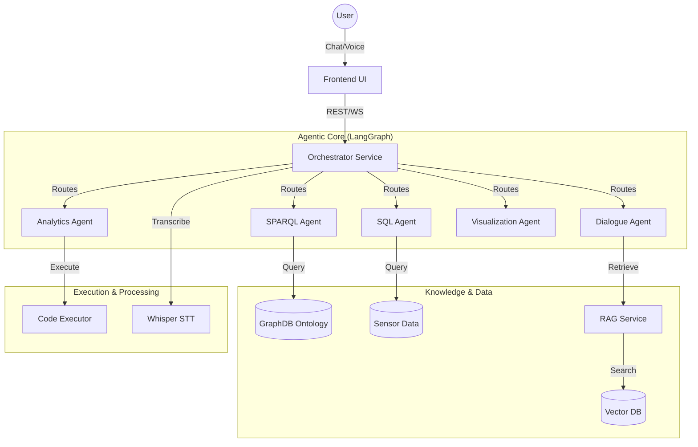
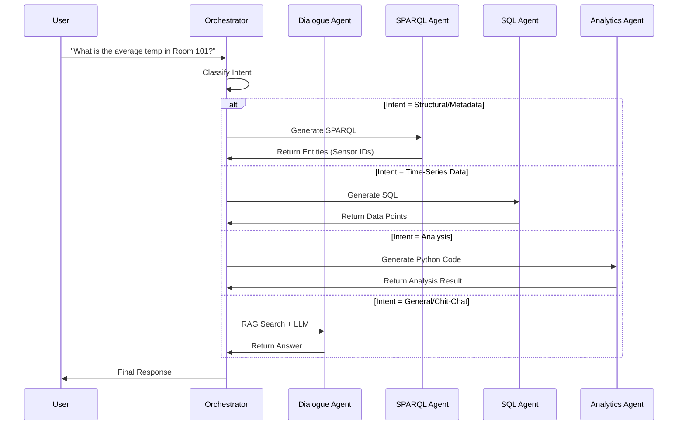

# OntoSage 2.0: Agentic AI for Intelligent Buildings

[](https://www.python.org/downloads/release/python-3110/)
[](https://fastapi.tiangolo.com/)
[](https://langchain-ai.github.io/langgraph/)
[](https://opensource.org/licenses/MIT)

**OntoSage 2.0** is a state-of-the-art **Agentic AI System** designed for the management, analysis, and interaction with Intelligent Buildings. Unlike traditional chatbots, OntoSage employs a **Multi-Agent Architecture** orchestrated by **LangGraph**, allowing it to reason, plan, and execute complex tasks across heterogeneous data sources (SQL Time-Series, RDF Knowledge Graphs, Vector Stores).

Whether you are a Facility Manager needing real-time sensor data, a Researcher querying complex ontologies, or a Student exploring building systems, OntoSage adapts its persona and tools to serve you.

---

## 🌟 Key Features

*   **🧠 Multi-Agent Orchestration**: A team of specialized agents (Dialogue, SPARQL, SQL, Analytics, Visualization) working together to solve complex user queries.
*   **🔍 Hybrid RAG System**: Combines **Vector Search** (Qdrant) for unstructured data with **Semantic Queries** (SPARQL) for structured knowledge graphs.
*   **📊 Advanced Analytics**: Generates and executes Python code in a secure sandbox to perform statistical analysis and data processing on the fly.
*   **📈 Dynamic Visualization**: Automatically generates interactive Plotly charts to visualize sensor trends and analysis results.
*   **🗣️ Voice Interface**: Integrated **Whisper STT** for seamless voice-to-text interaction.
*   **🏢 3D Building Digital Twin**: Interactive 3D visualization of building assets and sensor locations.
*   **🔓 Flexible Model Support**: Run completely offline with **Ollama (DeepSeek/Llama)** or connect to **OpenAI (GPT-4)** for cloud-based power.
*   **⚡ High Performance**: Redis-based caching for conversation state and semantic queries (SPARQL/SQL).
*   **🛡️ Secure & Reliable**: Hardened SQL execution, deterministic analytics templates, and standardized API responses.

---

## 🏗️ System Architecture

OntoSage 2.0 follows a **Hub-and-Spoke** architecture where the **Orchestrator** acts as the central brain, coordinating communication between the Frontend and specialized microservices.



### Agent Decision Flow

How the system decides which agent to use:



---

## 🧩 Detailed Service Guide

### 1. Orchestrator Service (`/orchestrator`)
**The Brain.** Built with **FastAPI** and **LangGraph**.
*   **Role**: Manages the conversation state, history, and agent routing. It receives the user's query and decides *which* agent is best suited to handle it.
*   **Agents**:
    *   **Dialogue Agent**: Handles chit-chat, intent classification, and general Q&A using RAG.
    *   **SPARQL Agent**: Translates natural language into SPARQL queries to fetch structural data from the Ontology (e.g., "What sensors are in Room 101?").
    *   **SQL Agent**: Translates natural language into SQL queries to fetch historical time-series data (e.g., "Show me the temperature of Sensor X last week").
    *   **Analytics Agent**: Writes Python code to analyze data (e.g., "Calculate the average energy consumption").
    *   **Visualization Agent**: Generates configuration for Plotly charts.
*   **State Management**: Uses **Redis** to persist conversation history and agent scratchpads, allowing for multi-turn reasoning.

### 2. RAG Service (`/rag-service`)
**The Librarian.** Built with **GraphDB** and **Qdrant**.
*   **Role**: Handles semantic search. It indexes building documentation, ontology descriptions, and metadata.
*   **Working**: When a user asks a vague question, the RAG service retrieves relevant context chunks to help the LLM understand the domain-specific terminology before generating a response.

### 3. Code Executor Service (`/code-executor`)
**The Sandbox.** Built with **Docker** and **Python**.
*   **Role**: A secure, isolated environment for running code generated by the Analytics Agent.
*   **Security**: Prevents the AI from accessing the host system, network, or sensitive files. It only has access to the specific data provided for the analysis task.
*   **Output**: Returns the standard output (text) and any generated artifacts (images/plots) back to the Orchestrator.

### 4. Whisper STT Service (`/whisper-stt`)
**The Ears.** Built with **OpenAI Whisper**.
*   **Role**: Converts voice recordings from the frontend into text.
*   **Working**: Supports multiple languages and is optimized for technical terminology. Can run locally (using CPU/GPU) or proxy to OpenAI's API.

### 5. Frontend Application (`/frontend`)
**The Face.** Built with **React 19**, **TypeScript**, and **Tailwind CSS**.
*   **Features**:
    *   **Chat Interface**: Streaming responses, markdown support, code highlighting.
    *   **3D Viewer**: Interactive model of the building, highlighting rooms and sensors based on the conversation.
    *   **Dashboard**: Real-time charts and analytics views.
    *   **Voice Input**: One-click recording and sending.

### 6. Data Layer
*   **MySQL**: Stores high-frequency sensor telemetry data.
*   **GraphDB**: Stores the RDF Knowledge Graph (Ontology) representing the building's physical structure and relationships.
*   **Qdrant**: Vector database for semantic similarity search.
*   **Redis**: High-speed cache for conversation state and pub/sub messaging.

---

## 🚀 Getting Started

### Prerequisites
*   **Docker Desktop** (Windows/Mac) or **Docker Engine** (Linux).
*   **Git** to clone the repository.
*   *(Optional)* **NVIDIA GPU** for faster local inference.

### Step 1: Configuration
OntoSage supports two modes: **Local** (Privacy-focused, Free) and **Cloud** (High Performance, Paid).

1.  **Clone the repo**:
    ```bash
    git clone https://github.com/suhasdevmane/OntoBot.git
    cd OntoBot
    ```

2.  **Choose your provider**:
    *   **For Local (Ollama)**:
        ```bash
        cp .env.local .env
        ```
    *   **For Cloud (OpenAI)**:
        ```bash
        cp .env.cloud .env
        ```
        *Edit `.env` and add your `OPENAI_API_KEY`.*

### Step 2: Deployment
We provide automated scripts to handle the complex Docker Compose setup.

**Windows (PowerShell):**
```powershell
./startup.ps1 -Provider local
# OR
./startup.ps1 -Provider cloud
```

**Linux / Mac (Bash):**
```bash
chmod +x scripts/check-health.sh
./scripts/check-health.sh
docker-compose up -d
```

*Note: The first startup may take 10-15 minutes to download necessary Docker images and LLM models (approx. 10GB).*

### Step 3: Access the System
Once the startup script completes and health checks pass:

*   **Frontend UI**: [http://localhost:3000](http://localhost:3000)
*   **API Documentation**: [http://localhost:8000/docs](http://localhost:8000/docs)
*   **RAG Service**: [http://localhost:8001/docs](http://localhost:8001/docs)
*   **Grafana Monitoring**: [http://localhost:3001](http://localhost:3001) (Default login: admin/admin)

---

## 📚 Full Documentation

For deeper details and operations, see the docs set:

- [docs/ARCHITECTURE.md](docs/ARCHITECTURE.md)
- [docs/SERVICES.md](docs/SERVICES.md)
- [docs/CONFIGURATION.md](docs/CONFIGURATION.md)
- [docs/BUILDING_ONBOARDING.md](docs/BUILDING_ONBOARDING.md)
- [docs/RUNBOOK.md](docs/RUNBOOK.md)
- [docs/DEVELOPER_GUIDE.md](docs/DEVELOPER_GUIDE.md)
- [docs/USER_GUIDE.md](docs/USER_GUIDE.md)
- [docs/SECURITY.md](docs/SECURITY.md)

---

## 🏢 Onboarding Your Own Building

OntoSage is designed to be ontology-agnostic. You can load your own building's data (in RDF/TTL format) to start chatting with it.

### 1. Prepare Your Data
Ensure you have your building ontology in `.ttl` (Turtle) format. This file should define:
*   **Physical Structure**: Sites, Buildings, Floors, Rooms.
*   **Assets**: HVAC equipment, Lighting, Sensors.
*   **Relationships**: `hasPoint`, `feeds`, `isLocationOf`.

### 2. Place Data in Volume
Copy your `.ttl` files to the data directory:
```bash
# Example: Create a folder for your building
mkdir -p data/my_building/dataset
cp /path/to/your/building.ttl data/my_building/dataset/
```

### 3. Update Configuration
Edit `docker-compose.agentic.yml` to point the **GraphDB** service to your new data folder.

Find the `graphdb` service definition:
```yaml
  graphdb:
    # ...
    volumes:
      - ./volumes/graphdb:/opt/graphdb/home
      # CHANGE THIS LINE to point to your folder:
      - ./data/my_building/dataset:/opt/graphdb/import:ro
```

### 4. Restart Services
Restart the GraphDB service to load the new ontology:
```bash
docker-compose -f docker-compose.agentic.yml restart graphdb
```
*Note: GraphDB will automatically import files found in the `/opt/graphdb/import` directory on startup if the repository is empty.*

---

## 📖 Usage Guide

### 1. Asking Questions
You can ask questions in natural language. The system will automatically route your request.
*   **General**: "How does the HVAC system work?" (Uses RAG + Dialogue Agent)
*   **Structural**: "List all temperature sensors in Building 1." (Uses SPARQL Agent)
*   **Data**: "What was the average temperature in Room 202 yesterday?" (Uses SQL Agent)
*   **Analysis**: "Plot the correlation between humidity and temperature for the last month." (Uses Analytics + Visualization Agents)

### 2. Using Voice Mode
Click the microphone icon in the chat bar. Speak your query clearly. The system will transcribe it and process it just like a text message.

### 3. 3D Visualization
When you ask about specific rooms or equipment, the 3D viewer on the right panel will automatically fly to and highlight the relevant assets.

---

## 👨‍💻 Developer Guide

### Project Structure
*   `orchestrator/`: Main backend logic (FastAPI + LangGraph).
*   `frontend/`: React UI code.
*   `rag-service/`: Vector search logic.
*   `code-executor/`: Sandbox environment.
*   `docker-compose.yml`: Core service definitions.

See **[docs/PROJECT_STRUCTURE.md](docs/PROJECT_STRUCTURE.md)** for a full file tree.

### Adding a New Agent
1.  Create a new agent class in `orchestrator/app/agents/`.
2.  Define its state and tools.
3.  Register it in the `orchestrator/app/workflow.py` graph.
4.  Add a routing condition in the `supervisor` node.

### Running Tests
```bash
# Run all tests
pytest tests/

# Run specific test
pytest tests/test_llm_intent_detection.py
```

---

## 🔧 Troubleshooting

*   **"Ollama connection failed"**: Ensure the `ollama` container is running and healthy. If you don't have a GPU, local inference might be slow or time out.
*   **"Database connection error"**: Check if the `mysql` and `graphdb` containers are up. The startup script waits for them, but manual restarts might be needed if they crash.
*   **"OpenAI API Error"**: Verify your API key in the `.env` file and ensure you have credits.

---

## 📜 License

This project is licensed under the MIT License - see the [LICENSE](LICENSE) file for details.
