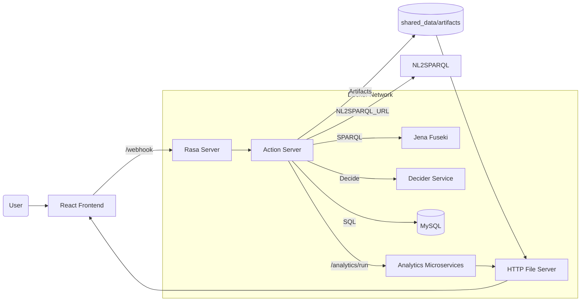

<div align="center">

# OntoBot

A production‑ready, end‑to‑end platform for human–building conversation: Rasa (NLU + Actions), robust analytics microservices, SQL/SPARQL knowledge stores, and a web UI—all orchestrated with Docker Compose.

</div>

> Last updated: 2025‑10‑01

This single README merges all documentation (project overview, Rasa runbook, APIs, and operations) into one comprehensive guide.

## Contents

- What is OntoBot?
- Architecture at a glance
- Services and ports
- Prerequisites
- Quick start (Docker)
- Configuration and environment (.env)
- Data and payloads (contracts)
- Analytics API (examples)
- Rasa actions, forms, and Decider flow
- Project structure and key paths
- Required files and datasets
- SPARQL (Fuseki) setup
- Database and performance
- Artifacts and file server
- Testing and smoke checks
- Troubleshooting and FAQs
- Security notes
- Roadmap
- License

---

## What is OntoBot?

OntoBot connects building/IoT telemetry and semantic data to a conversational interface and analytics.
You can:

- Ask questions in natural language and get unit‑aware answers.
- Run time‑series analytics via a standardized payload.
- Query semantic data (SPARQL on Jena Fuseki) and SQL telemetry.
- Serve artifacts (plots/csv) through a simple file server and view them in the frontend.

All services are containerized and connected on a shared Docker network.

---

## Architecture at a glance



---

## Services and ports (host)

See `docker-compose.yml` for definitive configuration.

- Analytics microservices (Flask)
  - Health: http://localhost:6001/health
  - Runner: http://localhost:6001/analytics/run (maps container 6000)
- MySQL telemetry
  - Host: localhost:3307 → container 3306, DB `sensordb` (root: mysql)
- Jena Fuseki RDF/SPARQL
  - Ping: http://localhost:3030/$/ping
- Rasa (core server)
  - Version: http://localhost:5005/version
- Rasa Action Server
  - Health: http://localhost:5055/health
- Duckling NER
  - Root: http://localhost:8000/
- HTTP File server
  - Health: http://localhost:8080/health
- Rasa Editor
  - UI: http://localhost:6080/
- Rasa Frontend (React)
  - UI: http://localhost:3000/
- Decider Service
  - Health: http://localhost:6009/health

Optional services (commented): ThingsBoard + pgAdmin, GraphDB, Jupyter Notebook, Abacws API + Visualiser, NL2SPARQL (T5) and Ollama (Mistral).

All services share the `ontobot-network` for internal DNS.

---

## Prerequisites

- Windows with Docker Desktop (WSL2 enabled) or macOS/Linux with Docker Engine
- Git and a terminal (PowerShell on Windows)

---

## Quick start (Docker)

```powershell
# From repo root
# 1) Optional: copy and adjust environment
Copy-Item .env.example .env -ErrorAction SilentlyContinue

# 2) Build and start all core services
docker-compose up -d --build

# 3) Train the Rasa model (optional if a model exists)
docker-compose exec rasa rasa train

# 4) Health checks (open in a browser)
# Analytics: http://localhost:6001/health
# Rasa:     http://localhost:5005/version
# Actions:  http://localhost:5055/health
# Fuseki:   http://localhost:3030/ $/ping
# File:     http://localhost:8080/health
# Decider:  http://localhost:6009/health

# 5) Try the bot in a shell
docker-compose exec rasa rasa shell
```

Stop everything:

```powershell
docker-compose down
```

Rebuild a specific service (example: analytics):

```powershell
docker-compose up microservices --build
```

---

## Configuration and environment (.env)

Copy `.env.example` to `.env` and adjust as needed. Key variables used by the Action Server and other services:

- BASE_URL: http://http_server:8080 (internal) / http://localhost:8080 (host)
- ANALYTICS_URL: http://microservices:6000/analytics/run (internal DNS)
- DECIDER_URL: http://decider-service:6009/decide
- DB_HOST, DB_PORT, DB_NAME, DB_USER, DB_PASSWORD
- Optional:
  - NL2SPARQL_URL (internal translator endpoint)
  - SUMMARIZATION_URL (Ollama/OpenAI/etc.)
  - BUNDLE_MEDIA=true|false to bundle multiple media in bot messages

Volumes:
- `rasa-ui/shared_data` is mounted to actions, file server, and editor.
- Artifacts (plots/csv) are placed under `shared_data/artifacts` and served via the file server.

---

## Data and payloads (contracts)

Analytics accepts flat or nested payloads. Keys should be human‑readable; UUIDs are replaced in actions.

- Flat: `{ "Readable_Sensor": [ { "datetime"|"timestamp", "reading_value" }, ... ] }`
- Nested: `{ "1": { "Readable_Sensor": { "timeseries_data": [ { "datetime", "reading_value" }, ... ] } } }`

Notes:
- Timestamps are normalized server‑side; temperature vs temp matching is robust.
- Units and UK indoor guidelines are included (°C, %RH, ppm, µg/m³, dB(A), …).
- Anomaly detection supports `method` like `zscore` or `iqr`.

---

## Analytics API (examples)

Base: http://localhost:6001

```powershell
# Run an analysis (nested payload)
Invoke-RestMethod -Method Post -Uri http://localhost:6001/analytics/run -ContentType 'application/json' -Body (@{
  analysis_type = 'analyze_temperatures'
  '1' = @{ Air_Temperature_Sensor = @{ timeseries_data = @(
    @{ datetime = '2025-02-10 05:31:59'; reading_value = 22.5 },
    @{ datetime = '2025-02-10 05:33:00'; reading_value = 23.0 }
  )}}
} | ConvertTo-Json -Depth 6)
```

Available analyses (selection): temperatures, humidity, CO2, PM, HCHO, noise, AQI; delta‑T, airflow, pressure trend, HVAC anomalies; correlation, aggregation, trend, anomalies (zscore/iqr), potential failures, downtime forecast; device deviation, failure trends, recalibration frequency.

Smoke test:

```powershell
python microservices/test_analytics_smoke.py
```

---

## Rasa actions, forms, and Decider flow

- Forms
  - sensor_form → sensor_type supports comma‑separated inputs, fuzzy matching, canonicalization
  - dates_form → start_date, end_date accept DD/MM/YYYY, YYYY‑MM‑DD, and phrases like “last week”, “today”, “now”
- Common slots: sensor_type (List[str]), start_date, end_date, timeseries_ids (UUIDs from SPARQL), analytics_type (from Decider/heuristics)
- Key actions
  - action_question_to_brickbot: NL2SPARQL → Fuseki → standardized JSON → save artifact → decide analytics → set slots and FollowupAction
  - action_process_timeseries: SQL fetch → build payload (flat/nested) → call Analytics → format outputs + artifacts
- Internal network endpoints: Analytics http://microservices:6000/analytics/run, Decider http://decider-service:6009/decide, File http://http_server:8080

Rasa REST example:

```powershell
Invoke-RestMethod -Method Post -Uri http://localhost:5005/webhooks/rest/webhook -ContentType 'application/json' -Body (@{
  sender = 'tester1'
  message = 'Give me humidity trends for Zone_Air_Humidity_Sensor_5.01 last week'
} | ConvertTo-Json)
```

---

## Project structure and key paths

- Rasa project: `rasa-ui/` (data, domain.yml, config.yml, endpoints.yml, credentials.yml)
- Actions code: `rasa-ui/actions/actions.py`
- Analytics service: `microservices/`
- Frontend: `rasa-frontend/`
- Editor and file server scripts: under `rasa-ui/`
- Shared data and artifacts: `rasa-ui/shared_data/artifacts/<user>`
- Helper script: `scripts/tidy_artifacts.ps1`

---

## Required files and datasets

- Sensor mappings: `rasa-ui/actions/sensor_mappings.txt` with lines `name,uuid`
- Optional curated names: `rasa-ui/actions/sensor_list.txt` (one per line) to improve fuzzy matching
- Fuseki dataset: load your RDF/TTL into the Fuseki container (see next section)

---

## SPARQL (Fuseki) setup

- Container: `jena-fuseki-rdf-store` (host port 3030)
- Typical mounted path: `./trial/dataset:/fuseki-data`
- Access the UI at http://localhost:3030 and load your dataset
- Actions prepend common Brick/ontology prefixes to queries automatically

---

## Database and performance

- MySQL columns are UUIDs; queries select `Datetime` plus requested UUID columns
- Multi‑UUID: SQL does not `AND` column `IS NOT NULL` (prevents data loss); NULLs are filtered per‑column in Python
- Indexes:
  - Primary/clustered index on `Datetime`
  - Consider per‑UUID indexes for heavy use, or migrate to a time‑series store for scale

---

## Artifacts and file server

- Artifacts saved under `rasa-ui/shared_data/artifacts/<safe_user>` (derived from `sender_id`)
- File server exposes them at http://localhost:8080; add `?download=1` to force download
- Utility:

```powershell
# Move stray files in shared_data root into artifacts
./scripts/tidy_artifacts.ps1
```

---

## Testing and smoke checks

- Health endpoints: Analytics (/health), Rasa (/version), Actions (/health), File (/health), Fuseki ($/ping), Decider (/health)
- Logs: `docker-compose logs -f <service>`
- Network: `docker network inspect ontobot-network`
- Analytics smoke test: `python microservices/test_analytics_smoke.py`

---

## Troubleshooting and FAQs

- Port conflicts → adjust host ports in `docker-compose.yml` (MySQL maps to 3307 by default)
- Service unhealthy → check logs; hit health URLs directly
- Analytics errors → verify flat/nested payloads; inspect the `results` object for detailed errors
- Artifacts missing → confirm files under `shared_data/artifacts` and file server health; ensure BASE_URL correct for actions
- Action server can’t reach MySQL → use host `mysqlserver` and port `3306` inside Docker; confirm credentials
- Plugging in NL2SPARQL or LLM → set `NL2SPARQL_URL` / `SUMMARIZATION_URL` in environment; code fails gracefully if unavailable
- Run without frontend → use REST webhook or `rasa shell`

---

## Security notes

- Replace default DB credentials with least‑privilege accounts; avoid exposing 3306 directly
- Avoid writing secrets to `shared_data`; it’s served over HTTP
- Prefer internal services over external testing URLs for NL2SPARQL/LLM in production

---

## Roadmap

- Default to internal NL2SPARQL/Summarization services once available
- Add e2e tests that exercise Decider → Analytics → artifact creation
- Provide a dataset‑load script for Fuseki
- Consider a time‑series database for large telemetry workloads

---

## License

See LICENSE in this repository. Third‑party components retain their respective licenses.
