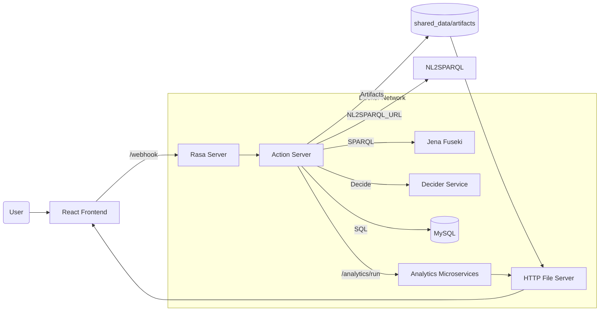

<div align="center">

# OntoBot

A production‑ready, end‑to‑end platform for human–building conversation: Rasa (NLU + Actions), robust analytics microservices, SQL/SPARQL knowledge stores, and a web UI—all orchestrated with Docker Compose.

</div>

> Last updated: 2025‑10‑01

This single README merges all documentation (project overview, Rasa runbook, APIs, and operations) into one comprehensive guide.

## Contents

- What is OntoBot?
- Architecture at a glance
- Services and ports
- Prerequisites
- Quick start (Docker)
- Configuration and environment (.env)
- Data and payloads (contracts)
- Analytics API (examples)
- Rasa actions, forms, and Decider flow
- Project structure and key paths
- Required files and datasets
- SPARQL (Fuseki) setup
- Database and performance
- Artifacts and file server
- Testing and smoke checks
- Troubleshooting and FAQs
- Security notes
- Roadmap
- References
- License

---
## Compose stacks overview and extras (required vs optional)

This repo now has dedicated compose files per building and an overlay for extras:

- Building 1: `docker-compose.bldg1.yml`
  - For the original/legacy building. Uses Rasa project under `./rasa-bldg1`.
  - Includes: Rasa, Actions, Duckling, Editor, HTTP file server, Microservices, Decider, MySQL, Fuseki, pgAdmin.

- Building 2 (Timescale): `docker-compose.bldg2.yml`
  - For bldg2 with SQL telemetry (TimescaleDB). Uses `./rasa-bldg2`.
  - Includes: TimescaleDB + ThingsBoard, Rasa, Actions, Duckling, Editor, HTTP file server, Microservices, Decider, MySQL, Fuseki, pgAdmin (pre-configured via `bldg2/servers.json`).

- Building 3 (Cassandra): `docker-compose.bldg3.yml`
  - For bldg3 with telemetry in Cassandra and TB entities in Postgres. Uses `./rasa-bldg3`.
  - Includes: Postgres + Cassandra + ThingsBoard, Rasa, Actions, Duckling, Editor, HTTP file server, Microservices, Decider, MySQL, Fuseki, pgAdmin (no default servers.json; you can add `bldg3/servers.json`).

- Extras overlay: `docker-compose.extras.yml`
  - Purpose: add optional exploration/ML services on top of any building stack.
  - Services:
    - Required for some workflows:
      - `nl2sparql` (T5-based translator) if your pipeline requires NL → SPARQL via HTTP.
      - `ollama` (Mistral) if you want on-box LLM summarization or generation.
    - Useful for exploration:
      - `graphdb` (alternate RDF store)
      - `jupyter` (notebooks; mounts `./development/notebooks` and `./rasa-bldg1/actions` by default)
      - `adminer` (DB UI; depends on MySQL)

Run patterns (PowerShell):

```powershell
# bldg1 only
docker compose -f docker-compose.bldg1.yml up -d --build

# bldg1 + extras
docker compose -f docker-compose.bldg1.yml -f docker-compose.extras.yml up -d --build

# bldg2 only (Timescale)
docker compose -f docker-compose.bldg2.yml up -d --build

# bldg2 + extras
docker compose -f docker-compose.bldg2.yml -f docker-compose.extras.yml up -d --build

# bldg3 only (Cassandra)
docker compose -f docker-compose.bldg3.yml up -d --build

# bldg3 + extras
docker compose -f docker-compose.bldg3.yml -f docker-compose.extras.yml up -d --build
```

Notes:
- One stack at a time: run only bldg1 OR bldg2 OR bldg3 to avoid port conflicts and data confusion.
- Fuseki is included in all building compose files on http://localhost:3030; load the appropriate `bldgX/trial/dataset` into Fuseki UI.
- pgAdmin is included in all three; bldg1 mounts `bldg1/servers.json`, bldg2 mounts `bldg2/servers.json` (pre-configured for Timescale), and bldg3 includes a template at `bldg3/servers.json` and is mounted by default.
- If you use `adminer` with bldg2/bldg3 and no MySQL, either add MySQL to those stacks or remove the dependency from extras.
- The `ollama` service uses a GPU deploy block; comment it if GPU is not available.

### Extras overlay (optional)

Layer optional services on top of a building stack by combining compose files (order matters; building stack first):

```powershell
# Example: building 1 + extras
docker compose -f docker-compose.bldg1.yml -f docker-compose.extras.yml up -d --build

# Stop the combined stack
docker compose -f docker-compose.bldg1.yml -f docker-compose.extras.yml down
```

You can substitute `docker-compose.bldg2.yml` or `docker-compose.bldg3.yml` for bldg1.

Services provided by the extras overlay:
- nl2sparql
  - Natural language → SPARQL service over HTTP.
  - When: your action flow expects an NL2SPARQL endpoint.
  - Health: http://localhost:6005/health (internal DNS `nl2sparql:6005`).
- ollama (Mistral)
  - Local LLM for summarization/captioning/generation.
  - Health: http://localhost:11434
  - GPU deploy block included; comment if GPU isn’t available.
- graphdb
  - Alternate RDF triple store for experimentation.
  - UI: http://localhost:7200
- jupyter
  - Notebooks for EDA/experiments; mounts `./development/notebooks` and `./rasa-bldg1/actions` by default.
  - UIs: http://localhost:8888 (Lab), http://localhost:8089 (Ontology view)
  - Adjust mounts per building as needed.
- adminer
  - Lightweight DB UI; useful for MySQL exploration.
  - UI: http://localhost:8282 (requires MySQL running in your chosen stack)

Safe combinations and notes:
- Run one building stack at a time (bldg1 OR bldg2 OR bldg3); extras are port-stable and can be overlaid.
- Typical full workflow: bldg2 + nl2sparql + ollama for NL → SPARQL → Analysis → Summary.

Action Server configuration when using extras:
- Set internal DNS URLs in the Action Server environment (already on the Docker network):
  - `NL2SPARQL_URL=http://nl2sparql:6005/nl2sparql`
  - `SUMMARIZATION_URL=http://ollama:11434`
  
If these variables are absent, the Action Server paths gracefully skip the optional steps.


## Docker Compose: how to run, stop, and choose files

Use these patterns from the repo root. All commands are PowerShell-friendly on Windows.

### Common commands

```powershell
# Start services (build if needed) in detached mode
docker compose -f <compose-file>.yml up -d --build

# Show running services from that file
docker compose -f <compose-file>.yml ps

# Tail logs for a specific service
docker compose -f <compose-file>.yml logs -f --tail 200 <service-name>

# Restart a service (e.g., after config changes)
docker compose -f <compose-file>.yml restart <service-name>

# Stop (keeps containers)
docker compose -f <compose-file>.yml stop

# Down (removes containers but keeps named volumes)
docker compose -f <compose-file>.yml down

# Danger: down and remove volumes too (wipes data in named volumes)
docker compose -f <compose-file>.yml down -v
```

Multiple files (overlays):

```powershell
# Building stack + extras overlay
docker compose -f docker-compose.bldg2.yml -f docker-compose.extras.yml up -d --build

# Bring down the combined stack
docker compose -f docker-compose.bldg2.yml -f docker-compose.extras.yml down
```

### Compose files and scenarios

- docker-compose.bldg1.yml
  - Scenario: Building 1 full stack with Rasa at `./rasa-bldg1` and shared services (no ThingsBoard path by default).
  - Use when: You want to run Q&A for bldg1 with Fuseki, MySQL, Editor, Frontend, Analytics.
  - Run:
    - Up: `docker compose -f docker-compose.bldg1.yml up -d --build`
    - Down: `docker compose -f docker-compose.bldg1.yml down`

- docker-compose.bldg2.yml
  - Scenario: Building 2 full stack with ThingsBoard + TimescaleDB and Rasa at `./rasa-bldg2`.
  - Use when: You want Q&A for bldg2 and to validate telemetry in Timescale.
  - Run:
    - Up: `docker compose -f docker-compose.bldg2.yml up -d --build`
    - Train (one-off): `docker compose -f docker-compose.bldg2.yml --profile manual up --build --abort-on-container-exit rasa-train`
    - Down: `docker compose -f docker-compose.bldg2.yml down`

- docker-compose.bldg3.yml
  - Scenario: Building 3 full stack with ThingsBoard (entities in Postgres) + Cassandra for telemetry and Rasa at `./rasa-bldg3`.
  - Use when: You want Q&A for bldg3 and to validate telemetry in Cassandra.
  - Run:
    - Up: `docker compose -f docker-compose.bldg3.yml up -d --build`
    - Train (one-off): `docker compose -f docker-compose.bldg3.yml --profile manual up --build --abort-on-container-exit rasa-train`
    - Down: `docker compose -f docker-compose.bldg3.yml down`

- docker-compose.extras.yml (overlay)
  - Scenario: Optional services like nl2sparql, ollama, graphdb, jupyter, adminer.
  - Use when: You need NL→SPARQL, local LLM summarization, alternate RDF store, notebooks, or a DB UI.
  - Run with a building stack (order matters):
    - Up: `docker compose -f docker-compose.bldgX.yml -f docker-compose.extras.yml up -d --build`
    - Down: `docker compose -f docker-compose.bldgX.yml -f docker-compose.extras.yml down`

- docker-compose.pg.yml (ThingsBoard + PostgreSQL)
  - Scenario: ThingsBoard with plain Postgres for telemetry (no Timescale or Cassandra).
  - Use when: You want to experiment with TB on Postgres only.
  - Run:
    - Up: `docker compose -f docker-compose.pg.yml up -d --build`
    - Down: `docker compose -f docker-compose.pg.yml down`

- docker-compose.ts.yml (ThingsBoard + TimescaleDB)
  - Scenario: ThingsBoard backed by Timescale (Postgres + Timescale extension) for telemetry.
  - Use when: You want a minimal TB + Timescale setup (independent of bldg2 stack).
  - Run:
    - Up: `docker compose -f docker-compose.ts.yml up -d --build`
    - Down: `docker compose -f docker-compose.ts.yml down`

- docker-compose.cassandra.yml (ThingsBoard + Postgres + Cassandra)
  - Scenario: ThingsBoard with Cassandra for telemetry and Postgres for entities.
  - Use when: You want a minimal TB + Cassandra setup (independent of bldg3 stack).
  - Run:
    - Up: `docker compose -f docker-compose.cassandra.yml up -d --build`
    - Down: `docker compose -f docker-compose.cassandra.yml down`

- docker-compose.rasatrain.yml
  - Scenario: One-off job to train a Rasa project (legacy/default project under `rasa-ui`).
  - Use when: You want to train outside the per-building stacks.
  - Run:
    - Train: `docker compose -f docker-compose.rasatrain.yml up --build --abort-on-container-exit`

- docker-compose.yml (main)
  - Scenario: Legacy/dev monolithic compose with toggles for different TB options.
  - Use when: You prefer a single file and manually comment/uncomment TB variants (not recommended—prefer per-building files).
  - Run:
    - Up: `docker compose up -d --build`
    - Down: `docker compose down`

Best practices:
- Run one building stack at a time for Q&A to avoid port/data conflicts.
- Named volumes persist data across `up`/`down`; use `down -v` only when you intentionally want to reset state.
- For overlays, always list the building compose first, then `docker-compose.extras.yml`.
- Healthchecks are defined for most services—if a service is unhealthy, review logs with `logs -f` and check its health endpoint in the README.

## What is OntoBot?

OntoBot connects building/IoT telemetry and semantic data to a conversational interface and analytics.
You can:

- Ask questions in natural language and get unit‑aware answers.
- Run time‑series analytics via a standardized payload.
- Query semantic data (SPARQL on Jena Fuseki) and SQL telemetry.
- Serve artifacts (plots/csv) through a simple file server and view them in the frontend.

All services are containerized and connected on a shared Docker network.

---

## Architecture at a glance



---

## Services and ports (host)

See `docker-compose.yml` for definitive configuration.

- Analytics microservices (Flask)
  - Health: http://localhost:6001/health
  - Runner: http://localhost:6001/analytics/run (maps container 6000)
- MySQL telemetry
  - Host: localhost:3307 → container 3306, DB `sensordb` (root: mysql)
- Jena Fuseki RDF/SPARQL
  - Ping: http://localhost:3030/$/ping
- Rasa (core server)
  - Version: http://localhost:5005/version
- Rasa Action Server
  - Health: http://localhost:5055/health
- Duckling NER
  - Root: http://localhost:8000/
- HTTP File server
  - Health: http://localhost:8080/health
- Rasa Editor
  - UI: http://localhost:6080/
- Rasa Frontend (React)
  - UI: http://localhost:3000/
- Decider Service
  - Health: http://localhost:6009/health

Optional services (commented): ThingsBoard + pgAdmin, GraphDB, Jupyter Notebook, Abacws API + Visualiser, NL2SPARQL (T5) and Ollama (Mistral).

All services share the `ontobot-network` for internal DNS.

---

## Running ThingsBoard stacks (choose one)

You can run ThingsBoard with different backends using separate compose files, or by editing the main `docker-compose.yml`:

- Option 1: PostgreSQL only → `docker-compose.pg.yml`
- Option 2: TimescaleDB (Postgres + Timescale extension) → `docker-compose.ts.yml`
- Option 3: PostgreSQL (entities) + Cassandra (telemetry) → `docker-compose.cassandra.yml`

Recommended: use the dedicated compose file for the option you want.

Examples (PowerShell):

```powershell
# Option 1 – TB + PostgreSQL
docker compose -f docker-compose.pg.yml up -d

# Option 2 – TB + TimescaleDB
docker compose -f docker-compose.ts.yml up -d

# Option 3 – TB + PostgreSQL + Cassandra
docker compose -f docker-compose.cassandra.yml up -d
```

ThingsBoard UI is at http://localhost:8082 in all options.

Using the main docker-compose.yml directly:

1) Open `docker-compose.yml` and comment out the two options you are not using.
2) Leave only one ThingsBoard option (and its DB services) uncommented.
3) Start with:

```powershell
docker compose up -d
```

Notes:
- Each option has isolated named volumes to keep data separate.
- Timescale adds a DB healthcheck and TB waits for it.
- Cassandra can require more memory and longer first start.

---

## Choose your building: bldg2 or bldg3 (compose files)

OntoBot supports per-building deployments with separate Rasa projects and ontology TTLs. Choose exactly one building at a time for question answering.

- What changes between buildings
  - Ontology/dataset (TTL files):
    - bldg2 TTLs live under `bldg2/`
    - bldg3 TTLs live under `bldg3/`
  - Rasa project and model:
    - bldg2 uses `./rasa-bldg2` (its own training data and models)
    - bldg3 uses `./rasa-bldg3` (its own training data and models)
  - ThingsBoard telemetry backend:
    - bldg2 uses TimescaleDB (SQL on Postgres)
    - bldg3 uses Cassandra

- What stays the same
  - All other backend services and contracts are identical across buildings:
    - Analytics microservices, Decider service, Duckling, HTTP file server, Rasa Editor, Rasa Frontend
    - SPARQL store (Jena Fuseki) and the way Actions query it
    - Artifact paths and payload formats

Two root-level compose files orchestrate the per-building stacks:

- Building 2 (TimescaleDB): `docker-compose.bldg2.yml`
  - Rasa project: `./rasa-bldg2`
  - ThingsBoard UI: http://localhost:8082
  - Rasa: http://localhost:5005/version
  - Actions: http://localhost:5055/health
  - Duckling: http://localhost:8000/
  - File server: http://localhost:8080/health
  - Rasa Editor: http://localhost:6080/
  - Rasa Frontend: http://localhost:3000/
  - pgAdmin (Timescale): http://localhost:5050/

- Building 3 (Cassandra): `docker-compose.bldg3.yml`
  - Rasa project: `./rasa-bldg3`
  - ThingsBoard UI: http://localhost:8083
  - Rasa: http://localhost:5006/version (host 5006 → container 5005)
  - Actions: http://localhost:5056/health (host 5056 → container 5055)
  - Duckling: http://localhost:8001/
  - File server: http://localhost:8084/health (host 8084 → container 8080)
  - Rasa Editor: http://localhost:6081/
  - Rasa Frontend: http://localhost:3001/

Important: Run one building stack for Q&A at a time. Ports are set to avoid conflicts if you do bring both up, but models, datasets, and telemetry backends are independent.

### Quick start: Building 2 (TimescaleDB)

1) Bring up the bldg2 stack

```powershell
docker compose -f docker-compose.bldg2.yml up -d --build
```

2) Start SPARQL store (Fuseki) if you haven’t already (defined in main docker-compose.yml)

```powershell
docker compose up -d fuseki-db jena-fuseki
```

3) Load/refresh your bldg2 TTL dataset in Fuseki UI (http://localhost:3030)

4) Train the bldg2 Rasa model (if needed)

```powershell
# Use the manual profile training job defined in docker-compose.bldg2.yml
docker compose -f docker-compose.bldg2.yml --profile manual up --build --abort-on-container-exit rasa-train
```

5) Test Rasa

```powershell
Invoke-RestMethod -Method Post -Uri http://localhost:5005/webhooks/rest/webhook -ContentType 'application/json' -Body (@{
  sender = 'tester1'
  message = 'What is the average temperature last week in Zone A?'
} | ConvertTo-Json)
```

6) Optional: Send telemetry to ThingsBoard and verify in TimescaleDB

```powershell
# Replace <DEVICE_TOKEN> with your TB device token
Invoke-WebRequest -Method Post -Uri "http://localhost:8081/api/v1/<DEVICE_TOKEN>/telemetry" -ContentType "application/json" -Body '{ "temperature": 23.7 }'

# Inspect in pgAdmin (http://localhost:5050). The connection is pre-configured via bldg2/servers.json.
# You can also run SQL against timescaledb (inside a psql session) to see ts_kv rows.
```

#### pgAdmin connections (bldg2)

Open pgAdmin at http://localhost:5050. Two servers are pre-registered via `bldg2/servers.json`:

- TimescaleDB (container, bldg2) → Host: `timescaledb`, Port: `5432`
  - Best for use from the pgAdmin container (internal Docker network name)
- TimescaleDB (host 5433, bldg2) → Host: `localhost`, Port: `5433`
  - Useful for host tools like psql/clients; also works from pgAdmin

Credentials (prompted by pgAdmin):
- Username: `thingsboard`
- Password: `thingsboard`
- Database: `thingsboard`

Verify mappings and telemetry:

1) Map device token to device UUID

```sql
SELECT d.id, d.name
FROM device d
JOIN device_credentials dc ON dc.device_id = d.id
WHERE dc.credentials_id = 'YOUR_DEVICE_ACCESS_TOKEN';
```

2) Recent telemetry for that device UUID

```sql
SELECT
  to_timestamp(t.ts/1000.0) AS ts,
  dkey.key,
  COALESCE(
    t.dbl_v::text,
    t.long_v::text,
    t.str_v,
    (t.bool_v::text),
    (t.json_v::text)
  ) AS value
FROM ts_kv t
JOIN ts_kv_dictionary dkey ON t.key = dkey.key_id
WHERE t.entity_id = 'xxxxxxxx-xxxx-xxxx-xxxx-xxxxxxxxxxxx'
ORDER BY t.ts DESC
LIMIT 20;
```

Optional Timescale checks:

```sql
\dx;  -- should list timescaledb
SELECT hypertable_name FROM timescaledb_information.hypertables ORDER BY hypertable_name;
```

### Quick start: Building 3 (Cassandra)

1) Bring up the bldg3 stack

```powershell
docker compose -f docker-compose.bldg3.yml up -d --build
```

2) Start SPARQL store (Fuseki) if you haven’t already (defined in main docker-compose.yml)

```powershell
docker compose up -d fuseki-db jena-fuseki
```

3) Load/refresh your bldg3 TTL dataset in Fuseki UI (http://localhost:3030)

4) Train the bldg3 Rasa model (if needed)

```powershell
docker compose -f docker-compose.bldg3.yml --profile manual up --build --abort-on-container-exit rasa-train
```

5) Test Rasa

```powershell
Invoke-RestMethod -Method Post -Uri http://localhost:5006/webhooks/rest/webhook -ContentType 'application/json' -Body (@{
  sender = 'tester1'
  message = 'Show humidity trends for last week in Zone B'
} | ConvertTo-Json)
```

6) Optional: Send telemetry to ThingsBoard (HTTP transport)

```powershell
Invoke-WebRequest -Method Post -Uri "http://localhost:8082/api/v1/<DEVICE_TOKEN>/telemetry" -ContentType "application/json" -Body '{ "humidity": 48 }'
# Note: Telemetry is stored in Cassandra. Validate via TB dashboards or cqlsh in the cassandra container.
```

#### pgAdmin connections (bldg3)

Open pgAdmin at http://localhost:5051. One server is pre-registered via `bldg3/servers.json`:

- TB Postgres (bldg3) → Host: `tb_postgres`, Port: `5432`
  - Username: `thingsboard`
  - Password: `thingsboard`
  - Database: `thingsboard` (select after connecting; maintenance DB defaults to `postgres`)

Verify device token → device UUID in Postgres (TB metadata):

```sql
SELECT d.id, d.name
FROM device d
JOIN device_credentials dc ON dc.device_id = d.id
WHERE dc.credentials_id = 'YOUR_DEVICE_ACCESS_TOKEN';
```

Note: Postgres in bldg3 holds ThingsBoard entities/metadata only. Telemetry resides in Cassandra—use TB dashboards/APIs or cqlsh for time-series data.

More details: see bldg3/README.md → pgAdmin connections
[`bldg3/README.md#pgadmin-connections-tb-postgres-metadata`](bldg3/README.md#pgadmin-connections-tb-postgres-metadata)

### How components connect (per-building)

- Rasa (per building) → Action Server (per building): each building has its own training data, model, and `actions.py` under `./rasa-bldg2` or `./rasa-bldg3`.
- Action Server → SPARQL (Fuseki): queries the dataset you loaded from the building’s TTL files under `bldg2/` or `bldg3/`.
- Action Server → Decider → Analytics: decides the analysis and calls the shared analytics API with a standardized payload; results and plots are saved under the shared artifacts folder and served by the HTTP file server.
- Telemetry persistence (ThingsBoard):
  - bldg2 uses TimescaleDB. TB connects to Timescale; pgAdmin is provided to inspect it. Actions can read SQL time-series if enabled in your `actions.py`.
  - bldg3 uses Cassandra. TB writes telemetry to Cassandra; TB UI dashboards and APIs can be used to view telemetry. Action paths remain the same unless you customize them for Cassandra.

In both cases, all non‑telemetry OntoBot components remain identical.

---

## Rasa: editing, training, and saving changes

There are two ways to manage Rasa training in this repo:

1) Through the frontend/editor and backend services
  - The Rasa project lives under `rasa-ui/` (data, domain.yml, config.yml, endpoints.yml, credentials.yml, models/)
  - The editor server (`rasa-editor`) and HTTP file server expose settings to edit files, trigger training, and save artifacts.
  - The `rasa` container serves the bot and can load new models from the shared volume (`rasa-ui/models`).
  - Shared folders mounted across services:
    - `rasa-ui/data`, `rasa-ui/domain.yml`, `rasa-ui/config.yml`, `rasa-ui/models` (for models), etc.

2) Manual training with a one-off compose job
  - Use the provided `docker-compose.rasatrain.yml` to run `rasa train` against the mounted project files.

Example (PowerShell):

```powershell
# Train a new model and output to ./rasa-ui/models
docker compose -f docker-compose.rasatrain.yml up --build --abort-on-container-exit

# After training, restart the running Rasa service to pick up the new model if needed
docker compose restart rasa
```

Where to edit files:
- Intents/stories/rules and NLU data: `rasa-ui/data`
- Domain: `rasa-ui/domain.yml`
- Config: `rasa-ui/config.yml`
- Endpoints/credentials: `rasa-ui/endpoints.yml`, `rasa-ui/credentials.yml`

Saving changes via the frontend:
- The editor and file server mount the same project paths; updates you make are persisted to the host files under `rasa-ui/`.
- When you trigger training from the UI (or run the manual training job), the resulting model is written to `rasa-ui/models/` and can be loaded by the live Rasa server.

---

## Prerequisites

- Windows with Docker Desktop (WSL2 enabled) or macOS/Linux with Docker Engine
- Git and a terminal (PowerShell on Windows)

---

## Quick start (Docker)

```powershell
# From repo root
# 1) Optional: copy and adjust environment
Copy-Item .env.example .env -ErrorAction SilentlyContinue

# 2) Build and start all core services
docker-compose up -d --build

# 3) Train the Rasa model (optional if a model exists)
docker-compose exec rasa rasa train

# 4) Health checks (open in a browser)
# Analytics: http://localhost:6001/health
# Rasa:     http://localhost:5005/version
# Actions:  http://localhost:5055/health
# Fuseki:   http://localhost:3030/ $/ping
# File:     http://localhost:8080/health
# Decider:  http://localhost:6009/health

# 5) Try the bot in a shell
docker-compose exec rasa rasa shell
```

Stop everything:

```powershell
docker-compose down
```

Rebuild a specific service (example: analytics):

```powershell
docker-compose up microservices --build
```

---

## Configuration and environment (.env)

Copy `.env.example` to `.env` and adjust as needed. Key variables used by the Action Server and other services:

- BASE_URL: http://http_server:8080 (internal) / http://localhost:8080 (host)
- ANALYTICS_URL: http://microservices:6000/analytics/run (internal DNS)
- DECIDER_URL: http://decider-service:6009/decide
- DB_HOST, DB_PORT, DB_NAME, DB_USER, DB_PASSWORD
- Optional:
  - NL2SPARQL_URL (internal translator endpoint)
  - SUMMARIZATION_URL (Ollama/OpenAI/etc.)
  - BUNDLE_MEDIA=true|false to bundle multiple media in bot messages

Volumes:
- `rasa-ui/shared_data` is mounted to actions, file server, and editor.
- Artifacts (plots/csv) are placed under `shared_data/artifacts` and served via the file server.

---

## Data and payloads (contracts)

Analytics accepts flat or nested payloads. Keys should be human‑readable; UUIDs are replaced in actions.

- Flat: `{ "Readable_Sensor": [ { "datetime"|"timestamp", "reading_value" }, ... ] }`
- Nested: `{ "1": { "Readable_Sensor": { "timeseries_data": [ { "datetime", "reading_value" }, ... ] } } }`

Notes:
- Timestamps are normalized server‑side; temperature vs temp matching is robust.
- Units and UK indoor guidelines are included (°C, %RH, ppm, µg/m³, dB(A), …).
- Anomaly detection supports `method` like `zscore` or `iqr`.

---

## Analytics API (examples)

Base: http://localhost:6001

```powershell
# Run an analysis (nested payload)
Invoke-RestMethod -Method Post -Uri http://localhost:6001/analytics/run -ContentType 'application/json' -Body (@{
  analysis_type = 'analyze_temperatures'
  '1' = @{ Air_Temperature_Sensor = @{ timeseries_data = @(
    @{ datetime = '2025-02-10 05:31:59'; reading_value = 22.5 },
    @{ datetime = '2025-02-10 05:33:00'; reading_value = 23.0 }
  )}}
} | ConvertTo-Json -Depth 6)
```

Available analyses (selection): temperatures, humidity, CO2, PM, HCHO, noise, AQI; delta‑T, airflow, pressure trend, HVAC anomalies; correlation, aggregation, trend, anomalies (zscore/iqr), potential failures, downtime forecast; device deviation, failure trends, recalibration frequency.

Smoke test:

```powershell
python microservices/test_analytics_smoke.py
```

---

## Rasa actions, forms, and Decider flow

- Forms
  - sensor_form → sensor_type supports comma‑separated inputs, fuzzy matching, canonicalization
  - dates_form → start_date, end_date accept DD/MM/YYYY, YYYY‑MM‑DD, and phrases like “last week”, “today”, “now”
- Common slots: sensor_type (List[str]), start_date, end_date, timeseries_ids (UUIDs from SPARQL), analytics_type (from Decider/heuristics)
- Key actions
  - action_question_to_brickbot: NL2SPARQL → Fuseki → standardized JSON → save artifact → decide analytics → set slots and FollowupAction
  - action_process_timeseries: SQL fetch → build payload (flat/nested) → call Analytics → format outputs + artifacts
- Internal network endpoints: Analytics http://microservices:6000/analytics/run, Decider http://decider-service:6009/decide, File http://http_server:8080

Rasa REST example:

```powershell
Invoke-RestMethod -Method Post -Uri http://localhost:5005/webhooks/rest/webhook -ContentType 'application/json' -Body (@{
  sender = 'tester1'
  message = 'Give me humidity trends for Zone_Air_Humidity_Sensor_5.01 last week'
} | ConvertTo-Json)
```

---

## Project structure and key paths

- Rasa project: `rasa-ui/` (data, domain.yml, config.yml, endpoints.yml, credentials.yml)
- Actions code: `rasa-ui/actions/actions.py`
- Analytics service: `microservices/`
- Frontend: `rasa-frontend/`
- Editor and file server scripts: under `rasa-ui/`
- Shared data and artifacts: `rasa-ui/shared_data/artifacts/<user>`
- Helper script: `scripts/tidy_artifacts.ps1`

---

## Required files and datasets

- Sensor mappings: `rasa-ui/actions/sensor_mappings.txt` with lines `name,uuid`
- Optional curated names: `rasa-ui/actions/sensor_list.txt` (one per line) to improve fuzzy matching
- Fuseki dataset: load your RDF/TTL into the Fuseki container (see next section)

---

## SPARQL (Fuseki) setup

- Container: `jena-fuseki-rdf-store` (host port 3030)
- Typical mounted path: `./trial/dataset:/fuseki-data`
- Access the UI at http://localhost:3030 and load your dataset
- Actions prepend common Brick/ontology prefixes to queries automatically

See also:
- Apache Jena Fuseki docs: https://jena.apache.org/documentation/fuseki2/
- SPARQL over HTTP (SOH): https://jena.apache.org/documentation/fuseki2/soh.html
- Fuseki 1 (archive): https://jena.apache.org/documentation/archive/serving_data/fuseki1.html

---

## Database and performance

- MySQL columns are UUIDs; queries select `Datetime` plus requested UUID columns
- Multi‑UUID: SQL does not `AND` column `IS NOT NULL` (prevents data loss); NULLs are filtered per‑column in Python
- Indexes:
  - Primary/clustered index on `Datetime`
  - Consider per‑UUID indexes for heavy use, or migrate to a time‑series store for scale

---

## Artifacts and file server

- Artifacts saved under `rasa-ui/shared_data/artifacts/<safe_user>` (derived from `sender_id`)
- File server exposes them at http://localhost:8080; add `?download=1` to force download
- Utility:

```powershell
# Move stray files in shared_data root into artifacts
./scripts/tidy_artifacts.ps1
```

---

## Testing and smoke checks

- Health endpoints: Analytics (/health), Rasa (/version), Actions (/health), File (/health), Fuseki ($/ping), Decider (/health)
- Logs: `docker-compose logs -f <service>`
- Network: `docker network inspect ontobot-network`
- Analytics smoke test: `python microservices/test_analytics_smoke.py`

---

## Troubleshooting and FAQs

- Port conflicts → adjust host ports in `docker-compose.yml` (MySQL maps to 3307 by default)
- Service unhealthy → check logs; hit health URLs directly
- Analytics errors → verify flat/nested payloads; inspect the `results` object for detailed errors
- Artifacts missing → confirm files under `shared_data/artifacts` and file server health; ensure BASE_URL correct for actions
- Action server can’t reach MySQL → use host `mysqlserver` and port `3306` inside Docker; confirm credentials
- Plugging in NL2SPARQL or LLM → set `NL2SPARQL_URL` / `SUMMARIZATION_URL` in environment; code fails gracefully if unavailable
- Run without frontend → use REST webhook or `rasa shell`

---

## Security notes

- Replace default DB credentials with least‑privilege accounts; avoid exposing 3306 directly
- Avoid writing secrets to `shared_data`; it’s served over HTTP
- Prefer internal services over external testing URLs for NL2SPARQL/LLM in production

---

## Roadmap

- Default to internal NL2SPARQL/Summarization services once available
- Add e2e tests that exercise Decider → Analytics → artifact creation
- Provide a dataset‑load script for Fuseki
- Consider a time‑series database for large telemetry workloads

---

## References

Official docs for platforms and services referenced by OntoBot:

- Rasa (Core & Actions): https://rasa.com/docs/rasa/
- Duckling (entity extraction): https://github.com/facebook/duckling
- Apache Jena Fuseki: https://jena.apache.org/documentation/fuseki2/
  - SPARQL over HTTP (SOH): https://jena.apache.org/documentation/fuseki2/soh.html
  - Fuseki 1 (archive): https://jena.apache.org/documentation/archive/serving_data/fuseki1.html
- SPARQL 1.1 Query Language (W3C): https://www.w3.org/TR/sparql11-query/
- MySQL: https://dev.mysql.com/doc/
- Docker: https://docs.docker.com/
- Docker Compose: https://docs.docker.com/compose/
- React: https://react.dev/
- Brick Schema: https://brickschema.org/
- ThingsBoard (optional): https://thingsboard.io/
- GraphDB (optional): https://graphdb.ontotext.com/
- Jupyter (optional): https://jupyter.org/
- Ollama (optional): https://ollama.com/
- Mistral model in Ollama (optional): https://ollama.com/library/mistral
- T5 model (for NL2SPARQL variants): https://huggingface.co/docs/transformers/model_doc/t5

Internal services (this repo):
- Analytics microservices, Decider service, HTTP file server, Rasa Editor → see sections above in this README.

---

## License

MIT License

Copyright (c) 2024 Suhas Devmane

Permission is hereby granted, free of charge, to any person obtaining a copy
of this software and associated documentation files (the "Software"), to deal
in the Software without restriction, including without limitation the rights
to use, copy, modify, merge, publish, distribute, sublicense, and/or sell
copies of the Software, and to permit persons to whom the Software is
furnished to do so, subject to the following conditions:

The above copyright notice and this permission notice shall be included in all
copies or substantial portions of the Software.

THE SOFTWARE IS PROVIDED "AS IS", WITHOUT WARRANTY OF ANY KIND, EXPRESS OR
IMPLIED, INCLUDING BUT NOT LIMITED TO THE WARRANTIES OF MERCHANTABILITY,
FITNESS FOR A PARTICULAR PURPOSE AND NONINFRINGEMENT. IN NO EVENT SHALL THE
AUTHORS OR COPYRIGHT HOLDERS BE LIABLE FOR ANY CLAIM, DAMAGES OR OTHER
LIABILITY, WHETHER IN AN ACTION OF CONTRACT, TORT OR OTHERWISE, ARISING FROM,
OUT OF OR IN CONNECTION WITH THE SOFTWARE OR THE USE OR OTHER DEALINGS IN THE
SOFTWARE.
