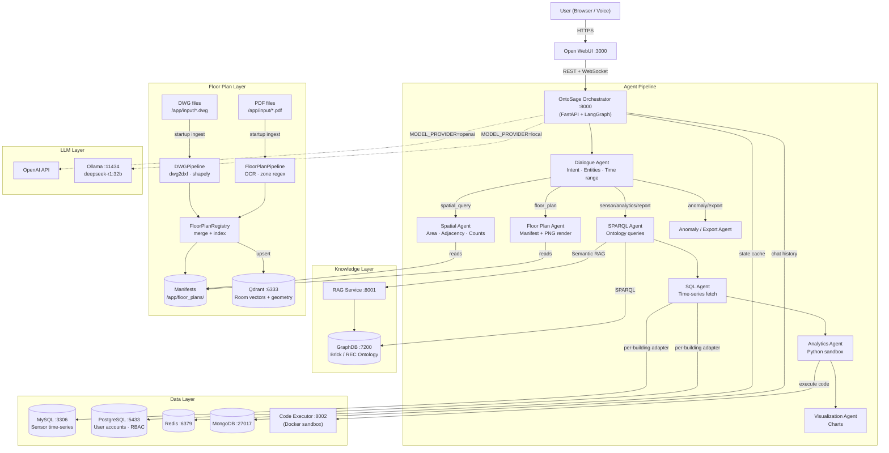

# OntoSage — Agentic AI for Intelligent Buildings

**Natural language interaction with smart building systems — no technical knowledge required.**

[](https://www.python.org/)
[](https://fastapi.tiangolo.com/)
[](https://langchain-ai.github.io/langgraph/)
[](https://brickschema.org/)
[](https://opensource.org/licenses/MIT)
[](https://github.com/suhasdevmane/OntoSage/actions/workflows/ci.yml)
[](https://suhasdevmane.github.io/OntoSage/)

---

**OntoSage** is an open-source agentic AI platform that translates plain English questions into real-time answers sourced from building ontologies (knowledge graphs) and sensor time-series databases.

A facility manager types: *"Which zones on Floor 3 exceeded 1000 ppm CO₂ for more than 15 minutes this week?"*

OntoSage:
1. Classifies the query as an **analytics** intent
2. Searches the semantic knowledge graph (GraphDB) for CO₂ sensor URIs in Floor 3 zones
3. Generates and executes a SPARQL query to find sensor UUIDs
4. Fetches last-7-day readings from the MySQL sensor database
5. Runs Python analytics code in a sandboxed container to compute threshold breaches
6. Returns a formatted table with zone names, peak values, durations, and timestamps

No SQL, no SPARQL, no schema knowledge required from the user.

---

## What Makes OntoSage Different

| Capability | Description |
|---|---|
| **16 Intent Types** | sensor readings, analytics, anomaly detection, reports, exports, recommendations, forecasts, discovery, comparison, floor plans, spatial geometry, and more |
| **Floor Plan Intelligence** | Automatic PDF + AutoCAD DWG ingestion — room polygons, areas, adjacency, and sensor locations extracted at startup and searchable via natural language |
| **Spatial Geometry Queries** | Ask "how many rooms on floor 3 larger than 50 m²?" or "what is adjacent to 3.01?" — answered from DWG geometry with no SQL or SPARQL |
| **Zero-Knowledge Interaction** | Users need no knowledge of sensor IDs, SPARQL, SQL, or ontology classes |
| **Multi-Building Support** | 8 database backends: MySQL, PostgreSQL, TimescaleDB, InfluxDB, MongoDB, SQLite, Cassandra, Redis TimeSeries |
| **Semantic Grounding** | GraphDB similarity indexing maps natural language to RDF entities — no external vector database needed |
| **Safe Analytics Sandbox** | Python code generation executed in a resource-limited Docker sandbox with no filesystem or network access |
| **Role-Based Access Control** | 6 roles, 20 permissions enforced at every API endpoint |
| **LLM Flexibility** | Switch between local Ollama models and OpenAI with a single environment variable |
| **Conversation Memory** | Redis-backed conversation state with 1-hour TTL; full history in MongoDB |

---

## Architecture


```mermaid
graph TD
    User["User (Browser / Voice)"] -->|HTTPS| WebUI["Open WebUI :3000"]
    WebUI -->|REST + WebSocket| Orch["OntoSage Orchestrator :8000\n(FastAPI + LangGraph)"]

    subgraph "Agent Pipeline"
        Orch --> DA["Dialogue Agent\nIntent · Entities · Time range"]
        DA -->|sensor/analytics/report| SA["SPARQL Agent\nOntology queries"]
        DA -->|floor_plan| FPA["Floor Plan Agent\nManifest + PNG render"]
        DA -->|spatial_query| SPA["Spatial Agent\nArea · Adjacency · Counts"]
        DA -->|anomaly/export| AA["Anomaly / Export Agent"]
        SA --> SQ["SQL Agent\nTime-series fetch"]
        SQ --> AnA["Analytics Agent\nPython sandbox"]
        AnA --> VA["Visualization Agent\nCharts"]
    end

    subgraph "Knowledge Layer"
        SA -->|SPARQL| GDB[("GraphDB :7200\nBrick / REC Ontology")]
        SA -->|Semantic RAG| RAGS["RAG Service :8001"]
        RAGS --> GDB
    end

    subgraph "Floor Plan Layer"
        FPA -->|reads| MF[("Manifests\n/app/floor_plans/")]
        SPA -->|reads| MF
        PDF["PDF files\n/app/input/*.pdf"] -->|startup ingest| FPP["FloorPlanPipeline\nOCR · zone regex"]
        DWG["DWG files\n/app/input/*.dwg"] -->|startup ingest| DWGP["DWGPipeline\ndwg2dxf · shapely"]
        FPP --> REG["FloorPlanRegistry\nmerge + index"]
        DWGP --> REG
        REG --> MF
        REG -->|upsert| QD[("Qdrant :6333\nRoom vectors + geometry")]
    end

    subgraph "Data Layer"
        SQ -->|per-building adapter| MySQL[("MySQL :3306\nSensor time-series")]
        SQ -->|per-building adapter| PG[("PostgreSQL :5433\nUser accounts · RBAC")]
        Orch -->|state cache| Redis[("Redis :6379")]
        Orch -->|chat history| Mongo[("MongoDB :27017")]
        AnA -->|execute code| CE["Code Executor :8002\n(Docker sandbox)"]
    end

    subgraph "LLM Layer"
        Orch -. "MODEL_PROVIDER=openai" .-> OpenAI["OpenAI API"]
        Orch -. "MODEL_PROVIDER=local" .-> Ollama["Ollama :11434\ndeepseek-r1:32b"]
    end
```

---

## Quick Start (5 Minutes)

### Prerequisites

- Docker Desktop (Windows / macOS) or Docker Engine (Linux)
- 8 GB RAM minimum (16 GB recommended)
- OpenAI API key **or** NVIDIA GPU for local inference

### 1. Clone

```bash
git clone https://github.com/suhasdevmane/OntoSage.git
cd OntoSage
```

### 2. Configure

```bash
cp .env.example .env
```

Open `.env` and set at minimum:

```bash
# For OpenAI (no GPU required — recommended for getting started)
MODEL_PROVIDER=openai
OPENAI_API_KEY=sk-your-key-here
OPENAI_MODEL=gpt-4o-mini

# Database passwords (change from defaults)
MYSQL_ROOT_PASSWORD=yourpassword
MYSQL_PASSWORD=yourpassword
POSTGRES_USER_PASSWORD=yourpassword
```

### 3. Start

```bash
docker compose up -d
```

First run pulls images (~2–5 minutes). Subsequent starts take under 30 seconds.

### 4. Verify

```bash
curl http://localhost:8000/health
```

### 5. Open the Chat Interface

```
http://localhost:3000
```

Create an account (first user becomes admin), then start asking questions.

---

## Local GPU Mode (Ollama)

For a fully private, offline deployment:

```bash
# Install NVIDIA Container Toolkit (Ubuntu)
sudo apt-get install nvidia-container-toolkit
sudo systemctl restart docker

# Start with GPU profile
docker compose --profile local-gpu up -d

# Pull the model (first run only — ~20 GB download)
docker exec ollama ollama pull deepseek-r1:32b
```

Then set in `.env`:

```bash
MODEL_PROVIDER=local
OLLAMA_MODEL=deepseek-r1:32b
```

See the [Deployment Guide](https://suhasdevmane.github.io/OntoSage/DEPLOYMENT/) for options including `llama3.2:7b` (8 GB VRAM) and `deepseek-r1:14b` (16 GB VRAM).

---

## Example Queries

| Query | Intent type | What happens |
|---|---|---|
| "What sensors are on Floor 3?" | `discovery` | SPARQL query → ontology graph |
| "CO₂ level in Zone 5 right now" | `sensor_data` | SPARQL → UUID → SQL → latest value |
| "Temperature trend this week" | `analytics` | SPARQL → SQL → Python analytics → chart |
| "Which zones exceeded 1000 ppm CO₂?" | `anomaly` | SPARQL → SQL → threshold detection |
| "Compare energy use Floor 2 vs Floor 3" | `comparison` | SPARQL → SQL → analytics → bar chart |
| "Generate a weekly building report" | `report` | Multi-section formatted report |
| "Export yesterday's sensor data as CSV" | `export` | SPARQL → SQL → CSV download |
| "Forecast temperature for tomorrow" | `forecast` | SPARQL → SQL → trend projection |
| "Show me floor 3 / where is room 3.01?" | `floor_plan` | Floor plan manifest → PNG image + room list |
| "How many rooms larger than 50 m² on floor 4?" | `spatial_query` | DWG geometry → filtered room table |
| "What rooms are adjacent to the server room?" | `spatial_query` | DWG adjacency graph → neighbour list |
| "How many sensors are on floor 3?" | `spatial_query` | DWG INSERT blocks → count by type |
| "Total floor area of the building?" | `spatial_query` | DWG area data → per-floor and grand total |

---

## Connecting Your Building

OntoSage adapts to your building — you don't rewrite your data to fit OntoSage.

There are two independent knowledge domains you can connect — either one works independently:

| Domain | Files | What it enables |
|---|---|---|
| **Sensor data** | `.ttl` ontology + time-series database | "What's the CO₂ in zone 3.01 right now?", trends, anomalies, reports |
| **Floor plans** | `.pdf` and/or `.dwg` drawings | "Show me floor 3", room areas, adjacency, block/MEP locations |

### Step 1: Prepare your ontology

Your building's Turtle (`.ttl`) file needs:
- Sensor declarations with RDF types (`brick:Temperature_Sensor`, etc.)
- Time-series linkage connecting sensors to database UUIDs:

```turtle
bldg:sensor_001 brick:hasExternalReference _:ref .
_:ref ref:hasTimeseriesId "a8df8757-009a-4c3b-b1f2-ec59f8ce3e21" ;
      ref:storedAt bldg:database1 .
```

### Step 2: Run the onboarding CLI

```bash
python scripts/onboard_building.py
```

This interactive wizard validates your TTL, generates a `building_config.yaml`, and tests database connectivity.

### Step 3: Load into GraphDB and create the similarity index

```bash
# Load ontology
curl -X POST http://localhost:7200/repositories/ontosage/statements \
  -H "Content-Type: text/turtle" --data-binary @mybuilding.ttl
```

Then follow the [Building Onboarding Guide](https://suhasdevmane.github.io/OntoSage/BUILDING_ONBOARDING/) to create the semantic search index.

---

## Floor Plan Intelligence

OntoSage automatically ingests architectural drawings at startup and makes them queryable in natural language — no manual import steps required.

### How it works

Drop your floor plan files into `/app/input/` and the system does the rest:

```
/app/input/
  Abacws floor 0.pdf      ← rendered image + room labels via OCR
  Abacws floor 0.dwg      ← AutoCAD geometry: polygons, areas, adjacency
  Abacws floor 1.pdf
  Abacws floor 1.dwg
  ...
```

On every startup the **FloorPlanRegistry** runs both pipelines in parallel:

| Pipeline | Input | What it extracts |
|---|---|---|
| **PDF pipeline** | `*.pdf` | Room labels (OCR fallback for vector-path text), zone IDs, rendered PNG |
| **DWG pipeline** | `*.dwg` | Room polygons (shapely), area (m²), perimeter, adjacency graph, door/sensor/HVAC block locations |

The two outputs are merged per floor — DWG wins for geometry, PDF wins for the rendered image — and the result is written to `floor_plans/<building_id>/floor_N.manifest.json` and indexed in Qdrant.

**Idempotent**: files are SHA-256 fingerprinted; unchanged files are skipped on restart. Only new or modified files are reprocessed.

**Live file watching**: drop a new `.pdf` or `.dwg` into `/app/input/` while the system is running and it will be ingested within 3 seconds — no restart needed.

**Graceful degradation**: if `dwg2dxf` (libredwg-utils) is not installed, the DWG pipeline is skipped and only PDF-based `schema_version="1.0"` manifests are produced. The rest of the system continues normally.

### Spatial query examples

Once floor plans are ingested, the `spatial_query` intent answers geometry questions directly from the manifests — no LLM call, sub-second response:

```
"How many meeting rooms are on floor 3?"          → count filtered by type
"Show rooms larger than 50 m² on floor 4"         → sorted area table
"What spaces are adjacent to zone 3.01?"           → adjacency graph lookup
"How many fire exits are on floor 2?"              → DWG block count by type
"Total usable area across all floors"              → sum of all space areas
```

### REST API for floor plan data

```bash
# List all ingested manifests
GET /api/v1/floor-plans

# Full manifest JSON for a specific floor
GET /api/v1/floor-plans/abacws/3/manifest

# Room polygon coordinates (normalised 0–1)
GET /api/v1/floor-plans/abacws/3/polygons

# Inline SVG floor plan (colour-coded by room type)
GET /api/v1/floor-plans/abacws/3/svg?width=1200&show_labels=true

# Force re-ingest all files
POST /api/v1/floor-plans/reingest
```

### Per-building configuration

Override zone ID patterns, AIA/NCS layer names, DPI, and floor labels via a YAML file:

```yaml
# /app/input/cardiff_eng/building.yaml
building_id: cardiff_eng
building_name: Cardiff School of Engineering
zone_id_pattern: "R{floor}{nn}"    # matches R301, R415
default_dpi: 200
floors_label_override:
  0: "Ground Floor"
  1: "First Floor"
```

---

## Supported Database Backends

The `config/database_registry.yaml` file maps TTL `ref:storedAt` identifiers to database connections. OntoSage supports:

| Backend | Technology | Use case |
|---|---|---|
| `mysql` | MySQL, MariaDB, TiDB | Standard IoT sensor stores |
| `postgresql` | PostgreSQL, Aurora, Neon | Enterprise deployments |
| `timescaledb` | TimescaleDB hypertables | High-frequency time-series |
| `mongodb` | MongoDB, Atlas, DocumentDB | Document-model sensor data |
| `influxdb` | InfluxDB 2.x | Native time-series platforms |
| `sqlite` | SQLite, DuckDB | Local / embedded deployments |
| `cassandra` | Cassandra, ScyllaDB | High-write IoT at scale |
| `redis_timeseries` | Redis + RedisTimeSeries | Real-time edge data |

Multiple buildings can use different backends simultaneously. Each sensor in the ontology declares its own `ref:storedAt` adapter key — routing is fully automatic.

---

## Switching LLM Providers

Switch at any time without rebuilding:

```bash
# Switch to OpenAI
MODEL_PROVIDER=openai docker compose restart orchestrator

# Switch to local Ollama
MODEL_PROVIDER=local docker compose --profile local-gpu restart orchestrator

# Windows PowerShell
.\switch-provider.ps1 openai
.\switch-provider.ps1 local
```

---

## Service Ports

| Port | Service | Purpose |
|---|---|---|
| **3000** | Open WebUI | Chat interface |
| **8000** | Orchestrator API | REST + WebSocket + `/v1/chat/completions` |
| **8001** | RAG Service | Semantic entity retrieval |
| **8002** | Code Executor | Analytics sandbox |
| **7200** | GraphDB | Ontology store + Workbench UI |
| **6379** | Redis | Conversation state cache |
| **3307** | MySQL | Sensor time-series data |
| **5433** | PostgreSQL | User accounts + RBAC |
| **27017** | MongoDB | Chat history |
| **6333** | Qdrant | Room geometry vectors (`floor_plans`) + cross-session agent memory (`user_memory`) |

---

## Documentation

**[ONTOSAGE.md](ONTOSAGE.md)** — The single comprehensive reference document. Everything you need to understand, deploy, extend, and operate OntoSage from scratch: all 16 intents, 11 agents, 10 personas, floor plan intelligence, 4 RAG systems, 3 LLM providers, 8 database backends, security, compliance standards, API reference, MCP integration, building onboarding, troubleshooting, and research background.

Full hosted documentation at **[suhasdevmane.github.io/OntoSage](https://suhasdevmane.github.io/OntoSage/)**

| Guide | Description |
|---|---|
| [ONTOSAGE.md](ONTOSAGE.md) | Complete system reference (start here) |
| [Deployment](https://suhasdevmane.github.io/OntoSage/DEPLOYMENT/) | Deploy from scratch — OpenAI or local GPU |
| [Building Onboarding](https://suhasdevmane.github.io/OntoSage/BUILDING_ONBOARDING/) | Connect your building's ontology and sensor database |
| [Configuration](https://suhasdevmane.github.io/OntoSage/CONFIGURATION/) | All environment variables and settings |
| [GraphDB Setup](https://suhasdevmane.github.io/OntoSage/GRAPHDB_SETUP/) | Create the semantic similarity index |
| [Architecture](https://suhasdevmane.github.io/OntoSage/ARCHITECTURE/) | Component design and data flow |
| [Developer Guide](https://suhasdevmane.github.io/OntoSage/DEVELOPER_GUIDE/) | Local dev setup, adding agents, CI |
| [Security](https://suhasdevmane.github.io/OntoSage/SECURITY/) | Auth, RBAC, sandbox isolation |
| [Runbook](https://suhasdevmane.github.io/OntoSage/RUNBOOK/) | Operations: health checks, backups, troubleshooting |

---

## Development

```bash
# Set up virtual environment
python -m venv .venv && source .venv/bin/activate  # Linux/macOS
python -m venv .venv && .venv\Scripts\activate     # Windows

# Install dependencies
pip install -r orchestrator/requirements.txt
pip install pytest pytest-asyncio black isort flake8

# Start infrastructure services only (GraphDB, Redis, MySQL, etc.)
docker compose up -d graphdb redis mysql postgres-user-data code-executor rag-service

# Run orchestrator locally with hot reload
PYTHONPATH=. uvicorn orchestrator.main:app --reload --port 8000
```

### Running Tests

```bash
pytest tests/ -v                      # all tests
pytest -m unit                        # fast unit tests only
pytest -m integration                 # requires Docker services
pytest tests/ --cov=orchestrator      # with coverage report
```

### Code Style

```bash
black --line-length 100 orchestrator/ shared/ scripts/ tests/
isort --profile black orchestrator/ tests/
flake8 orchestrator/ shared/ --max-line-length 110
```

---

## Research Background

OntoSage was developed as part of research at **Cardiff University** (Devmane, Rana, Perera) into zero-knowledge interaction with built environments. The system was evaluated across three real buildings with 81 participants and 5,916 pre-development survey questions analysing how different building stakeholders — from facility managers to occupants — ask questions about their buildings.

A paper describing the methodology, corpus analysis, and evaluation results is in preparation for **ACM IMWUT (Proceedings of the ACM on Interactive, Mobile, Wearable and Ubiquitous Technologies)**.

---

## Contributing

Contributions are welcome. Please:

1. Fork the repository and create a feature branch
2. Run the test suite and linters before submitting
3. Follow the conventions in the [Developer Guide](https://suhasdevmane.github.io/OntoSage/DEVELOPER_GUIDE/)
4. Open a pull request against `main`

For bug reports and feature requests, open a [GitHub Issue](https://github.com/suhasdevmane/OntoSage/issues).

---

## License

MIT — see [LICENSE](LICENSE) for details.

---

*OntoSage is open source. Built with [LangGraph](https://github.com/langchain-ai/langgraph), [FastAPI](https://fastapi.tiangolo.com/), [GraphDB](https://graphdb.ontotext.com/), and [Brick Schema](https://brickschema.org/).*
