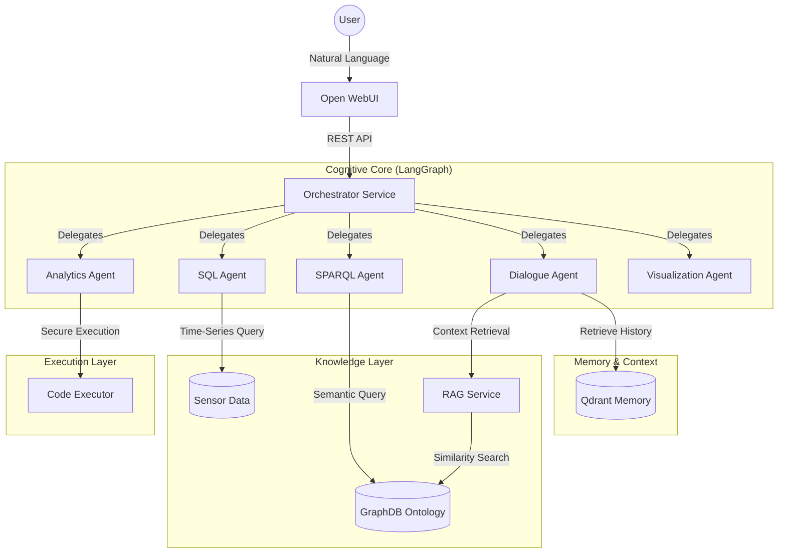

# OntoSage: Easy-Deploy Conversational AI for Sustainable Smart Buildings
## Enabling Zero-Knowledge Human-Building Interaction for Persona-Agnostic Multi-Objective Goals

[](https://www.python.org/downloads/release/python-3110/)
[](https://fastapi.tiangolo.com/)
[](https://langchain-ai.github.io/langgraph/)
[](https://opensource.org/licenses/MIT)

**OntoSage** is a research-grade **Agentic AI Framework** designed to democratize access to smart building data. It enables **Zero-Knowledge Human-Building Interaction (HBI)**, allowing users with no technical expertise (occupants, facility managers, researchers) to interact with complex building systems using natural language.

Designed for **Sustainable Smart Buildings**, OntoSage facilitates **persona-agnostic multi-objective goals**—from optimizing energy consumption to ensuring occupant comfort—without requiring users to understand the underlying database schemas, ontologies, or sensor protocols.

The framework is built on a **"Easy-Deploy"** philosophy, ensuring it can be deployed in any smart building environment with **minimal changes** to existing databases and ontologies.

---

## 🌟 Key Research Contributions & Features

*   **🤖 Zero-Knowledge Interaction**: Abstracts the complexity of SPARQL, SQL, and IoT protocols. Users simply ask questions like "Why is it so hot in here?" or "Analyze energy trends for last month," and the system handles the technical translation.
*   **🏢 Persona-Agnostic Adaptability**: Automatically detects and adapts to the user's role (e.g., providing simplified comfort controls for occupants vs. detailed diagnostic data for facility managers).
*   **⚡ Easy-Deploy Architecture**: Containerized microservices architecture (Docker) that requires minimal configuration. It adapts to *your* building's existing ontology (Brick, RealEstateCore, etc.) and database structure rather than forcing a migration.
*   **🧠 Multi-Agent Orchestration**: A sophisticated **LangGraph**-based brain that coordinates specialized agents:
    *   **Dialogue Agent**: Context-aware communication.
    *   **SPARQL Agent**: Semantic reasoning over building topology.
    *   **SQL Agent**: High-performance time-series retrieval.
    *   **Analytics Agent**: On-the-fly Python code generation for statistical analysis.
    *   **Visualization Agent**: Dynamic generation of Plotly charts.
*   **🔍 GraphDB-Native RAG**: Utilizes **GraphDB Similarity Indexing** for semantic search directly within the Knowledge Graph, eliminating the need for external vector databases for ontology mapping.
*   **🧠 Long-Term Memory**: Uses **Qdrant** to store and retrieve **User Conversation History**, enabling the system to recall past context and preferences across sessions.
*   **🔓 Open & Private**: Fully supports local deployment with **Ollama (DeepSeek/Llama)** for data privacy, or cloud integration with OpenAI.
*   **🗣️ Multimodal Interface**: Integrated with **Open WebUI** for a seamless chat experience, including voice interaction capabilities.

---

## 🏗️ System Architecture

OntoSage employs a **Hub-and-Spoke** agentic architecture. The **Orchestrator** serves as the central cognitive unit, decomposing complex user queries into sub-tasks delegated to specialized agents.


```mermaid
graph TD
    User((User)) -->|Natural Language| OpenWebUI[Open WebUI]
    OpenWebUI -->|REST API| Orchestrator[Orchestrator Service]
    
    subgraph "Cognitive Core (LangGraph)"
        Orchestrator -->|Delegates| Dialogue[Dialogue Agent]
        Orchestrator -->|Delegates| SPARQL[SPARQL Agent]
        Orchestrator -->|Delegates| SQL[SQL Agent]
        Orchestrator -->|Delegates| Analytics[Analytics Agent]
        Orchestrator -->|Delegates| Vis[Visualization Agent]
    end
    
    subgraph "Memory & Context"
        Dialogue -->|Retrieve History| Qdrant[(Qdrant Memory)]
    end

    subgraph "Knowledge Layer"
        SPARQL -->|Semantic Query| GraphDB[(GraphDB Ontology)]
        SQL -->|Time-Series Query| MySQL[(Sensor Data)]
        Dialogue -->|Context Retrieval| RAG[RAG Service]
        RAG -->|Similarity Search| GraphDB
    end
    
    subgraph "Execution Layer"
        Analytics -->|Secure Execution| Sandbox[Code Executor]
    end
```

### Zero-Knowledge Query Resolution Flow

1.  **Context Retrieval**: The system fetches relevant past interactions from **Qdrant** to understand the user's ongoing context.
2.  **Intent Recognition**: The system identifies if the user wants to *know* (metadata), *see* (time-series), or *analyze* (computation).
3.  **Schema Mapping**: It uses **GraphDB Similarity Indexing** to map natural language terms (e.g., "Conference Room") to specific ontology entities (e.g., `bldg:Room-101`).
4.  **Data Retrieval**: It autonomously constructs valid SPARQL or SQL queries based on the connected building's schema.
5.  **Synthesis**: Results are synthesized into a natural language response, often accompanied by dynamic visualizations.

---

## 🧩 Service Components

### 1. Orchestrator Service (`/orchestrator`)
The cognitive brain built with **FastAPI** and **LangGraph**. It maintains conversation state and manages the "Persona Agnostic" logic, adjusting responses based on the inferred user intent.

### 2. Agentic Microservices
*   **SPARQL Agent**: Interfaces with RDF stores (GraphDB) to understand building topology.
*   **SQL Agent**: Interfaces with SQL databases (PostgreSQL/MySQL) for historical sensor data.
*   **Analytics Agent**: A secure sandbox for executing generated Python code to perform complex calculations (e.g., "Calculate the correlation between occupancy and temperature").
*   **Visualization Agent**: Generates configuration for Plotly charts.
*   **State Management**: Uses **Redis** for short-term state and **Qdrant** for long-term semantic memory.

### 3. RAG Service (`/rag-service`)
**The Librarian.** Built with **GraphDB Similarity Indexing**.
*   **Role**: Handles semantic search directly within the Knowledge Graph.
*   **Working**: Uses GraphDB's internal vector index to find relevant ontology entities based on user queries, then retrieves their "bounded context" (neighboring triples) to ground the LLM.

### 4. Code Executor Service (`/code-executor`)
**The Sandbox.** Built with **Docker** and **Python**.
*   **Role**: A secure, isolated environment for running code generated by the Analytics Agent.
*   **Security**: Prevents the AI from accessing the host system, network, or sensitive files. It only has access to the specific data provided for the analysis task.
*   **Output**: Returns the standard output (text) and any generated artifacts (images/plots) back to the Orchestrator.

### 5. Frontend Application (`/frontend`)
**The Face.** Built with **Open WebUI**.
*   **Features**:
    *   **Chat Interface**: Streaming responses, markdown support, code highlighting.
    *   **Voice Input**: One-click recording and sending.
    *   **Visualization**: Renders interactive plots generated by the backend.

### 6. Data Layer
*   **MySQL**: Stores high-frequency sensor telemetry data.
*   **GraphDB**: Stores the RDF Knowledge Graph (Ontology) and handles Vector Similarity Search.
*   **Qdrant**: Stores vector embeddings of **User Conversation History** for long-term memory.
*   **Redis**: High-speed cache for active conversation state.

### 5. Frontend Application (`/frontend`)
**The Face.** Built with **React 19**, **TypeScript**, and **Tailwind CSS**.
*   **Features**:
    *   **Chat Interface**: Streaming responses, markdown support, code highlighting.
    *   **3D Viewer**: Interactive model of the building, highlighting rooms and sensors based on the conversation.
    *   **Dashboard**: Real-time charts and analytics views.
    *   **Voice Input**: One-click recording and sending.

### 6. Data Layer
*   **MySQL**: Stores high-frequency sensor telemetry data.
*   **GraphDB**: Stores the RDF Knowledge Graph (Ontology) representing the building's physical structure and relationships.
*   **Qdrant**: Vector database for semantic similarity search.
*   **Redis**: High-speed cache for conversation state and pub/sub messaging.

---

## 🚀 Getting Started

### Prerequisites
*   **Docker Desktop** (Windows/Mac) or **Docker Engine** (Linux).
*   **Git** to clone the repository.
*   *(Optional)* **NVIDIA GPU** for faster local inference.

### Step 1: Configuration
OntoSage supports two modes: **Local** (Privacy-focused, Free) and **Cloud** (High Performance, Paid).

1.  **Clone the repo**:
    ```bash
    git clone https://github.com/suhasdevmane/OntoBot.git
    cd OntoBot
    ```

2.  **Choose your provider**:
    *   **For Local (Ollama)**:
        ```bash
        cp .env.local .env
        ```
    *   **For Cloud (OpenAI)**:
        ```bash
        cp .env.cloud .env
        ```
        *Edit `.env` and add your `OPENAI_API_KEY`.*

### Step 2: Deployment
We provide automated scripts to handle the complex Docker Compose setup.

**Windows (PowerShell):**
```powershell
./startup.ps1 -Provider local
# OR
./startup.ps1 -Provider cloud
```

**Linux / Mac (Bash):**
```bash
chmod +x scripts/check-health.sh
./scripts/check-health.sh
docker-compose up -d
```

*Note: The first startup may take 10-15 minutes to download necessary Docker images and LLM models (approx. 10GB).*

### Step 3: Access the System
Once the startup script completes and health checks pass:

*   **Frontend UI**: [http://localhost:3000](http://localhost:3000)
*   **API Documentation**: [http://localhost:8000/docs](http://localhost:8000/docs)
*   **RAG Service**: [http://localhost:8001/docs](http://localhost:8001/docs)
*   **Grafana Monitoring**: [http://localhost:3001](http://localhost:3001) (Default login: admin/admin)

---

## 📚 Full Documentation

For deeper details and operations, see the docs set:

- [docs/ARCHITECTURE.md](docs/ARCHITECTURE.md)
- [docs/SERVICES.md](docs/SERVICES.md)
- [docs/CONFIGURATION.md](docs/CONFIGURATION.md)
- [docs/BUILDING_ONBOARDING.md](docs/BUILDING_ONBOARDING.md)
- [docs/RUNBOOK.md](docs/RUNBOOK.md)
- [docs/DEVELOPER_GUIDE.md](docs/DEVELOPER_GUIDE.md)
- [docs/USER_GUIDE.md](docs/USER_GUIDE.md)
- [docs/SECURITY.md](docs/SECURITY.md)

---

## 🏢 Onboarding Your Own Building

OntoSage is designed to be ontology-agnostic. You can load your own building's data (in RDF/TTL format) to start chatting with it.

### 1. Prepare Your Data
Ensure you have your building ontology in `.ttl` (Turtle) format. This file should define:
*   **Physical Structure**: Sites, Buildings, Floors, Rooms.
*   **Assets**: HVAC equipment, Lighting, Sensors.
*   **Relationships**: `hasPoint`, `feeds`, `isLocationOf`.

### 2. Place Data in Volume
Copy your `.ttl` files to the data directory:
```bash
# Example: Create a folder for your building
mkdir -p data/my_building/dataset
cp /path/to/your/building.ttl data/my_building/dataset/
```

### 3. Update Configuration
Edit `docker-compose.agentic.yml` to point the **GraphDB** service to your new data folder.

Find the `graphdb` service definition:
```yaml
  graphdb:
    # ...
    volumes:
      - ./volumes/graphdb:/opt/graphdb/home
      # CHANGE THIS LINE to point to your folder:
      - ./data/my_building/dataset:/opt/graphdb/import:ro
```

### 4. Restart Services
Restart the GraphDB service to load the new ontology:
```bash
docker-compose -f docker-compose.agentic.yml restart graphdb
```
*Note: GraphDB will automatically import files found in the `/opt/graphdb/import` directory on startup if the repository is empty.*

---

## 📖 Usage Guide

### 1. Asking Questions
You can ask questions in natural language. The system will automatically route your request.
*   **General**: "How does the HVAC system work?" (Uses RAG + Dialogue Agent)
*   **Structural**: "List all temperature sensors in Building 1." (Uses SPARQL Agent)
*   **Data**: "What was the average temperature in Room 202 yesterday?" (Uses SQL Agent)
*   **Analysis**: "Plot the correlation between humidity and temperature for the last month." (Uses Analytics + Visualization Agents)

### 2. Using Voice Mode
Click the microphone icon in the chat bar. Speak your query clearly. The system will transcribe it and process it just like a text message.

### 3. 3D Visualization
When you ask about specific rooms or equipment, the 3D viewer on the right panel will automatically fly to and highlight the relevant assets.

---

## 👨‍💻 Developer Guide

### Project Structure
*   `orchestrator/`: Main backend logic (FastAPI + LangGraph).
*   `frontend/`: React UI code.
*   `rag-service/`: Vector search logic.
*   `code-executor/`: Sandbox environment.
*   `docker-compose.yml`: Core service definitions.

See **[docs/PROJECT_STRUCTURE.md](docs/PROJECT_STRUCTURE.md)** for a full file tree.

### Adding a New Agent
1.  Create a new agent class in `orchestrator/app/agents/`.
2.  Define its state and tools.
3.  Register it in the `orchestrator/app/workflow.py` graph.
4.  Add a routing condition in the `supervisor` node.

### Running Tests
```bash
# Run all tests
pytest tests/

# Run specific test
pytest tests/test_llm_intent_detection.py
```

---

## 🔧 Troubleshooting

*   **"Ollama connection failed"**: Ensure the `ollama` container is running and healthy. If you don't have a GPU, local inference might be slow or time out.
*   **"Database connection error"**: Check if the `mysql` and `graphdb` containers are up. The startup script waits for them, but manual restarts might be needed if they crash.
*   **"OpenAI API Error"**: Verify your API key in the `.env` file and ensure you have credits.

---

## 📜 License

This project is licensed under the MIT License - see the [LICENSE](LICENSE) file for details.
