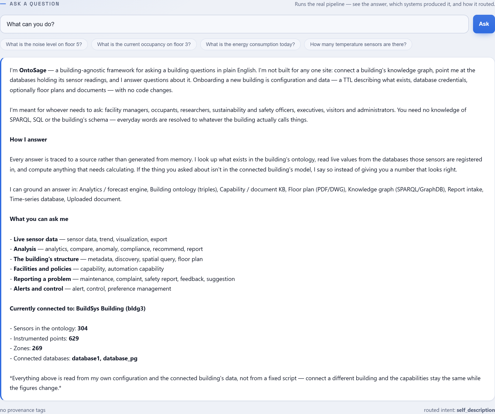
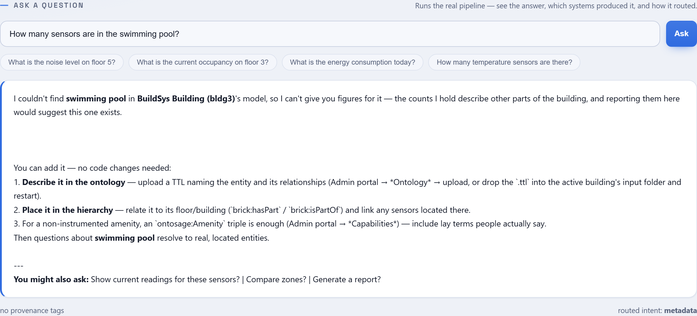
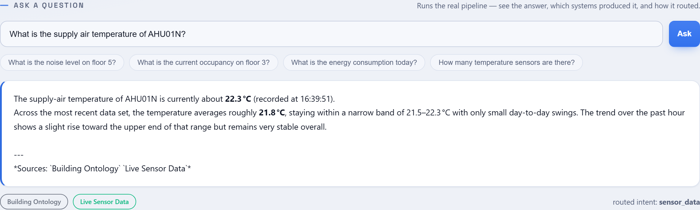
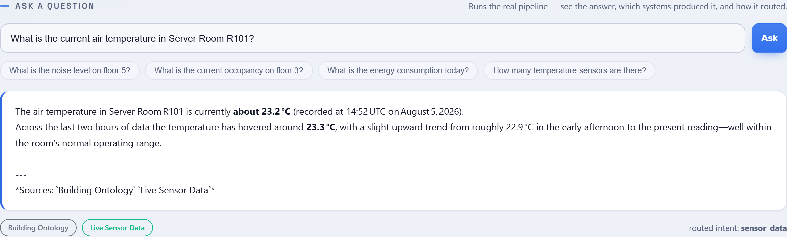

# OntoSage — Agentic AI for Smart Buildings

**Ask your building anything in plain English. Get answers grounded in its own data, with the evidence shown.**

[](https://www.python.org/)
[](https://fastapi.tiangolo.com/)
[](https://langchain-ai.github.io/langgraph/)
[](https://brickschema.org/)
[](https://opensource.org/licenses/MIT)
[](https://github.com/suhasdevmane/OntoSage/actions/workflows/ci.yml)

---

A facility manager opens the chat and asks: *"Show me floor 3 layout and also tell me how many rooms are there."*

OntoSage decomposes it into two sub-intents (`floor_plan` + `spatial_query`), routes each to the right agent, and returns both the floor map PDF and the room count in one response. Behind the scenes: two LLM calls, session validation, persona blending, Brick ontology + MySQL time-series + DWG geometry, and a complete routing audit trail written to Redis.

No SQL, no SPARQL, no schema knowledge required from the user.

Ask a follow-up — *"and what about humidity there?"* — and it remembers you meant floor 3.

> **Full technical reference:** [ONTOSAGE.md](./ONTOSAGE.md) — complete architecture, how answers are grounded and evidenced, compound-question reasoning, changelog, all intents, multi-tenant/multi-persona model, conversation memory, forecasting pipeline, admin console, quality gates and measured results, known limitations.

> **Where it stands (October 2026).** OntoSage answers single-fact and multi-part questions about
> one building from its ontology, its document registers, its floor plans and its live sensor
> readings, and shows the evidence behind each answer. **Compound, multi-criteria questions are
> the research frontier**: a pre-registered before/after evaluation found no statistically
> significant gain from the version-2 work (see [Measured quality](#measured-quality)). It is
> ready for **supervised trials**, not for unattended or open use.

---

## Prerequisites

> **`docker compose up -d` is the design goal, and it is not yet the whole truth.** Where a
> host dependency exists, it belongs here rather than in a newcomer's afternoon.

| What | Why | How to check |
|---|---|---|
| **Docker Desktop / Engine + Compose v2** | Every service except MySQL runs in compose | `docker compose version` |
| **MySQL on the HOST, port 3306, database `sensordb`** | The compose MySQL service is **commented out**; the orchestrator reaches the host via `host.docker.internal:3306`. Without it every time-series answer returns no rows while the graph answers normally — which reads as a data gap rather than a missing prerequisite | `mysql -h 127.0.0.1 -P 3306 -e "SHOW DATABASES"` |
| **A language model — one of three** | The model reads the question and writes the reply; it never does the arithmetic. **Hosted gateway** (the default in `.env.example`): an OpenAI-compatible GPU server running `gpt-oss:20b`, reachable on the Cardiff VPN, needs `HOSTED_LLM_API_KEY`. **Local**: Ollama on the host, port 11434, the same model, about 16 GB of GPU memory so it sits entirely on the GPU (CPU works, roughly six times slower). **OpenAI**: an API key, and it costs money | hosted: `curl <HOSTED_LLM_BASE_URL>/models` · local: `curl -s http://127.0.0.1:11434/api/tags` |
| **`.env`** | Copy `.env.example`, choose `MODEL_PROVIDER`, supply that provider's key, and set the four values `STRICT_SECRETS` refuses to boot on: `MYSQL_PASSWORD`, `POSTGRES_USER_PASSWORD`, `GRAPHDB_PASSWORD`, `SECRET_KEY` | the orchestrator refuses to start and names the offender |

**The shared gateway, and what to expect from it.** The hosted gateway is shared and generates a
few requests at once; the rest queue, so a request can wait minutes before its first word. The
workflow deadline is *derived* from the model timeout — a model slower than the deadline cannot
serve this pipeline, and the system warns at boot when that is the case. When the gateway cannot
be reached, the answer says exactly that, and says it is not a gap in the building's records,
rather than reporting a misleading "I could not find this". A call made during a brief outage
(under a minute) waits it out once; a longer outage is reported at once. The system is built for
**one user at a time**: with several people asking together, answers queue.

**Optional backends.** TimescaleDB and Cassandra are exercised by
`docker-compose.timeseries-backends.yml` and seeded by `scripts/seed_timeseries_backends.py`.
They are off by default and nothing needs them.

---

## Measured quality

Every quality figure here comes from reading the answers themselves — by a person, or, for the
compound-question evaluation, by a panel of language-model judges working to a fixed rubric (and
that is said where it matters). Automatic scorers are not used to make claims: in this project they
proved unreliable on questions they had not been calibrated on, and one scored below chance on
held-out answers.

| What was measured | Result |
|---|---|
| **Unseen real questions**, 60 at a time, hand-read (questions nobody building the system had asked) | **65%** and **68%** of answers acceptable on two independent sets, October 2026. *Acceptable* means a correct answer, or an honest decline that is itself correct |
| **Fabricated figures** in those unseen sets | **None** across six independent sets of about 60 questions. The compound-question evaluation below then found one fabricated claim in a seventh body of answers; it is logged as an open defect |
| **Compound, multi-criteria questions** — a pre-registered before/after on 91 held-out questions, version 1 against version 2 | **No statistically significant improvement.** 13.6% → 15.9% acceptable on the 44 answerable real questions (p = 1.00). Full report: [eval/compound/BEFORE_AFTER.md](./eval/compound/BEFORE_AFTER.md) |
| **Regression gate** — 51 fixed real questions, re-asked against the running system after every change | 51 of 51 behave as recorded (one case is a known quirk of the test harness, not of the system) |
| **Automated tests**, clean checkout, no building active | 15,157 pass and none fail (8 October 2026); GitHub's CI passes on Python 3.10, 3.11 and 3.12 |
| **Speed** | Median about 25 seconds per answer, 90th percentile about 45 seconds, occasionally minutes |

**How to read these.** The two 60-question figures describe the system as a whole on questions it
had not been tuned on; the earlier sets that *were* fixed against read higher and are not quoted.
The most common way an answer is unacceptable is a **false decline** — the building holds the data
and the answer says it does not. That is a visible failure, which is why it is tolerable in a
supervised trial; it is also the reason the system is **not yet ready for an open invitation**.

An earlier, automatically graded replay of 240 survey questions (June 2026) read 63.8% on the
reference building and 70.4% on a second building with no code changes — evidence that the system
moves between buildings. The grading method itself is no longer relied on, so those figures are
kept as history. They were drawn from a 5,604-question survey of what building stakeholders
actually ask.

---

## Where bldg1's readings come from

**Read this once; the system does not repeat it in every answer.**

Abacws is a real building and its model describes real equipment. Its instrumentation is
**concentrated on floor 5**: 37 rooms carry 20 physical sensors each — temperature, humidity,
CO₂, illuminance, particulate and air quality — and those readings are measurements, stored in
the wide `sensor_data` table.

**Floors 0–4 are synthetic.** Their points are placeholders generated to fill coverage gaps so
the system can be developed and demonstrated across the whole building. Ask about floor 3 and you
get floor 3's readings; they are correct for what they represent, and they stand in for
instruments that will be connected later.

| | sensors | spaces |
|---|---:|---:|
| Declared measured (`ontosage:isSimulated false`) | 685 | 37 — all floor 5 |
| Declared simulated (SATURATE placeholders) | 1,409 | 241 |

**An answer does not distinguish the two.** That is a deliberate decision, declared in
`input/building.yaml` as `provenance.evidence_policy: all_connected_readings`: the demonstration
is that the system answers correctly from whatever data is attached, not that it can litigate
where each number came from. The origin is documented here rather than repeated in prose the
reader would learn to skip.

The machinery to enforce the distinction exists and is tested. Setting
`provenance.evidence_policy: measured_only` makes the deliberation ranker exclude
simulated-origin candidates before ranking, and say so. **That is what a supervised pilot or any
deployment where someone acts on an answer should set** — at that point the distinction stops
being a development detail. See `docs/V12_SUPPORTED_SCOPE.md`.

---

## Design principles

OntoSage is **an agentic conversational layer over one smart building's own data** — *connect a
building's data, then ask it anything in plain English.* Everything below is a deliberate design
commitment, not an accident of implementation:

1. **One building at a time.** A deployment serves a single active building. Several buildings can
   live side by side in the repo, each with its own data folder, env file and compose file; exactly
   one is *activated* at a time by renaming its trio to `input/`, `.env` and `docker-compose.yml`,
   and each keeps isolated state under `volumes/<building_id>/`.
2. **TTL-first — the ontology is the source of truth.** If a fact can be an RDF triple, it lives in
   the Brick/BACnet ontology, not a sidecar file or a code constant. Questions are answered via SPARQL
   first; SQL, analytics, and the knowledge base handle only live time-series and things RDF can't express.
3. **No hardcoding — building-agnostic core.** Core code carries no building-specific literals
   (namespaces, zone ids, sensor counts, areas). Every figure in an answer is computed live from the
   graph or the floor plans, so it can never drift stale — and the same code runs unchanged for any building.
4. **Honest, grounded answers — never fabricate.** Every number traces to live data. Ask about a floor,
   wing, amenity, asset or measurement this building does not have and OntoSage says so plainly — it will
   not quietly answer with another sensor's readings, and it will not present an unrelated document as
   the answer. Each refusal also tells you **what to add** to make the question answerable.
5. **Any stakeholder, any purpose.** One interface serves facility managers, occupants, researchers,
   sustainability and safety officers, executives, visitors, students, and admins. Personas shape how an
   answer is framed; they don't gate access.
6. **Zero-knowledge to expert.** No SQL, SPARQL, or schema knowledge is required — lay terms resolve to
   the right sensors — yet experts still get Brick classes, RDF types, and a live SPARQL browser.
7. **Admin-controlled access (RBAC).** Every data and configuration endpoint is permission-gated;
   ontology management is admin-only. Roles are separate from personas.
8. **Connect data, get answers.** A question becomes answerable when the sensor is described in the
   ontology *and* its readings are in a registered database. Onboarding a source is drop-in: add the
   triples, register the database, load the rows — no code.
9. **Multiple datasources, pluggable — even within one building.** Each sensor's `ref:storedAt`
   routes its readings to the right backend, so different sensors in the *same* building can live in
   different databases: one active building runs MySQL and PostgreSQL side by side, some sensors read
   from each. A new backend technology is a new adapter, nothing more; the registry ships connection
   templates for ~50 stores (MySQL, PostgreSQL, TimescaleDB, MongoDB, InfluxDB, Cassandra, Redis, …).
10. **Local or API models, independently.** The language model is switchable between a hosted GPU
    gateway, local Ollama and OpenAI, and the embedding model is chosen separately, so you can run
    fully offline for privacy or on an API for capability.
    The local embedding model (`bge-large-en-v1.5`) is baked into the image and runs offline; its
    vector width and retrieval threshold are read from the model itself, and a boot-time sweep repairs
    any vector store left at a mismatched width — so the model can never silently drift.
11. **One command to run it.** Activate a building once (a couple of renames — no build steps, no
    generators) and the entire stack boots with `docker compose up -d`; all configuration lives in
    `.env` and the `input/` folder.

---

## How the system works

```
User question (natural language)
        │
        ▼
[Co-reference rewrite] — "and humidity there?" → "average humidity on floor 3"
        │
        ▼
Dialogue agent — LLM classifies intent + extracts entities (persona priors injected)
        │
        ▼
Python router — deterministic, audit-logged
        │
   ┌────┴────────────────────────────────────────────────────────────┐
   ▼         ▼           ▼           ▼          ▼          ▼         ▼
sparql   capability  floor_plan  spatial_q  control  maintenance  planner
   │         │                                                        │
   ▼         └──────────────────────────────────────────────┐        │
  sql                                                        │        │
   │                                                         │        │
   ▼                                                         ▼        ▼
analytics ──► visualization                              response ◄───┘
                                                              │
                                          [conversation memory saved]
                                                              ▼
                                                           client
```

Every turn: co-reference rewrite before classification; conversation persisted to Redis + Postgres after response. The routing decision (`intent, overrides_applied, final_node, decision_source`) is logged per-request.

The diagram shows the main path. Beyond it, deterministic rules send some questions to
specialised lanes:

- a **deliberation** lane ranks rooms or floors against several criteria and returns an evidence table;
- an **events** lane answers questions about bookings, work orders and footfall;
- **register** and **asset** lanes read the building's document registers and the working state of its equipment;
- a **reach** lane answers *"can you measure X here?"* from a coverage matrix rather than from prose;
- small lanes handle comfort history, readiness (*"is this room ready for my class?"*), indirect why-questions, conflicting stated facts, session recall (*"what did I ask?"*, *"how do you know that?"*), privacy refusals and out-of-scope guidance.

Which question shape goes to which lane is a single ordered contract of 76 rules in three
stages — while the model's classification is read, just after it, and once the question's
concepts are resolved. It is audited on every turn, so behaviour can be traced rather than
inferred.

---

### Flow — onboard a building end-to-end from the browser

**Fresh clone → pure-GUI onboarding. No host-side file editing, no code.** Every step is a tab in
the Admin Console (`http://localhost:3001`); each one writes into the **active building's `input/`
folder**, which OntoSage re-reads live.

```
  git clone …  →  activate a building (rename bldg1/ → input/)  →  docker compose up -d
        │
        ▼
  open  http://localhost:3001   (Admin Console — sign in as admin)
        │
        ▼
  ┌──────────────────────────────────────────────────────────────────────┐
  │ 1  Ontology ▸ Building identity   namespace / prefix / building name  │
  │ 2  Ontology ▸ Upload TTL          Brick model — sensors + links       │
  │ 3  Databases ▸ Register sensors   ref:hasTimeseriesId + ref:storedAt   │
  │ 4  Ontology ▸ Documents           policies / manuals (.md/.txt/.pdf)   │
  │ 4  Ontology ▸ Floor plans         PDF / DWG per floor                  │
  └──────────────────────────────────────────────────────────────────────┘
        │
        ▼
  5  Ask ▸ type a question   →   grounded answers, forever

  Every step writes into the ACTIVE building's  input/  folder (live reload).
  One building at a time — input/ is always the active building.
```

| Step | Admin Console tab | What it writes | Backing endpoint |
|---|---|---|---|
| 1. Building identity | **Ontology ▸ Building** | `input/building.yaml` (namespace, prefix, storage keys) | `PUT /api/v1/admin/building/config` |
| 2. Upload TTL | **Ontology ▸ Upload TTL** | `input/<file>.ttl` + GraphDB named graph | `POST /api/v1/admin/ontology/upload` |
| 3. Register sensors / DB | **Databases** | Brick + `ref:storedAt` triples; DB connection | `POST /api/v1/admin/databases/*` |
| 4. Documents | **Ontology ▸ Documents** | `input/documents/*` → document KB (Qdrant `documents_<bldg>`) | `POST /api/v1/admin/documents/upload` |
| 4. Floor plans | **Ontology ▸ Floor plans** | `input/<label> floor <N>.<ext>` → spatial manifests | `POST /api/v1/admin/floor-plans/upload` |
| 5. Ask | **Ask** | — (queries all of the above) | `POST /chat` |

> **Switching vs building.** `input/` is always the *active* building. To **build a new** building,
> do steps 1–5 in the browser. To **switch to a pre-built** building, swap `input/`'s contents (and
> `.env` / `docker-compose.yml`) — see [BUILDING_ONBOARDING.md](docs/BUILDING_ONBOARDING.md).

## What makes an answer trustworthy

OntoSage is built so that a wrong answer is visible and a right one can be checked.

**The model does not do the arithmetic.** A language model reads the question, works out what it
means, and writes the reply. Every count, total, average, ranking and comparison in between is
computed by ordinary deterministic code over the building's data, and an answer whose wording
disagrees with its own table is failed rather than shown.

**Every answer carries its evidence.** Open the *How I know this* panel under an answer and it
says what kind of claim it is (read from an instrument, read from a system of record, or derived),
what operation produced it, which kind of source led (an authoritative record or a measurement),
the sources it drew on in plain names rather than identifiers, and when the newest evidence is
from and when it was retrieved. A one-line sources footer sits above the panel.

**Four different kinds of "nothing" are kept apart.** The building does not have it. The building
has it, but not for the period asked. The system could not retrieve it just now. Or the person
asking is not permitted to see it. Each is said differently, and a decline names the step that
would make the question answerable.

**Named things are checked first.** A room, floor, piece of equipment or quantity named in a
question is looked up in the building's own graph before anything is answered. If it does not
exist, the answer says so and lists what does, instead of answering with another room's readings.

**Units, media and time are not mixed.** Readings in different units are never combined. Water
temperatures are not averaged with room air. Every store holds time in UTC, and answers show it in
the building's local time.

**A failure of the model is reported as one.** If the language model is unreachable, the answer
says that and says it is not a gap in the building's records.

**Follow-ups work.** *"And humidity there?"*, *"the second one"*, *"that report"* and
*"how do you know that?"* are resolved against what was just said — including the evidence record
of the previous answer.

**What a person sees depends on their role.** Roles decide which data sources an answer may draw
on and whether building systems can be controlled; see [Security & RBAC](#security--rbac).

---

## Compound, multi-criteria questions

Most questions ask for one thing. The hard ones ask for several at once, drawn from different
places in the building's data. This is the research contribution of the project, studied in a
pre-registered before/after evaluation. It is described here honestly: it works in part, and the
evaluation did not show a significant gain.

### What counts as compound

| Shape | What it needs | Example |
|---|---|---|
| **C1 Multi-criteria selection** | Filter or rank one set of rooms on criteria from different sources | *"Find a quiet room for 12 with a projector, free this afternoon"* |
| **C2 Cross-source comparison** | Two facts about the same thing from different sources | *"Real-time occupancy versus the evacuation capacity"* |
| **C3 Group, aggregate, rank** | Aggregate per group, then compare the groups | *"Which floor has less crowd now?"* |
| **C4 Period comparison** | One quantity over two named periods | *"This week's electricity against last week's, by floor"* |
| **C5 Series and events** | A relation between a series and events, or two series | *"Do VOC levels spike after night-shift cleaning?"* |
| **C6 Multi-part** | Two independent asks in one message | *"Temperature on floor 2, and when is the next service?"* |

### How version 2 answers them

The system inspects its own knowledge graph and works out **what can be known** about the
building's spaces, floors and routes. For the reference building that is about four hundred
*facets*: the quantities sensors measure, the fields in the building's document registers
(bookings, timetables, maintenance, assets, permits and so on), properties declared in the
ontology, recorded events, and spatial structure. Each facet is graded — declared, linked,
populated, suitable — from the data itself, never assumed.

For register rows to be answerable by room, each row is **linked to the room and floor it
describes at the moment the register is loaded** (883 rows to rooms and 786 to floors in the
reference building). Text that cannot be resolved to exactly one place is listed, never guessed.

The language model then translates the question into a **typed plan over those facets**. Code
rejects any facet that is not in the catalogue, fetches the values, joins them by room, and does
the work — one of five operations:

- **select** rooms that meet criteria from several sources;
- **compare** a measured value with a declared one, checking that the units agree;
- **group, aggregate and rank** — totals for amounts such as people, averages for levels such as
  temperature, with the count behind every group stated;
- **compare two periods**;
- **relate** a series to recorded events or to another series — always stated as co-occurrence,
  never as cause.

The answer is a table with its assumptions and its coverage. A criterion that cannot be assessed
is named, not dropped.

### Rolling it out safely

The new path takes a question only when the plan needs two or more kinds of source, or an
operation the older paths cannot compute; everything else keeps its older route. It has three
modes — **off**, **shadow** (decide and log what it would have done while the older path answers)
and **live** — and ships in shadow. Switching the facet machinery and the routing off gives the
*ablation arm* used to separate what the architecture contributes from the incidental fixes made
along the way.

### What the evaluation found

91 held-out questions were answered by version 1 and by version 2 (and the 49 primary ones also
by the ablation arm). Each answer was judged on its own, blind to which system wrote it.

- **The primary hypothesis was not supported**: 13.6% → 15.9% acceptable (95% CI −9.1 to +13.6
  points, p = 1.00) on the 44 answerable real questions.
- **The new path was reached by 2 of the 91 questions.** Real phrasing rarely matches the narrow
  conditions under which it takes over. One of the two went from a decline to a full answer.
- **The dominant failure is older and shared by both versions**: a false decline, on 32 of 49
  answers in each.
- **Reliability is uneven.** Single-criterion operations (a total per floor; CO₂ during sessions
  against outside them) succeeded on every repeat. A question that needs a kind-of-room filter
  *and* a cross-source comparison in one sentence succeeded about one time in seven.
- **One answer fabricated alarms** the building does not hold; it came from an older path, which
  version 1 had never reached on that question because it timed out first.
- **The judges were a panel of language models**, not the pre-registered human reader — a
  disclosed deviation. Their agreement was high (Fleiss' κ 0.885), but agreement among similar
  raters shows consistency, not validity, so a human check of a subsample is still owed.

Full report: [eval/compound/BEFORE_AFTER.md](./eval/compound/BEFORE_AFTER.md). Design and
pre-registration: [tasks/V2_COMPOUND_PLAN.md](./tasks/V2_COMPOUND_PLAN.md).

---

## Which questions can be answered — Stakeholder Guide

The core principle: **a question is answerable when the Brick TTL describes the sensor AND the time-series data is in the database.** Without triples in GraphDB, SPARQL finds nothing. Without rows in MySQL, analytics returns empty.

### Questions answerable from Brick TTL alone (no time-series needed)

| Question | Intent | Required |
|---|---|---|
| "How many sensors are on floor 3?" | `metadata` | Brick TTL in GraphDB |
| "What types of equipment does the building have?" | `discovery` | Brick TTL |
| "What is the total floor area?" | `spatial_query` | DWG/PDF floor plans |
| "Show me floor 3 layout" | `floor_plan` | PDF/DWG file in `input/` |
| "How many rooms are adjacent to room 3.01?" | `spatial_query` | DWG geometry |
| "What zones does floor 2 have?" | `metadata` | Brick TTL |

### Questions that need time-series data in MySQL

| Question | Intent | TTL required | MySQL table |
|---|---|---|---|
| "What is the temperature in zone 5.28 right now?" | `sensor_data` | `bldg1_*.ttl` with `ref:hasTimeseriesId` | `sensor_data` (wide) |
| "What was average humidity on floor 4 last week?" | `analytics` | same | same |
| "Show CO2 trends for the past month" | `trend` | Brick TTL with UUID | `sensor_data` or `iaq_data` |
| "Predict energy consumption next week" | `trend` + forecast | Brick TTL | `energy_data` |
| "Are there unusual temperature readings today?" | `anomaly` | Brick TTL | `sensor_data` |
| "Compare floor 3 vs floor 4 energy" | `compare` | Both floor sensors in TTL | `energy_data` |
| "Plot occupancy over the last 30 days" | `visualization` | Occupancy TTL | `occupancy_data` |
| "Export IAQ data as CSV" | `export` | IAQ TTL | `iaq_data` |
| "How many people are on floor 3 right now?" | `sensor_data` | Occupancy TTL | `occupancy_data` |
| "What is the energy consumption today?" | `analytics` | Energy meter TTL | `energy_data` |
| "Is the CO2 in meeting rooms within limits?" | `compliance` | IAQ TTL + `rules.yaml` | `iaq_data` |
| "What should I check this week?" | `recommend` | Multiple sensor TTLs | multiple tables |

### Questions answered from capability triples (no time-series needed)

Capabilities are **`ontosage:Amenity` / `ontosage:KnowledgeTopic` triples** in the building's
ontology (authored via the admin Capabilities GUI or the OCBV TBox — see
[ONTOSAGE.md §8.5](./ONTOSAGE.md)). Genuinely-uploaded manuals stay in the document KB.

| Question | Intent | Answered from |
|---|---|---|
| "Where is the lift?" | `capability` | `ontosage:Amenity` triple (`<id>_capabilities.ttl`) |
| "Is there a prayer room?" | `capability` | `ontosage:Amenity` triple |
| "What is the wifi / GDPR policy?" | `capability` | `ontosage:Policy` / `ontosage:KnowledgeTopic` triple (`answerText`), with the full text drawn from the document the topic names via `ontosage:documentRef` |
| "Is the building wheelchair accessible?" | `capability` | `ontosage:Amenity` triple |
| "What are the fire evacuation procedures?" | `capability` | the `ontosage:Policy` topic points at `documents/fire_safety.md`; retrieval is scoped to that file, not chosen by similarity across the whole corpus |

A `KnowledgeTopic` carries the short authoritative answer; when it also declares
`ontosage:documentRef`, the long form is read from *that named document* rather than whichever
chunk a vector search scores highest — so a policy question is answered deterministically from the
document the ontology says governs it.

### Questions about records the building keeps

Alongside its sensors, a building keeps **registers**: bookings, timetabled sessions, maintenance
and work orders, incidents and near misses, assets and their engineering profile, permits to work,
cleaning tasks, AV readiness, contracts, warranties and more — dozens in the reference building.
They are loaded as records in the ontology, so they answer in the same way as everything
else and carry the same evidence panel.

| Question | Answered from |
|---|---|
| "Which permits are open?" | the permit-to-work register |
| "When was the CO2 sensor in Room 5.01 last calibrated?" | the sensor calibration records |
| "Is the lift working?" | the lift state and asset status records |
| "What is the nearest accessible toilet to room 3.10?" | the accessible-route register and amenity locations |
| "Is Room 1.06 free for the next two hours?" | the booking and timetable records |

### Compound questions

These ask for several things at once. Reliability varies by shape, and the table says so.

| Question | What it computes | Reliability |
|---|---|---|
| "Which floor has the most people right now?" | a total per floor, with the number of spaces behind each | consistent |
| "Is CO2 higher in rooms during timetabled sessions than outside them?" | CO₂ during recorded sessions against outside them, per room, stated as co-occurrence | consistent |
| "Which floor has the most meeting rooms?" | rooms counted by kind, read from their own labels | intermittent |
| "Are any meeting rooms over their seating capacity right now?" | live occupancy against the declared seat count, per room | intermittent — about one in seven asks |

### Asking about OntoSage itself (no building data needed)

| Question | Intent | Answered from |
|---|---|---|
| "What is OntoSage?" | `self_description` | Live configuration — described as a building-agnostic framework, not one site's product |
| "What can you do?" | `self_description` | The active building's own intent registry (so a per-building intent shows up automatically) |
| "How do you work?" | `self_description` | The schema's grounding-source types + the connected building's live figures |
| "What kind of questions can I ask?" | `self_description` | The capability groups, composed from configuration — never a written-out blurb |

These are answered before any other path can claim them, so OntoSage never mistakes a question
*about itself* for one about the building, never answers it from an unrelated document, and never
falls through to a generic assistant that would claim to be "a large language model."


*Asked "What can you do?", OntoSage answers as the framework it is. The capability groups are read
from the active building's own intent registry and the figures from its live data — connect a
different building and the capabilities stay the same while "Currently connected to" changes.*


### Questions that store a report (no data needed — just saves to Postgres)

| Question | Intent | What happens |
|---|---|---|
| "The toilet is broken on floor 2" | `maintenance` | Stored in `user_reports`, tracking ID returned |
| "There is a gas smell near the lab" | `safety_report` | Prioritised URGENT, stored, triage views in pgAdmin |
| "The canteen was too cold yesterday" | `complaint` | Stored as NORMAL priority |
| "Suggestion: add more recycling bins" | `suggestion` | Stored with persona stamp |
| "The lift is making a noise" | `maintenance` | Stored as HIGH priority |

### Questions answered from external feeds (needs `feeds.yaml`)

| Question | Required feed |
|---|---|
| "What is the outside air temperature?" | `outside_weather_temp` in `feeds.yaml` |
| "Is there a meeting room available now?" | calendar feed |
| "What is the current electricity tariff?" | tariff feed |

### What OntoSage will not do

| Request | Why | Response |
|---|---|---|
| "Turn off the lights on floor 3" | `control` intent always declines in v1 (SimDriver only) | Polite decline, logs attempt |
| "Email the report to the team" | External action, not modelled | Declined |
| "What is the capital of France?" | Out of scope | Scope redirect |
| "What's the temperature in Zone 99.99?" | The zone is not in this building's model | Names real zones instead — never another zone's reading |
| "How many sensors are on floor 42?" | The floor does not exist | Lists the floors that do exist |
| "Show me the swimming pool temperature" | No such space or sensor | Says so, and explains how to add it |
| "Plot the methane concentration" | Nothing measures methane here | Refuses rather than substituting another metric |

**Refusals are actionable.** Every "I don't have that" ends with the concrete next step —
upload a TTL describing the entity, give its sensors `ref:hasTimeseriesId` + `ref:storedAt`,
register the database, or add an `ontosage:Amenity` — all config and data, never code.
This is the honesty guarantee in practice: a plausible-sounding wrong number is worse than
no number, because you cannot tell it apart from a right one.


*The building has no swimming pool. Rather than return its real whole-building sensor count — every
figure true, none of them an answer — OntoSage says it cannot find the referent and lists exactly what
to add.*

---

## By stakeholder

| Stakeholder | Key question types | Minimum data needed |
|---|---|---|
| **Facility Manager** | sensor_data, analytics, trend, anomaly, maintenance, floor_plan, recommend | Brick TTL + time-series MySQL + DWG files |
| **Sustainability Officer** | energy analytics, compare, trend, compliance, recommend | Energy/IAQ Brick TTL + `energy_data` + `iaq_data` tables |
| **Researcher** | metadata, discovery, analytics, export, trend | Brick TTL + relevant narrow tables |
| **Safety Officer** | anomaly, compliance, capability (fire safety), report_intake | Brick TTL + `documents/fire_safety.md` + `rules.yaml` |
| **General User / Student** | discovery, capability, floor_plan, spatial_query | Brick TTL + DWG/PDF files |
| **Admin** | All of the above + Admin portal | Everything above + `system:admin` role |

---

## Quick start

### 1. Activate a building

*Takes about a minute — do this before anything else.*

OntoSage runs **one building at a time**, and "activating" one is simply *naming*: the active
building is whichever folder is called `input/`, with `.env` and `docker-compose.yml` beside it.
A fresh clone ships all three demo buildings **parked**, so you pick one — nothing is generated,
nothing is built, you are just renaming files:

```
  A FRESH CLONE HAS                          YOU MAKE IT LOOK LIKE
  ─────────────────────────                  ──────────────────────────────
  bldg1/                     ──rename──►     input/               ← active building's data
  docker-compose.bldg1.yml   ──rename──►     docker-compose.yml   ← its services
  .env1.example              ──copy────►     .env                 ← its settings + secrets

  bldg2/ , bldg3/ and their files stay parked, untouched.
```

**Linux / macOS**

```bash
mv bldg1 input                                  # 1. building data (TTLs, floor plans, docs)
mv docker-compose.bldg1.yml docker-compose.yml  # 2. its compose file
cp .env1.example .env                           # 3. its settings — already has bldg1's identity
```

**Windows (PowerShell)**

```powershell
Move-Item bldg1 input
Move-Item docker-compose.bldg1.yml docker-compose.yml
Copy-Item .env1.example .env
```

Each building ships a matching template — `.env1.example`, `.env2.example`, `.env3.example` —
already carrying that building's identity (`BUILDING_ID`, namespace, database, compose project),
so activating `bldg2` is the same three lines with `2` substituted.

**Now open `.env` and replace every `CHANGE-ME` value.** They are placeholders, and
`STRICT_SECRETS=true` deliberately refuses to boot while any of them remains:

```bash
SECRET_KEY=CHANGE-ME-random-64-hex-chars     →  a real random string
GRAPHDB_PASSWORD=CHANGE-ME-…                 →  your GraphDB password
MYSQL_PASSWORD=CHANGE-ME-…                   →  your MySQL password
POSTGRES_USER_PASSWORD=CHANGE-ME-…           →  your Postgres password
ADMIN_PASSWORD=CHANGE-ME-…                   →  12+ characters
HOSTED_LLM_API_KEY=…                         →  the gateway key (MODEL_PROVIDER=hosted, the default)
OPENAI_API_KEY=                              →  your key if you use OpenAI; blank for hosted or local
```

The real `.env` you create is gitignored and never committed — only the `*.example`
templates ship.

> **`bldg1`, `bldg2`, `bldg3` are demo fixtures** so you can see a working system in minutes.
> Running *your own* building works the same way — activate a slot, then replace its contents:
> see [Use OntoSage with YOUR building](#use-ontosage-with-your-building).

### 2. Start the stack

```bash
docker compose up -d                          # all services start; wait ~90s
curl http://localhost:8000/health             # should show all services healthy
```

First boot warms GraphDB, which can take a few minutes on a large ontology; ontology
initialisation retries itself, so no manual restart is needed.

### 3. Register and authenticate

```bash
curl -X POST http://localhost:8000/auth/register \
  -H "Content-Type: application/json" \
  -d '{"username":"you","password":"pick-a-strong-one","email":"you@example.com"}'

TOKEN=$(curl -s -X POST http://localhost:8000/auth/login \
  -H "Content-Type: application/json" \
  -d '{"username":"you","password":"pick-a-strong-one"}' \
  | python -c "import sys,json; print(json.load(sys.stdin)['data']['session_token'])")
```

### 4. Ask questions

```bash
# Structural query — answered from Brick TTL alone
curl -X POST http://localhost:8000/chat \
  -H "Content-Type: application/json" -H "Authorization: $TOKEN" \
  -d '{"message":"How many sensors are on floor 3?","session_id":"demo"}'

# Live sensor reading — needs Brick TTL + time-series MySQL
curl -X POST http://localhost:8000/chat \
  -H "Content-Type: application/json" -H "Authorization: $TOKEN" \
  -d '{"message":"What is the current temperature in zone 5.28?","session_id":"demo"}'

# Multi-persona blending
curl -X POST http://localhost:8000/chat \
  -H "Content-Type: application/json" -H "Authorization: $TOKEN" \
  -d '{"message":"what should I look at this week?","session_id":"demo2",
       "personas":["facility_manager","sustainability_officer"]}'

# Multi-intent in one turn
curl -X POST http://localhost:8000/chat \
  -H "Content-Type: application/json" -H "Authorization: $TOKEN" \
  -d '{"message":"show me floor 3 layout and also tell me how many rooms are there",
       "session_id":"demo3"}'
```

### 5. Open the web interfaces

- **Chat UI**: `http://localhost:3000` (OpenWebUI — full conversation, multi-turn)
- **Admin Console**: `http://localhost:3001` (config-panel — building identity, capabilities, sensors, ontology, reindex, health; requires admin role)
- **GraphDB SPARQL**: `http://localhost:7200`
- **Qdrant dashboard**: `http://localhost:6333/dashboard`

---

## Use OntoSage with YOUR building

> **`bldg1`, `bldg2` and `bldg3` are test fixtures, not the product.** They exist so you can see a
> working system immediately and so portability is provable. Your building goes in exactly the same
> three slots — same folder, same env file, same compose file, **no code changes**.

### The idea in one line

Activate a slot, replace its contents with your building's ontology and config, point the sensors at
your database, restart. That's the whole process.

### Step 1 — Activate a slot and give it your identity

Activate any building (`bldg1` is the conventional choice) so the slots exist, then **change the
identity to your own**. Use a **new `BUILDING_ID`** — this is the single most important choice on
this page:

```bash
mv bldg1 input                                  # take over the slot
mv docker-compose.bldg1.yml docker-compose.yml
cp .env1.example .env                           # then change the identity block below
```

Per-building state lives in `volumes/<BUILDING_ID>/`. A **new id gets a brand-new, empty GraphDB,
Qdrant, Redis and Postgres automatically** — a genuinely fresh start. Keep the id `bldg1` and you
inherit Abacws's 320k triples, and your building's entities will be *added alongside* them, mixing
two buildings in one graph. If you must reuse an id, delete its state first:
`docker compose down && rm -rf volumes/bldg1`.

Set the identity block in **`.env`** (and mirror it in `input/env.building`, which travels with the
folder):

```bash
BUILDING_ID=riverside_hq                              # your id — drives volumes/<id>/ and log lines
BUILDING_NAME=Riverside HQ                            # shown in answers
BUILDING_NAMESPACE=http://example.org/riverside#      # MUST equal @prefix bldg: in your TTL
BUILDING_PREFIX=bldg
BUILDING_TIMEZONE=Europe/London                       # used for "today" / "yesterday"
MYSQL_DATABASE=riverside_sensordb                     # your time-series database
COMPOSE_PROJECT_NAME=ontosage_riverside               # keeps containers/volumes namespaced
```

Also set real secrets — `STRICT_SECRETS=true` refuses to boot while any password is still a default:
`MYSQL_PASSWORD`, `POSTGRES_USER_PASSWORD`, `GRAPHDB_PASSWORD`, `SECRET_KEY`, `PIPELINE_API_KEY`,
plus the key for your model provider (`HOSTED_LLM_API_KEY`, `OPENAI_API_KEY`, or
`MODEL_PROVIDER=local` with `OLLAMA_MODEL`).

### Step 2 — Replace the building data in `input/`

Delete the fixture's building files and drop in yours. **Keep the three shared schema files** —
they are OntoSage's vocabulary, not building data:

| Keep as-is (shared schema) | Replace with yours (building data) |
|---|---|
| `Brick_v1.4.ttl` — Brick ontology | `<your_id>.ttl` — your Brick model (sensors, spaces, equipment) |
| `Brick+extensions.ttl` — Brick extensions | `building.yaml` — `building_id`, `building_name`, `ontology_namespace` |
| `ontosage_schema.ttl` — OCBV vocabulary | `env.building` — identity mirror of the block above |
| | `database_registry.yaml` — your database connections |
| | `<your_id>_capabilities.ttl` — amenities / knowledge topics *(optional)* |
| | `<label> floor <N>.pdf` / `.dwg` — floor plans *(optional)* |
| | `documents/` — manuals, policies *(optional)* · `personas/` *(optional)* |

Your TTL must satisfy three rules — each one caused a real onboarding failure here:

```turtle
@prefix bldg: <http://example.org/riverside#> .   # 1. MUST equal ontology_namespace
@base        <http://example.org/riverside#> .   # 2. REQUIRED — without it GraphDB
                                                 #    rejects the whole file if any
                                                 #    IRI is relative
bldg:Room_204_Temp a brick:Air_Temperature_Sensor ;
    rdfs:label "Room 204 Temperature" ;
    brick:hasExternalReference [
        a ref:TimeseriesReference ;
        ref:hasTimeseriesId "8f3c…-uuid" ;       # 3. the column/uuid in YOUR database
        ref:storedAt        bldg:database1 ] .   #    an IRI, NOT a string — a quoted
                                                 #    literal silently breaks the join
```

### Step 3 — Connect your data source

The **two-halves rule** governs everything: a question is answerable when the sensor is a **triple in
the graph** *and* its readings are **rows in a registered database**. One half alone answers nothing.

Register the database under the key your TTL's `ref:storedAt` points to, in
`input/database_registry.yaml`:

```yaml
databases:
  database1:                                    # ← matches ref:storedAt bldg:database1
    type: mysql                                 # mysql | mysql_narrow | postgresql |
                                                # timescaledb | influxdb | mongodb | sqlite | …
    host: "${MYSQL_HOST:-host.docker.internal}"
    port: "${MYSQL_PORT:-3306}"
    user: "${MYSQL_USER}"
    password: "${MYSQL_PASSWORD}"
    database: "${MYSQL_DATABASE}"
    nature: real                                # real | synthetic — shown as provenance
    note: "Riverside BMS historian"
```

Two supported table shapes: **wide** (`type: mysql`, one column per sensor uuid — note MySQL's
~1017-column limit) and **narrow** (`type: mysql_narrow` / `postgresql` with `table:`, rows of
`(uuid, datetime, value)` — preferred for large estates).

**One building, several databases.** Add as many backends as you like; each `ref:storedAt` key
routes to its own. Point some sensors at a second key and register it — no code:

```yaml
  database_pg:                                  # ← a subset of sensors: ref:storedAt bldg:database_pg
    type: postgresql
    host: "${POSTGRES_HOST:-postgres}"
    database: "${POSTGRES_DB:-readings}"
    table: sensor_timeseries                    # narrow (uuid, datetime, value); layout auto-detected
    nature: synthetic
    note: "Second backend technology for this building"
```

A working example ships in the repo: one building answers `AHU01N` readings from **MySQL** and
`Server Room R101` readings from **PostgreSQL** in the same conversation — the adapter layer picks
the backend per sensor from `ref:storedAt`. Adding a third technology (TimescaleDB, MongoDB, …) is
the same three edits: point sensors at a new key, register it, supply its credentials in `.env`.



*Two questions, one building, two database technologies. Nothing in the question says which backend to
use — the sensor's `ref:storedAt` decides, and the user never sees the difference.*

### Step 4 — Build and start

```bash
docker compose down                       # if anything is running
docker compose build orchestrator         # only needed after a code change or first build
docker compose up -d
curl http://localhost:8000/health         # wait for "healthy"
```

Your TTLs are ingested automatically on boot (re-uploaded only when their content changes), the
sensor map is built from the live graph, and the floor-plan pipeline indexes any PDFs/DWGs. Cold
GraphDB warm-up can take minutes on a large ontology; ontology initialisation retries on its own.

### Step 5 — Verify both halves

```bash
# Half 1 — ontology loaded? (structural; answered by SPARQL alone)
"How many temperature sensors are in this building?"

# Half 2 — readings connected? (needs the timeseries link + rows)
"What is the current temperature in Room 204?"
```

The count answer also reports **declared vs reporting** sensors — "1,318 declared, 683 reported in
the last 24 h" — which is the fastest way to see how much of your model is actually wired to data.
If a sensor exists in the graph but returns nothing, its `ref:hasTimeseriesId` or `ref:storedAt` is
wrong, or the rows aren't there.

### Onboarding pitfalls we hit for real

| Symptom | Cause | Fix |
|---|---|---|
| Orchestrator refuses to boot, complains about namespace | `@prefix bldg:` ≠ `ontology_namespace` | Make them byte-identical (trailing `#` included) |
| GraphDB rejects the whole TTL ("malformed") | Relative IRIs with no `@base` | Add `@base` matching your namespace |
| Structural questions work, live values never do | `ref:hasTimeseriesId` present but `ref:storedAt` missing, or refs written as **strings** instead of IRIs | Both required; `ref:storedAt` must be an IRI matching a registry key |
| Answers mention a building you didn't load | Reused a `BUILDING_ID` whose `volumes/<id>/` still holds the old graph | Use a new id, or delete that state directory |
| "UUIDs missing / no readings" right after seeding | Adapter caches table columns for 5 minutes | Seed before boot, or restart the orchestrator |
| Wide table refuses more sensors | MySQL's ~1017-column limit | Switch those sensors to a narrow `(uuid, datetime, value)` table |

> **Prefer clicking to editing?** Everything above can be done from the Admin Console at
> `http://localhost:3001` — building identity, TTL upload, database registration, sensor mapping,
> documents and floor plans — with no host-side file editing. See [Admin Portal](#admin-portal).

---

## Adding data to your building

> **No-code path (recommended):** you never have to write code — only add **data** and
> **triples** through the admin console (`http://localhost:3001`). The whole flow is:
> **(1)** *Databases* tab → **+ Add connection** (your DB, hosted anywhere) → **(2)** that
> datasource → **Register sensors** (a guided form with Brick-class / location / UUID
> suggestions, or bulk **CSV**/**TTL**) — this writes the Brick + `ref:storedAt` triples that
> say *"I have this sensor, at this location, and its data is in this datasource"* →
> **(3)** ask questions and get grounded answers, forever. New backend = new registry entry,
> not code. Full walkthrough: **[ONTOSAGE.md §6.9](ONTOSAGE.md)**. The file-based steps below
> are the equivalent if you prefer editing TTL by hand.

### Step 1 — Add Brick triples (metadata, sensors, spaces)

This is the primary path. Everything OntoSage knows about a building's structure comes from `.ttl` files.

**File placement**: Drop any `bldg1_*.ttl` file into `input/` — the startup loader (`services/ttl_uploader.py`) ingests it idempotently into a named graph in GraphDB. No restart required if you use the Admin Portal upload; restart if dropping the file manually.

**Sensor registration shape** (canonical pattern):

```turtle
@prefix bldg:  <http://abacwsbuilding.cardiff.ac.uk/abacws#> .
@prefix brick: <https://brickschema.org/schema/Brick#> .
@prefix ref:   <https://brickschema.org/schema/Brick/ref#> .
@prefix rdf:   <http://www.w3.org/1999/02/22-rdf-syntax-ns#> .
@prefix rdfs:  <http://www.w3.org/2000/01/rdf-schema#> .

# 1. Declare the sensor and its location
bldg:EnergyMeter_Floor3 a brick:Electrical_Meter ;
    rdfs:label "Floor 3 Energy Meter"@en ;
    brick:isPartOf bldg:Floor3 .

# 2. Link to the time-series DB via a TimeseriesReference
bldg:EnergyMeter_Floor3 ref:hasExternalReference [
    a ref:TimeseriesReference ;
    ref:hasTimeseriesId "550e8400-e29b-41d4-a716-446655440003" ;
    ref:storedAt bldg:energy_narrow   # key in input/database_registry.yaml
] .
```

**Spaces and zones:**
```turtle
bldg:Room301 a brick:Room ;
    rdfs:label "Room 3.01"@en ;
    brick:isPartOf bldg:Floor3 ;
    brick:area "45.2"^^xsd:double .
```

**Rule**: If a fact can be expressed as an RDF triple, it goes in the TTL — not in a sidecar file. Sidecar YAML is for operational config only. (Capabilities followed this to completion: the old `capability.yaml` was removed and its content lives as `ontosage:Amenity` / `ontosage:KnowledgeTopic` triples.)

### Step 2 — Connect time-series data (narrow MySQL tables)

OntoSage uses narrow `(uuid, datetime, value)` tables — one per sensor modality. The 7 tables are in `data/mysql-init/create_narrow_timeseries_tables.sql`:

| Table | Content | Unit |
|---|---|---|
| `energy_data` | Electrical energy per floor | kWh |
| `occupancy_data` | Occupancy count per zone | persons |
| `water_data` | Water flow | L/min |
| `noise_data` | Ambient noise | dB |
| `iaq_data` | PM2.5 and TVOC | µg/m³, ppb |
| `light_data` | Illuminance | lux |
| `equipment_data` | Vibration, AHU runtime | mm/s, h |

**Load the tables:**
```bash
mysql -u root -p sensordb < data/mysql-init/create_narrow_timeseries_tables.sql
```

**Insert sensor readings** (match the UUID from the TTL):
```sql
INSERT INTO energy_data (uuid, datetime, value)
VALUES ('550e8400-e29b-41d4-a716-446655440003', '2026-07-07 14:00:00', 12.4);
```

**Register the connection** in `input/database_registry.yaml`:
```yaml
energy_narrow:
  type: mysql_narrow
  table: energy_data
  host: "${MYSQL_HOST}"
  port: 3306
  database: sensordb
  user: "${MYSQL_USER}"
  password: "${MYSQL_PASSWORD}"
```

**Activate** by adding the key to `input/building.yaml` under `storage.databases`.

### Step 3 — Add documents to the knowledge base

Drop Markdown, PDF, or TXT files into `input/documents/`:

```
input/documents/
├── fire_safety.md          # "What are the fire procedures?"
├── governance.md           # "Who is responsible for HVAC?"
├── hvac_operation.md       # "How do I adjust the temperature setpoint?"
└── maintenance_log.md      # "When was the last HVAC service?"
```

The document indexer (`services/document_indexer.py`) runs at startup and indexes them into the Qdrant `documents_bldg1` collection. Cited in capability answers with the source filename.

### Step 4 — Configure live feeds (optional)

Add `input/feeds.yaml` for real-time data from REST APIs or CSV drops:

```yaml
feeds:
  - id: outside_weather_temp
    type: rest_poll
    url: https://api.open-meteo.com/v1/forecast?latitude=51.48&longitude=-3.18&current_weather=true
    interval_s: 300
    brick_class: brick:Outside_Air_Temperature_Sensor
    storage: mysql
    field_map:
      current_weather.temperature: value
```

Absence of `feeds.yaml` = feed framework idle (no error).

---

## The `input/` folder

All per-building files live in `input/`. The active building's files sit directly at root level — `input/building.yaml`, `input/*.ttl`, etc. A nested `input/<id>/` layout is supported as a fallback for staging.

```
input/
├── building.yaml           # REQUIRED — building_id, ontology_namespace, storage.databases
├── database_registry.yaml  # REQUIRED — connection templates for all data stores
├── *.ttl                   # REQUIRED — Brick Schema ontology files; auto-uploaded at startup
├── ontosage_schema.ttl     # The OCBV vocabulary — the "talk to the building" layer over Brick
├── db_<key>_sensors.ttl    # Auto-written when you register a DB's sensors in the admin console
├── *.dwg, *.pdf            # Optional — floor plans (DWG for geometry, PDF for display)
├── <id>_capabilities.ttl   # Capability TRIPLES — ontosage:Amenity / KnowledgeTopic
│                           #   (amenities, policies, how-tos, faults). GUI- or TBox-authored.
├── documents/              # Optional — uploaded long-form manuals (semantic doc KB)
├── intents.yaml            # Optional — per-building intent overlay
├── personas/               # Optional — per-building persona YAML files
│   └── facility_manager.yaml
├── feeds.yaml              # Optional — live feed specs (rest_poll / csv_drop)
├── rules.yaml              # Optional — ECA alert rules (CO2 high → notify)
├── channels.yaml           # Optional — notification dispatch (log / webhook / smtp)
├── benchmarks.csv          # Optional — peer benchmark percentiles
├── concepts.ttl            # Optional — HBCO local vocab ("the fishbowl" → Room)
└── documents/              # Optional — policy/manual KB (indexed into Qdrant)
    ├── fire_safety.md
    └── hvac_operation.md
```

**`building.yaml` required keys:**
```yaml
building_id: bldg1
building_name: Abacws Building
ontology_namespace: "http://abacwsbuilding.cardiff.ac.uk/abacws#"   # the URI the bldg: prefix binds to
ontology_prefix: bldg                                               # SPARQL prefix label
storage:
  databases:
    - database1       # the main MySQL adapter for original sensor_data table
    - energy_narrow   # narrow modality tables
    - occupancy_narrow
```

> **`ontology_namespace` is the key per-building setting** — the `bldg:` prefix in every TTL is only a
> label; the *namespace* it binds to is what makes triples belong to *this* building. Set it before
> loading triples, and make sure every TTL's `@prefix bldg:` matches it (the startup validator hard-fails
> on a mismatch). You can set/view it in the admin console (**Ontology → Building identity**) instead of
> editing the file. It's read at boot, so a change applies after an orchestrator restart.

---

## Talking to the building — the OCBV vocabulary

Brick describes a building's *technical fabric* (points, sensors, equipment, locations) for machines.
It does **not** model what a human actually asks — *"where's the prayer room?", "is it stuffy on floor
5?", "the toilet is leaking, who do I tell?"*. The **OntoSage Conversational Building Vocabulary
(OCBV)** — `input/ontosage_schema.ttl`, CC-BY-4.0 — adds exactly that layer, and is what makes a
building *talkable-to*.

It **extends Brick without contradicting it** (own `ontosage:`/`hbco:` namespaces; references Brick
classes as ranges; aligns to Brick/REC/BOT/SOSA with SKOS mappings only). Loading it alongside a Brick
model adds conversational triples and invalidates nothing. Modules:

| Module | What it models |
|---|---|
| **Capabilities** | Amenities (prayer room, café, lift…) + knowledge topics (info / how-to / maintenance route) |
| **Conversation concepts** (HBCO) | Lay word → Brick sensor ("stuffy" → CO₂), so plain language resolves to live data |
| **Stakeholder roles** | Who is asking (occupant, FM, researcher…) — frames the answer, **not** RBAC |
| **Question-intent grammar** | The *kinds* of question (locate, quantify, trend, compare, anomaly, forecast, report) |
| **Report intake + provenance** | Fault/complaint/safety/feedback records, and how an answer is grounded (SPARQL/DB/floor-plan) |
| **Competency questions + example SPARQL** | Per-class annotations — for both the paper and LLM-assisted query generation |

**The schema is the single source of truth for authoring *and* answering:**

- **It drives the authoring UI.** The admin console's "Add capability" **Type** dropdown *and* its form
  fields are generated live from the OCBV classes and datatype-property domains — add a class or
  property to `ontosage_schema.ttl` and it appears in the form, no code change.
- **It feeds the RAG/LLM.** The schema's natural-language text (comments, definitions, examples,
  lay-terms, competency questions) is indexed into the semantic index, so a plain-English question
  matches the right OCBV term — and the retriever then hands the term's **example SPARQL** to the LLM
  as a copy-adaptable template.

Stakeholders add instances via the guided form (or by dropping a `<bldg>_capabilities.ttl` file); no
Turtle required. Full technical detail: [ONTOSAGE.md § 6.10](./ONTOSAGE.md).

---

## Admin Portal

The running admin console is the **config-panel at `http://localhost:3001`** (localhost-only, served
by nginx and proxying `/api` + `/auth` to the orchestrator over the internal network). All admin
actions call FastAPI endpoints under `/api/v1/admin/` and require the `system:admin` role. *(A React
admin portal also exists under `frontend/src/` for development, but its Docker service is off by
default — the config-panel is the console to use.)*

### Ontology & schema

| Action | What it does |
|---|---|
| **Building identity** | View/edit `ontology_namespace` + prefix + name (written to `building.yaml`); restart to apply |
| **Add capability** | Guided form whose **Type dropdown + fields are generated from the OCBV schema**; writes a dual-typed instance to `input/<bldg>_capabilities.ttl` |
| **Browse / drop graphs** | List named graphs with triple counts; drop a graph (file-backed graphs are trashed so the drop survives a restart) |
| **Validate / Upload TTL** | Parse Turtle (rdflib); upload into a named graph — a `urn:ontosage:ttl:<file>` graph also persists to `input/<file>` so it survives a restart |
| **SPARQL browser** | Run read-only SELECT/ASK against the live ontology |

### Databases & sensors

| Action | What it does |
|---|---|
| **Register sensors** | Points form / CSV / TTL → **written TTL-first to `input/db_<key>_sensors.ttl`** (source of truth) and synced to GraphDB, so they survive a restart and get reindexed. Re-registering upserts (no duplicates). |
| **Test / introspect** | Probe an external DB connection and list its tables/columns |

### Indexing

| Action | What it does |
|---|---|
| **Semantic index (auto)** | Adding sensors or uploading TTL automatically triggers a **debounced** rebuild of the GraphDB similarity index (it self-heals/creates on a fresh volume). |
| **Semantic-index status** | The console shows *rebuilding → up-to-date* so you know when new data is searchable; a **Rebuild now** button forces it. |
| **KB reindex (Qdrant)** | Background job to re-embed `capability` / `documents` / `floor_plans` into Qdrant. |

### Backend endpoints (selected)

```
GET  /api/v1/admin/building/config              — read ontology namespace/prefix/name
PUT  /api/v1/admin/building/config              — write them to building.yaml (restart to apply)
GET  /api/v1/admin/capabilities                 — list capabilities + schema-derived types & form fields
POST /api/v1/admin/capabilities                 — create a capability (guided, schema-validated)
POST /api/v1/admin/databases/{key}/sensors[/csv|/ttl]  — register sensors (persist to input/ + reindex)
GET  /api/v1/admin/ontology/graphs              — list named graphs
POST /api/v1/admin/ontology/validate|upload     — validate / upload TTL (file graphs persist to input/)
DEL  /api/v1/admin/ontology/graphs/{id}         — drop a named graph
POST /api/v1/admin/ontology/sparql              — run a SELECT/ASK query
POST /api/v1/admin/reindex                      — trigger reindex (capability|documents|floor_plans|ontology_similarity)
GET  /api/v1/admin/reindex/similarity-status    — semantic-index state (rebuilding | ready)
GET  /api/v1/admin/reindex[/{job_id}]           — list / poll Qdrant reindex jobs
```

### Admin bootstrap

No default admin account exists. Set in `.env` before first start:
```bash
ADMIN_USERNAME=admin@yourorg.com
ADMIN_PASSWORD=<strong-password>
STRICT_SECRETS=true
```

The orchestrator creates that admin-role account on startup if it doesn't exist. Or create manually:
```bash
docker exec ontosage-orchestrator python /app/orchestrator/create_admin.py <user> <pass>
```

---

## Security & RBAC

### Authentication

- Argon2id password hashing
- Redis session tokens (7-day TTL)
- Session probes Postgres before lookup; fails closed with honest "service unavailable" on DB outage

### RBAC — 6 roles × 21 permissions

Roles and their grants are defined in `ROLE_PERMISSIONS` (`orchestrator/middleware/rbac.py`).
These are **RBAC roles**, distinct from *personas* (e.g. `sustainability_officer`,
`researcher`) which only bias intent classification and carry no permissions.

| Role | Key permissions |
|---|---|
| `admin` | `system:admin` + every read/write permission |
| `facility_manager` | All data reads + `config:read/write` + `building:read/write` + `device:control` + `control:write` |
| `analyst` | All data reads (sensor/analytics/metadata/report/export/anomaly/trend/compliance/comparison) + `building:read` |
| `operator` | `sensor/analytics/metadata/anomaly/trend:read` + `building:read` + `device:control` |
| `occupant` | `sensor:read`, `metadata:read`, `system:health` |
| `readonly` | `metadata:read`, `system:health` only |

### Users and roles in practice

Accounts are created in the **Admin Console → Users & Access**: pick a username, a
password (12+ characters, with a show/hide toggle so you can confirm what you typed), and
a role. Each row also has a **Password** button to set a new one — stored passwords are
one-way Argon2id hashes, so an existing password can never be displayed, only replaced.
A reset signs out that user's active sessions, and both creating a user and changing a
role take effect on the next request: **no restart, no re-login, no cache flush**.

The **Role → Data-source access** matrix on the same tab controls which data sources each
role may draw on when answering. A role left fully unticked is unrestricted (access
control is opt-in), and changes apply immediately.

> **Trial setting.** For the current QA trial every role is allowed every data source, so that
> testers can try the whole building. The per-role lists are kept in a comment at the top of
> the building's access file and **must be restored before any non-trial deployment**. What
> still differs by role: `readonly` cannot control building systems or create alerts, and
> someone signing in without an account is served as `readonly`.

### Role-aware answers in the chat UI

Open WebUI authenticates to OntoSage with a single shared `PIPELINE_API_KEY`, so on its own
every chat request would arrive as the same least-privilege identity. Setting
`ENABLE_FORWARD_USER_INFO_HEADERS=true` on Open WebUI makes it forward who is signed in, and
`TRUST_FORWARDED_USER=true` on the orchestrator resolves that identity to the matching
OntoSage account so **its** role drives the answer:

```
"Set the temperature setpoint in zone 5.28 to 21 degrees"

  readonly          → "You don't have permission to control building systems…"
  facility_manager  → "Command queued for approval (ID: b2160acc)…"
```

Identical request, identical API key, different answers.

Someone who signs into the chat UI without an OntoSage account is served at **readonly** —
enough to explore the building, nothing more. Give them a role by creating an account whose
username matches their sign-in email (or its local part, e.g. `alice@example.com` →
`alice`); the next question they ask uses it.

> **Trust boundary.** A forwarded header is only as trustworthy as whoever can set it —
> anyone holding `PIPELINE_API_KEY` could claim to be any user. `TRUST_FORWARDED_USER` is
> therefore **off by default** and safe to enable only where the proxy is the sole key
> holder on a trusted network (the default Docker setup). With it off the header is ignored
> entirely.

### Required env flags

```bash
STRICT_SECRETS=true          # refuse startup if any password still equals its default
SECRET_KEY=<random-64-char>  # JWT signing key
TRUST_FORWARDED_USER=true    # apply each chat user's own role (see trust boundary above)
```

---

## Tests and quality gates

Four gates, each answering a different question. They overlap without any one containing another,
so more than one is needed.

| Gate | The question it answers | How to run |
|---|---|---|
| **Fast offline suite** | Does anything that used to work now break? About 15,000 tests, needing no building, no `.env` and no running services — the state a fresh clone sees | `pytest -m unit -q` |
| **CI parity** | Does exactly what GitHub Actions runs pass? It reads the file list from the CI workflow, so it cannot drift | `python scripts/run_ci_unit_tests.py` |
| **Regression gate** | Do 51 fixed real questions still behave as recorded, against the running system? Run it **alone**: its verdicts are unreliable under load | `python scripts/regression_answerability.py --token <PIPELINE_API_KEY>` |
| **Held-out hand reads** | Is it actually good, on questions nobody tuned it on? | see [ONTOSAGE.md §9](./ONTOSAGE.md) |

**Before committing, the first two must both pass** in the parked state (no building active).
They once disagreed: three CI tests failed for weeks behind a green fast suite, because most of the
suite is selected by a marker and CI lists its files by hand. CI parity exists so that cannot
happen again.

```bash
pytest -m unit -q                              # fast offline suite
python scripts/run_ci_unit_tests.py            # exactly what CI runs
pytest -m integration -q                       # needs the running stack
```

**Cross-building regression harness** — one command proves a change didn't break any building:

```bash
python scripts/regression_harness.py --record   # capture a behavioural baseline for the active building
python scripts/regression_harness.py            # compare against it; non-zero exit on any regression
```

It fills 14 fixed checks from the *active* building's own graph (a real room, floor and measurand,
discovered by SPARQL), so the same set runs on any building — including one onboarded tomorrow.
It compares behaviour (route taken, whether live data was reached, answered-vs-declined), not
answer text, and flags an honest decline that turns into an answer as a fabrication risk. A baseline
is recorded per building under `tasks/regression_baselines/`.

**Live tests (needs running stack):**
```bash
python scripts/corpus_replay.py --sample 240   # stratified replay of survey questions
python scripts/ontosage_qa_suite.py --quick    # persona × intent QA battery
```

**Before testing a change against the running system, flush all four caches** or you will be
looking at an answer produced before the change: the response cache, the query-row cache, the
routing-decision cache and the compiled-plan cache. The last survives a restart.

---

## What's new

### Compound questions, evidence on every answer, and trial readiness (September – October 2026)

| Change | Detail |
|---|---|
| **Compound-question reasoning (version 2)** | The multi-criteria ranking path now plans over the building's own *facets* — sensed quantities, register fields, ontology properties, events and spatial structure — instead of sensors alone. Five operations: select, compare measured against declared, group-aggregate-rank, compare two periods, relate a series to events. Evaluated in a pre-registered before/after; the headline result is a negative one (see [Measured quality](#measured-quality)) |
| **Registers linked to rooms** | Every row of a document register is linked to the room and floor it describes when the register is loaded, so "which rooms…" can join a booking, a seat count and a sensor reading. What cannot be resolved to exactly one place is listed, never guessed |
| **Evidence on every answer** | A *How I know this* panel states the kind of claim, the operation, the kind of source that led, labelled sources and the time of the evidence. Never a bare identifier |
| **Typed absence and outcomes** | Every response envelope now reports whether the turn's machinery ran, and the lanes that know why they came back empty say which kind of nothing it was: "the building has no such thing", "no data for that period", "could not retrieve" or "not permitted". The generic decline wording does not yet carry a typed outcome, so a person or a script still has to read the prose for those |
| **A deterministic routing contract** | 76 ordered, audited rules in three stages decide which question shape goes to which lane. Order is part of the contract and is pinned by tests |
| **More lanes** | Events (bookings, work orders, footfall), compliance registers, asset state, reach ("can you measure X here?"), comfort history, readiness ("is this room ready for my class?"), indirect why-questions, conflicting stated facts, session recall, privacy refusal, and out-of-scope guidance — 42 intents in all |
| **Follow-ups that point backwards** | *"The second one"*, *"that report"*, *"the two"*, *"I'm in room X"* and *"how do you know that?"* are resolved from the previous answer before classification |
| **Honesty fixes found by reading answers** | A total is no longer an average (people per floor); water and room-air temperatures are no longer pooled; a decline about the model is no longer reported as a gap in the data; a sampling note no longer decorates an answer that contains no figure |
| **One clock** | All stores hold UTC; answers display the building's local time |
| **Hosted model gateway** | A third provider alongside local and OpenAI, with outage handling that tells the reader what happened |
| **Process watchdog** | Memory and event-loop lag are logged every 30 seconds from a separate thread, so a wedged service can be told from an idle one |
| **Quality gates and measurement discipline** | CI parity with the commit gate; a 51-question regression gate; hand-read held-out sets; pre-registered evaluation with a stated protocol deviation |

### Conversational vocabulary + schema-driven console (2026-07-17)

| Change | Detail |
|---|---|
| **OCBV 2.0 schema** | `input/ontosage_schema.ttl` — the single, publication-ready (CC-BY-4.0) *Conversational Building Vocabulary* over Brick: capabilities, HBCO conversation concepts (folded in), stakeholder roles, question-intent grammar, report-intake, answer-provenance, competency questions + example SPARQL, Brick/REC/BOT/SOSA alignment, SHACL shapes |
| **Schema-driven authoring** | The "Add capability" Type dropdown **and** form fields are generated live from the OCBV classes + datatype-property domains (`/api/v1/admin/capabilities` → `types`/`form_fields`), falling back to a built-in list if GraphDB is down |
| **Schema indexed for RAG** | The similarity index's `documentText` now includes each term's comment/definition/example/lay-terms/competency-question, so a plain-English question matches the right OCBV term and the retriever hands its example SPARQL to the LLM |
| **Sensors persist TTL-first** | GUI-registered sensors are written to `input/db_<key>_sensors.ttl` (source of truth) and synced to GraphDB — they survive a restart/volume reset. Re-registering upserts (no duplicate triples) |
| **Automatic semantic reindex** | Adding sensors / uploading TTL / startup triggers a **debounced** similarity-index rebuild that **self-creates** on a fresh volume (delete+create; the in-place trigger hangs on GraphDB 10.7.4). A `similarity-status` endpoint + console banner show when new data is searchable |
| **Building-identity GUI** | Set/view `ontology_namespace` + prefix in the console (written to `building.yaml`) instead of hand-editing — the per-building onboarding prerequisite |
| **Building-agnostic retrieval fix** | `graphdb_retriever` + the SPARQL-agent prompts now resolve the `bldg:` namespace from `settings.BUILDING_NAMESPACE`/`BUILDING_PREFIX` (was a hardcoded abacws literal) — semantic retrieval now works for any building |
| **Build provenance** | Each built image bakes `GIT_SHA`/`BUILD_TIME`; `/health` reports `build.sha`/`build.time` so an operator knows exactly which commit is running |

### P0 — Security Hardening (current branch: `security/p0-hardening`)

| Change | Detail |
|---|---|
| **RBAC enforced on all endpoints** | `require_permission()` → `get_user_context` dependency; all data endpoints return 401 on missing/invalid token |
| **Admin portal (8 new endpoints)** | Ontology management (list/validate/upload/drop graphs, SPARQL browser) + reindex job queue; all `system:admin` gated |
| **React admin tab** | `/admin` route in the frontend; service health check updated to GraphDB |
| **Narrow MySQL tables** | 7 per-modality `(uuid, datetime, value)` tables in `sensordb` — DDL in `data/mysql-init/create_narrow_timeseries_tables.sql` |
| **mysql_narrow adapter** | `MySQLNarrowAdapter` scopes to one table, builds `WHERE uuid IN (...)` queries |
| **TTL extensions** | `bldg1_timeseries_extension.ttl` (19 sensors, 7 modalities) + `bldg1_security_lighting_extension.ttl` (lighting systems, CCTV, alarm zones across 6 floors) |
| **STRICT_SECRETS** | `STRICT_SECRETS=true` refuses orchestrator startup when any password still equals its default value |
| **Self-registration default role** | `/auth/register` grants `occupant` (was `readonly`, which couldn't call `/chat`) |
| **Export download auth** | `/api/files/{filename}` now requires `export:read` (was unauthenticated) |
| **Per-account login lockout** | `LOGIN_MAX_ATTEMPTS` failed logins locks a username for `LOGIN_LOCKOUT_SECONDS`, independent of the per-IP rate limiter |
| **Proxy-aware, replica-safe rate limiting** | `RateLimitMiddleware` only trusts `X-Forwarded-For` from `TRUSTED_PROXY_CIDRS`; counts via Redis when connected (falls back to in-process otherwise) |
| **delete_user Redis cleanup** | Uses the tracked per-user conversation index + a targeted `SCAN` instead of a blocking `KEYS conversation:*` scan; the admin delete-user endpoint now revokes sessions too (previously left them valid up to 7 days) |
| **Password minimum length** | Raised from 6 to 12 characters |
| **Legacy RBAC stack removed** | `middleware/rbac.py` now exports only `UserContext` + `ROLE_PERMISSIONS`; the unwired, defective JWT/in-memory stack (`TokenManager`, `RBACMiddleware`, `UserStore`, `create_rbac_dependency`) is gone |

### V3 — Corpus-Driven Capability Completion (2026-06-11)

| Capability | Detail |
|---|---|
| **HBCO concept resolver** | 69 lay terms → Brick class + recipe; *"stuffy"* → `CO2_Sensor` + threshold recipe |
| **Recipe registry** | 38 analytic recipes (threshold, range, aggregate, benchmark, estimate) |
| **Live feed framework** | `csv_drop` + `rest_poll` adapters; weather, calendar, tariff feeds for bldg1 |
| **ECA rules engine** | Standing event-condition-action rules with Redis duration windows |
| **Actuation gateway** | SimDriver (log-only) + approval workflow; `control:write` RBAC gate |
| **Goal planner** | Mandate decomposition ("make this eco-friendly") → KPI sub-queries |
| **Document KB** | Policy/manual files indexed into Qdrant; cited in answers |
| **Corpus replay harness** | 240-question stratified replay; LLM-graded pass rate |
| **bldg2 portability proof** | Full V3 config validated against a second building fixture |

### Phase 22 — Follow-up co-reference (2026-05-xx)

*"and humidity there?"* is rewritten to *"average humidity on floor 3"* before classification. Gated (zero-LLM heuristic first); no-ops self-contained queries.

### Phase 21 — Conversation memory + secret hardening

Two-tier: Redis (count-bounded, no time-expiry) + Postgres `turn_memory` per-turn summaries. `STRICT_SECRETS` boot guard. Secrets masked in config repr.

### Phase 20 — PhD-grade forecasting

Multi-model time-series forecast (ARIMA / exp-smoothing / linear) inside the `trend` pipeline. Auto model selection, horizon parsing, RMSE/R² metrics.

### Phase 18 — Production hardening

libredwg 0.13.3 source build (6-floor DWG geometry, 20,370.2 m² total area); weasyprint PDF backend; Python 3.12 + Debian trixie base image (CVE remediation); Postgres connect retry with exponential backoff.

---

## Add a new intent (2 steps, no graph edits)

```yaml
# orchestrator/intents/intent_definitions.yaml
- name: my_intent
  description: |-
    What this intent handles. Include trigger phrases.
  examples:
    - '"trigger query 1"'
  pipeline_group: standalone
  node_method: _my_node_fn
```

```python
# orchestrator/workflow/_orchestrator.py
async def _my_node_fn(self, state: ConversationState) -> ConversationState:
    """One-line description."""
    state.intermediate_results["my_result"] = ...
    return state
```

Restart. Routing, graph wiring, and conditional edges auto-wire.

---

## Switching buildings

Each building is a trio of files: a data folder, an env file, and a compose file. Exactly one
building is *active* at a time, and activation is just naming: the active trio is `input/`,
`.env` and `docker-compose.yml`. Everything else stays parked.

```
bldg1/  .env1  docker-compose.bldg1.yml     ← parked
bldg2/  .env2  docker-compose.bldg2.yml     ← parked
input/  .env   docker-compose.yml           ← ACTIVE (this was bldg3/, .env3, …)
```

The folders and compose files are in git; the `.env*` files are **not** — they hold secrets, so
each machine keeps its own. On a fresh clone you create `.env` from `.env.example` plus the
building's `env.building` block (see [Quick start](#1-activate-a-building));
after that first setup, parking a building keeps its `.envN` around for next time.

To switch, **stop the running stack first** — renaming underneath a live container breaks its
mounts — then swap the names:

```bash
docker compose down                                    # stop the current building
mv input bldg3 && mv .env .env3                        # park it under its OWN id
mv docker-compose.yml docker-compose.bldg3.yml
mv bldg1 input && mv .env1 .env                        # activate the next one
mv docker-compose.bldg1.yml docker-compose.yml
docker compose up -d
```

Before booting, the three identity sources must agree: `BUILDING_ID` in `.env`, `building_id`
in `input/building.yaml`, and the `@prefix bldg:` in the TTL matching `ontology_namespace`.
Each building's copy is recorded in `<folder>/env.building`, and the orchestrator hard-fails
on a mismatch rather than answering from the wrong graph.

**State stays isolated per building** under `volumes/<building_id>/` — GraphDB, Qdrant, Redis,
Postgres and Mongo each get their own directory, so switching back finds everything intact.
Compose refuses to start if `BUILDING_ID` is unset, so a missing env can never mount one
building's data into another's stack.

`scripts/swap_building.py --to <id> --dry-run` performs the same identity validation
non-destructively (exit code 2 on a mismatch) if you prefer a scripted check.

---

## Documentation map

| Doc | Audience | Scope |
|---|---|---|
| **[CLAUDE.md](./CLAUDE.md)** | AI assistants / contributors | **Read first.** Navigation index (file:symbol), current branch state, debugging patterns, workflow rules, open issues |
| **README.md** (this file) | New users | Quickstart, stakeholder question guide, data setup, admin portal, RBAC |
| **[ONTOSAGE.md](./ONTOSAGE.md)** | Operators + contributors | Complete technical reference — architecture, grounding and evidence, compound questions, config surface, quality gates, known limitations |
| **[docs/CAPABILITY_ROUTING.md](./docs/CAPABILITY_ROUTING.md)** | Contributors | Capability routing (TTL-first single path) + document-KB thresholds |
| **[docs/RUNBOOK.md](./docs/RUNBOOK.md)** | Operators | Incident runbook — what to do when things break |
| **[eval/compound/BEFORE_AFTER.md](./eval/compound/BEFORE_AFTER.md)** | Researchers, reviewers | The compound-question before/after result, with its protocol deviation stated first |
| **[tasks/V2_COMPOUND_PLAN.md](./tasks/V2_COMPOUND_PLAN.md)** | Researchers | The version-2 design and the evaluation as pre-registered, then its result |
| **[docs/READINESS_2026-09-19.md](./docs/READINESS_2026-09-19.md)** · **[docs/V12_SUPPORTED_SCOPE.md](./docs/V12_SUPPORTED_SCOPE.md)** | Researchers, operators | What is and is not supported, and how readiness was measured |
| **[.claude/rules/](./.claude/rules/)** | Contributors | Style + agent + API + SPARQL patterns |

**For AI-assisted code review or bug fixing:** read all three core files (`CLAUDE.md` → `README.md` → `ONTOSAGE.md`) before touching code. `CLAUDE.md`'s Navigation Index tells you exactly which file and symbol to open for any task — without it you'll spend tool calls searching.

---

## Known limitations

Measured, current as of October 2026, and not softened.

| Limitation | What it means for you |
|---|---|
| **False declines are the most common failure** | The building holds the data and the answer says it does not, or gives a generic "couldn't put an answer together". It was the dominant failure in every hand read, and 32 of 49 answers in the compound evaluation, in both versions. A decline is visible and harmless to trust, but it is a real loss of usefulness |
| **Multi-criteria questions are only partly reliable** | A question needing a kind-of-room filter *and* a cross-source comparison in one sentence succeeds some of the time. The model's reading of such a sentence varies from one ask to the next. Single-criterion operations are consistent |
| **One fabricated answer was observed** | In the compound evaluation, an alarm-correlation question was answered with air-quality alarms that the building's records do not contain. It is an open defect. None was found in six hand-read sets of about 60 unseen questions each |
| **The reference building's own data disagrees with itself in places** | Floors 0–4 are synthetic (see above). Many declared room capacities are physically impossible, live people counts exceed stated capacities in many rooms, and the graph's idea of what some rooms are differs from the architect's drawings. Capacity-based answers inherit all of this |
| **Speed and concurrency** | Median about 25 seconds, 90th percentile about 45, occasionally minutes. Built for one user at a time; simultaneous users queue |
| **A model provider is a dependency** | The hosted gateway needs the Cardiff VPN and is shared; local needs a GPU. When the model is unreachable the answer says so |
| **MySQL runs on the host** | The compose MySQL service is commented out; the orchestrator reaches the host on port 3306 |
| **Redis `FLUSHDB` signs everyone out** | It removes session tokens, so users must log in again. To clear stale answers, delete only the four cache families, never the whole database |
| **Trial access setting** | For the QA trial every role may draw on every data source. Restore the per-role lists before any other deployment (see [Security & RBAC](#security--rbac)) |

The full, itemised defect log is `tasks/FIX_TRACKER.csv`.

---

## License

MIT. Developed against Cardiff University's Abacws building (`bldg1`), with `bldg2` and `bldg3` as portability fixtures. Brick Schema is BSD-licensed.
