<div align="center">

# OntoBot

**Production-Ready Conversational AI for Smart Buildings**

[](LICENSE)
[](https://rasa.com/)
[](https://www.python.org/)
[](https://www.docker.com/)
[](https://reactjs.org/)

A production-ready, end-to-end platform for human–building conversation: Rasa (NLU + Actions), robust analytics microservices, SQL/SPARQL knowledge stores, and a web UI—all orchestrated with Docker Compose.

[Quick Start](#quick-start-docker) • [Documentation](#-documentation) • [Buildings](#-buildings) • [Services](#-services) • [API Reference](#api-reference)

</div>

---

> **Last updated**: 2025-10-08  
> **Status**: Production Ready | Multi-Building Support | 1,606 Total Sensors

## 📑 Table of Contents

- [What is OntoBot?](#what-is-ontobot)
- [🏢 Buildings](#-buildings)
- [🚀 Quick Start](#quick-start-docker)
- [🔧 Services & Architecture](#-services--architecture)
- [📚 Documentation](#-documentation)
- [⚙️ Configuration](#configuration-and-environment-env)
- [🔬 Development](#development)
- [🧪 Testing](#testing-and-smoke-checks)
- [🐛 Troubleshooting](#troubleshooting-and-faqs)
- [🗺️ Roadmap](#roadmap)
- [📖 References](#references)
- [📄 License](#license)

## Recent Highlights (Oct 2025)

- ✅ **Multi-building dataset generation & merge tooling** (bldg1, bldg2, bldg3) with raw + deduplicated outputs and provenance
- ✅ **Hardened T5 fine-tuning** (checkpoint-3) powering the `nl2sparql` microservice; legacy checkpoint-2 removed
- ✅ **Automatic Ollama (Mistral)** model auto-pull & warm-up on container start
- ✅ **Health endpoints** to critical services (nl2sparql, analytics, decider, Rasa, file server) for compose reliability
- ✅ **Professional documentation** with GitHub Pages support and comprehensive service READMEs
- ✅ **T5 Training GUI** for incremental model fine-tuning with web interface

---

## What is OntoBot?

OntoBot is an intelligent conversational AI platform designed for smart buildings. It combines:

- **Natural Language Understanding** (Rasa) - Understand user questions about building systems
- **Knowledge Graphs** (Brick Schema + SPARQL) - Semantic representation of building equipment and sensors
- **Time-Series Analytics** - Statistical analysis, anomaly detection, forecasting
- **Multi-Database Support** - MySQL, PostgreSQL/TimescaleDB, Cassandra
- **T5 NL2SPARQL Translation** - Convert natural language to SPARQL queries using BrickSchema
- **LLM Integration** (Mistral/Ollama) - Natural language response generation
- **Web UI** (React) - User-friendly chat interface with rich visualizations

### Key Features

🎯 **Multi-Building Support**: Three example buildings(2 synthetic) with 1,606 total sensors  
📊 **Advanced Analytics**: 30+ analytics types including forecasting and anomaly detection  
🔍 **Semantic Queries**: SPARQL-powered knowledge graph exploration  
📈 **Real-Time Monitoring**: Live sensor data with visualization  
🤖 **Conversational Interface**: Natural language queries in plain English  
🏗️ **Modular Architecture**: Microservices-based, easily extensible  
🐳 **Docker-First**: Complete orchestration with Docker Compose  
📚 **Comprehensive Documentation**: Professional README files and GitHub Pages

### Frontend Interface

The OntoBot web interface provides an intuitive chat-based interaction for querying building systems and viewing analytics results.

<div align="center">
  
  <p><em>OntoBot Frontend: Natural language chat interface with real-time sensor data visualization</em></p>
</div>

---

## 🏢 Buildings

OntoBot supports three example smart buildings with different characteristics and use cases.

### Building Taxonomy

| Building | Type | Sensors | Database | Focus Area | Documentation |
|----------|------|---------|----------|------------|---------------|
| **Building 1 (ABACWS)** | Real University Testbed | 680 | MySQL | Indoor Environmental Quality (IEQ) | [📖 README](rasa-bldg1/README.md) |
| **Building 2 (Office)** | Synthetic Commercial | 329 | TimescaleDB | HVAC & Thermal Comfort | [📖 README](rasa-bldg2/README.md) |
| **Building 3 (Data Center)** | Synthetic Critical Infrastructure | 597 | Cassandra | Cooling & Alarms | [📖 README](rasa-bldg3/README.md) |

**Total System Coverage**: 1,606 sensors across all buildings

### Building 1: ABACWS (Real University Testbed)

- **Location**: Cardiff University, Wales, UK
- **Sensors**: 680 sensors across 34 zones (5.01–5.34)
- **Sensor Types**: CO2, TVOC, Formaldehyde, PM1/2.5/10, Multi-Gas (MQ2/3/5/9), Temperature, Humidity, Light, Sound
- **Database**: MySQL (port 3307)
- **Compose File**: `docker-compose.bldg1.yml`
- **Details**: [Building 1 README](rasa-bldg1/README.md) | [Building 1 Data](bldg1/README.md)

### Building 2: Synthetic Office Building

- **Purpose**: HVAC Optimization & Thermal Comfort Research
- **Sensors**: 329 sensors (15 AHUs, 50 zones, 3 chillers, 2 boilers)
- **Sensor Types**: AHU supply/return temps, zone temperatures, setpoints, occupancy, flow rates, pressures
- **Database**: TimescaleDB (PostgreSQL + time-series extension, port 5433)
- **Compose File**: `docker-compose.bldg2.yml`
- **Details**: [Building 2 README](rasa-bldg2/README.md) | [Building 2 Data](bldg2/README.md)

### Building 3: Synthetic Data Center

- **Purpose**: Critical Infrastructure & Cooling Optimization
- **Sensors**: 597 sensors (CRAC units, UPS, PDUs, rack temps, alarms)
- **Sensor Types**: Critical cooling, power distribution, environmental monitoring, alarm sensors
- **Database**: Cassandra (port 9042) + PostgreSQL for metadata (port 5434)
- **Compose File**: `docker-compose.bldg3.yml`
- **Details**: [Building 3 README](rasa-bldg3/README.md) | [Building 3 Data](bldg3/README.md)

### 🔀 Switching Between Buildings

OntoBot runs **one building at a time** to avoid port conflicts:

```powershell
# Stop current building
docker-compose -f docker-compose.bldg1.yml down

# Start different building
docker-compose -f docker-compose.bldg2.yml up -d --build

# Frontend auto-detects the active building
```

**Note**: The frontend and services automatically detect which building is active. No code changes needed!

For detailed multi-building workflows, see [Multi-Building Support](MULTI_BUILDING_SUPPORT.md).

---

## Quick Start (Docker)

### Prerequisites

- Docker Desktop 20.10+
- Docker Compose 2.0+
- 8GB RAM minimum (16GB recommended)
- 20GB free disk space

**Detailed Prerequisites**: See [Prerequisites](#prerequisites) section below.

### Start Building 1 (ABACWS)

```powershell
# Clone repository
git clone --recursive https://github.com/suhasdevmane/OntoBot.git
cd OntoBot

# Start Building 1 stack
docker-compose -f docker-compose.bldg1.yml up -d --build

# Wait for services (~2-3 minutes)
Start-Sleep -Seconds 180

# Access the UI
# Frontend: http://localhost:3000
# Rasa: http://localhost:5005/version
```

### Try Your First Query

Open http://localhost:3000 and ask:

```
What is the temperature in zone 5.04?
Show me CO2 levels for the last hour
Detect anomalies in humidity
```

### Start with Extras (NL2SPARQL + Ollama)

```powershell
# Building 1 + AI services
docker-compose -f docker-compose.bldg1.yml -f docker-compose.extras.yml up -d --build
```

**For detailed getting started guide**: [📖 Quick Start Guide](suhasdevmane.github.io/_docs/quickstart.md)

---

## 🔧 Services & Architecture

### Core Services

| Service | Port | Purpose | Health Check | Documentation |
|---------|------|---------|--------------|---------------|
| **Rasa Core** | 5005 | NLU/Dialogue Engine | `GET /version` | [Rasa Docs](https://rasa.com/docs/) |
| **Action Server** | 5055 | Custom Business Logic | `GET /health` | See building READMEs |
| **Analytics Microservices** | 6001 | Time-Series Analytics | `GET /health` | [📖 README](microservices/README.md) |
| **Decider Service** | 6009 | Analytics Selection | `GET /health` | [📖 README](decider-service/README.md) |
| **NL2SPARQL (T5)** | 6005 | NL→SPARQL Translation | `GET /health` | [📖 README](Transformers/README.md) |
| **Ollama/Mistral** | 11434 | LLM Summarization | `GET /api/tags` | [📖 README](Transformers/README.md) |
| **File Server** | 8080 | Artifact Hosting | `GET /health` | See building READMEs |
| **Frontend (React)** | 3000 | Chat UI | N/A | [📖 README](rasa-frontend/README.md) |
| **Duckling** | 8000 | Entity Extraction | `GET /` | [Duckling Docs](https://github.com/facebook/duckling) |
| **Jena Fuseki** | 3030 | SPARQL Endpoint | `GET /$/ping` | [Fuseki Docs](https://jena.apache.org/documentation/fuseki2/) |

### Database Services (Building-Specific)

| Service | Port | Used By | Purpose |
|---------|------|---------|---------|
| **MySQL** | 3307 | Building 1 | Telemetry storage |
| **TimescaleDB** | 5433 | Building 2 | Time-series optimized PostgreSQL |
| **Cassandra** | 9042 | Building 3 | Distributed NoSQL for critical data |
| **PostgreSQL** | 5434 | Building 3 | ThingsBoard metadata |

### Optional Services (Extras)

| Service | Port | Purpose | Enabled By |
|---------|------|---------|------------|
| **Jupyter Lab** | 8888 | Notebooks | `docker-compose.extras.yml` |
| **GraphDB** | 7200 | Alternate RDF Store | `docker-compose.extras.yml` |
| **Adminer** | 8282 | Database UI | `docker-compose.extras.yml` |
| **ThingsBoard** | 8082 | IoT Platform | Building 2/3 compose files |
| **pgAdmin** | 5050/5051 | PostgreSQL Management | All building compose files |

### Architecture Diagram

```mermaid
flowchart TB
    User[👤 User Browser<br/>:3000] --> FE[React Frontend<br/>:3000]
    FE -->|/webhook| Rasa[Rasa NLU Server<br/>:5005]
    Rasa --> Actions[Action Server<br/>:5055]
    
    Actions -->|NL2SPARQL_URL| NL2S[NL2SPARQL Service<br/>T5 Model :6005]
    Actions -->|SPARQL Queries| Fuseki[Jena Fuseki<br/>Triple Store :3030]
    Actions -->|Analytics Decision| Decider[Decider Service<br/>:6009]
    Actions -->|SQL Queries| DB[(Database<br/>Building-Specific)]
    Actions -->|/analytics/run| Analytics[Analytics Microservices<br/>30+ Analysis Types :6001]
    Actions -->|Read/Write Artifacts| FS[(File Server<br/>:8080)]
    
    Analytics -->|Save Results| FS
    Decider -->|Training Data| TrainFS[(Training Files)]
    
    NL2S -->|SPARQL Translation| Actions
    Ollama[Ollama/Mistral<br/>LLM :11434] -->|Summarization| Actions
    
    FS -->|Serve Artifacts| FE
    FileSrv[HTTP File Server<br/>:8080] --> FE
    
    DB -.->|MySQL :3307| BLD1[Building 1<br/>ABACWS]
    DB -.->|TimescaleDB :5433| BLD2[Building 2<br/>Office]
    DB -.->|Cassandra :9042| BLD3[Building 3<br/>Data Center]
    
    subgraph Docker_Network[Docker Network: ontobot-network]
        Rasa
        Actions
        Analytics
        Decider
        NL2S
        Ollama
        Fuseki
        DB
        FileSrv
        FS
    end
    
    subgraph Optional_Services[Optional Services - docker-compose.extras.yml]
        NL2S
        Ollama
        GraphDB[GraphDB<br/>:7200]
        Jupyter[Jupyter Lab<br/>:8888]
        Adminer[Adminer<br/>:8282]
    end
    
    style User fill:#e1f5ff
    style FE fill:#4a90e2
    style Rasa fill:#5a17ee
    style Actions fill:#ff6b6b
    style Analytics fill:#51cf66
    style Decider fill:#ffd43b
    style NL2S fill:#845ef7
    style Ollama fill:#ff8787
    style Fuseki fill:#20c997
    style DB fill:#868e96
    style Docker_Network fill:#f1f3f5,stroke:#868e96,stroke-width:2px
    style Optional_Services fill:#fff3bf,stroke:#ffd43b,stroke-width:2px,stroke-dasharray: 5 5
```



**For detailed architecture**: See [Architecture at a glance](#architecture-at-a-glance) section below.

---

## 📚 Documentation

### 🌐 GitHub Pages Documentation

Comprehensive documentation is available on GitHub Pages:

| Document | Description | Link |
|----------|-------------|------|
| **Frontend UI Guide** | Complete UI reference, all pages, keyboard shortcuts | [📖 Read](suhasdevmane.github.io/_docs/frontend_ui.md) |
| **T5 Training Guide** | Model training workflow, GUI usage, API endpoints | [📖 Read](suhasdevmane.github.io/_docs/t5_training_guide.md) |
| **Backend Services** | All 8 services, API references, integration patterns | [📖 Read](suhasdevmane.github.io/_docs/backend_services.md) |
| **Multi-Building Guide** | Building differences, switching, portability | [📖 Read](suhasdevmane.github.io/_docs/multi_building.md) |
| **Quick Start Guide** | 30-minute setup, first conversation, common issues | [📖 Read](suhasdevmane.github.io/_docs/quickstart.md) |
| **API Reference** | Complete REST API specs with examples | [📖 Read](suhasdevmane.github.io/_docs/api_reference.md) |

### 📁 Service-Specific READMEs

| Service | Description | Documentation |
|---------|-------------|---------------|
| **Building 1 (ABACWS)** | Real testbed with 680 sensors | [📖 README](rasa-bldg1/README.md) |
| **Building 2 (Office)** | Synthetic office with 329 sensors | [📖 README](rasa-bldg2/README.md) |
| **Building 3 (Data Center)** | Synthetic data center with 597 sensors | [📖 README](rasa-bldg3/README.md) |
| **Analytics Microservices** | Time-series analytics API (30+ analyses) | [📖 README](microservices/README.md) |
| **Decider Service** | Analytics decision logic & training | [📖 README](decider-service/README.md) |
| **NL2SPARQL & Ollama** | Language translation & summarization | [📖 README](Transformers/README.md) |
| **Frontend (React)** | Chat UI and configuration | [📖 README](rasa-frontend/README.md) |

### 📊 Additional Documentation

| Document | Purpose | Link |
|----------|---------|------|
| **Multi-Building Support** | Switching buildings, portability | [MULTI_BUILDING_SUPPORT.md](MULTI_BUILDING_SUPPORT.md) |
| **Buildings Taxonomy** | Detailed building characteristics | [BUILDINGS.md](BUILDINGS.md) |
| **Port Reference** | Complete port mapping | [PORTS.md](PORTS.md) |
| **Analytics Deep Dive** | Analytics API details | [analytics.md](analytics.md) |
| **Setup Checklist** | Deployment checklist | [SETUP_CHECKLIST.md](SETUP_CHECKLIST.md) |
| **Models Documentation** | T5 and Decider models | [MODELS.md](MODELS.md) |
| **T5 GUI Architecture** | Training GUI design | [T5_GUI_ARCHITECTURE.md](T5_GUI_ARCHITECTURE.md) |
| **Port Fix Documentation** | Chrome ERR_UNSAFE_PORT fix | [T5_TRAINING_PORT_FIX.md](T5_TRAINING_PORT_FIX.md) |

---

## Compose Stacks Overview and Extras (Feature Selection)

This repo has dedicated compose files for three distinct smart buildings plus an overlay for additional tooling. Language translation (`nl2sparql`) and local summarization (`ollama`) are pluggable feature services (can be hosted separately for quick responses).

### Compose Files

#### Building Stacks (Choose One)

- **`docker-compose.bldg1.yml`** - Building 1 (ABACWS)
  - Real university testbed with MySQL
  - Services: Rasa, Actions, Duckling, Editor, File Server, Microservices, Decider, MySQL, Fuseki, pgAdmin
  - Documentation: [Building 1 README](rasa-bldg1/README.md)

- **`docker-compose.bldg2.yml`** - Building 2 (Office)
  - Synthetic office with TimescaleDB
  - Services: Same as bldg1 + TimescaleDB, ThingsBoard
  - Pre-configured pgAdmin via `bldg2/servers.json`
  - Documentation: [Building 2 README](rasa-bldg2/README.md)

- **`docker-compose.bldg3.yml`** - Building 3 (Data Center)
  - Synthetic data center with Cassandra
  - Services: Same as bldg1 + Cassandra, PostgreSQL, ThingsBoard
  - Documentation: [Building 3 README](rasa-bldg3/README.md)

#### Extras Overlay (Optional)

- **`docker-compose.extras.yml`** - Additional Services
  - `nl2sparql` (6005) - T5-based NL→SPARQL translator
  - `ollama` (11434) - Mistral LLM for summarization
  - `graphdb` (7200) - Alternate RDF store
  - `jupyter` (8888) - Notebooks for exploration
  - `adminer` (8282) - Database UI
  - Documentation: [Transformers README](Transformers/README.md)

### Running Stacks

```powershell
# Building 1 only
docker-compose -f docker-compose.bldg1.yml up -d --build

# Building 1 + extras (NL2SPARQL + Ollama)
docker-compose -f docker-compose.bldg1.yml -f docker-compose.extras.yml up -d --build

# Building 2 only (TimescaleDB)
docker-compose -f docker-compose.bldg2.yml up -d --build

# Building 2 + extras
docker-compose -f docker-compose.bldg2.yml -f docker-compose.extras.yml up -d --build

# Building 3 only (Cassandra)
docker-compose -f docker-compose.bldg3.yml up -d --build

# Building 3 + extras
docker-compose -f docker-compose.bldg3.yml -f docker-compose.extras.yml up -d --build
```

**Important Notes:**
- ⚠️ Run **only one building at a time** to avoid port conflicts
- ✅ Fuseki included in all compose files (http://localhost:3030)
- ✅ pgAdmin auto-configured for each building
- ✅ Frontend auto-detects active building (no code changes needed)
- 🎮 Ollama uses GPU if available (comment out GPU section if CPU-only)

---

## Architecture at a Glance

OntoBot connects building/IoT telemetry and semantic data to a conversational interface and analytics. The platform enables:

- **Natural language questions** with unit-aware answers
- **Time-series analytics** via standardized payloads
- **Semantic queries** (SPARQL on Jena Fuseki) and SQL telemetry
- **Artifact generation** (plots/CSV) served through HTTP and displayed in the frontend

All services are containerized and connected on the `ontobot-network` Docker network.

### How It Works

1. **User asks a question** in the React frontend (e.g., "What is the CO2 level in zone 5.04?")

2. **Rasa NLU** extracts intents and entities from the natural language

3. **Action Server** executes custom business logic:
   - Translates NL → SPARQL via `nl2sparql` service (optional)
   - Queries Jena Fuseki for semantic data (equipment, sensors, relationships)
   - Retrieves sensor UUIDs and metadata from knowledge graph
   - Fetches time-series data from building-specific database (MySQL/TimescaleDB/Cassandra)

4. **Decider Service** classifies the query and determines appropriate analytics type

5. **Analytics Microservices** perform analysis:
   - 30+ analysis types (statistics, anomaly detection, forecasting, correlation, etc.)
   - Generates plots, CSVs, and structured results
   - Saves artifacts to shared file server storage

6. **Ollama/Mistral** (optional) generates natural language summaries of results

7. **Frontend displays** conversational response with:
   - Natural language answer
   - Interactive charts and visualizations
   - Download links for artifacts
   - Metadata and statistics

### Service Communication

All services communicate over the internal Docker network (`ontobot-network`) using service names as hostnames:

```
Action Server Internal URLs:
- FUSEKI_ENDPOINT=http://fuseki-db:3030/trial/sparql
- ANALYTICS_URL=http://microservices:6000/analytics/run
- DECIDER_URL=http://decider-service:6009/decide
- NL2SPARQL_URL=http://nl2sparql:6005/nl2sparql
- SUMMARIZATION_URL=http://ollama:11434
- DB_HOST=mysqlserver (or timescaledb, cassandra)
```

**Host Access** (for testing/debugging):
- Replace internal DNS names with `localhost` and mapped ports
- Example: `http://localhost:6001/analytics/run` instead of `http://microservices:6000/analytics/run`

### Data Flow Example

**Query**: "Show me temperature anomalies in zone 5.04 for the last week"

```
1. User → Frontend (React :3000)
   POST message to Rasa webhook

2. Frontend → Rasa (:5005)
   Extract intent: query_timeseries
   Extract entities: sensor_type=temperature, zone=5.04, time=last week

3. Rasa → Action Server (:5055)
   Trigger custom action: action_question_to_brickbot

4. Action Server → NL2SPARQL (:6005) [optional]
   Convert "temperature in zone 5.04" → SPARQL query

5. Action Server → Fuseki (:3030)
   Execute SPARQL query
   Result: temperature_sensor_UUID_for_zone_5.04

6. Action Server → Decider (:6009)
   Input: "temperature anomalies last week"
   Output: analysis_type="detect_anomalies"

7. Action Server → Database
   SQL query for sensor UUID, date range
   Result: [{datetime, value}, ...]

8. Action Server → Analytics (:6001)
   POST /analytics/run
   Payload: {analysis_type, sensor_data, method: "zscore"}
   
9. Analytics → File Server (:8080)
   Save plot: anomalies_temperature_zone504.png
   Save CSV: anomalies_temperature_zone504.csv
   
10. Analytics → Action Server
    Return: {anomalies_detected: 3, artifact_urls, statistics}

11. Action Server → Ollama (:11434) [optional]
    Generate summary: "I detected 3 temperature anomalies..."
    
12. Action Server → Rasa → Frontend
    Display conversational message + plot + download links
```

### Extensibility

OntoBot is designed to be modular and extensible:

- **Add new buildings**: Create new compose file, Rasa project, and TTL dataset
- **Add analytics types**: Extend `microservices/blueprints/` with new analysis functions
- **Integrate new databases**: Add database client in Action Server
- **Custom NLU**: Modify Rasa training data in `domain.yml` and `data/`
- **UI customization**: Edit React frontend in `rasa-frontend/src/`
- **Deploy remotely**: Point `NL2SPARQL_URL` / `SUMMARIZATION_URL` to external services

---

## Docker Compose: How to Run, Stop, and Choose Files

Use these patterns from the repo root. All commands are PowerShell-friendly on Windows.

### Common Commands

```powershell
# Start services (build if needed) in detached mode
docker-compose -f <compose-file>.yml up -d --build

# Show running services from that file
docker-compose -f <compose-file>.yml ps

# Tail logs for a specific service
docker-compose -f <compose-file>.yml logs -f --tail 200 <service-name>

# Restart a service (e.g., after config changes)
docker-compose -f <compose-file>.yml restart <service-name>

# Stop (keeps containers)
docker-compose -f <compose-file>.yml stop

# Down (removes containers but keeps named volumes)
docker-compose -f <compose-file>.yml down

# Danger: down and remove volumes too (wipes data in named volumes)
docker-compose -f <compose-file>.yml down -v
```

**Multiple files (overlays)**:

```powershell
# Building stack + extras overlay
docker-compose -f docker-compose.bldg2.yml -f docker-compose.extras.yml up -d --build

# Bring down the combined stack
docker-compose -f docker-compose.bldg2.yml -f docker-compose.extras.yml down
```

### Compose Files and Scenarios

#### Building 1: `docker-compose.bldg1.yml`

**Scenario**: Building 1 full stack with Rasa at `./rasa-bldg1` and shared services (no ThingsBoard path by default).

**Use when**: You want to run Q&A for bldg1 with Fuseki, MySQL, Editor, Frontend, Analytics.

```powershell
# Up
docker-compose -f docker-compose.bldg1.yml up -d --build

# Down
docker-compose -f docker-compose.bldg1.yml down
```

#### Building 2: `docker-compose.bldg2.yml`

**Scenario**: Building 2 full stack with ThingsBoard + TimescaleDB and Rasa at `./rasa-bldg2`.

**Use when**: You want Q&A for bldg2 and to validate telemetry in Timescale.

```powershell
# Up
docker-compose -f docker-compose.bldg2.yml up -d --build

# Train (one-off)
docker-compose -f docker-compose.bldg2.yml --profile manual up --build --abort-on-container-exit rasa-train

# Down
docker-compose -f docker-compose.bldg2.yml down
```

#### Building 3: `docker-compose.bldg3.yml`

**Scenario**: Building 3 full stack with ThingsBoard (entities in Postgres) + Cassandra for telemetry and Rasa at `./rasa-bldg3`.

**Use when**: You want Q&A for bldg3 and to validate telemetry in Cassandra.

```powershell
# Up
docker-compose -f docker-compose.bldg3.yml up -d --build

# Train (one-off)
docker-compose -f docker-compose.bldg3.yml --profile manual up --build --abort-on-container-exit rasa-train

# Down
docker-compose -f docker-compose.bldg3.yml down
```

#### Extras: `docker-compose.extras.yml` (overlay)

**Scenario**: Additional services like graphdb, jupyter, adminer (core language services may also be overlaid if not embedded elsewhere).

**Use when**: You need NL→SPARQL, local LLM summarization, alternate RDF store, notebooks, or a DB UI.

```powershell
# Run with a building stack (order matters)
# Up
docker-compose -f docker-compose.bldgX.yml -f docker-compose.extras.yml up -d --build

# Down
docker-compose -f docker-compose.bldgX.yml -f docker-compose.extras.yml down
```

#### ThingsBoard + PostgreSQL: `docker-compose.pg.yml`

**Scenario**: ThingsBoard with plain Postgres for telemetry (no Timescale or Cassandra).

**Use when**: You want to experiment with TB on Postgres only.

```powershell
# Up
docker-compose -f docker-compose.pg.yml up -d --build

# Down
docker-compose -f docker-compose.pg.yml down
```

#### ThingsBoard + TimescaleDB: `docker-compose.ts.yml`

**Scenario**: ThingsBoard backed by Timescale (Postgres + Timescale extension) for telemetry.

**Use when**: You want a minimal TB + Timescale setup (independent of bldg2 stack).

```powershell
# Up
docker-compose -f docker-compose.ts.yml up -d --build

# Down
docker-compose -f docker-compose.ts.yml down
```

#### ThingsBoard + Cassandra: `docker-compose.cassandra.yml`

**Scenario**: ThingsBoard with Cassandra for telemetry and Postgres for entities.

**Use when**: You want a minimal TB + Cassandra setup (independent of bldg3 stack).

```powershell
# Up
docker-compose -f docker-compose.cassandra.yml up -d --build

# Down
docker-compose -f docker-compose.cassandra.yml down
```

#### Rasa Training: `docker-compose.rasatrain.yml`

**Scenario**: One-off job to train a Rasa project (legacy/default project under `rasa-ui`).

**Use when**: You want to train outside the per-building stacks.

```powershell
# Train
docker-compose -f docker-compose.rasatrain.yml up --build --abort-on-container-exit
```

#### Main: `docker-compose.yml` (legacy)

**Scenario**: Legacy/dev monolithic compose with toggles for different TB options.

**Use when**: You prefer a single file and manually comment/uncomment TB variants (not recommended—prefer per-building files).

```powershell
# Up
docker-compose up -d --build

# Down
docker-compose down
```

### Best Practices

- ✅ Run **one building stack** at a time for Q&A to avoid port/data conflicts
- ✅ **Named volumes** persist data across `up`/`down`; use `down -v` only when you intentionally want to reset state
- ✅ For **overlays**, always list the building compose first, then `docker-compose.extras.yml`
- ✅ **Healthchecks** are defined for most services—if a service is unhealthy, review logs with `logs -f` and check its health endpoint

---

## Configuration and Environment (.env)

Copy `.env.example` to `.env` and adjust as needed. Key variables used by the Action Server and other services:

### Core Service URLs

```bash
# File Server (serves artifacts)
BASE_URL=http://http_server:8080                    # Internal Docker network
# Or for host access: http://localhost:8080

# Analytics Microservices
ANALYTICS_URL=http://microservices:6000/analytics/run  # Internal DNS

# Decider Service (analytics classification)
DECIDER_URL=http://decider-service:6009/decide
```

### Database Configuration

```bash
# MySQL (Building 1)
DB_HOST=mysqlserver
DB_PORT=3306          # Internal port (mapped to 3307 on host)
DB_NAME=ontobot
DB_USER=root
DB_PASSWORD=your_password

# TimescaleDB (Building 2)
# Uses same variables, but DB_HOST=timescaledb

# Cassandra (Building 3)
# Uses Cassandra-specific configuration in Action Server
```

### Optional AI Services

```bash
# NL2SPARQL Translation (T5 Model)
NL2SPARQL_URL=http://nl2sparql:6005/nl2sparql
# If not set, Action Server skips translation stage

# LLM Summarization (Ollama/Mistral)
SUMMARIZATION_URL=http://ollama:11434
# If not set, Action Server returns raw analytical metrics

# Media Bundling
BUNDLE_MEDIA=true    # Bundle multiple media in bot messages (default: true)
```

### Remote / External Deployment

You do **NOT** have to run `nl2sparql` or `ollama` locally. You can point these URLs at services running on any reachable host:

```bash
# External NL2SPARQL service
NL2SPARQL_URL=http://nl2sparql.mycompany.net:6005/nl2sparql

# External LLM API
SUMMARIZATION_URL=https://llm.example.org/api

# Cloud-hosted services
ANALYTICS_URL=https://analytics-api.mycompany.net/analytics/run
```

As long as the Action Server can reach those HTTP endpoints and they respect the expected contract, the local compose services may be omitted.

### Volumes and Shared Data

The Action Server, File Server, and Editor share the `rasa-ui/shared_data` directory:

```
rasa-ui/
├── shared_data/
│   ├── artifacts/       # Analysis results (plots, CSVs)
│   │   └── <user>/      # Per-user artifact folders
│   ├── models/          # Trained Rasa models (shared with Rasa server)
│   └── training/        # Training data and logs
```

**Artifacts**:
- Plots and CSVs are placed under `shared_data/artifacts/<safe_user>`
- File server exposes them at `http://localhost:8080/artifacts/<user>/<filename>`
- Add `?download=1` query parameter to force download instead of display

**Best Practices**:
- Replace default DB credentials with least-privilege accounts
- Avoid exposing database ports (3306, 5432, 9042) directly to the internet in production
- Never write secrets to `shared_data` (it's served over HTTP)
- Use internal service names for service-to-service communication in Docker
- Use `localhost` and mapped ports only for host-level testing/debugging

---

## Data and Payloads (Contracts)

The Analytics Microservices API accepts both **flat** and **nested** payload formats for flexibility.

### Flat Payload Format

Simple dictionary with sensor names as keys:

```json
{
  "Readable_Sensor_Name": [
    { "datetime": "2025-02-10 05:31:59", "reading_value": 22.5 },
    { "datetime": "2025-02-10 05:33:00", "reading_value": 23.0 }
  ]
}
```

### Nested Payload Format

Organized by building zones or equipment:

```json
{
  "1": {
    "Air_Temperature_Sensor": {
      "timeseries_data": [
        { "datetime": "2025-02-10 05:31:59", "reading_value": 22.5 },
        { "datetime": "2025-02-10 05:33:00", "reading_value": 23.0 }
      ]
    }
  },
  "2": {
    "Humidity_Sensor": {
      "timeseries_data": [
        { "datetime": "2025-02-10 05:31:59", "reading_value": 45.2 },
        { "datetime": "2025-02-10 05:33:00", "reading_value": 46.1 }
      ]
    }
  }
}
```

### Key Requirements

- **Human-readable keys**: Use descriptive sensor names (e.g., `Zone_Air_Temperature_Sensor_5.04`)
- **UUID replacement**: Action Server replaces UUIDs with readable names before calling Analytics
- **Timestamp normalization**: Analytics accepts both `datetime` and `timestamp` keys
- **Flexible key matching**: Temperature variations (`temp`, `temperature`, `Temperature`) are handled robustly

### Full Analytics Request Example

```json
{
  "analysis_type": "analyze_temperatures",
  "1": {
    "Zone_Air_Temperature_Sensor_5.04": {
      "timeseries_data": [
        { "datetime": "2025-02-10 05:00:00", "reading_value": 21.5 },
        { "datetime": "2025-02-10 06:00:00", "reading_value": 22.0 },
        { "datetime": "2025-02-10 07:00:00", "reading_value": 22.5 }
      ]
    }
  }
}
```

### Units and Guidelines

Analytics includes UK indoor environmental quality guidelines:

| Parameter | Unit | Recommended Range | Authority |
|-----------|------|-------------------|-----------|
| Temperature | °C | 19–23°C | CIBSE Guide A |
| Relative Humidity | %RH | 40–60% | CIBSE/WHO |
| CO₂ | ppm | <1000 ppm | CIBSE TM40 |
| PM2.5 | µg/m³ | <25 µg/m³ | WHO |
| Formaldehyde (HCHO) | µg/m³ | <100 µg/m³ | WHO |
| Noise | dB(A) | <40 dB(A) | WHO |

### Anomaly Detection

For anomaly detection analyses, include the `method` parameter:

```json
{
  "analysis_type": "detect_anomalies",
  "method": "zscore",  // or "iqr"
  "1": {
    "CO2_Sensor": {
      "timeseries_data": [ /* data */ ]
    }
  }
}
```

**Methods**:
- `zscore`: Z-score based (default, standard deviations from mean)
- `iqr`: Interquartile range based (more robust to outliers)

---

## Analytics API Examples

Base URL: `http://localhost:6001` (host) or `http://microservices:6000` (internal Docker network)

### Run Temperature Analysis

```powershell
Invoke-RestMethod -Method Post -Uri http://localhost:6001/analytics/run `
  -ContentType 'application/json' `
  -Body (@{
    analysis_type = 'analyze_temperatures'
    '1' = @{
      Air_Temperature_Sensor = @{
        timeseries_data = @(
          @{ datetime = '2025-02-10 05:31:59'; reading_value = 22.5 },
          @{ datetime = '2025-02-10 05:33:00'; reading_value = 23.0 },
          @{ datetime = '2025-02-10 05:35:00'; reading_value = 22.8 }
        )
      }
    }
  } | ConvertTo-Json -Depth 6)
```

### Detect Anomalies (Z-Score Method)

```powershell
Invoke-RestMethod -Method Post -Uri http://localhost:6001/analytics/run `
  -ContentType 'application/json' `
  -Body (@{
    analysis_type = 'detect_anomalies'
    method = 'zscore'
    '1' = @{
      CO2_Sensor = @{
        timeseries_data = @(
          @{ datetime = '2025-02-10 05:00:00'; reading_value = 450 },
          @{ datetime = '2025-02-10 06:00:00'; reading_value = 480 },
          @{ datetime = '2025-02-10 07:00:00'; reading_value = 1500 },  # Anomaly
          @{ datetime = '2025-02-10 08:00:00'; reading_value = 470 }
        )
      }
    }
  } | ConvertTo-Json -Depth 6)
```

### Forecast Future Values

```powershell
Invoke-RestMethod -Method Post -Uri http://localhost:6001/analytics/run `
  -ContentType 'application/json' `
  -Body (@{
    analysis_type = 'forecast_timeseries'
    periods = 24  # Forecast 24 hours ahead
    '1' = @{
      Temperature_Sensor = @{
        timeseries_data = @(
          # ... 7 days of historical data ...
        )
      }
    }
  } | ConvertTo-Json -Depth 6)
```

### Available Analysis Types

OntoBot supports **30+ analytics types** organized by category:

#### Environmental Comfort (7 types)
- `analyze_temperatures` - Statistical analysis with comfort range validation
- `analyze_humidity` - RH analysis with mold/dryness risk detection
- `analyze_co2` - IAQ analysis with ventilation recommendations
- `analyze_pm` - Particulate matter with health risk assessment
- `analyze_hcho` - Formaldehyde analysis with safety thresholds
- `analyze_noise` - Acoustic comfort analysis
- `calculate_aqi` - Air Quality Index calculation

#### HVAC & Energy (5 types)
- `analyze_delta_t` - Supply/return temperature differential
- `analyze_airflow` - Flow rate analysis and efficiency
- `analyze_pressure_trend` - Pressure monitoring
- `detect_hvac_anomalies` - Equipment fault detection
- `calculate_cop` - Coefficient of Performance

#### Time-Series Analysis (6 types)
- `correlation_analysis` - Multi-sensor correlation matrix
- `aggregation_analysis` - Temporal aggregation (hourly, daily, weekly)
- `trend_analysis` - Linear regression and trend detection
- `detect_anomalies` - Statistical outlier detection (z-score/IQR)
- `forecast_timeseries` - ARIMA-based forecasting
- `detect_potential_failures` - Predictive maintenance

#### Equipment & Maintenance (5 types)
- `predict_downtime` - Failure prediction with confidence intervals
- `device_deviation_analysis` - Cross-device comparison
- `predict_failure_trends` - Long-term failure probability
- `calculate_recalibration_frequency` - Sensor drift analysis
- `analyze_setpoint_deviation` - Control loop performance

#### Advanced Analytics (7+ types)
- `energy_optimization` - Load profiling and savings opportunities
- `occupancy_correlation` - Occupancy vs environmental parameters
- `seasonal_decomposition` - Trend, seasonality, residual components
- `change_point_detection` - Regime shifts in time-series
- `sensor_health_monitoring` - Data quality and sensor status
- `comfort_compliance` - Regulatory compliance checking
- And more...

### Smoke Test

Quick validation of all analytics endpoints:

```powershell
# From repo root
python microservices/test_analytics_smoke.py
```

Expected output:
```
Testing endpoint: /health
✅ Health check passed

Testing endpoint: /analytics/run (analyze_temperatures)
✅ Temperature analysis passed

Testing endpoint: /analytics/run (detect_anomalies)
✅ Anomaly detection passed

All tests passed! ✅
```

### Health Check

```powershell
# PowerShell
Invoke-RestMethod http://localhost:6001/health

# Output
@{status="healthy"; service="analytics-microservices"; version="2.0"}
```

---

## Rasa Actions, Forms, and Decider Flow

OntoBot uses custom Rasa actions to orchestrate the entire analytics pipeline. For an in-depth description of the Action Server implementation, see the dedicated actions README at `rasa-bldg1/actions/README.md`.

### Forms and Slot Extraction

#### `sensor_form` - Sensor Type Collection

**Purpose**: Extract and validate sensor types from user queries

**Features**:
- ✅ Comma-separated inputs: `"temperature, humidity, CO2"`
- ✅ Fuzzy matching: `"temp"` → `"Zone_Air_Temperature_Sensor"`
- ✅ Canonical name mapping: Standardizes sensor names from `sensor_list.txt`

**Slot**: `sensor_type` (List[str])

**Example**:
```
User: "Show me temp and humidity"
→ sensor_type: ["Zone_Air_Temperature_Sensor", "Zone_Air_Humidity_Sensor"]
```

#### `dates_form` - Date Range Collection

**Purpose**: Extract start and end dates for time-series queries

**Supported Formats**:
- `DD/MM/YYYY`: `"10/02/2025"` → February 10, 2025
- `YYYY-MM-DD`: `"2025-02-10"` → February 10, 2025
- Natural language: `"last week"`, `"today"`, `"now"`, `"yesterday"`, `"last month"`

**Slots**: `start_date`, `end_date`

**Example**:
```
User: "Show trends from 01/02/2025 to 07/02/2025"
→ start_date: "2025-02-01", end_date: "2025-02-07"

User: "Analyze last week"
→ start_date: "2025-02-03", end_date: "2025-02-10"
```

### Common Slots

| Slot | Type | Description | Example |
|------|------|-------------|---------|
| `sensor_type` | List[str] | Sensor names (fuzzy-matched) | `["Temperature_Sensor"]` |
| `start_date` | str | Query start date (ISO format) | `"2025-02-01"` |
| `end_date` | str | Query end date (ISO format) | `"2025-02-10"` |
| `timeseries_ids` | List[str] | Sensor UUIDs from SPARQL | `["uuid1", "uuid2"]` |
| `analytics_type` | str | Analysis type from Decider | `"detect_anomalies"` |
| `zone` | str | Building zone identifier | `"5.04"` |
| `building` | str | Building identifier | `"Building_1"` |

### Key Actions

#### `action_question_to_brickbot`

**Purpose**: Primary action for natural language queries

**Flow**:
1. **NL → SPARQL Translation** (optional via `NL2SPARQL_URL`)
   - Converts natural language to SPARQL query
   - Example: `"temperature in zone 5.04"` → SPARQL query

2. **SPARQL Query Execution**
   - Queries Jena Fuseki for sensor UUIDs and metadata
   - Returns: Sensor names, UUIDs, zones, equipment relationships

3. **Save JSON Artifact**
   - Saves SPARQL results to `shared_data/artifacts/<user>/sparql_results.json`

4. **Analytics Decision** (via Decider Service)
   - Determines appropriate analysis type based on query
   - Example: `"Show anomalies"` → `analytics_type="detect_anomalies"`

5. **Set Slots and Trigger Followup**
   - Sets `timeseries_ids`, `analytics_type`, `sensor_type` slots
   - Triggers `action_process_timeseries` as followup action

**Example**:
```
User: "Detect temperature anomalies in zone 5.04 last week"
→ NL2SPARQL → SPARQL query → Sensor UUIDs
→ Decider → analytics_type="detect_anomalies"
→ FollowupAction("action_process_timeseries")
```

#### `action_process_timeseries`

**Purpose**: Fetch data, run analytics, generate artifacts

**Flow**:
1. **SQL Data Fetch**
   - Query database (MySQL/TimescaleDB/Cassandra) using sensor UUIDs
   - Date range from `start_date` / `end_date` slots
   - Returns: `[{datetime, reading_value}, ...]`

2. **Build Analytics Payload**
   - Format: Flat or nested payload (see [Data and Payloads](#data-and-payloads-contracts))
   - Replace UUIDs with human-readable names
   - Normalize timestamps

3. **Call Analytics Microservices**
   - POST to `http://microservices:6000/analytics/run`
   - Payload includes `analysis_type` and sensor data

4. **Process Results**
   - Extract statistics, anomalies, forecasts
   - Save plots (PNG) and data (CSV) to `shared_data/artifacts/<user>/`
   - Generate artifact URLs: `http://localhost:8080/artifacts/<user>/<filename>`

5. **LLM Summarization** (optional via `SUMMARIZATION_URL`)
   - Generate natural language summary of results
   - Example: "I detected 3 temperature anomalies in zone 5.04..."

6. **Return Conversational Response**
   - Natural language answer
   - Artifact links (plots, CSVs)
   - Statistics and metadata

**Example**:
```
Input Slots:
  sensor_type: ["Zone_Air_Temperature_Sensor_5.04"]
  timeseries_ids: ["uuid-abc-123"]
  analytics_type: "detect_anomalies"
  start_date: "2025-02-03"
  end_date: "2025-02-10"

Output:
  Response: "I detected 3 temperature anomalies in zone 5.04 last week..."
  Artifacts:
    - temperature_anomalies_zone504.png
    - temperature_anomalies_zone504.csv
  Statistics: {anomalies_count: 3, mean: 22.3, std: 1.2}
```

### Internal Network Endpoints

Action Server uses Docker internal DNS for service-to-service communication:

```python
# Action Server Environment Variables
FUSEKI_ENDPOINT = "http://fuseki-db:3030/trial/sparql"
ANALYTICS_URL = "http://microservices:6000/analytics/run"
DECIDER_URL = "http://decider-service:6009/decide"
NL2SPARQL_URL = "http://nl2sparql:6005/nl2sparql"  # Optional
SUMMARIZATION_URL = "http://ollama:11434"          # Optional
DB_HOST = "mysqlserver"  # or "timescaledb" or "cassandra"
FILE_SERVER_URL = "http://http_server:8080"
```

### Rasa REST API Example

Test the bot directly via REST webhook:

```powershell
Invoke-RestMethod -Method Post -Uri http://localhost:5005/webhooks/rest/webhook `
  -ContentType 'application/json' `
  -Body (@{
    sender = 'tester1'
    message = 'Give me humidity trends for Zone_Air_Humidity_Sensor_5.01 last week'
  } | ConvertTo-Json)
```

**Response**:
```json
[
  {
    "recipient_id": "tester1",
    "text": "I analyzed humidity trends for Zone 5.01 from Feb 3-10. The average was 45.2% RH (within comfort range). Here are the results:",
    "image": "http://localhost:8080/artifacts/tester1/humidity_trends_zone501.png"
  },
  {
    "recipient_id": "tester1",
    "custom": {
      "type": "download",
      "url": "http://localhost:8080/artifacts/tester1/humidity_trends_zone501.csv",
      "filename": "humidity_trends_zone501.csv"
    }
  }
]
```

### Verbosity and Artifact Management

The Action Server includes configurable verbosity levels:

- **High Verbosity**: Full statistics, metadata, and explanations
- **Low Verbosity**: Concise summaries with artifact links
- **Artifact Bundling**: Controlled via `BUNDLE_MEDIA=true|false` in `.env`

See building-specific `actions/README.md` for detailed implementation:
- [Building 1 Actions](rasa-bldg1/actions/README.md)
- [Building 2 Actions](rasa-bldg2/actions/README.md)
- [Building 3 Actions](rasa-bldg3/actions/README.md)

---

## Project Structure and Key Paths

```
OntoBot/
├── rasa-bldg1/              # Building 1 Rasa project
│   ├── actions/
│   │   ├── actions.py       # Custom action logic
│   │   ├── sensor_mappings.txt  # name,uuid mappings
│   │   └── sensor_list.txt  # Curated sensor names for fuzzy matching
│   ├── data/                # NLU training data (intents, stories, rules)
│   ├── domain.yml           # Domain configuration
│   ├── config.yml           # Pipeline and policies
│   ├── endpoints.yml        # Action server and tracker store endpoints
│   ├── credentials.yml      # Channel credentials
│   ├── models/              # Trained Rasa models
│   └── shared_data/         # Shared artifacts and datasets
│       └── artifacts/       # Analysis results (plots, CSVs)
│           └── <user>/      # Per-user artifact folders
│
├── rasa-bldg2/              # Building 2 Rasa project (same structure)
├── rasa-bldg3/              # Building 3 Rasa project (same structure)
│
├── microservices/           # Analytics Microservices
│   ├── app.py               # Flask application entry point
│   ├── blueprints/          # Analysis modules
│   │   ├── temperature.py
│   │   ├── humidity.py
│   │   ├── anomaly.py
│   │   ├── forecasting.py
│   │   └── ... (30+ modules)
│   └── test_analytics_smoke.py  # Smoke tests
│
├── decider-service/         # Analytics Decision Service
│   ├── app.py               # Flask application
│   ├── training/            # Training data and models
│   │   ├── training_data.csv
│   │   └── best_model.pkl
│   └── README.md
│
├── Transformers/            # NL2SPARQL & LLM Services
│   ├── nl2sparql/           # T5-based translation
│   │   ├── app.py
│   │   └── checkpoint-3/    # Fine-tuned T5 model
│   ├── ollama/              # Mistral LLM
│   └── README.md
│
├── rasa-frontend/           # React Frontend
│   ├── src/
│   │   ├── App.js           # Main application
│   │   ├── components/      # UI components
│   │   └── ChatInterface.js
│   ├── package.json
│   └── README.md
│
├── bldg1/                   # Building 1 TTL datasets
│   └── trial/dataset/       # RDF/TTL files for Fuseki
│
├── bldg2/                   # Building 2 TTL datasets
│   ├── servers.json         # pgAdmin pre-configuration
│   └── trial/dataset/
│
├── bldg3/                   # Building 3 TTL datasets
│   ├── servers.json         # pgAdmin pre-configuration (optional)
│   └── trial/dataset/
│
├── scripts/                 # Utility scripts
│   └── tidy_artifacts.ps1   # Move stray files to artifacts folder
│
├── docker-compose.bldg1.yml # Building 1 stack
├── docker-compose.bldg2.yml # Building 2 stack
├── docker-compose.bldg3.yml # Building 3 stack
├── docker-compose.extras.yml # Optional services overlay
│
├── .env.example             # Environment template
├── .env                     # User configuration (git-ignored)
├── README.md                # This file
├── BUILDINGS.md             # Building taxonomy
├── PORTS.md                 # Port reference
├── MULTI_BUILDING_SUPPORT.md # Multi-building guide
└── LICENSE                  # MIT License
```

### Important Files

#### Sensor Mappings

**`rasa-bldg1/actions/sensor_mappings.txt`**:
```csv
Zone_Air_Temperature_Sensor_5.01,uuid-abc-123
Zone_Air_Humidity_Sensor_5.01,uuid-def-456
Zone_Air_CO2_Sensor_5.01,uuid-ghi-789
```

Format: `<readable_name>,<uuid>` (one per line)

#### Sensor List (Optional)

**`rasa-bldg1/actions/sensor_list.txt`**:
```
Zone_Air_Temperature_Sensor_5.01
Zone_Air_Humidity_Sensor_5.01
Zone_Air_CO2_Sensor_5.01
```

Purpose: Curated list for improved fuzzy matching

#### Domain Configuration

**`rasa-bldg1/domain.yml`**: Defines intents, entities, slots, responses, actions

#### Training Data

**`rasa-bldg1/data/`**: NLU examples, stories, rules for training

---

## SPARQL (Fuseki) Setup

OntoBot uses **Apache Jena Fuseki** as the SPARQL triple store for semantic knowledge graph queries.

### Container Details

- **Service Name**: `jena-fuseki-rdf-store` (or `jena-fuseki`)
- **Host Port**: `3030`
- **Internal Port**: `3030`
- **Data Volume**: `./bldgX/trial/dataset:/fuseki-data` (building-specific)
- **Network**: `ontobot-network`

### Accessing Fuseki UI

1. Open http://localhost:3030 in your browser
2. Default credentials (if authentication is enabled):
   - Username: `admin`
   - Password: (check compose file or environment variables)

### Loading TTL Datasets

#### Option 1: Via Fuseki UI (Recommended for Initial Setup)

1. Navigate to http://localhost:3030
2. Click **"manage datasets"**
3. Click **"add new dataset"**
   - Dataset name: `trial` (or your preferred name)
   - Dataset type: **Persistent (TDB2)**
4. Click **"create dataset"**
5. Select your dataset from the list
6. Click **"upload data"**
7. Choose your TTL files from:
   - Building 1: `bldg1/trial/dataset/*.ttl`
   - Building 2: `bldg2/trial/dataset/*.ttl`
   - Building 3: `bldg3/trial/dataset/*.ttl`
8. Click **"upload"**

#### Option 2: Pre-load via Volume Mount

The compose files mount the TTL directory directly:

```yaml
volumes:
  - ./bldg1/trial/dataset:/fuseki-data
```

Fuseki automatically loads datasets from `/fuseki-data` on startup (if configured).

### SPARQL Endpoint URLs

| Purpose | URL | Method |
|---------|-----|--------|
| **Query** | `http://localhost:3030/trial/sparql` | GET/POST |
| **Update** | `http://localhost:3030/trial/update` | POST |
| **Data** | `http://localhost:3030/trial/data` | GET/POST/PUT |
| **Upload** | `http://localhost:3030/trial/upload` | POST |

**Internal Docker Network** (from Action Server):
```
http://fuseki-db:3030/trial/sparql
```

### Example SPARQL Queries

#### Query 1: Find All Temperature Sensors in Zone 5.04

```sparql
PREFIX brick: <https://brickschema.org/schema/Brick#>
PREFIX ref: <https://brickschema.org/schema/Brick/ref#>

SELECT ?sensor ?hasUUID WHERE {
  ?sensor a brick:Zone_Air_Temperature_Sensor ;
          brick:isPointOf ?zone ;
          ref:hasExternalReference ?uuid_node .
  
  ?zone brick:hasIdentifier "5.04" .
  ?uuid_node ref:hasTimeseriesId ?hasUUID .
}
```

#### Query 2: Get All Sensor Types in Building

```sparql
PREFIX brick: <https://brickschema.org/schema/Brick#>
PREFIX rdf: <http://www.w3.org/1999/02/22-rdf-syntax-ns#>

SELECT DISTINCT ?sensorType WHERE {
  ?sensor rdf:type ?sensorType .
  FILTER(STRSTARTS(STR(?sensorType), "https://brickschema.org/schema/Brick#"))
}
ORDER BY ?sensorType
```

#### Query 3: Equipment and Point Relationships

```sparql
PREFIX brick: <https://brickschema.org/schema/Brick#>

SELECT ?equipment ?point WHERE {
  ?point brick:isPointOf ?equipment .
  ?equipment a brick:Equipment .
}
LIMIT 50
```

### Action Server SPARQL Integration

The Action Server automatically prepends common prefixes to SPARQL queries:

```python
DEFAULT_PREFIXES = """
PREFIX brick: <https://brickschema.org/schema/Brick#>
PREFIX rdf: <http://www.w3.org/1999/02/22-rdf-syntax-ns#>
PREFIX rdfs: <http://www.w3.org/2000/01/rdf-schema#>
PREFIX ref: <https://brickschema.org/schema/Brick/ref#>
PREFIX owl: <http://www.w3.org/2002/07/owl#>
"""
```

**Example Usage** in `actions.py`:

```python
import requests

fuseki_endpoint = os.getenv("FUSEKI_ENDPOINT", "http://fuseki-db:3030/trial/sparql")

sparql_query = """
SELECT ?sensor ?hasUUID WHERE {
  ?sensor a brick:Zone_Air_Temperature_Sensor ;
          ref:hasExternalReference ?uuid_node .
  ?uuid_node ref:hasTimeseriesId ?hasUUID .
}
"""

response = requests.post(
    fuseki_endpoint,
    data={"query": sparql_query},
    headers={"Accept": "application/sparql-results+json"}
)

results = response.json()
```

### Fuseki Health Check

```powershell
# PowerShell
Invoke-RestMethod http://localhost:3030/$/ping

# Expected output:
# (Blank 200 OK response)
```

### TTL File Structure

Each building has its own TTL dataset:

```
bldg1/trial/dataset/
├── abacws-building.ttl          # Building metadata
├── sensors-zone-5.01.ttl        # Zone 5.01 sensors
├── sensors-zone-5.02.ttl        # Zone 5.02 sensors
├── ...
└── sensor-uuids.ttl             # Sensor UUID mappings
```

**Brick Schema Version**: 1.3 or 1.4 (depending on building)

### Official Documentation

- **Apache Jena Fuseki**: https://jena.apache.org/documentation/fuseki2/
- **SPARQL over HTTP (SOH)**: https://jena.apache.org/documentation/fuseki2/soh.html
- **SPARQL 1.1 Query Language**: https://www.w3.org/TR/sparql11-query/
- **Brick Schema**: https://brickschema.org/

---

## Database and Performance

OntoBot supports three database backends for building-specific telemetry storage.

### MySQL (Building 1)

**Container**: `mysqlserver`  
**Host Port**: `3307` (internal: `3306`)  
**Database**: `ontobot`

#### Schema Design

**Main Table**: `sensor_readings`

```sql
CREATE TABLE sensor_readings (
  id BIGINT AUTO_INCREMENT PRIMARY KEY,
  Datetime DATETIME NOT NULL,
  uuid_sensor_1 DECIMAL(10,2),
  uuid_sensor_2 DECIMAL(10,2),
  uuid_sensor_3 DECIMAL(10,2),
  -- ... (one column per sensor UUID)
  INDEX idx_datetime (Datetime)
) ENGINE=InnoDB;
```

**Key Design Decisions**:
- ✅ **`Datetime` as clustered index** - Optimizes time-range queries
- ✅ **UUID columns** - One column per sensor (wide table design)
- ✅ **DECIMAL(10,2)** - Precise numeric storage for sensor readings
- ⚠️ **NULL values allowed** - Sensors may not report at same timestamp

#### Query Pattern

```sql
SELECT Datetime, uuid_abc_123, uuid_def_456
FROM sensor_readings
WHERE Datetime BETWEEN '2025-02-01 00:00:00' AND '2025-02-10 23:59:59'
ORDER BY Datetime ASC;
```

**Important**: Action Server does **NOT** add `AND uuid_abc_123 IS NOT NULL` to prevent data loss. NULLs are filtered per-column in Python after retrieval.

#### Performance Optimization

**Indexes**:
```sql
-- Primary index (already exists)
CREATE INDEX idx_datetime ON sensor_readings(Datetime);

-- Per-UUID indexes for heavy use
CREATE INDEX idx_sensor_1 ON sensor_readings(uuid_sensor_1);
CREATE INDEX idx_sensor_2 ON sensor_readings(uuid_sensor_2);
```

**Partitioning** (for large datasets):
```sql
ALTER TABLE sensor_readings
PARTITION BY RANGE (YEAR(Datetime)) (
  PARTITION p2023 VALUES LESS THAN (2024),
  PARTITION p2024 VALUES LESS THAN (2025),
  PARTITION p2025 VALUES LESS THAN (2026),
  PARTITION p_future VALUES LESS THAN MAXVALUE
);
```

**Table Optimization**:
```sql
OPTIMIZE TABLE sensor_readings;
```

**Connection Details**:
- Internal Docker: `mysqlserver:3306`
- Host access: `localhost:3307`
- Username: `root` (or configured user)
- Password: From `.env` (`DB_PASSWORD`)

### TimescaleDB (Building 2)

**Container**: `timescaledb`  
**Host Port**: `5433` (internal: `5432`)  
**Database**: `thingsboard`

#### Hypertable Design

TimescaleDB extends PostgreSQL with time-series optimizations:

```sql
-- Create hypertable
SELECT create_hypertable('ts_kv', 'ts', chunk_time_interval => 86400000);

-- Enable compression
ALTER TABLE ts_kv SET (
  timescaledb.compress,
  timescaledb.compress_segmentby = 'entity_id,key'
);

-- Create compression policy (compress data older than 7 days)
SELECT add_compression_policy('ts_kv', INTERVAL '7 days');

-- Create retention policy (drop data older than 1 year)
SELECT add_retention_policy('ts_kv', INTERVAL '1 year');
```

#### Query Pattern

```sql
-- Recent sensor data
SELECT
  to_timestamp(ts/1000.0) AS timestamp,
  dbl_v AS value
FROM ts_kv
WHERE entity_id = 'uuid-abc-123'
  AND ts >= extract(epoch from now() - INTERVAL '7 days') * 1000
ORDER BY ts DESC;

-- Time-bucket aggregation
SELECT
  time_bucket('1 hour', to_timestamp(ts/1000.0)) AS hour,
  AVG(dbl_v) AS avg_value,
  MAX(dbl_v) AS max_value,
  MIN(dbl_v) AS min_value
FROM ts_kv
WHERE entity_id = 'uuid-abc-123'
GROUP BY hour
ORDER BY hour DESC;
```

**Connection Details**:
- Internal Docker: `timescaledb:5432`
- Host access: `localhost:5433`
- Username: `thingsboard`
- Password: `thingsboard`

**pgAdmin Pre-configured**: See `bldg2/servers.json`

### Cassandra (Building 3)

**Container**: `cassandra`  
**Host Port**: `9042`  
**Keyspace**: `thingsboard`

#### Schema Design

```cql
CREATE KEYSPACE IF NOT EXISTS thingsboard
WITH replication = {
  'class': 'SimpleStrategy',
  'replication_factor': 1
};

CREATE TABLE thingsboard.ts_kv_cf (
  entity_type text,
  entity_id uuid,
  key text,
  partition bigint,
  ts bigint,
  bool_v boolean,
  str_v text,
  long_v bigint,
  dbl_v double,
  PRIMARY KEY ((entity_type, entity_id, key, partition), ts)
) WITH CLUSTERING ORDER BY (ts DESC);
```

#### Query Pattern

```cql
-- Recent sensor data
SELECT ts, dbl_v
FROM thingsboard.ts_kv_cf
WHERE entity_type = 'DEVICE'
  AND entity_id = uuid-abc-123
  AND key = 'temperature'
  AND partition = 0
  AND ts >= 1704067200000
ORDER BY ts DESC
LIMIT 1000;
```

**Connection Details**:
- Internal Docker: `cassandra:9042`
- Host access: `localhost:9042`
- Username: (default, no auth)
- CQL Shell: `docker exec -it cassandra cqlsh`

### Multi-UUID Query Handling

**Challenge**: Sensors may not report readings at the exact same timestamp.

**Solution**:
1. **Retrieve all requested UUID columns** without `IS NOT NULL` filter
2. **Per-column filtering** in Python/pandas after retrieval
3. **Align timestamps** using forward-fill or interpolation if needed

**Example** (Python):

```python
import pandas as pd

# Query returns: Datetime, uuid1, uuid2 (with NULLs)
df = pd.read_sql(query, connection)

# Filter per-column
df_uuid1 = df[['Datetime', 'uuid1']].dropna()
df_uuid2 = df[['Datetime', 'uuid2']].dropna()

# Send separate payloads to analytics if needed
```

### Performance Best Practices

#### MySQL
- ✅ Use `Datetime` index for time-range queries
- ✅ Add per-UUID indexes for frequently queried sensors
- ✅ Use partitioning for datasets > 100M rows
- ✅ Run `OPTIMIZE TABLE` periodically
- ⚠️ Avoid `SELECT *` - specify UUID columns explicitly

#### TimescaleDB
- ✅ Enable compression for historical data
- ✅ Use `time_bucket()` for aggregations
- ✅ Create continuous aggregates for common queries
- ✅ Set retention policies to auto-drop old data
- ✅ Monitor chunk size and adjust chunk interval if needed

#### Cassandra
- ✅ Design partition keys to avoid hot spots
- ✅ Use appropriate compaction strategy (SizeTieredCompactionStrategy)
- ✅ Limit query results (avoid full table scans)
- ✅ Monitor repair operations for multi-node clusters
- ⚠️ Cassandra is optimized for writes, not complex queries

### Migration to Time-Series Databases

For large-scale deployments (>1B rows), consider:

- **InfluxDB**: Purpose-built time-series database
- **TimescaleDB**: Already used in Building 2, can replace MySQL for Building 1
- **ClickHouse**: Column-oriented for analytical queries
- **Prometheus + Victoria Metrics**: Metrics-focused with long-term storage

---

## Artifacts and File Server

OntoBot generates analysis results (plots, CSVs, JSON) as **artifacts** served via HTTP.

### Artifact Storage

**Location**: `rasa-ui/shared_data/artifacts/<safe_user>/`

**Safe User**: Derived from `sender_id` with special characters sanitized:
- Input: `user@example.com`
- Safe User: `user_example_com`

**Directory Structure**:
```
rasa-ui/shared_data/artifacts/
├── tester1/
│   ├── temperature_trends_2025-02-10.png
│   ├── temperature_trends_2025-02-10.csv
│   ├── anomalies_detected.json
│   └── sparql_results.json
├── user2/
│   └── ...
└── admin/
    └── ...
```

### File Server

**Container**: `http_server`  
**Host Port**: `8080`  
**Internal Port**: `8080`  
**Mount**: `./rasa-ui/shared_data:/app/shared_data`

**Health Check**: `http://localhost:8080/health`

### Accessing Artifacts

#### View in Browser

```
http://localhost:8080/artifacts/<user>/<filename>
```

**Example**:
```
http://localhost:8080/artifacts/tester1/temperature_trends.png
```

#### Force Download

Add `?download=1` query parameter:

```
http://localhost:8080/artifacts/tester1/temperature_trends.csv?download=1
```

#### List User Artifacts

```powershell
# PowerShell
Invoke-RestMethod http://localhost:8080/artifacts/tester1/
```

### Artifact Types

| Type | Extension | Generated By | Purpose |
|------|-----------|--------------|---------|
| **Plots** | `.png` | Analytics Microservices | Visualizations (line, scatter, heatmap) |
| **Data** | `.csv` | Analytics Microservices | Raw/processed data for download |
| **Metadata** | `.json` | Action Server, Analytics | Structured results and statistics |
| **SPARQL Results** | `.json` | Action Server | Knowledge graph query results |

### Artifact Lifecycle

1. **Generation**: Analytics creates plot and CSV
   - Saved to `shared_data/artifacts/<user>/`
   - Filenames include timestamp for uniqueness

2. **URL Construction**: Action Server builds URLs
   - Format: `http://http_server:8080/artifacts/<user>/<filename>`
   - Internal: `http://http_server:8080` (Docker network)
   - External: `http://localhost:8080` (host access)

3. **Delivery**: Rasa returns artifact URLs in bot response
   - Image URLs: Displayed inline in frontend
   - CSV URLs: Shown as download links
   - JSON URLs: Used programmatically

4. **Cleanup**: Manual or scripted
   - Artifacts persist indefinitely
   - Use `tidy_artifacts.ps1` to organize files

### Utility: Tidy Artifacts

**Script**: `scripts/tidy_artifacts.ps1`

**Purpose**: Move stray files from `shared_data` root into `artifacts/` folder

```powershell
# Run from repo root
.\scripts\tidy_artifacts.ps1
```

**What it does**:
- Scans `rasa-ui/shared_data/` for files not in `artifacts/`
- Moves them to `artifacts/misc/` or `artifacts/<detected_user>/`
- Preserves directory structure
- Logs all operations

**When to use**:
- After manual testing
- Before production deployment
- Periodically for cleanup

### Frontend Integration

The React frontend automatically:
- ✅ Displays PNG/JPG artifacts as inline images
- ✅ Shows CSV/JSON artifacts as download buttons
- ✅ Handles multiple artifacts per message
- ✅ Supports artifact bundling (controlled by `BUNDLE_MEDIA`)

**Example Bot Response**:
```json
{
  "text": "Here are the temperature trends for last week:",
  "image": "http://localhost:8080/artifacts/tester1/temp_trends.png",
  "custom": {
    "type": "download",
    "url": "http://localhost:8080/artifacts/tester1/temp_trends.csv",
    "filename": "temperature_trends.csv"
  }
}
```

### Security Considerations

⚠️ **Important**:
- Artifacts are served over **HTTP without authentication**
- Do NOT store sensitive data in `shared_data/`
- In production, add authentication to file server
- Consider time-limited signed URLs for sensitive artifacts
- Implement artifact expiration/cleanup policies

### Artifact Naming Convention

**Best Practice**:
```
<analysis_type>_<sensor>_<zone>_<timestamp>.<ext>

Examples:
- temperature_trends_zone504_2025-02-10_143022.png
- anomalies_detected_co2_zone501_2025-02-10.csv
- humidity_forecast_building1_2025-02-10.json
```

**Benefits**:
- Easy identification
- Prevents filename collisions
- Sortable by timestamp
- Self-documenting

---

