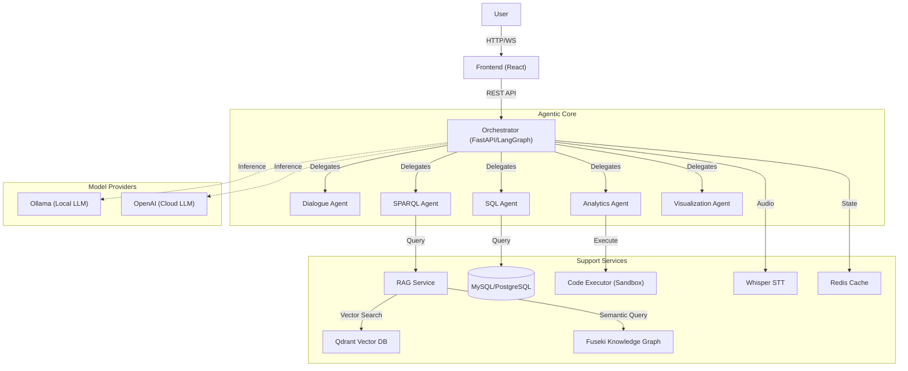

# System Architecture

**OntoSage 2.0** employs a modular, microservices-based architecture designed for scalability, flexibility, and robust agentic behavior. The system is orchestrated using **LangGraph** to manage state and interactions between specialized AI agents.

## High-Level Overview

The system follows a hub-and-spoke model where the **Orchestrator** serves as the central hub, coordinating requests from the **Frontend** and delegating tasks to specialized services and agents.

## Core Components

### 1. Orchestrator (The Brain)
- **Technology**: Python, FastAPI, LangGraph.
- **Role**: Manages the conversation flow, maintains context, and routes user intents to the appropriate agent.
- **Key Features**:
  - **Redis Caching**: Implements semantic caching for SPARQL and SQL queries (1-hour TTL) and persists conversation state.
  - **API Standardization**: All endpoints return a uniform JSON structure (`{ success, data, error }`).
- **Agents**:
  - **Dialogue Agent**: Handles general conversation and intent classification.
  - **SPARQL Agent**: Translates natural language to SPARQL queries for ontology interaction.
  - **SQL Agent**: Generates SQL queries for time-series data retrieval. **Hardened** to allow only `SELECT` statements and prevent injection.
  - **Analytics Agent**: Generates Python code to analyze data. Uses **Deterministic Templates** for common tasks to ensure reliability.
  - **Visualization Agent**: Creates Plotly charts for data visualization.

### 2. RAG Service (Knowledge Retrieval)
- **Technology**: Python, Qdrant, Sentence Transformers.
- **Role**: Provides semantic search capabilities over the building ontology and documentation. It retrieves relevant context to augment LLM responses.

### 3. Code Executor (Safe Execution)
- **Technology**: Python, Docker/Sandbox.
- **Role**: Executes Python code generated by the Analytics Agent in an isolated environment to prevent security risks. It returns the output (text or image) to the Orchestrator.

### 4. Whisper STT (Voice Interface)
- **Technology**: OpenAI Whisper (Local or Cloud).
- **Role**: Transcribes voice input from the frontend into text for the Orchestrator to process.

### 5. Frontend (User Interface)
- **Technology**: React 19, TypeScript, Tailwind CSS.
- **Role**: Provides a chat interface, 3D building visualization, and interactive charts. It communicates with the backend via REST APIs and WebSockets.

## Data Layer

- **Redis**: Stores conversation history and agent state for low-latency access.
- **Qdrant**: Vector database for storing embeddings of the ontology and documents.
- **Apache Jena Fuseki**: Stores the RDF Knowledge Graph (Ontology).
- **MySQL / PostgreSQL**: Stores structured building data (sensors, time-series telemetry).

## Deployment & Infrastructure

- **Docker Compose**: Orchestrates the containerized services.
- **Monitoring**: Prometheus collects metrics, and Grafana provides dashboards for system health and performance.
- **Model Serving**: 
  - **Local**: Ollama serves open-source models (e.g., Llama 3, Mistral) locally.
  - **Cloud**: Direct integration with OpenAI API for GPT-4 models.
