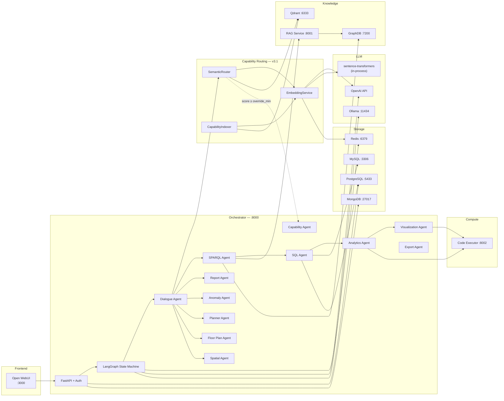

# System Architecture

OntoSage is built around three core ideas: **ontology-first knowledge representation**, **agentic pipeline execution**, and **zero-knowledge interaction**. This document describes every component, how they connect, and the key design decisions behind the architecture.

---

## High-Level Design

OntoSage follows a **hub-and-spoke** orchestration model. Every user request enters a single FastAPI application (the Orchestrator), which runs a **LangGraph state machine** that routes the request through a chain of specialised agents. No agent communicates directly with another; all coordination happens through shared state.

```
User → Open WebUI → Orchestrator (LangGraph) → [Agent Chain] → Response
                            ↕                         ↕
                          Redis                  GraphDB / MySQL / PostgreSQL
```

The design separates **knowledge** (what sensors exist, where they are, what relationships they have) from **data** (what values those sensors have recorded). Knowledge lives in GraphDB as an RDF ontology. Data lives in relational stores. The pipeline bridges them automatically.

---

## Component Map


```mermaid
graph LR
    subgraph "Frontend"
        OW["Open WebUI<br/>:3000"]
    end

    subgraph "Orchestrator — :8000"
        FW["FastAPI + Auth"]
        LG["LangGraph State Machine"]
        DA["Dialogue Agent"]
        CAPA["Capability Agent"]
        SPA["SPARQL Agent"]
        SQLA["SQL Agent"]
        ANA["Analytics Agent"]
        VISA["Visualization Agent"]
        REP["Report Agent"]
        ANO["Anomaly Agent"]
        PLA["Planner Agent"]
        EXP["Export Agent"]
        FPA["Floor Plan Agent"]
        SQA["Spatial Agent"]
    end

    subgraph "Capability Routing — v3.1"
        SR["SemanticRouter"]
        CI["CapabilityIndexer"]
        ES["EmbeddingService"]
    end

    subgraph "Knowledge"
        RAGS["RAG Service :8001"]
        GDB["GraphDB :7200"]
        QD["Qdrant :6333"]
    end

    subgraph "Storage"
        MySQL["MySQL :3306"]
        PG["PostgreSQL :5433"]
        Redis["Redis :6379"]
        Mongo["MongoDB :27017"]
    end

    subgraph "Compute"
        CE["Code Executor :8002"]
    end

    subgraph "LLM"
        OAI["OpenAI API"]
        OLL["Ollama :11434"]
        ST["sentence-transformers<br/>(in-process)"]
    end

    OW --> FW
    FW --> LG
    LG --> DA
    DA --> SR
    SR --> ES
    SR --> QD
    SR -. score ≥ override_min .-> CAPA
    CI --> ES
    CI --> QD
    ES --> OAI
    ES --> ST
    DA --> SPA
    DA --> REP
    DA --> ANO
    DA --> PLA
    DA --> FPA
    DA --> SQA
    SPA --> SQLA
    SQLA --> ANA
    ANA --> VISA
    SPA --> RAGS
    RAGS --> GDB
    SPA --> GDB
    SQLA --> MySQL
    SQLA --> PG
    ANA --> CE
    VISA --> CE
    LG --> Redis
    ES --> Redis
    FW --> PG
    FW --> Mongo
    LG --> OAI
    LG --> OLL
```

> **Capability routing pipeline (v3.1)** sits in front of the LLM intent classifier. At startup, `CapabilityIndexer` embeds the per-building `capability.yaml` into Qdrant. On every query, `SemanticRouter` probes that collection — if `score ≥ override_min`, the dialogue node skips the LLM intent call entirely and routes straight to `CapabilityAgent`. See [Capability Routing](CAPABILITY_ROUTING.md) for the full pipeline.

---

## The Orchestrator

**File:** `orchestrator/main.py`, `orchestrator/workflow.py`

The Orchestrator is the only service that users and the frontend interact with directly. It is responsible for:

- Accepting and validating all incoming requests (REST, WebSocket)
- Managing authentication and RBAC enforcement
- Maintaining conversation state in Redis
- Running the LangGraph agent pipeline
- Routing to the correct LLM provider

### FastAPI Application

The application is built with FastAPI and runs on port 8000. Key endpoint groups:

| Endpoint | Method | Purpose |
|---|---|---|
| `/health` | GET | Service health — returns status of all dependencies |
| `/chat` | POST | Single-turn chat request |
| `/ws/{session_id}` | WebSocket | Streaming multi-turn conversation |
| `/v1/chat/completions` | POST | OpenAI-compatible endpoint for Open WebUI |
| `/api/v1/buildings` | GET | List registered buildings |
| `/api/v1/sensors` | GET | Sensor discovery |
| `/docs` | GET | Interactive Swagger API documentation |

All data endpoints require authentication and enforce RBAC. The health endpoint is public and is used by Docker health checks and monitoring tools.

### Response Envelope

Every API response follows a consistent envelope:

```json
{
  "status": "success",
  "data": { ... },
  "trace_id": "4a7f2b1c-..."
}
```

On error:

```json
{
  "status": "error",
  "message": "Human-readable description of what went wrong",
  "trace_id": "4a7f2b1c-..."
}
```

Every request is assigned a `trace_id` at the middleware layer. This ID appears in all log lines for that request, enabling end-to-end distributed tracing.

---

## The LangGraph State Machine

**File:** `orchestrator/workflow.py`

The heart of OntoSage is a directed state graph built with LangGraph. Every node is a wrapped agent function. Every edge is a conditional routing decision.

### Graph Structure

```
START → dialogue → [conditional routing] → sparql / sql / analytics /
                                            report / anomaly / planner /
                                            export / visualization
                                          → response → END
```

The entry node is always `dialogue`. After intent classification, `_route_from_dialogue()` selects the next node. Most complex paths are chains: SPARQL → SQL → Analytics → Visualization → Response.

### Conversation State

All agents share a single `ConversationState` object (defined in `shared/models.py`). This is the only communication channel between nodes. Between turns it is persisted to a **two-tier memory**: Redis holds the recent state (count-bounded, no time-expiry by default) and PostgreSQL `turn_memory` holds per-turn summaries with forecast/analytics carry-forward — see [Conversation Intelligence](CONVERSATION_INTELLIGENCE.md).

```python
class ConversationState(BaseModel):
    conversation_id: str
    user_id: str
    building_id: Optional[str]
    messages: List[Message]
    intent: Optional[str]
    intermediate_results: Dict[str, Any]  # 16-field shared scratchpad
    # ... additional fields
```

The `intermediate_results` dict passes structured data between nodes. Reserved keys:

| Key | Set by | Read by |
|---|---|---|
| `intent` | Dialogue | Router, all agents |
| `entities` | Dialogue | SPARQL, SQL |
| `time_range` | Dialogue | SQL |
| `sparql_results` | SPARQL | SQL, Response |
| `uuids` | SPARQL | SQL |
| `sql_data` | SQL | Analytics |
| `analytics_output` | Analytics | Visualization, Response |
| `visualization_path` | Visualization | Response |
| `error` | `_safe_node` | Response |

### Safe Node Wrapper

Every node is wrapped with `_safe_node()`, which catches all exceptions, logs them with context (intent, conversation ID, node name), sets the `error` key in state, and returns state so the pipeline continues to the response node rather than crashing.

```python
workflow.add_node("sparql", self._safe_node(self._sparql_node, "sparql"))
```

---

## The Intent Types

The Dialogue Agent classifies every query into one of **22+ intent types**, defined in a YAML registry (`orchestrator/intents/intent_definitions.yaml`) and extensible per building without code changes. The routing decision is determined by the classified intent. For the `capability` intent the classifier may be bypassed entirely by the SemanticRouter fast-path (see [Capability Routing](CAPABILITY_ROUTING.md)). A context-dependent follow-up is first rewritten into a self-contained query (see [Conversation Intelligence](CONVERSATION_INTELLIGENCE.md)).

| Intent | Route | Description |
|---|---|---|
| `sensor_data` | sparql → sql → response | Current or recent sensor readings |
| `analytics` | sparql → sql → analytics → response | Statistical analysis, averages, trends |
| `discovery` | sparql → response | Explore available sensors, zones, devices |
| `report` | sparql → sql → report → response | Structured building report |
| `anomaly` | sparql → sql → anomaly → response | Out-of-range / spike detection |
| `comparison` | sparql → sql → analytics → response | Compare zones, devices, or time periods |
| `export` | sparql → sql → export → response | Download data as CSV / JSON / HTML |
| `recommend` | sparql → sql → response | HVAC, energy, and comfort recommendations |
| `planner` | planner → response | Multi-step orchestrated tasks |
| `trend` / `forecast` | sparql → sql → analytics → **forecast** → response | Temporal trends and forward projections — runs the [multi-model forecasting pipeline](FORECASTING.md) on forecast/predict queries |
| `compliance` | sparql → sql → analytics → response | ASHRAE / WELL / BREEAM standards checks |
| `floor_plan` | floor_plan → response | Show floor plan, locate a room, visual navigation |
| `spatial_query` | spatial_query → response | Area, adjacency, room counts, block/MEP queries |
| `capability` ⚡ | capability → response | **(v3.1)** Off-ontology Q&A (fire safety, amenities, policies). Sub-50 ms when router score ≥ override_min |
| `maintenance` / `complaint` / `safety_report` / `feedback` / `suggestion` | report_intake → response | **Unified report intake** — auto-classified, prioritised, persona-stamped, stored in `user_reports` |
| `control` | response | Not yet supported — informs the user |
| `general` / `greeting` | response | Greetings, general knowledge questions |
| `clarification` | response | Query too vague — asks follow-up question |
| `alert` | sparql → sql → anomaly → response | Threshold-based alerting |

---

## Agent Details

### Dialogue Agent

**File:** `orchestrator/agents/dialogue_agent.py`

The first node in every pipeline execution. Its responsibilities:

1. **Capability semantic probe (v3.1)** — Calls `SemanticRouter.classify()` BEFORE the LLM intent call. If `score ≥ override_min` (e.g. 0.60 for local MiniLM), the intent is set to `capability`, KB matches are stashed on `state.intermediate_results["capability_matches"]`, and the LLM call is **skipped entirely** (~600 ms saved). See [Capability Routing](CAPABILITY_ROUTING.md).
2. **Context retrieval** — Calls the RAG Service to fetch relevant ontology context (entity labels, types, triples) for the user's query
3. **Intent classification** — Sends the query + context to the LLM, receives a structured JSON response containing `intent`, `entities`, `time_range`, and other metadata
4. **Soft-override pass** — If the LLM picked a non-data intent but the router score is in `[threshold, override_min)`, route corrects to `capability` (medium-confidence band)
5. **Deterministic overrides** — Protective keyword rules for `compare`, `correlation`, `floor_plan` patterns the LLM occasionally misclassifies
6. **Redis caching** — Caches intent classification results by query hash (1-hour TTL) to avoid redundant LLM calls
7. **Response formatting** — For `general` and `clarification` intents, composes and returns the final response directly

The intent classification prompt includes persona-aware system messages that adapt the response style based on the inferred user role.

### Capability Agent (v3.1)

**File:** `orchestrator/agents/capability_agent.py`

Answers off-ontology questions — fire safety procedures, amenities, IT, accessibility, policies — that SPARQL and SQL cannot answer. Corpus analysis of 5,916 survey questions shows this stratum covers ~50% of real building queries (CAPABILITY 25.6%, OTHER 24.0%).

Pipeline:

1. Reads `state.intermediate_results["capability_matches"]` — pre-fetched by SemanticRouter inside the dialogue node (no second KB search)
2. Formats matched `CapabilityEntry` objects into a grounded response, citing source (e.g. `fire_safety_management_plan`)
3. Records provenance: `capability_kb` (hit), `kb_no_match` (router fired but no entries above threshold), or `no_kb` (building has no `capability.yaml`)
4. On a miss, returns an **explicit boundary message** with facility-management contact — never hallucinated answers

For the full pipeline (indexer, router, threshold bands, calibration, multi-intent extension), see [Capability Routing](CAPABILITY_ROUTING.md).

### SPARQL Agent

**File:** `orchestrator/agents/sparql_agent.py`

Responsible for translating classified intents into SPARQL queries against the GraphDB ontology.

Pipeline:

1. Calls RAG Service (`/graphdb/retrieve`) with the user's entities to get ontology context: prefixes, entity IRIs, nearby triples, labels
2. Constructs a SPARQL generation prompt with the retrieved context
3. Sends to LLM → receives a SPARQL query string
4. Validates SPARQL syntax; repairs common issues (missing prefixes, bad brackets)
5. Executes against GraphDB via HTTP POST
6. On empty results: triggers semantic fallback — reasons over retrieved triples directly
7. For analytics queries: extracts `uuid` values via `ashrae:hasExternalReference → ref:hasTimeseriesId` pattern

Required SPARQL prefixes are always included:

```sparql
PREFIX rdf:    <http://www.w3.org/1999/02/22-rdf-syntax-ns#>
PREFIX rdfs:   <http://www.w3.org/2000/01/rdf-schema#>
PREFIX brick:  <https://brickschema.org/schema/Brick#>
PREFIX bacnet: <http://data.ashrae.org/bacnet/#>
PREFIX s223:   <http://data.ashrae.org/standard223#>
```

### SQL Agent

**File:** `orchestrator/agents/sql_agent.py`

Fetches time-series sensor readings from the appropriate database backend.

- Reads `uuids` from `intermediate_results` (set by SPARQL Agent)
- Routes to the correct storage adapter based on building ID and `config/database_registry.yaml`
- Generates SQL queries that unpivot wide-format sensor tables (UUID columns, `Datetime` row index)
- Enforces SELECT-only validation — blocks `INSERT`, `UPDATE`, `DELETE`, `DROP`, `ALTER`, `CREATE`
- Applies time range filters from `intermediate_results["time_range"]`
- Returns up to 1,000 rows in standardised format: `[{timestamp, uuid, value}]`

### Analytics Agent

**File:** `orchestrator/agents/analytics_agent.py`

Generates Python analytics code and executes it in the Code Executor sandbox.

- Receives standardised sensor data from the SQL Agent
- Checks deterministic templates for common operations (min/max/avg/trend/latest/count)
- For complex queries: sends data shape + question to LLM, receives Python code
- Submits code to Code Executor via `POST /execute`
- Retries up to 3 times on error, passing the error back to the LLM for auto-correction
- Returns `formatted_response` (text summary) and optional plot file path
- Replaces UUID identifiers in output with human-readable sensor labels

### Forecast Agent

**File:** `orchestrator/agents/forecast_agent.py` · **Module:** `orchestrator/services/forecasting/`

Multi-model time-series forecasting, invoked inside the `trend` pipeline when the query carries forecast/predict intent.

- Preprocesses the fetched series (clean, resample, gap-fill)
- Parses the horizon from natural language (*"next week"* → N steps)
- Auto-selects among ARIMA, exponential smoothing, and linear models
- Reports accuracy (RMSE / R²) and emits `forecast_result {model, horizon, metrics, points}` for the Visualization Agent
- See the [Forecasting](FORECASTING.md) guide for the full pipeline

### Report-Intake Agent

**File:** `orchestrator/services/report_intake_service.py`

Handles the `maintenance` / `complaint` / `safety_report` / `feedback` / `suggestion` intents. Auto-classifies and prioritises the report (gas/fire → URGENT), stamps it with the user's persona, persists it to the `user_reports` table, and returns a tracking ID.

### Visualization Agent

**File:** `orchestrator/agents/visualization_agent.py`

Generates and renders charts when explicitly requested or when analytics didn't produce a plot.

- Supports: line, bar, scatter, histogram, heatmap, pie, box charts
- Sends chart specification to LLM, receives matplotlib/plotly code
- Executes via Code Executor
- Returns base64-encoded image embedded in the response, plus a plain-text description

### Report Agent

**File:** `orchestrator/agents/report_agent.py`

Generates structured narrative reports combining metadata, sensor readings, and statistical summaries.

- Detects report type from query (summary, energy, comfort, maintenance, weekly)
- Fetches sensor data and computes descriptive statistics
- Calls LLM to produce prose narrative with section headings
- Returns a formatted markdown document

### Anomaly Agent

**File:** `orchestrator/agents/anomaly_agent.py`

Detects out-of-range readings using three complementary methods:

1. **Threshold detection** — Compares values against comfort range (temperature: 18–26°C, CO₂: 400–1000 ppm, etc.)
2. **Z-score detection** — Flags readings more than N standard deviations from the mean
3. **Spike detection** — Identifies rapid consecutive changes (configurable derivative threshold)

Anomalies from all three methods are merged and deduplicated. A narrative summary is generated by the LLM.

### Planner Agent

**File:** `orchestrator/agents/planner_agent.py`

Handles complex multi-step queries by decomposing them into an ordered execution plan.

- Sends the user query to the LLM with a list of available agents
- Receives a structured `ExecutionPlan` (list of `PlanStep` objects, each specifying an agent and parameters)
- Executes steps sequentially, passing results forward
- Falls back to a minimal default plan if LLM planning fails

### Export Agent

Routes to the `export` node when intent is `export`. Generates structured outputs in the user's requested format (CSV, JSON, HTML, Markdown) from the SQL data.

---

## RAG Service

**File:** `rag-service/graphdbRAG/`  
**Port:** 8001

The RAG (Retrieval Augmented Generation) Service is a standalone FastAPI application that bridges the SPARQL Agent with the GraphDB knowledge graph.

### How It Works

When a user asks about "temperature in Zone 5", the system needs to know what the correct RDF entity URI is for "Zone 5" and which sensor types measure temperature. The RAG Service answers this:

1. **Query cleaning** — Normalises the user's natural language query
2. **Vector similarity search** — Uses GraphDB's built-in Similarity Plugin to find ontology entities whose textual representation (label + type name + entity name) matches the query
3. **Graph traversal** — Follows RDF edges up to N hops from each matched entity, collecting nearby triples
4. **Context assembly** — Returns `prefixes`, `entities`, `triples`, `labels`, `summary`, and metadata counts

The SPARQL Agent uses this context to write accurate, schema-aware SPARQL queries without needing to know the ontology structure in advance.

### API

```
POST /graphdb/retrieve
{
  "query": "temperature sensors in zone 5",
  "top_k": 10,
  "hops": 2,
  "min_score": 0.5
}
```

Response:
```json
{
  "prefixes": "PREFIX brick: <...>",
  "entities": ["http://building.org/Zone_5_01", ...],
  "triples": ["<Zone_5_01> a brick:HVAC_Zone .", ...],
  "labels": {"Zone_5_01": "Zone 5.01"},
  "summary": "Found 3 entities related to temperature in Zone 5...",
  "metadata": {"entity_count": 3, "triple_count": 47}
}
```

---

## Multi-Building Storage Adapters

**File:** `orchestrator/services/adapters/`  
**Config:** `config/database_registry.yaml`

OntoSage supports multiple buildings, each with its own database backend. The `AdapterRegistry` maps `building_id` to the correct storage adapter at startup.

### Supported Backends

| Adapter | Technology | Use Case |
|---|---|---|
| `MySQLAdapter` | MySQL / MariaDB | Traditional BMS sensor databases |
| `PostgreSQLAdapter` | PostgreSQL | Modern building data platforms |
| `TimescaleDBAdapter` | TimescaleDB | High-frequency sensor data (extends PostgreSQL) |
| `InfluxDBAdapter` | InfluxDB | IoT platforms, energy meters |
| `MongoDBAdapter` | MongoDB | Flexible schema sensor stores |
| `SQLiteAdapter` | SQLite | Development, single-building prototypes |
| `CassandraAdapter` | Apache Cassandra | Large-scale distributed sensor networks |
| `RedisTimeSeriesAdapter` | Redis TimeSeries | Real-time streaming data |

All adapters implement the same async interface:

```python
async def fetch(self, uuids: List[str], start: datetime, end: datetime) -> Dict
async def health_check(self) -> bool
```

This means the SQL Agent never needs to know which backend it is querying.

### Registry Configuration

`config/database_registry.yaml`:
```yaml
buildings:
  bldg1:
    adapter: mysql
    host: mysql-bldg1
    port: 3306
    database: sensor_data
    table: sensor_readings
  bldg2:
    adapter: timescaledb
    host: timescale-bldg2
    port: 5432
    database: telemetry
    table: measurements
```

---

## Authentication and RBAC

**File:** `orchestrator/auth_manager.py`, `orchestrator/middleware/rbac.py`

### Authentication

Passwords are hashed with **Argon2id** (winner of the Password Hashing Competition). Legacy SHA-256 hashes are transparently migrated to Argon2id on first successful login.

Sessions are 32-byte cryptographically random tokens stored in Redis with a **7-day TTL**. Every API request must present this token in the `Authorization: Bearer <token>` header.

### Role-Based Access Control

Six roles are defined, each with a specific permission set:

| Role | Typical User | Key Permissions |
|---|---|---|
| `admin` | System administrator | All 20 permissions |
| `facility_manager` | Facilities team | sensor:read, analytics:read, report:read, config:read, building:read |
| `analyst` | Data scientist | sensor:read, analytics:read, export:read, trend:read |
| `operator` | BMS operator | sensor:read, anomaly:read, alert:read, config:read |
| `occupant` | Building user | sensor:read (limited), metadata:read |
| `readonly` | Guest / unauthenticated | metadata:read, system:health only |

The `require_permission()` FastAPI dependency enforces permissions at the endpoint level. Attempting to access a resource without the required permission returns HTTP 403.

---

## GraphDB Knowledge Graph

GraphDB is the semantic backbone of OntoSage. It stores the building ontology as RDF triples and provides:

- **SPARQL endpoint** at `http://localhost:7200/repositories/{repo}`
- **Similarity Plugin** for vector-based entity search over ontology text
- **REST API** for repository management

### Supported Ontology Schemas

| Schema | Namespace | Use |
|---|---|---|
| Brick Schema | `https://brickschema.org/schema/Brick#` | Primary — sensors, equipment, locations |
| ASHRAE 223 | `http://data.ashrae.org/standard223#` | External references, time-series links |
| BACnet | `http://data.ashrae.org/bacnet/#` | Device identifiers |
| RealEstateCore | `https://w3id.org/rec/` | Real estate-focused building models |

### Linking Ontology to Time-Series

The critical pattern that enables sensor data retrieval:

```turtle
:Air_Temperature_Sensor_5_01
    a brick:Air_Temperature_Sensor ;
    rdfs:label "Air Temperature Sensor 5.01" ;
    brick:isPartOf :Zone_5_01 ;
    ashrae:hasExternalReference [
        ref:hasTimeseriesId "uuid-abc-123-def" ;
        ref:storedAt "mysql"
    ] .
```

The SPARQL Agent always queries for `ref:hasTimeseriesId` values when analytics are needed. This UUID is the column name in the MySQL sensor table.

---

## Data Flow Summary

```
User query
    │
    ▼
Dialogue Agent
    ├─ Retrieve RAG context from GraphDB similarity index
    ├─ Classify intent (1 of 14 types)
    ├─ Extract entities and time range
    └─ Route to appropriate agent chain
         │
         ▼
SPARQL Agent (if metadata/analytics intent)
    ├─ Build SPARQL using RAG context
    ├─ Execute against GraphDB
    ├─ Extract sensor UUIDs and storage backend
    └─ Pass to SQL Agent
         │
         ▼
SQL Agent (if analytics needed)
    ├─ Route to correct storage adapter
    ├─ Query time-series data by UUID
    ├─ Validate and sanitise SQL
    └─ Return standardised [{timestamp, uuid, value}]
         │
         ▼
Analytics / Report / Anomaly Agent
    ├─ Generate Python code or apply template
    ├─ Execute in Code Executor sandbox
    ├─ Retry on error (up to 3 times)
    └─ Produce text summary + optional plot
         │
         ▼
Visualization Agent (if plot requested)
    ├─ Generate chart code
    ├─ Execute in sandbox
    └─ Return base64 image
         │
         ▼
Response Node
    ├─ Merge results from all agents
    ├─ Replace UUIDs with human-readable labels
    ├─ Format persona-aware markdown response
    └─ Attach media (charts, exports)
         │
         ▼
User receives answer
```

---

## LLM Provider Abstraction

**File:** `orchestrator/llm_manager.py`

The `LLMManager` class abstracts all LLM calls. The active provider is selected by the `MODEL_PROVIDER` environment variable:

| Value | Provider | Default Model | Notes |
|---|---|---|---|
| `openai` | OpenAI API | `gpt-4o-mini` | Requires `OPENAI_API_KEY` |
| `local` | Ollama | `deepseek-r1:32b` | Requires GPU; runs entirely offline |
| `cloud` | Ollama Cloud | configurable | Managed Ollama hosting |

All agents call `llm_manager.generate(prompt)` — they are completely unaware of which provider is active. Switching providers requires only changing the `MODEL_PROVIDER` environment variable and restarting the orchestrator.

---

## Caching Strategy

**File:** `orchestrator/services/` (Redis integration throughout)

Redis is used for three distinct caching layers:

| Layer | Key | TTL | Benefit |
|---|---|---|---|
| **Conversation state** | `conversation:{conversation_id}` | none (count-bounded) | Recent turns + carry-forward; trimmed to `CONVERSATION_MAX_MESSAGES`, no time-expiry by default |
| **Response cache** | `resp_cache:*` | 1 hour | Skips repeat LLM calls for identical queries |
| **SPARQL results** | `sparql:{hash(query+entities)}` | 1 hour | Skips GraphDB query for identical requests |
| **Session tokens** | `session:{token}` | 7 days | Authentication state |

Cache hits are logged with `[cache_hit]` markers, visible in the orchestrator logs.

---

## Code Executor Sandbox

**File:** `code-executor/sandbox.py`  
**Port:** 8002

The Analytics and Visualization agents generate Python code dynamically. This code is executed in an isolated container environment with:

- **No network access** — Cannot make outbound HTTP calls
- **Read-only filesystem** — Except for the `/outputs` volume
- **CPU and memory limits** — Enforced by Docker resource constraints
- **Allowed libraries only** — pandas, numpy, matplotlib, seaborn, plotly, scipy
- **Execution timeout** — Configurable, default 30 seconds

The API is simple:

```
POST /execute
{ "code": "import pandas as pd\nprint(pd.Series([1,2,3]).mean())" }
```

Response:
```json
{
  "stdout": "2.0\n",
  "stderr": "",
  "success": true,
  "plots": []
}
```

---

## Monitoring and Observability

Every component exposes structured logging with:
- Trace IDs on every request
- Node entry/exit logging with intent and conversation context
- Cache hit/miss markers
- Timing information for LLM calls and database queries

For production deployments, Prometheus metrics and Grafana dashboards are available via the `--profile monitoring` Docker Compose profile. See the [Runbook](RUNBOOK.md) for configuration details.
