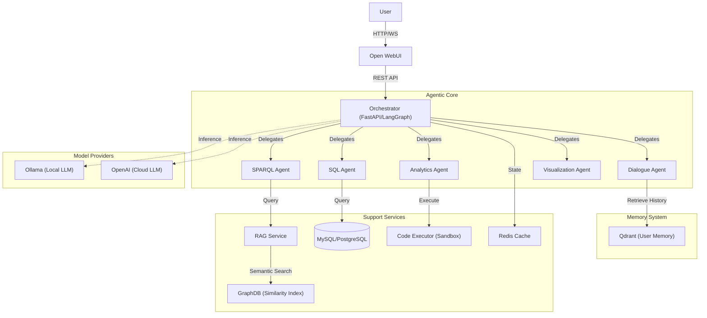

# System Architecture

**OntoSage** employs a modular, microservices-based architecture designed for **Easy-Deploy** scalability and **Zero-Knowledge** interaction. The system is orchestrated using **LangGraph** to manage state and interactions between specialized AI agents, enabling it to adapt to **persona-agnostic multi-objective goals**.

## High-Level Overview

The system follows a hub-and-spoke model where the **Orchestrator** serves as the central cognitive hub, coordinating requests from the **Open WebUI** and delegating tasks to specialized services and agents.

```mermaid
graph TD
    User[User] -->|HTTP/WS| Frontend["Open WebUI"]
    Frontend -->|REST API| Orchestrator["Orchestrator (FastAPI/LangGraph)"]
    
    subgraph "Agentic Core"
        Orchestrator -->|Delegates| DialogueAgent["Dialogue Agent"]
        Orchestrator -->|Delegates| SPARQLAgent["SPARQL Agent"]
        Orchestrator -->|Delegates| SQLAgent["SQL Agent"]
        Orchestrator -->|Delegates| AnalyticsAgent["Analytics Agent"]
        Orchestrator -->|Delegates| VisAgent["Visualization Agent"]
    end
    
    subgraph "Memory System"
        DialogueAgent -->|Retrieve History| Qdrant["Qdrant (User Memory)"]
    end

    subgraph "Support Services"
        SPARQLAgent -->|Query| RAGService["RAG Service"]
        RAGService -->|Semantic Search| GraphDB["GraphDB (Similarity Index)"]
        
        SQLAgent -->|Query| SQLDB[("MySQL/PostgreSQL")]
        
        AnalyticsAgent -->|Execute| CodeExecutor["Code Executor (Sandbox)"]
        
        Orchestrator -->|State| Redis["Redis Cache"]
    end
    
    subgraph "Model Providers"
        Orchestrator -.->|Inference| Ollama["Ollama (Local LLM)"]
        Orchestrator -.->|Inference| OpenAI["OpenAI (Cloud LLM)"]
    end
```

## Core Components

### 1. Orchestrator (The Cognitive Brain)
- **Technology**: Python, FastAPI, LangGraph.
- **Role**: Manages the conversation flow, maintains context, and routes user intents to the appropriate agent. It implements the **Zero-Knowledge** logic by translating vague user requests into specific technical actions.
- **Key Features**:
  - **Memory Management**: Queries **Qdrant** to retrieve relevant past conversation history, ensuring continuity across sessions.
  - **Redis Caching**: Implements semantic caching for SPARQL and SQL queries (1-hour TTL) and persists active conversation state.
  - **API Standardization**: All endpoints return a uniform JSON structure (`{ success, data, error }`).
- **Agents**:
  - **Dialogue Agent**: Handles general conversation, intent classification, and memory retrieval.
  - **SPARQL Agent**: Translates natural language to SPARQL queries for ontology interaction.
  - **SQL Agent**: Generates SQL queries for time-series data retrieval. **Hardened** to allow only `SELECT` statements and prevent injection.
  - **Analytics Agent**: Generates Python code to analyze data. Uses **Deterministic Templates** for common tasks to ensure reliability.
  - **Visualization Agent**: Creates Plotly charts for data visualization.

### 2. RAG Service (GraphDB Native)
- **Technology**: Python, GraphDB Similarity Index.
- **Role**: Provides semantic search capabilities over the building ontology.
- **Mechanism**: Instead of using an external vector DB for documents, it leverages **GraphDB's internal Similarity Indexing**. This allows it to find ontology entities (e.g., `brick:Temperature_Sensor`) that are semantically similar to user terms (e.g., "heat detector") directly within the Knowledge Graph.

### 3. Qdrant (Long-Term Memory)
- **Technology**: Qdrant Vector Database.
- **Role**: Stores vector embeddings of **User Conversation History**.
- **Usage**: When a user sends a new request, the system searches Qdrant for similar past interactions to provide context-aware responses (e.g., remembering that the user previously asked about "Room 101").

### 4. Code Executor (Safe Execution)
- **Technology**: Python, Docker/Sandbox.
- **Role**: Executes Python code generated by the Analytics Agent in an isolated environment to prevent security risks. It returns the output (text or image) to the Orchestrator.

### 5. Open WebUI (Multimodal Interface)
- **Technology**: Svelte, Python.
- **Role**: Provides a rich chat interface with integrated voice support (STT/TTS), markdown rendering, and interactive chart display. It communicates with the backend via REST APIs.

## Data Layer

- **Redis**: Stores active conversation state and agent scratchpads.
- **Qdrant**: Stores long-term user conversation history.
- **GraphDB**: Stores the RDF Knowledge Graph (Ontology) and handles Semantic Similarity Search.
- **MySQL / PostgreSQL**: Stores structured building data (sensors, time-series telemetry).

## Deployment & Infrastructure

- **Docker Compose**: Orchestrates the containerized services for an **Easy-Deploy** experience.
- **Monitoring**: Prometheus collects metrics, and Grafana provides dashboards for system health and performance.
- **Model Serving**: 
  - **Local**: Ollama serves open-source models (e.g., DeepSeek-R1, Llama 3) locally for privacy.
  - **Cloud**: Direct integration with OpenAI API for GPT-4 models.
