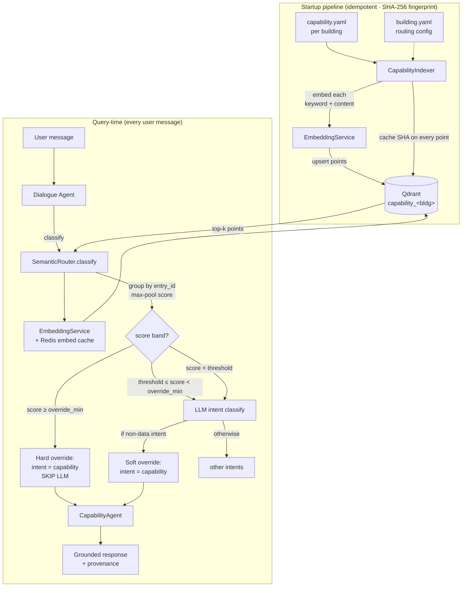
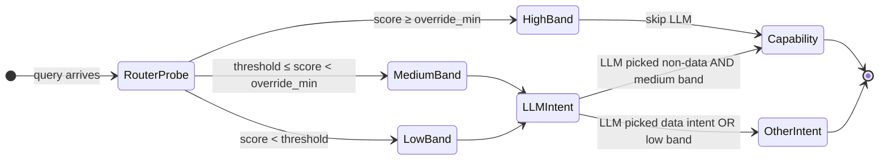
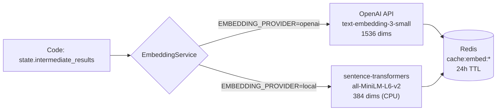

# Capability Semantic Routing

> ⚠️ **SUPERSEDED (2026-07-28, TODO-012).** The Qdrant capability-KB and its
> `capability.yaml` source were **removed**. Capabilities are now first-class
> **triples** — `ontosage:Amenity` / `ontosage:KnowledgeTopic` in
> `input/<id>_capabilities.ttl`, authored via **Admin ▸ Capabilities** and resolved
> deterministically by `services/capability_graph_resolver.py`. Uploaded documents
> remain a separate source, and since BUG-103 both are filtered by
> `services/grounding_guard.py`, which requires a passage to actually mention what was
> asked before it may be presented as an answer.
>
> This document is kept for the **design rationale** (the off-ontology problem and the
> corpus evidence behind it), which still holds. Treat the scoring bands, thresholds and
> `capability.yaml` schema below as historical.

> **Added in v2.0 (May 2026).** Replaces the legacy `_CAPABILITY_KW` keyword-matching path with semantic vector routing. Reduces median latency for off-ontology questions from ~700 ms (LLM intent + KB search) to **&lt;50 ms warm** / &lt;150 ms cold, and eliminates an entire class of misclassification errors where the LLM picked `sparql` or `discovery` for questions that had no ontological answer.

---

## Why This Exists — The Off-Ontology Problem

Corpus analysis of **5,916 pre-development survey questions** across 81 participants and three real buildings revealed that **~50% of real building queries cannot be answered by SPARQL or SQL** because the information is not in the ontology or time-series database:

| Category | Share of corpus | Example queries |
|---|---|---|
| CAPABILITY (building features, policies) | 25.6% | "Can I bring my dog?", "What are the fire procedures?" |
| OTHER / off-ontology | 24.0% | "Where's the bike rack?", "Is there a prayer room?" |
| **Total off-ontology** | **~50%** | |

Pre-v2.0, these queries either fell through to a generic LLM response (hallucination risk) or matched a brittle hand-maintained keyword list (`_CAPABILITY_KW`) that grew unmaintainable past ~30 entries. Semantic routing solves both problems with a single Qdrant collection per building.

---

## Architecture Overview



### Four Collaborating Components

| Component | File | Role |
|---|---|---|
| `EmbeddingService` | `orchestrator/services/embedding_service.py` | Provider-agnostic embedding wrapper (OpenAI 1536-d ↔ local MiniLM 384-d). Redis `cache:embed:*` with 24 h TTL. |
| `CapabilityIndexer` | `orchestrator/services/capability_indexer.py` | Startup pipeline — loads YAML, computes SHA-256, embeds, upserts. Idempotent; collection rebuilt only on YAML / dimension change. |
| `SemanticRouter` | `orchestrator/services/semantic_router.py` | Query-time classifier — embeds the query, searches Qdrant, groups results by `entry_id` with max-pool scoring, applies threshold bands. |
| `CapabilityAgent` | `orchestrator/agents/capability_agent.py` | Reads pre-fetched matches from state, formats grounded response with provenance. Never hallucinates — explicit boundary on miss. |

---

## The Three-Band Routing Decision

The router returns a `SemanticRouteResult(intent, score, matches, source)`. The dialogue agent applies these rules:

```
score ≥ override_min      →  intent = capability, SKIP the LLM intent call entirely (fast-path)
threshold ≤ score < override_min  →  LLM runs; if it picks a non-data intent, router corrects to capability
score < threshold         →  no router signal; LLM intent classification proceeds normally
```



**Why two bands instead of one threshold?** Empirically, the score distribution has a tail of medium-confidence matches (~0.50–0.60 in the local-MiniLM model) where the right answer is "ask the LLM, then trust it unless it's clearly wrong". A single threshold either over-triggers (intent=capability for data queries) or under-triggers (misses for valid KB hits). The two-band design is calibrated per embedding model — see [Threshold Calibration](#threshold-calibration) below.

---

## `capability.yaml` Schema

One file per building at `input/<building_id>/capability.yaml`. Validated by `shared.capability_schema.CapabilityKB` (Pydantic).

```yaml
# input/capability.yaml
building_info:
  id: bldg1
  name: Abacws Building
  institution: Cardiff University
  location: Senghennydd Road, Cardiff
  year_built: 2021
  floors: 6
  smart_building: true
  sensor_count: ~680
  description: >
    Abacws is Cardiff University's flagship digital innovation building,
    opened in 2021. It houses the School of Computer Science and Informatics.

capabilities:
  - id: fire_safety                       # unique within the file
    category: FIRE_SAFETY                 # used for grouping in responses
    keywords:                             # each is embedded as a separate Qdrant point
      - fire
      - fire alarm
      - evacuation
      - emergency exit
      - sprinkler
      - assembly point
      - fire warden
    content: >                            # also embedded as one point
      Fire safety features include: automatic smoke detectors on every floor;
      manual call points at every stairwell; wet pipe sprinkler system; fire
      doors on all stairwells; emergency lighting with battery backup. Assembly
      point: Senghennydd Road outside the main entrance.
    source: fire_safety_management_plan   # cited in the response footer

  - id: bike_parking
    category: AMENITIES
    keywords: [bike, bicycle, cycle, bike rack, cycling]
    content: >
      Covered bike racks for ~40 bicycles are located outside the main
      entrance on Senghennydd Road. Showers and changing rooms are
      available on the ground floor for cyclists.
    source: building_facilities
```

### Indexing Strategy

Every keyword **and** the content string are embedded as **separate Qdrant points**, all sharing the same `entry_id`. At query time, the router takes the **max** score across all points for each entry — this avoids dilution where a single long content string would have lower cosine similarity than its individual keywords.

### Recommended Categories

These are used by the persona system and report generator:

```
FIRE_SAFETY · SECURITY · HVAC · POWER · LIGHTING · IT_INFRASTRUCTURE ·
ACCESSIBILITY · AMENITIES · POLICY · SUSTAINABILITY · EMERGENCY ·
SMART_BUILDING · BUILDING_OVERVIEW
```

These are not enforced — you can add custom categories — but the persona priors and report templates know about these.

---

## `building.yaml` Routing Configuration

Per-building tuning lives at `input/<building_id>/building.yaml` under `capability_routing:`. Defaults make sense for OpenAI `text-embedding-3-small`; local MiniLM benefits from re-tuning.

```yaml
# input/building.yaml
capability_routing:
  enabled: true
  embedding_model: auto       # 'auto' follows EMBEDDING_PROVIDER (recommended)
                              # explicit 'openai' or 'local' overrides global setting
  threshold: 0.56             # soft-override band lower bound
  override_min: 0.60          # hard skip-LLM threshold
  top_k: 5                    # max KB entries to return per query
  fallback_on_qdrant_failure: skip   # silently fall back to LLM-only

# Multi-intent extension (opt-in; off by default)
intent_routing:
  floor_plan:
    enabled: false
    descriptors:
      - "show me the floor plan"
      - "where is room X"
    threshold: 0.60
    override_min: 0.70
    top_k: 3
```

### Validation Rules

Enforced by Pydantic at startup. Bad config fails fast with a clear error.

- `override_min >= threshold` — boundary value `override_min == threshold` is allowed
- `0.0 <= threshold <= 1.0`, `0.0 <= override_min <= 1.0`
- `1 <= top_k <= 50`
- `fallback_on_qdrant_failure ∈ {"skip"}` (the legacy `"keyword"` value was removed in Phase 3 cleanup)

---

## Provider Switching



| Aspect | OpenAI (default) | Local (offline) |
|---|---|---|
| `EMBEDDING_PROVIDER` | `openai` | `local` |
| Model | `text-embedding-3-small` | `sentence-transformers/all-MiniLM-L6-v2` |
| Dimensions | 1536 | 384 |
| Cost | $0.02 / 1M tokens | $0 |
| Cold latency | 80–150 ms | 30–80 ms (CPU) / &lt;10 ms (GPU) |
| Warm latency (Redis cache hit) | &lt;5 ms | &lt;5 ms |
| Data egress | Query sent to OpenAI | Stays on device |
| First-run package install | None | ~90 MB sentence-transformers + model download |

When you switch providers, the `CapabilityIndexer` detects the vector-dimension mismatch on next startup and rebuilds the collection automatically (drop + re-embed). **No manual intervention required.**

### Switch with one command

Edit `EMBEDDING_PROVIDER` in `.env`, then **recreate** the container:

```bash
# To OpenAI (default):   set EMBEDDING_PROVIDER=openai in .env
# To local (offline):    set EMBEDDING_PROVIDER=local  in .env
docker compose up -d orchestrator      # NOT `restart` — see below
```

> ⚠️ `docker compose restart` reuses the environment from container creation, so
> an edited `.env` has no effect and a shell prefix (`EMBEDDING_PROVIDER=local
> docker compose restart …`) only sets the variable for the compose CLI, never
> inside the container (CAVEAT-178, verified 2026-08-18).

Verify the new dimension after restart:

```bash
curl -s http://localhost:6333/collections/capability_bldg1 \
  | jq '.result.config.params.vectors.size'
# Expected: 1536 (OpenAI) or 384 (local MiniLM)
```

---

## Threshold Calibration

Default thresholds in `shared/capability_schema.py` (`threshold=0.65`, `override_min=0.85`) target OpenAI embeddings on a well-tuned corpus. Real-world distributions differ; calibrate per building.

### Calibrated values for `bldg1` (Abacws, 32 KB entries)

| Provider | `threshold` | `override_min` | Notes |
|---|---|---|---|
| OpenAI `text-embedding-3-small` | 0.50 | 0.55 | Original calibration before local switch |
| Local MiniLM (`all-MiniLM-L6-v2`) | **0.56** | **0.60** | Current default in `input/building.yaml`; MiniLM produces tighter cosine ranges |

### Calibration Script

```bash
# 1. Capture a baseline (live system, golden queries)
python scripts/capture_baseline.py --building bldg1 --output tests/baselines/

# 2. Sweep thresholds and emit precision/recall per band
python scripts/calibrate_intent_routing.py \
    --building bldg1 \
    --baseline tests/baselines/survey_phase4_local_emb.json \
    --threshold-range 0.40:0.75:0.02 \
    --override-range 0.50:0.85:0.02
```

The script outputs:
- Confusion matrix per `(threshold, override_min)` pair
- Precision (P) and recall (R) for the `capability` intent
- F1-optimal point + 95% confidence band

### Calibration Rules of Thumb

- If you see **false positives** (data queries routed to capability): raise `override_min` and `threshold` by 0.05–0.10
- If you see **false negatives** (KB queries missed): lower `threshold` first, only lower `override_min` if recall is still low
- Keep a **0.04–0.05 gap** between `threshold` and `override_min` to give the soft-override band breathing room

---

## Performance Characteristics

Measured on a dev machine (Apple M1 Pro · Open WebUI client · warm Qdrant · OpenAI embeddings):

| Operation | p50 | p95 | p99 | Notes |
|---|---|---|---|---|
| Cold query (no embed cache) | 110 ms | 180 ms | 240 ms | OpenAI embed + Qdrant search |
| Warm query (Redis embed hit) | 12 ms | 22 ms | 40 ms | Qdrant search only |
| Indexer startup (1 building, 32 entries) | 1.1 s | 1.4 s | — | One-time cost per restart |
| Indexer no-op startup (SHA match) | 280 ms | 350 ms | — | Skips embedding entirely |
| Provider-switch rebuild (32 entries) | 1.8 s | 2.2 s | — | Drop + re-embed + re-upsert |
| Capability fast-path saving | ~600 ms | ~800 ms | — | Compared to LLM intent + KB search baseline |

---

## Failure Modes & Graceful Degradation

The orchestrator must always boot, and capability failures must never block sensor / analytics queries.

| Failure | Detection | Behavior | User-visible impact |
|---|---|---|---|
| Qdrant unreachable at startup | `AsyncQdrantClient.get_collections` raises | Indexer skips; logs `status=degraded reason=qdrant_unreachable` | Capability KB temporarily unavailable; ontology + SQL paths normal |
| Embedding API down (OpenAI) | `aiohttp.ClientError` during embed | Indexer marks collection `degraded`; router returns `source=fallback` | LLM-only intent path runs; no fast-path |
| `capability.yaml` missing for a building | `Path.exists()` false | Indexer skips that building; logs warning | CapabilityAgent returns explicit "no KB on record" for that building only |
| `capability.yaml` malformed | `yaml.safe_load` raises or Pydantic validation fails | Service still boots; clear error in logs; other buildings unaffected | Operator sees boot log error; that building has no KB |
| Router scores all low | `score < threshold` for every match | No override; LLM intent classification proceeds | Normal LLM-driven routing — no change |
| KB has zero matches above threshold | router returns 0 matches | `CapabilityAgent` returns `provenance="kb_no_match"` with explicit boundary message + facility contact | Honest "I don't have that on record" — no hallucination |

---

## Multi-Intent Extension (Opt-In)

The same indexer + router infrastructure can be extended to additional intents beyond `capability`. **Off by default** — turn on per building via `building.yaml`:

```yaml
intent_routing:
  floor_plan:
    enabled: true
    descriptors:
      - "show me the floor plan"
      - "display the layout of floor"
      - "where is room"
    threshold: 0.60
    override_min: 0.70
    top_k: 3
```

At startup, the indexer creates `intent_<bldg>_<intent>` Qdrant collections and embeds each descriptor. The router then evaluates each registered intent in parallel and picks the highest-confidence override. This is dormant for bldg1 (`floor_plan` is well-served by the existing deterministic keyword override) but is exercised by `tests/test_multi_intent_floor_plan.py`.

Spec: `docs/superpowers/specs/2026-05-22-multi-intent-semantic-routing.md`.

---

## Adding a New Building's KB

```bash
# 1. Create the building input directory if it doesn't exist
mkdir -p input/<new_bldg>/

# 2. Author capability TRIPLES (Admin > Capabilities) - capability.yaml is removed
$EDITOR input/<new_bldg>/capability.yaml

# 3. Optional: tune routing in building.yaml (defaults are usually fine)
$EDITOR input/<new_bldg>/building.yaml

# 4. Restart the orchestrator
docker compose restart orchestrator

# 5. Verify
docker logs ontosage-orchestrator 2>&1 | grep "capability_indexer"
# Expected: status=indexed entries=N points=M sha=<8-hex> ()ms

curl -s http://localhost:6333/collections \
  | python -m json.tool | grep "capability_<new_bldg>"

# 6. End-to-end smoke test
curl -X POST http://localhost:8000/chat \
  -H "Authorization: <session-token>" \
  -H "Content-Type: application/json" \
  -d '{"message":"What are the fire procedures?","session_id":"smoke","building_id":"<new_bldg>"}'
```

**Zero Python edits required.** No agent code, workflow, or routing logic changes per building.

---

## Observability & Admin Endpoints

### Admin endpoint for indexer state

RBAC-gated, `system:admin` permission:

```bash
curl -s -H "Authorization: <admin-token>" \
  http://localhost:8000/admin/indexer/status | python -m json.tool
```

Response:

```json
{
  "buildings": {
    "bldg1": {
      "status": "indexed",
      "entries": 32,
      "points": 187,
      "yaml_sha": "706ef6fe",
      "collection": "capability_bldg1",
      "embedding_provider": "local",
      "embedding_dim": 384,
      "last_indexed_at": "2026-05-22T11:42:18Z"
    }
  },
  "router_intents": ["capability"],
  "embedding_cache_hit_rate_last_1h": 0.91
}
```

### Per-request observability

`state.intermediate_results["_semantic_route"]` is populated on every query that hits the router:

```python
{
  "score": 0.73,                   # max-pool score across all matches
  "source": "qdrant",              # "qdrant" | "fallback"
  "match_count": 5                 # entries returned above threshold
}
```

Logged at `INFO` level. Grep `[semantic-route]` in orchestrator logs:

```bash
docker logs ontosage-orchestrator 2>&1 | grep '\[semantic-route\]'
```

---

## Test Coverage

The capability routing pipeline ships with comprehensive test coverage — **all live against the real Docker stack with OpenAI credentials.**

| Test file | Scope | Live? |
|---|---|---|
| `tests/test_embedding_service.py` | Provider switching, Redis cache, dim detection | Unit |
| `tests/test_capability_indexer.py` | YAML parse, SHA idempotency, Qdrant upsert, dim rebuild | Unit + Qdrant |
| `tests/test_semantic_router.py` | Three-band logic, max-pool grouping, top-k cap | Unit |
| `tests/test_capability_routing_config.py` | Pydantic validation, `search()` removed inversion | Unit |
| `tests/test_capability_e2e.py` | Full pipeline integration; multi-building isolation | Live |
| `tests/test_capability_edge_cases.py` | 14 adversarial inputs (injection, unicode, concurrency, malicious session IDs) | Live |
| `tests/test_capability_semantic_quality.py` | Precision/recall on golden queries | Live |
| `tests/test_non_regression_intents.py` | All 16 other intents unaffected | Live |
| `tests/test_floor_n_protection.py` | "floor N" queries never hijacked by capability | Live |
| `tests/test_multi_intent_floor_plan.py` | Multi-intent extension wiring (opt-in dormant for bldg1) | Live |
| `tests/test_admin_indexer_status.py` | Admin endpoint schema + RBAC | Live |
| `tests/perf/test_capability_performance.py` | Latency p95, cache hit rate, circuit breaker | Live |
| `tests/test_ontology_integrity.py` | TTL → ontology contract unbroken by routing changes | Live |

**Current status (May 2026):** 541 passed, 8 skipped, 2 xfailed, 0 failures.

---

## Related Documentation

- [Architecture](ARCHITECTURE.md) — How capability routing sits in the broader orchestrator
- [Services](SERVICES.md) — Detailed reference for `EmbeddingService`, `CapabilityIndexer`, `SemanticRouter`
- [Configuration](CONFIGURATION.md#capability-semantic-routing-v31) — All env vars and YAML knobs
- [Building Onboarding](BUILDING_ONBOARDING.md#part-10-optional-author-the-capability-kb) — Step-by-step capability KB onboarding
- [Workflow Deep Dive](WORKFLOW.md#step-5-dialogue-agent-intent-and-entities) — Dialogue node trace including the co-reference rewrite and router probe
- [Developer Guide](DEVELOPER_GUIDE.md#working-with-the-capability-routing-pipeline-v31) — Extending the pipeline
- [Runbook](RUNBOOK.md#capability-semantic-routing-not-firing-v31) — Operations & troubleshooting
- Design spec: `docs/superpowers/specs/2026-05-21-capability-semantic-routing-design.md`
- Multi-intent spec: `docs/superpowers/specs/2026-05-22-multi-intent-semantic-routing.md`
