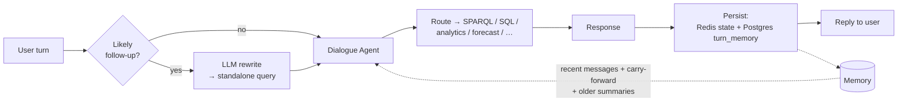

# Conversation Intelligence

OntoSage holds a coherent, multi-turn conversation. Two mechanisms make that possible:

1. **Conversation memory** — what was said and computed in earlier turns is remembered and reused.
2. **Follow-up co-reference resolution** — a context-dependent follow-up ("and what about humidity *there*?") is rewritten into a self-contained question before the system tries to answer it.

Together they let any user talk to the building the way they would talk to a colleague — without repeating context every turn.

---

## Why it matters

Without conversation intelligence, every question must be fully self-contained:

> ❌ *"What is the average temperature on floor 3?"* → *"What is the average humidity on floor 3?"* (the user must restate "floor 3")

With it, the natural phrasing works:

> ✅ *"What is the average temperature on floor 3?"* → *"and what about humidity **there**?"* (OntoSage resolves "there" → floor 3)

---

## Per-turn lifecycle

Two cross-cutting layers wrap the agent pipeline on every turn:



- **Before the Dialogue Agent** — co-reference resolution (see below).
- **After the Response** — the turn is persisted to short-term (Redis) and long-term (Postgres) memory, and the next turn reads it back.

---

## Conversation memory

Two complementary stores keep a conversation coherent:

| Layer | Store | Holds | Eviction |
|---|---|---|---|
| **Short-term** | Redis `conversation:<id>` | The full conversation state — messages + `intermediate_results` | **Count-based** — trimmed to `CONVERSATION_MAX_MESSAGES` (default 20). `CONVERSATION_TTL=0` ⇒ **no time-expiry** by default |
| **Long-term** | PostgreSQL `turn_memory` | One row per turn: `user_query`, `intent`, `entities`, a deterministic one-line `result_summary` (no raw sensor arrays), and `carry_forward` | Persistent |

!!! note "Count-based eviction, not a TTL"
    Earlier versions expired conversation state after one hour. OntoSage now **bounds the stored Redis blob by message count** and, by default, never time-expires it (`CONVERSATION_TTL=0`). Set `CONVERSATION_TTL` to a positive number of seconds to re-enable time-based expiry.

### Carry-forward

When a turn produces a forecast or analytics artifact, it is stored on the turn and **re-injected on the next turn**, so chained requests work:

> *"Forecast CO₂ for next week"* → *"now plot that"* → the visualization node reuses the previous `forecast_result`.

Only safe, structured artifacts are carried forward (`forecast_result`, `analytics_result`) — never raw multi-thousand-row series.

### Long-term context injection

Beyond the recent window, `TurnMemoryService.get_older_context()` prepends compact one-line summaries of earlier turns as a system-context prefix, giving the model long-term recall without resending the entire transcript.

---

## Follow-up co-reference resolution

This is the industry-standard **"condense question"** technique — the same approach used by modern conversational RAG systems — applied with a cheap gate so the extra LLM call only runs when it is likely worth it.

```
Turn 1:  "what is the average temperature on floor 3"
Turn 2:  "and what about humidity there"
                                   ▲ "there" = floor 3
         rewritten → "what is the average humidity on floor 3"
```

| Stage | Mechanism |
|---|---|
| **Gate** (zero-LLM) | Fires only when the turn is a *likely* follow-up: a short query (≤4 words) **or** it contains deictic/anaphoric markers (`there`, `that`, `the same`, a leading `and`/`what about`, …). A self-contained question skips the rewrite entirely. |
| **Rewrite** | A fast LLM resolves the reference against the last few turns and returns a standalone query. **Graceful** — on any error it returns the original; it also **no-ops** when the query is already self-contained. |
| **Apply** | The standalone query replaces the working message *before* intent classification, so entity extraction **and** the downstream SPARQL/SQL stages all resolve the reference. The original wording is preserved for transparency. |

!!! tip "Conservative by design"
    A false positive only costs one fast-LLM call (the rewrite no-ops), while the gate avoids spending that call on the majority of self-contained questions. Worst case is *"no worse than before"* — a bad rewrite never blocks the answer.

Disable with `COREFERENCE_REWRITE_ENABLED=false` to fall back to per-turn-only understanding.

---

## Configuration

| Variable | Default | Effect |
|---|---|---|
| `CONVERSATION_TTL` | `0` | Redis conversation-state TTL in seconds. `0` = no time-expiry (count-bounded instead). |
| `CONVERSATION_MAX_MESSAGES` | `20` | Max messages retained in the Redis conversation blob. |
| `MAX_CONVERSATION_HISTORY` | `20` | Max prior turns injected into the LLM context. |
| `COREFERENCE_REWRITE_ENABLED` | `true` | Enable the gated follow-up co-reference rewrite. |

See the [Configuration](CONFIGURATION.md) guide for the full surface.

---

## Operational notes

- **Endpoint scope.** The long-term `turn_memory` carry-forward and older-context injection run on the OpenWebUI-facing `/v1/chat/completions` path. The native `/chat` endpoint persists Redis state but is the lighter path.
- **Privacy.** `turn_memory` stores a deterministic one-line summary per turn — never raw sensor arrays — keeping the table compact and free of bulk telemetry.
- **Inspecting memory.** The Redis key `conversation:<id>` holds the live state; the Postgres `turn_memory` table holds the durable per-turn history.
