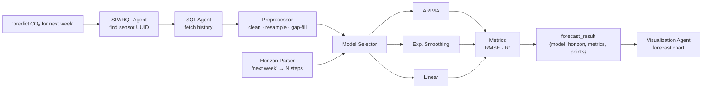

# Forecasting

OntoSage answers forward-looking questions — *"predict CO₂ for next week"*, *"what will the temperature trend be?"* — with a multi-model time-series forecasting pipeline that selects the best model for the data, parses the horizon from natural language, and reports its own accuracy.

---

## When it runs

Forecasting is part of the **`trend`** intent pipeline. A `trend` query flows through the normal data path (`sparql → sql → analytics`); when the query also carries forecast/predict intent, the analytics stage hands the fetched series to the **Forecast Agent** instead of plain aggregation.

---

## Pipeline stages

| Stage | Module | Responsibility |
|---|---|---|
| **Preprocess** | `services/forecasting/preprocessor.py` | Clean the raw series, resample to a regular cadence, handle gaps/outliers |
| **Parse horizon** | `services/forecasting/horizon_parser.py` | Turn natural-language horizons (*"next week"*, *"3 days"*) into a concrete number of forecast steps |
| **Select model** | `services/forecasting/model_selector.py` | Choose the model best suited to the series' characteristics |
| **Forecast** | `services/forecasting/models/` | ARIMA, exponential smoothing, and linear forecasters |
| **Score** | `services/forecasting/metrics.py` | Report accuracy — RMSE and R² — so the answer is honest about its confidence |
| **Format & chart** | `agents/forecast_agent.py` → Visualization Agent | Produce `forecast_result` and render the forecast plot |

---

## Models

| Model | Best for |
|---|---|
| **ARIMA** | Series with autocorrelation / trend + short-term structure |
| **Exponential smoothing (ETS)** | Level/trend/seasonality with smooth dynamics |
| **Linear** | Simple, near-monotonic trends; a robust, cheap fallback |

The **model selector** picks among these automatically; the chosen model and its accuracy metrics are returned with the answer, so the user sees *which* model produced the forecast and *how well* it fit.

---

## What the user gets

A forecast turn returns a `forecast_result` containing the selected `model`, the resolved `horizon`, accuracy `metrics` (`rmse`, `r2`), and the forecast `points` — rendered as a chart by the visualization node. Because the result is kept in [conversation memory](CONVERSATION_INTELLIGENCE.md), a follow-up like *"now show that as a table"* reuses it without recomputing.

!!! note "Honest confidence"
    Forecasts always carry their RMSE/R². A low-confidence fit is reported as such rather than presented as certainty — consistent with OntoSage's "honest boundaries" principle.

---

## Related

- [Conversation Intelligence](CONVERSATION_INTELLIGENCE.md) — how forecast artifacts carry forward across turns
- [Workflow Deep Dive](WORKFLOW.md) — the full request trace
- [Services](SERVICES.md) — where the Forecast Agent sits among the services
