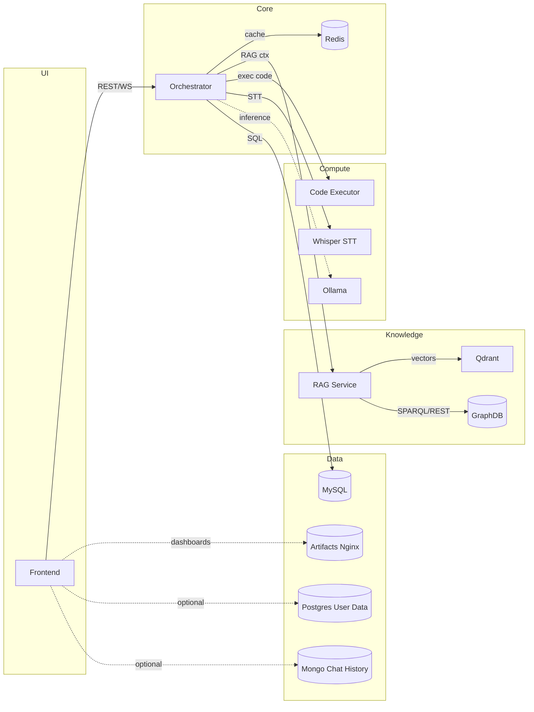

# Service Catalog

This document describes every service in OntoSage 2.0, including responsibilities, ports, environment, health checks, dependencies, and interactions.

## Overview Diagram



---

## Orchestrator (FastAPI + LangGraph)
- Port: `8000`
- Image/Build: `orchestrator/Dockerfile`
- Mounts: `./orchestrator`, `./shared` (hot reload), `./data/bldg1`, `./outputs/query_results`
- Env (key): `REDIS_HOST`, `RAG_SERVICE_HOST`, `CODE_EXECUTOR_HOST`, `WHISPER_STT_HOST`, `GRAPHDB_HOST`, `MYSQL_HOST`, model provider vars
- Health: `GET /health`
- Depends: `redis`, `graphdb-rag-service`, `code-executor`, `graphdb`, `mysql`, `ollama`
- Duties:
  - Conversation state and tool routing
  - Agent graph (Dialogue, SPARQL, SQL, Analytics, Visualization)
  - Provider abstraction (Ollama/OpenAI)
  - OpenAI-compatible `/v1` proxy (when enabled)
  - **API Standardization**: All endpoints return:
    ```json
    {
      "success": true,
      "data": { ... },
      "error": null,
      "meta": null
    }
    ```

## RAG Service (GraphDB + Qdrant)
- Port: `8001`
- Image/Build: `rag-service/graphdbRAG/Dockerfile`
- Env (key): `GRAPHDB_REPOSITORY`, `GRAPHDB_SIMILARITY_INDEX`
- Health: `GET /health`
- Depends: `graphdb`
- Duties:
  - Chunking and embedding ontology/documents
  - Vector search in Qdrant; optional GraphDB similarity index
  - Returns citations and entity IDs for grounding answers

## GraphDB
- Ports: `7200` (HTTP), `7300` (gRPC) [bound to localhost]
- Volumes: `./volumes/graphdb:/opt/graphdb/home`, `./data/bldg1/trial/dataset:/opt/graphdb/import:ro`
- Env: `GDB_HEAP_SIZE`, `GDB_MAX_MEM`
- Health: `GET /rest/repositories`
- Duties: Ontology repository and SPARQL endpoint for building knowledge

## Qdrant
- Ports: `6333` (HTTP), `6334` (gRPC)
- Volume: `./volumes/qdrant:/qdrant/storage`
- Health: `GET /health`
- Duties: Vector embeddings store for RAG

## Code Executor
- Port: `8002`
- Build: `code-executor/Dockerfile`
- Env: from `.env` (timeout/limits via shared config)
- Health: `GET /health`
- Duties: Sandboxed Python execution of Analytics Agent code

## Whisper STT
- Port: host `8003` -> container `10300`
- Image: `lscr.io/linuxserver/faster-whisper`
- Env: `WHISPER_MODEL`, `WHISPER_BEAM`, `WHISPER_LANG`
- Health: `GET /health` on `10300`
- Duties: Audio transcription

## Ollama (Local LLM)
- Port: host `11435` -> container `11434`
- Volume: `./volumes/ollama:/root/.ollama`
- Health: `ollama list`
- Duties: Local model serving (e.g., `deepseek-r1:32b`)

## Redis (Memory Store)
- Port: `6379`
- Volume: `./volumes/redis`
- Command: `--appendonly yes --maxmemory 2gb --maxmemory-policy allkeys-lru`
- Health: `redis-cli ping`
- Duties: Conversation and agent state

## MySQL (Sensor Time-Series)
- Port: host `3307` -> container `3306`
- Volume: `mysql-data:/var/lib/mysql` (external)
- Health: `mysqladmin ping`
- Duties: Historical telemetry, sensor UUID mappings

## Postgres (User Data)
- Port: host `5433` -> container `5432`
- Volume: `./volumes/postgres-user-data`
- Health: `pg_isready`
- Duties: User chat history, UI data (optional)

## Mongo (Chat History)
- Port: `27017`
- Volume: `./volumes/mongo`
- Health: `mongosh db.adminCommand('ping')`
- Duties: Chat/session data for legacy UI and integrations

## Abacws API & Visualiser (Legacy/Integration)
- API Port: `5000`; Visualiser Port: `8090`
- Build: `Abacws/api` and `Abacws/visualiser`
- Duties: 3D digital twin and REST backend used by visualiser

## File Server (Artifacts)
- Port: `8080`
- Volume: `./volumes/artifacts`
- Duties: Serve generated plots/images/artifacts via static hosting

## Monitoring (Optional)
- Prometheus: `9090`; Grafana: `3001`
- Duties: Metrics collection and dashboards (enable with `--profile monitoring`)
