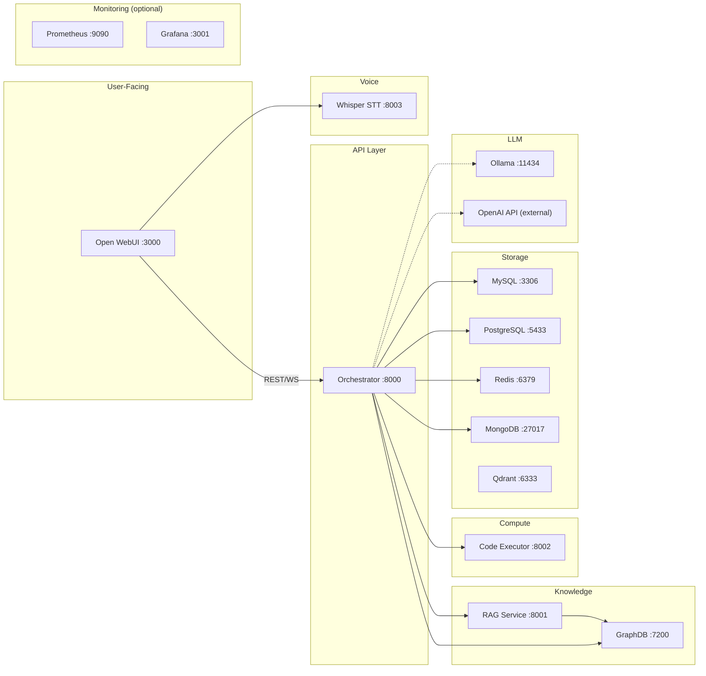

# Service Catalog

Complete reference for every service in the OntoSage stack: ports, environment variables, health checks, dependencies, volumes, and runtime responsibilities.

---

## Service Overview


```mermaid
graph LR
    subgraph "User-Facing"
        OW["Open WebUI :3000"]
    end

    subgraph "API Layer"
        ORCH["Orchestrator :8000"]
    end

    subgraph "Knowledge"
        RAGS["RAG Service :8001"]
        GDB["GraphDB :7200"]
    end

    subgraph "Compute"
        CE["Code Executor :8002"]
    end

    subgraph "Storage"
        MYSQL["MySQL :3306"]
        PG["PostgreSQL :5433"]
        REDIS["Redis :6379"]
        MONGO["MongoDB :27017"]
        QDRANT["Qdrant :6333"]
    end

    subgraph "LLM"
        OLLA["Ollama :11434"]
        OAI["OpenAI API (external)"]
    end

    subgraph "Voice"
        WHISP["Whisper STT :8003"]
    end

    subgraph "Monitoring (optional)"
        PROM["Prometheus :9090"]
        GRAF["Grafana :3001"]
    end

    OW -->|REST/WS| ORCH
    ORCH --> RAGS
    RAGS --> GDB
    ORCH --> GDB
    ORCH --> CE
    ORCH --> MYSQL
    ORCH --> PG
    ORCH --> REDIS
    ORCH --> MONGO
    ORCH -.-> OLLA
    ORCH -.-> OAI
    OW --> WHISP
```

---

## Orchestrator

| Property | Value |
|---|---|
| **Container name** | `ontosage-orchestrator` |
| **Port** | `8000` |
| **Build context** | `./orchestrator` |
| **Dockerfile** | `orchestrator/Dockerfile` |
| **Health check** | `GET http://localhost:8000/health` |

### Responsibilities

- Hosts the LangGraph agent state machine
- Validates and routes all incoming requests
- Enforces authentication (Argon2id sessions) and RBAC (6 roles, 20 permissions)
- Coordinates the 14-intent pipeline across 9 specialised agents
- Manages conversation state in Redis (1-hour TTL)
- Provides OpenAI-compatible `/v1/chat/completions` endpoint for Open WebUI
- Switches transparently between OpenAI and Ollama based on `MODEL_PROVIDER`

### Key Environment Variables

| Variable | Default | Description |
|---|---|---|
| `MODEL_PROVIDER` | `openai` | `openai` \| `local` \| `cloud` |
| `OPENAI_API_KEY` | — | Required when `MODEL_PROVIDER=openai` |
| `OPENAI_MODEL` | `gpt-4o-mini` | OpenAI model name |
| `OLLAMA_BASE_URL` | `http://ollama:11434` | Ollama endpoint |
| `OLLAMA_MODEL` | `deepseek-r1:32b` | Local model name |
| `REDIS_HOST` | `redis` | Redis hostname |
| `REDIS_PORT` | `6379` | Redis port |
| `GRAPHDB_HOST` | `graphdb` | GraphDB hostname |
| `GRAPHDB_PORT` | `7200` | GraphDB port |
| `GRAPHDB_REPOSITORY` | `ontosage` | Repository name |
| `RAG_SERVICE_HOST` | `rag-service` | RAG Service hostname |
| `RAG_SERVICE_PORT` | `8001` | RAG Service port |
| `CODE_EXECUTOR_HOST` | `code-executor` | Code Executor hostname |
| `CODE_EXECUTOR_PORT` | `8002` | Code Executor port |
| `MYSQL_HOST` | `mysql` | MySQL hostname |
| `MYSQL_PORT` | `3306` | MySQL port |
| `POSTGRES_HOST` | `postgres` | PostgreSQL hostname |
| `POSTGRES_PORT` | `5432` | PostgreSQL port (internal) |
| `MONGODB_HOST` | `mongo` | MongoDB hostname |
| `BUILDING_CONFIG_FILE` | `config/building_config.yaml` | Building registry path |

### Volumes

| Host path | Container path | Purpose |
|---|---|---|
| `./orchestrator` | `/app/orchestrator` | Source (hot reload in dev) |
| `./shared` | `/app/shared` | Shared models and config |
| `./config` | `/app/config` | Building registry YAML |
| `./outputs` | `/app/outputs` | Generated plots and exports |

### API Endpoints (key)

| Endpoint | Method | Auth required | Permission |
|---|---|---|---|
| `/health` | GET | No | — |
| `/chat` | POST | Yes | `sensor:read` |
| `/ws/{session_id}` | WebSocket | Yes | `sensor:read` |
| `/v1/chat/completions` | POST | Yes | `sensor:read` |
| `/api/v1/buildings` | GET | Yes | `building:read` |
| `/api/v1/buildings/{id}/sensors` | GET | Yes | `sensor:read` |
| `/auth/login` | POST | No | — |
| `/auth/logout` | POST | Yes | — |
| `/auth/register` | POST | No | — |
| `/docs` | GET | No | — |

---

## Open WebUI

| Property | Value |
|---|---|
| **Container name** | `open-webui` |
| **Port** | `3000` (host) → `8080` (container) |
| **Image** | `ghcr.io/open-webui/open-webui:0.8.3` |
| **Health check** | `GET http://localhost:3000` |

### Responsibilities

- Provides the chat interface accessible at `http://localhost:3000`
- Handles Speech-to-Text via Whisper integration
- Renders markdown, code blocks, and embedded charts from the orchestrator
- Manages user sessions and conversation history in its own storage
- Connects to the orchestrator's OpenAI-compatible endpoint

### Key Environment Variables

| Variable | Value | Description |
|---|---|---|
| `OPENAI_API_BASE_URL` | `http://ontosage-orchestrator:8000/v1` | Points Open WebUI at the orchestrator |
| `OPENAI_API_KEY` | `sk-ontobot-pipeline` | Internal API key (not OpenAI's) |
| `OLLAMA_BASE_URL` | `http://ollama:11434` | Ollama endpoint (for local mode) |
| `WEBUI_URL` | `http://localhost:3000` | Public URL of the WebUI |
| `ENABLE_WEBSOCKET_SUPPORT` | `true` | Enable streaming responses |

### Volume

| Host path | Container path | Purpose |
|---|---|---|
| `./volumes/open-webui` | `/app/backend/data` | User accounts, conversation history |

---

## RAG Service

| Property | Value |
|---|---|
| **Container name** | `graphdb-rag-service` |
| **Port** | `8001` |
| **Build context** | `./rag-service/graphdbRAG` |
| **Health check** | `GET http://localhost:8001/health` |
| **Depends on** | `graphdb` |

### Responsibilities

- Provides semantic entity search over the building ontology
- Uses GraphDB's built-in Similarity Plugin — no external vector database required
- Returns entity IRIs, surrounding triples, and human-readable labels
- Grounds LLM prompts with accurate ontology context to prevent hallucination

### Key Environment Variables

| Variable | Default | Description |
|---|---|---|
| `GRAPHDB_HOST` | `graphdb` | GraphDB hostname |
| `GRAPHDB_PORT` | `7200` | GraphDB port |
| `GRAPHDB_REPOSITORY` | `ontosage` | Repository to query |
| `GRAPHDB_SIMILARITY_INDEX` | `bldg_index` | Similarity index name |

### API Endpoints

| Endpoint | Method | Description |
|---|---|---|
| `/health` | GET | Service health |
| `/graphdb/retrieve` | POST | Semantic entity retrieval |

**Retrieve request body:**
```json
{
  "query": "temperature sensors in zone 5",
  "top_k": 10,
  "hops": 2,
  "min_score": 0.5
}
```

**Retrieve response:**
```json
{
  "prefixes": "PREFIX brick: <...>\nPREFIX rdfs: <...>",
  "entities": ["http://building.org/Temp_Sensor_5_01"],
  "triples": ["<Temp_Sensor_5_01> a brick:Air_Temperature_Sensor ."],
  "labels": {"Temp_Sensor_5_01": "Air Temperature Sensor 5.01"},
  "summary": "Found 3 temperature sensors in Zone 5...",
  "metadata": {"entity_count": 3, "triple_count": 47}
}
```

---

## GraphDB

| Property | Value |
|---|---|
| **Container name** | `graphdb` |
| **Ports** | `7200` (HTTP), `7300` (gRPC — bound to localhost) |
| **Image** | `ontotext/graphdb:10.x` |
| **Health check** | `GET http://localhost:7200/rest/repositories` |

### Responsibilities

- Stores the building ontology as RDF triples (Turtle format)
- Hosts the Similarity Plugin for vector-based entity search
- Executes SPARQL queries from the SPARQL Agent
- Provides the REST API and web workbench

### Key Environment Variables

| Variable | Default | Description |
|---|---|---|
| `GDB_HEAP_SIZE` | `4g` | Java heap size |
| `GDB_MAX_MEM` | `6g` | Maximum JVM memory |

### Volume

| Host path | Container path | Purpose |
|---|---|---|
| `./volumes/graphdb` | `/opt/graphdb/home` | Persistent ontology and index storage |
| `./data/bldg1/trial/dataset` | `/opt/graphdb/import:ro` | Building ontology files (read-only) |

### Web Workbench

Access at `http://localhost:7200`. The workbench provides:
- Repository management (create, configure, import)
- SPARQL query editor
- Similarity index management
- Visual graph explorer

### SPARQL Endpoint

```bash
# Query via curl
curl -X POST http://localhost:7200/repositories/ontosage/sparql \
  -H "Content-Type: application/sparql-query" \
  -H "Accept: application/sparql-results+json" \
  -d "SELECT ?s ?p ?o WHERE { ?s ?p ?o } LIMIT 10"
```

---

## Code Executor

| Property | Value |
|---|---|
| **Container name** | `code-executor` |
| **Port** | `8002` |
| **Build context** | `./code-executor` |
| **Health check** | `GET http://localhost:8002/health` |

### Responsibilities

- Executes Python code generated by Analytics and Visualization agents
- Enforces strict resource limits (CPU, memory, time)
- Blocks all network access from executed code
- Provides read/write access only to the `/outputs` volume
- Supports chart generation (matplotlib, seaborn, plotly)

### Security Constraints

| Constraint | Value |
|---|---|
| Network access | None (isolated) |
| Filesystem write | `/outputs` only |
| Filesystem read | `/data` (read-only) |
| CPU limit | 1 core |
| Memory limit | 512 MB |
| Execution timeout | 30 seconds |
| Allowed libraries | pandas, numpy, matplotlib, seaborn, plotly, scipy, sklearn |

### API

```
POST /execute
Content-Type: application/json

{
  "code": "import pandas as pd\nprint(pd.Series([1,2,3]).mean())"
}
```

Response:
```json
{
  "stdout": "2.0\n",
  "stderr": "",
  "success": true,
  "plots": []
}
```

If the code generates a plot with `plt.savefig("output.png")`, the response includes:
```json
{
  "plots": ["output.png"]
}
```

---

## Redis

| Property | Value |
|---|---|
| **Container name** | `redis` |
| **Port** | `6379` |
| **Image** | `redis:7-alpine` |
| **Health check** | `redis-cli ping` |
| **Command** | `--appendonly yes --maxmemory 2gb --maxmemory-policy allkeys-lru` |

### Responsibilities

- Stores conversation state (1-hour TTL per session)
- Caches intent classification results (1-hour TTL)
- Caches SPARQL generation results (1-hour TTL)
- Stores authenticated session tokens (7-day TTL)

### Volume

| Host path | Container path | Purpose |
|---|---|---|
| `redis-data` (named) | `/data` | Persistent cache (survives restart) |

### Key Prefixes

| Key pattern | TTL | Content |
|---|---|---|
| `conv:{conversation_id}` | 1 hour | `ConversationState` JSON |
| `intent:{query_hash}` | 1 hour | Intent classification result |
| `sparql:{query_hash}` | 1 hour | Generated SPARQL query |
| `session:{token}` | 7 days | Session metadata (user_id, role) |

---

## MySQL

| Property | Value |
|---|---|
| **Container name** | `mysql` (or external host) |
| **Port** | `3306` |
| **Image** | `mysql:8.0` |
| **Health check** | `mysqladmin ping -h localhost` |

### Responsibilities

- Primary time-series store for Building 1 sensor data
- Wide-table format: `Datetime` column + one column per sensor UUID
- Queried via `MySQLAdapter` using `aiomysql` (async)

### Table Schema (expected)

```sql
CREATE TABLE sensor_readings (
    Datetime DATETIME NOT NULL,
    `{uuid-1}` FLOAT,
    `{uuid-2}` FLOAT,
    -- ... one column per sensor UUID
    PRIMARY KEY (Datetime)
);
```

The column name is the sensor UUID as stored in the ontology (`ref:hasTimeseriesId`).

### Volume

| Name | Purpose |
|---|---|
| `mysql-data` (external) | Sensor time-series data (pre-existing, shared with other containers) |

---

## PostgreSQL

| Property | Value |
|---|---|
| **Container name** | `postgres-user-data` |
| **Port** | `5433` (host) → `5432` (container) |
| **Image** | `postgres:16-alpine` |
| **Health check** | `pg_isready -U postgres` |

### Responsibilities

- Stores user accounts, passwords (Argon2id hashed), and roles
- Provides the RBAC data store
- Stores long-term conversation history (as complement to Redis ephemeral state)
- Used by Open WebUI for user account persistence

### Volume

| Host path | Container path | Purpose |
|---|---|---|
| `postgres-user-data` (named) | `/var/lib/postgresql/data` | User and session data |

---

## MongoDB

| Property | Value |
|---|---|
| **Container name** | `mongo` |
| **Port** | `27017` |
| **Image** | `mongo:7` |
| **Health check** | `mongosh --eval "db.adminCommand('ping')"` |

### Responsibilities

- Stores full chat history for Open WebUI conversations
- Provides durable message history that persists beyond Redis TTL
- Used as a fallback long-term store for conversation archives

### Volume

| Name | Purpose |
|---|---|
| `mongo-data` (named) | Chat history persistence |

---

## Qdrant

| Property | Value |
|---|---|
| **Container name** | `qdrant` |
| **Ports** | `6333` (HTTP), `6334` (gRPC) |
| **Image** | `qdrant/qdrant:latest` |
| **Health check** | `GET http://localhost:6333/health` |

### Responsibilities

- Provides vector similarity search for agent memory
- Available for future embedding workflows
- Current RAG operates on GraphDB's native similarity index; Qdrant is available for extended use cases

### Volume

| Host path | Container path | Purpose |
|---|---|---|
| `qdrant-data` (named) | `/qdrant/storage` | Vector index storage |

---

## Whisper STT

| Property | Value |
|---|---|
| **Container name** | `whisper-stt` |
| **Port** | `8003` (host) → `10300` (container) |
| **Image** | `lscr.io/linuxserver/faster-whisper` |
| **Health check** | `GET http://localhost:10300/health` |

### Responsibilities

- Transcribes voice input from the Open WebUI microphone
- Runs Faster-Whisper locally — no cloud transcription, no audio data leaves the server
- Configurable model size (tiny to large) and language

### Key Environment Variables

| Variable | Default | Description |
|---|---|---|
| `WHISPER_MODEL` | `base` | Model size: `tiny-int8`, `base`, `small-int8`, `medium`, `large` |
| `WHISPER_BEAM` | `1` | Beam size (1=fast, 5=accurate) |
| `WHISPER_LANG` | `en` | Language code |

---

## Ollama (Local LLM — Optional)

| Property | Value |
|---|---|
| **Container name** | `ollama-deepseek-r1` |
| **Port** | `11435` (host) → `11434` (container) |
| **Image** | `ollama/ollama:latest` |
| **Profile** | `local-gpu` (not in default stack) |
| **Health check** | `ollama list` |

### Responsibilities

- Serves local LLM inference when `MODEL_PROVIDER=local`
- Keeps the model loaded in VRAM for 24 hours (`OLLAMA_KEEP_ALIVE=24h`)
- Provides 100% offline operation — no data leaves the server

### Key Environment Variables

| Variable | Default | Description |
|---|---|---|
| `OLLAMA_MODEL` | `deepseek-r1:32b` | Model to serve |
| `OLLAMA_NUM_CTX` | `4096` | Context window size |
| `OLLAMA_GPU_LAYERS` | `-1` | GPU layers (-1 = all) |
| `OLLAMA_NUM_PARALLEL` | `1` | Parallel inference requests |
| `OLLAMA_KEEP_ALIVE` | `24h` | Model VRAM retention |

### Volume

| Host path | Container path | Purpose |
|---|---|---|
| `./volumes/ollama` | `/root/.ollama` | Downloaded model weights |

> **Note:** Ollama requires an NVIDIA GPU with the NVIDIA Container Toolkit installed. See [Deployment Guide](DEPLOYMENT.md) for GPU setup instructions.

---

## Monitoring Services (Optional)

Started with `docker-compose --profile monitoring up -d`.

### Prometheus

| Property | Value |
|---|---|
| **Port** | `9090` |
| **Profile** | `monitoring` |

Scrapes metrics from the orchestrator and other services. Configured via `./config/prometheus.yml`.

### Grafana

| Property | Value |
|---|---|
| **Port** | `3001` |
| **Profile** | `monitoring` |

Provides dashboards for:
- Request rate and latency by intent type
- Agent execution time breakdown
- Cache hit/miss rates
- Error rates by service
- LLM token usage (when using OpenAI)

Access at `http://localhost:3001` (default login: `admin` / `admin`).

---

## Port Reference

| Port | Service | Protocol |
|---|---|---|
| `3000` | Open WebUI | HTTP |
| `3001` | Grafana | HTTP |
| `6333` | Qdrant | HTTP |
| `6334` | Qdrant | gRPC |
| `6379` | Redis | TCP |
| `7200` | GraphDB | HTTP |
| `7300` | GraphDB | gRPC |
| `8000` | Orchestrator | HTTP |
| `8001` | RAG Service | HTTP |
| `8002` | Code Executor | HTTP |
| `8003` | Whisper STT | HTTP |
| `9090` | Prometheus | HTTP |
| `11434` | Ollama | HTTP |
| `27017` | MongoDB | TCP |
| `3306` | MySQL | TCP |
| `5433` | PostgreSQL | TCP |

---

## Docker Networks

| Network | Type | Connected services |
|---|---|---|
| `ontobot-agentic` | Internal bridge | All OntoSage services |
| `ontobot-network` | External | Connects to pre-existing MySQL/sensor network |

Internal services communicate by container name (e.g., `http://graphdb:7200`). Only the ports listed above are exposed to the host.
