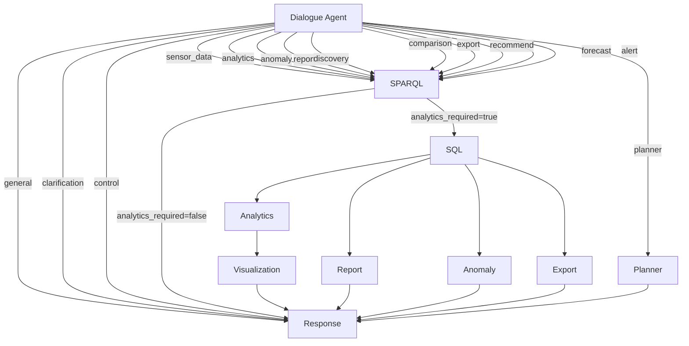

# Workflow Deep Dive

This document traces every step of a request through OntoSage — from the moment a user presses Enter to the moment an answer appears. Understanding this pipeline is essential for debugging, extending the system, or simply understanding why the system behaves the way it does.

---

## The Complete Request Lifecycle

```
1. User input (text or voice)
2. HTTP / WebSocket → FastAPI Orchestrator
3. Auth middleware → RBAC enforcement
4. Conversation state loaded from Redis
5. LangGraph state machine invoked
6. Dialogue Agent: intent classification + entity extraction
7. Conditional routing based on intent
8. SPARQL Agent: ontology query (if needed)
9. SQL Agent: time-series fetch (if needed)
10. Analytics / Report / Anomaly Agent (if needed)
11. Visualization Agent (if needed)
12. Response Node: merge, format, label
13. State saved to Redis
14. Response returned to frontend
```

Each step is described in full below.

---

## Step 1: Input Capture

Users interact through **Open WebUI** at `http://localhost:3000`.

- **Text**: typed directly into the chat interface
- **Voice**: spoken via the browser microphone, transcribed by Faster-Whisper (port 8003), and then treated identically to text

The frontend sends messages to the orchestrator via one of two transports:

| Transport | Endpoint | Use case |
|---|---|---|
| REST | `POST /chat` | Single-turn, polling-based |
| WebSocket | `WS /ws/{session_id}` | Streaming, real-time multi-turn |

The OpenAI-compatible endpoint (`POST /v1/chat/completions`) is also available for integrations with tools that expect the OpenAI API format. Open WebUI uses this endpoint.

---

## Step 2: Authentication and RBAC

Every request (except `/health`) passes through two middleware layers:

1. **Trace ID injection** — A unique UUID is generated and attached to `request.state.trace_id`. This ID appears in every log line for the request.

2. **Auth middleware** — Validates the `Authorization: Bearer <token>` header against Redis. If the session is missing or expired, returns HTTP 401.

3. **RBAC dependency** — Each endpoint declares a required permission (e.g., `sensor:read`, `analytics:read`). The `create_rbac_dependency()` function checks whether the authenticated user's role includes that permission. Returns HTTP 403 on failure.

The RBAC check happens before any business logic runs. A guest user (role: `readonly`) cannot trigger analytics — they receive a 403 before the LangGraph pipeline is ever invoked.

---

## Step 3: Conversation State

Before the LangGraph pipeline starts, the orchestrator loads the `ConversationState` for the current session from Redis.

If no state exists (new conversation), a fresh `ConversationState` is created with:
- A new `conversation_id` (UUID)
- The `user_id` from the session token
- The `building_id` from the request (or the user's default building)
- An empty `messages` list
- An empty `intermediate_results` dict

The state object is the single source of truth for the entire pipeline. It is passed to every agent node, mutated in place, and saved back to Redis after the pipeline completes.

---

## Step 4: LangGraph Execution

The `WorkflowOrchestrator._build_graph()` method constructs the state machine once at startup. The graph is compiled into an executable runner.

When a request arrives, `orchestrator.run(state)` is called. LangGraph:

1. Starts at the `dialogue` entry node
2. Passes state through each node in sequence
3. At each conditional edge, calls the routing function to select the next node
4. Continues until the `response` node, which returns the final state

If any node raises an exception, `_safe_node()` catches it, logs it with the trace ID, sets `state.intermediate_results["error"]`, and returns state. The pipeline continues to the `response` node, which produces a graceful error message.

---

## Step 5: Dialogue Agent — Intent and Entities

**File:** `orchestrator/agents/dialogue_agent.py`

This is always the first node. It produces the routing decision for every other node. **Six substeps run in this order**, with the SemanticRouter probe (v3.1) in front to enable a fast-path bypass of the LLM.

### 5a. Capability Semantic Router Probe (v3.1)

**Before** any LLM call, the agent embeds the user query and searches the per-building Qdrant collection `capability_<bldg>`. The match scores are grouped by `entry_id` with max-pool aggregation; the highest group score is checked against `building.yaml::capability_routing` thresholds:

```python
sem = await self.semantic_router.classify(user_query, building_id)
if sem.score >= override_min:        # hard override (skip LLM entirely)
    state.intermediate_results["capability_matches"] = sem.matches
    return {"intent": "capability", "general": False, ...}
# else: continue to cache + LLM path; possible soft override later
```

**Decision bands** (calibrated per building):

| Score band | Action | LLM call? | Latency saved |
|---|---|---|---|
| `score ≥ override_min` (e.g. 0.60) | Hard override → `capability` | ❌ Skipped | ~600 ms |
| `threshold ≤ score < override_min` (e.g. 0.56–0.60) | Soft override after LLM | ✅ Once | ~0 |
| `score < threshold` | No router signal | ✅ Once | ~0 |

When the router fires high-band, the `CapabilityAgent` reads `state.intermediate_results["capability_matches"]` directly — no second KB search. See [Capability Routing](CAPABILITY_ROUTING.md).

### 5b. Cache Check

If the router did not fire a hard override, the agent computes `hash(user_query + recent_context)` and checks Redis. If a cached intent result exists, it is returned immediately. This eliminates LLM latency for repeated questions.

### 5c. Ontology Context Retrieval

The agent calls the RAG Service:

```
POST http://rag-service:8001/graphdb/retrieve
{
  "query": "temperature in Zone 5",
  "top_k": 10,
  "hops": 2
}
```

The RAG Service returns entity IRIs, nearby triples, and a plain-text summary. This context grounds the LLM's understanding of the building's structure — it knows "Zone 5" maps to `<http://building.org/Zone_5_01>` and that it contains `brick:Temperature_Sensor` instances.

### 5d. Intent Classification Prompt

The LLM receives a structured prompt containing:
- Recent conversation history (last N turns)
- Retrieved ontology context
- The user's current query
- A list of all 16 intent types with descriptions

The LLM returns a JSON object:

```json
{
  "intent": "analytics",
  "entities": ["Zone_5_01"],
  "required_analytics": ["avg", "max"],
  "time_range": {"start": "2024-01-08T00:00:00", "end": "2024-01-15T23:59:59"},
  "response": null,
  "clarification_question": null,
  "explanation": "User wants temperature statistics for Zone 5 over the last week"
}
```

### 5e. Soft Override + Deterministic Overrides

After the LLM returns:

1. **Soft override** — if the semantic router score is in `[threshold, override_min)` AND the LLM picked a non-data intent, route corrects to `capability`
2. **Deterministic keyword overrides** — protective rules for `compare`, `correlation`, `floor_plan` patterns the LLM occasionally misclassifies (e.g. "Show me floor 3" classified as `sparql`)

### 5f. Routing Decision

The router `_route_from_dialogue()` reads `state.intermediate_results["intent"]` and returns the name of the next node:

```python
def _route_from_dialogue(self, state: ConversationState) -> str:
    intent = state.intermediate_results.get("intent", "general")
    if intent == "capability":           # v3.1 — KB lookup, no SPARQL
        return "capability"
    elif intent == "sensor_data":
        return "sparql"
    elif intent == "analytics":
        return "sparql"
    elif intent == "anomaly":
        return "sparql"
    elif intent == "report":
        return "sparql"
    elif intent == "discovery":
        return "sparql"
    elif intent == "planner":
        return "planner"
    elif intent == "floor_plan":
        return "floor_plan"
    elif intent == "spatial_query":
        return "spatial_query"
    elif intent in ("general", "clarification"):
        return "response"
    # ... 16 branches total
    else:
        return "response"  # safe default
```

---

## Step 6: SPARQL Agent — Ontology Query

**File:** `orchestrator/agents/sparql_agent.py`

Activated for intents: `sensor_data`, `analytics`, `anomaly`, `report`, `comparison`, `discovery`, `forecast`, `alert`, `export`, `recommend`.

### 6a. Context Retrieval

The agent calls the RAG Service again, this time using the extracted entities as the query. The response provides the exact RDF class names and property paths relevant to the user's question.

### 6b. SPARQL Generation

The LLM receives:
- RAG context (prefixes, triples, entity IRIs)
- Conversation history
- The user's entities and intent
- Required output format (UUIDs if analytics needed, metadata if discovery)

The LLM generates a SPARQL query. Required prefixes are always present:

```sparql
PREFIX rdf:    <http://www.w3.org/1999/02/22-rdf-syntax-ns#>
PREFIX rdfs:   <http://www.w3.org/2000/01/rdf-schema#>
PREFIX brick:  <https://brickschema.org/schema/Brick#>
PREFIX bacnet: <http://data.ashrae.org/bacnet/#>
PREFIX xsd:    <http://www.w3.org/2001/XMLSchema#>
PREFIX s223:   <http://data.ashrae.org/standard223#>
```

### 6c. Validation and Repair

The generated query is validated:
- Syntax check (balanced brackets, valid SELECT clause)
- Required prefix check
- Safety check (no SPARQL Update operations)

If the query is syntactically broken, a repair prompt is sent to the LLM with the error message.

### 6d. Execution

The validated query is sent to GraphDB:

```bash
POST http://graphdb:7200/repositories/ontosage/sparql
Content-Type: application/sparql-query
Accept: application/sparql-results+json
```

Results are returned as JSON bindings:
```json
{
  "results": {
    "bindings": [
      {
        "sensor": {"value": "http://building.org/Temp_Sensor_5_01"},
        "uuid": {"value": "abc-123-def"},
        "storage": {"value": "mysql"}
      }
    ]
  }
}
```

### 6e. UUID Extraction

For analytics intents, the agent extracts the `uuid` and `storage` values from the bindings. These are stored in `state.intermediate_results["uuids"]` for the SQL Agent.

The pattern used is:

```sparql
?sensor ashrae:hasExternalReference ?extRef .
?extRef ref:hasTimeseriesId ?uuid .
OPTIONAL { ?extRef ref:storedAt ?storage }
```

### 6f. Semantic Fallback

If SPARQL returns zero results, the agent does not immediately fail. Instead, it runs a semantic fallback: the LLM reasons directly over the retrieved triples and context to produce an answer without database access. This handles questions about building structure that exist in the ontology but where the SPARQL generation went wrong.

---

## Step 7: SQL Agent — Time-Series Retrieval

**File:** `orchestrator/agents/sql_agent.py`

Activated when `state.intermediate_results["uuids"]` is non-empty and analytics are needed.

### 7a. Storage Adapter Routing

The agent calls `AdapterRegistry.get_adapter(building_id)` to obtain the correct storage adapter for the current building. This is configured in `config/database_registry.yaml`.

### 7b. Time Range Application

The time range from `intermediate_results["time_range"]` is applied:

| User phrase | Translated to |
|---|---|
| "right now" | Last 5 minutes |
| "today" | `DATE(NOW())` |
| "yesterday" | `DATE(NOW()) - 1` |
| "this week" | Monday 00:00 to now |
| "last 7 days" | Now minus 7 days |
| "last month" | 30 days ago to now |
| ISO datetime | Exact range |

### 7c. Query Generation

For MySQL wide-format tables (where each UUID is a column), the agent generates a `UNION ALL` unpivot pattern:

```sql
SELECT Datetime AS timestamp, 'abc-123-def' AS uuid, `abc-123-def` AS value
FROM sensor_readings
WHERE Datetime BETWEEN '2024-01-08' AND '2024-01-15'
  AND `abc-123-def` IS NOT NULL
UNION ALL
SELECT Datetime, 'xyz-456-ghi', `xyz-456-ghi`
FROM sensor_readings
WHERE Datetime BETWEEN '2024-01-08' AND '2024-01-15'
  AND `xyz-456-ghi` IS NOT NULL
ORDER BY timestamp DESC
LIMIT 1000
```

### 7d. SQL Validation

Before execution, every generated query is validated:

```python
def _validate_sql(self, query: str) -> bool:
    # Must start with SELECT (after stripping whitespace/comments)
    # Must not contain DDL/DML keywords
    # Must be a single statement (no semicolons mid-query)
```

Queries that fail validation are rejected and an error is returned.

### 7e. Result Standardisation

All adapters return data in a consistent format regardless of the underlying database:

```json
{
  "data": [
    {"timestamp": "2024-01-15T14:30:00", "uuid": "abc-123-def", "value": 22.4},
    {"timestamp": "2024-01-15T14:25:00", "uuid": "abc-123-def", "value": 22.3}
  ],
  "row_count": 2,
  "uuids": ["abc-123-def"]
}
```

---

## Step 8: Analytics Agent — Computation

**File:** `orchestrator/agents/analytics_agent.py`

### 8a. Template Matching

For common operations, deterministic Python templates are used instead of LLM code generation. This ensures reliability and speed:

| Operation | Template |
|---|---|
| Latest reading | Select most recent row by timestamp |
| Average | `df["value"].mean()` |
| Min / Max | `df["value"].min()` / `df["value"].max()` |
| Count | `len(df)` |
| Trend | Linear regression over time series |
| Daily summary | Group by date, compute statistics |

### 8b. LLM Code Generation

For complex or novel queries, the LLM generates Python code. The prompt includes:
- The standardised data structure (column names, row count, sample rows)
- The user's question
- Available libraries: pandas, numpy, matplotlib, seaborn, scipy
- Instructions to print a formatted summary and, if a plot is needed, to save it with `plt.savefig(filename)` and print `PLOT_GENERATED: {filename}`

### 8c. Sandbox Execution

The generated code is sent to the Code Executor:

```
POST http://code-executor:8002/execute
{ "code": "import pandas as pd\n..." }
```

Execution is bounded by:
- 30-second timeout
- 512 MB memory limit
- CPU quota

### 8d. Error Retry Loop

If the Code Executor returns an error (e.g., `KeyError`, `NameError`), the agent sends the original code + error message to the LLM and requests a fix. This repeats up to 3 times. After 3 failures, the agent returns a graceful message explaining that the analysis could not be completed.

### 8e. Label Substitution

After the code runs, the agent replaces UUID strings in the output with human-readable sensor labels:

```
"abc-123-def had a max value of 24.5°C"
→
"Air Temperature Sensor 5.01 had a max value of 24.5°C"
```

---

## Step 9: Visualization Agent

**File:** `orchestrator/agents/visualization_agent.py`

Activated when:
- The user's query explicitly requests a chart ("show me", "plot", "graph")
- The Analytics Agent ran but did not produce a plot

The agent determines the appropriate chart type:
- `line` — time series data
- `bar` — categorical comparisons
- `scatter` — correlations
- `heatmap` — multi-sensor, multi-time grid
- `histogram` — value distributions
- `pie` — proportional breakdowns

Chart code is generated by the LLM, executed in the Code Executor, and the resulting image is base64-encoded for embedding in the API response.

---

## Step 10: Anomaly Agent

**File:** `orchestrator/agents/anomaly_agent.py`

Activated for `anomaly` and `alert` intents.

Runs three detection algorithms concurrently:

**Threshold detection:**
```python
COMFORT_RANGES = {
    "temperature": (18.0, 26.0),
    "co2": (400, 1000),
    "humidity": (30, 70),
    "pressure": (980, 1050)
}
```
Any reading outside these ranges is flagged.

**Z-score detection:**
Computes `(value - mean) / std` for each sensor's time series. Values with `|z| > 3.0` are flagged.

**Spike detection:**
Computes the first derivative of the time series. Consecutive changes exceeding a configurable threshold are flagged as spikes.

Results from all three methods are merged, deduplicated, and ranked by severity. The LLM then generates a plain-English narrative summary.

---

## Step 11: Report Agent

**File:** `orchestrator/agents/report_agent.py`

Activated for `report` intent.

Generates a structured report with sections:
1. Executive summary
2. Sensor data overview (descriptive statistics per sensor)
3. Anomalies detected (if any)
4. Comfort compliance summary
5. Notable highlights (highest/lowest values, longest out-of-range period)

The LLM narrates each section from the computed statistics. Output is formatted as a markdown document.

---

## Step 12: Planner Agent

**File:** `orchestrator/agents/planner_agent.py`

Activated for `planner` intent — complex, multi-step queries such as:

> "Get me a report on CO₂ levels in all meeting rooms for the last week, export it as CSV, and highlight any rooms that exceeded 1000 ppm."

The Planner decomposes this into:
1. SPARQL: Find all CO₂ sensors in meeting rooms
2. SQL: Fetch last 7 days of readings
3. Analytics: Compute statistics, flag threshold breaches
4. Export: Generate CSV
5. Report: Summarise findings

Each step is a `PlanStep` with `agent` and `description` fields. Steps are executed sequentially with results passed forward.

---

## Step 13: Response Node

**File:** `orchestrator/workflow.py` (`_response_node`)

The final node always runs, regardless of which agents executed. It:

1. **Prioritises results** — Checks for content in this order: visualization → analytics → SQL → SPARQL → dialogue
2. **Replaces UUIDs** — Substitutes technical identifiers with human-readable sensor labels throughout the response text
3. **Attaches media** — Embeds base64 chart images or download links for exports
4. **Formats response** — Calls the Dialogue Agent's formatter to produce persona-aware markdown
5. **Handles errors** — If `intermediate_results["error"]` is set, produces a graceful error message with suggested next steps

---

## Step 14: State Persistence

After the pipeline completes:

1. The assistant's response is appended to `state.messages`
2. The full `ConversationState` is serialised and saved to Redis (`conv:{conversation_id}`, 1-hour TTL)
3. If this is a new conversation, the title is auto-generated from the first query
4. Generated files (plots, exports) are written to the `outputs/` volume and served via the file server
5. The final response is returned to the frontend

---

## Example Traces

### Trace A: Simple Sensor Reading

> "What is the current temperature in Zone 5?"

```
dialogue      intent=sensor_data, entities=[Zone_5_01], time_range=now
    ↓
sparql        query Zone_5_01 sensors → uuid="abc-123", storage="mysql"
    ↓
sql           SELECT last 5 min for uuid abc-123 → [{ts, uuid, 22.4}]
    ↓
analytics     latest template → "22.4°C as of 14:32"
    ↓
response      "The current temperature in Zone 5.01 is 22.4°C (measured at 14:32)."
```

Total time: ~2.5 seconds (with Redis cache hit on intent: ~0.8 seconds)

---

### Trace B: Analytics with Chart

> "Show me the temperature trend for Level 3 over the last 7 days"

```
dialogue      intent=analytics, entities=[Level_3], time_range=last_7_days
    ↓
sparql        query Level 3 sensors → 12 temperature sensor UUIDs
    ↓
sql           UNION ALL for 12 UUIDs, 7-day range → 8,640 rows
    ↓
analytics     generate trend code → execute → PLOT_GENERATED: trend_20240115.png
    ↓
visualization (skipped — analytics already produced plot)
    ↓
response      "Average temperature on Level 3 over 7 days: 21.8°C.
               Peak: 25.1°C on Tuesday afternoon. 
               [chart embedded]"
```

Total time: ~6–8 seconds

---

### Trace C: Metadata Discovery

> "What sensors are in the Building Management Room?"

```
dialogue      intent=discovery, entities=[Building_Management_Room]
    ↓
sparql        SELECT ?sensor ?type ?label WHERE { ?sensor brick:isPartOf :BMS_Room }
              → 4 sensors: CO2, Temperature, Humidity, Occupancy
    ↓
(no sql, no analytics — discovery intent routes directly to response)
    ↓
response      "The Building Management Room (Zone 1.08) contains 4 sensors:
               • CO₂ Level Sensor 1.08 (brick:CO2_Sensor)
               • Air Temperature Sensor 1.08 (brick:Air_Temperature_Sensor)
               • Relative Humidity Sensor 1.08 (brick:Relative_Humidity_Sensor)
               • Occupancy Sensor 1.08 (brick:Occupancy_Sensor)"
```

Total time: ~1.8 seconds

---

### Trace D: Anomaly Detection

> "Are there any rooms with unusually high CO₂ levels today?"

```
dialogue      intent=anomaly, entities=[], time_range=today
    ↓
sparql        SELECT all CO₂ sensors in building → 47 UUIDs
    ↓
sql           Fetch today's readings for all 47 UUIDs → ~2,800 rows
    ↓
anomaly       threshold: 12 readings >1000ppm in 5 zones
              z-score: 3 spikes flagged
              → merged: 8 anomalous events
    ↓
response      "⚠ 8 anomalous CO₂ events detected today:
               • Zone 5.03 — Peak 1,247 ppm at 10:15 (occupancy event)
               • Zone 2.11 — Sustained elevation >1000 ppm for 45 minutes
               ..."
```

Total time: ~5 seconds

---

## Routing Reference


