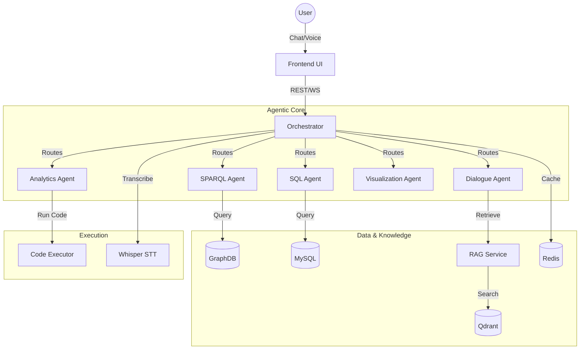

# OntoSage 2.0 Documentation Portal

Welcome to the official documentation site for **OntoSage 2.0** — an Agentic AI platform for Intelligent Buildings.

OntoSage 2.0 is designed to bridge the gap between complex building data (Ontologies, Time-Series, Metadata) and human users (Facility Managers, Researchers, Students) through a natural language interface.

## 🚀 Key Features

*   **Multi-Agent Orchestration**: Specialized agents for Dialogue, SPARQL (Ontology), SQL (Time-Series), Analytics, and Visualization.
*   **Hybrid RAG**: Combines Vector Search (Qdrant) with Semantic Graph Queries (GraphDB).
*   **Secure Analytics**: Sandboxed Python code execution for on-the-fly data analysis.
*   **High Performance**: Redis-based caching for conversation state and semantic queries.
*   **Robust Security**: Hardened SQL execution and deterministic analytics templates.
*   **Interactive UI**: React-based frontend with 3D Digital Twin and Plotly charts.

## 📚 Documentation Structure

### Core Concepts
*   **[Architecture](ARCHITECTURE.md)**: High-level system design, component interaction, and agent roles.
*   **[Workflow Deep Dive](WORKFLOW.md)**: Detailed "under-the-hood" explanation of how requests are processed, from frontend to agent execution.
*   **[Services](SERVICES.md)**: Catalog of all microservices (Orchestrator, RAG, Code Executor, etc.) with port mappings and dependencies.

### Guides
*   **[User Guide](USER_GUIDE.md)**: How to use the chat interface, voice commands, and interpret visualizations.
*   **[Developer Guide](DEVELOPER_GUIDE.md)**: Setup, testing, debugging, and contributing to the codebase.
*   **[Deployment](DEPLOYMENT.md)**: Instructions for Docker Compose deployment (Local & Cloud).
*   **[Building Onboarding](BUILDING_ONBOARDING.md)**: How to import your own building topology (Brick Schema/RealEstateCore .ttl files).
*   **[Configuration](CONFIGURATION.md)**: Environment variables and system settings.
*   **[Security](SECURITY.md)**: Authentication, authorization, and sandbox security.
*   **[Runbook](RUNBOOK.md)**: Operational procedures for maintenance and troubleshooting.

## 🏗️ System Diagram

## 🏁 Quick Start

1.  **Deploy**: Follow the [Deployment Guide](DEPLOYMENT.md) to start the stack.
2.  **Onboard**: Import your building data using the [Onboarding Guide](BUILDING_ONBOARDING.md).
3.  **Chat**: Open `http://localhost:3000` and ask "What is the temperature in Room 101?".

