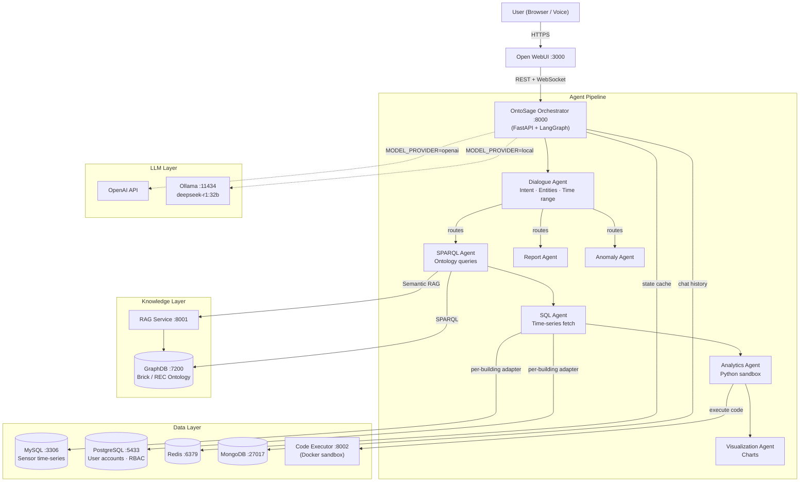

# OntoSage — Agentic AI for Intelligent Buildings

**OntoSage** is a production-grade, open-source agentic AI platform that enables natural language interaction with smart building systems. It translates plain English questions — from any user, with no technical knowledge of the underlying data — into real-time answers sourced from building ontologies (knowledge graphs) and sensor time-series databases.

Built on [LangGraph](https://github.com/langchain-ai/langgraph), [FastAPI](https://fastapi.tiangolo.com/), and the [Brick Schema](https://brickschema.org/), OntoSage bridges the gap between complex RDF ontologies and the people who need to understand what is happening inside a building right now.

---

## What OntoSage Does

A facility manager types: *"What is the CO₂ level in Zone 5.01 right now, and has it been above 1000 ppm this week?"*

OntoSage:

1. Classifies the query as an **analytics** intent
2. Retrieves the semantic context (zone topology, sensor types) from the GraphDB knowledge graph
3. Generates and executes a SPARQL query to find the relevant CO₂ sensor URIs and their time-series UUIDs
4. Fetches the last 7 days of readings from the MySQL sensor database
5. Runs Python analytics code in a sandboxed container to compute statistics and detect threshold breaches
6. Returns a formatted, human-readable answer with optional chart — no SQL, no SPARQL, no schema knowledge required from the user

---

## Core Capabilities

| Capability | Description |
|---|---|
| **14 Intent Types** | Routes sensor queries, analytics, anomaly detection, reports, exports, recommendations, forecasts, discovery, and more |
| **Zero-Knowledge Interaction** | Users need no knowledge of sensor IDs, ontology classes, or database schemas |
| **Multi-Building Support** | Per-building storage adapters support MySQL, PostgreSQL, TimescaleDB, InfluxDB, MongoDB, SQLite, Cassandra, and Redis TimeSeries |
| **Semantic Grounding** | GraphDB similarity indexing maps natural language to RDF entities |
| **Safe Analytics** | Python code generation executed in a resource-limited Docker sandbox |
| **Role-Based Access Control** | 6 roles, 20 permissions enforced at every API endpoint |
| **LLM Flexibility** | Switch between local Ollama models and OpenAI with a single environment variable |
| **Conversation Memory** | Redis-backed conversation state with 1-hour TTL; full history in PostgreSQL |

---

## Architecture at a Glance


```mermaid
graph TD
    User["User (Browser / Voice)"] -->|HTTPS| WebUI["Open WebUI :3000"]
    WebUI -->|REST + WebSocket| Orch["OntoSage Orchestrator :8000<br/>(FastAPI + LangGraph)"]

    subgraph "Agent Pipeline"
        Orch --> DA["Dialogue Agent<br/>Intent · Entities · Time range"]
        DA -->|routes| SA["SPARQL Agent<br/>Ontology queries"]
        DA -->|routes| RA["Report Agent"]
        DA -->|routes| AA["Anomaly Agent"]
        SA --> SQ["SQL Agent<br/>Time-series fetch"]
        SQ --> AnA["Analytics Agent<br/>Python sandbox"]
        AnA --> VA["Visualization Agent<br/>Charts"]
    end

    subgraph "Knowledge Layer"
        SA -->|SPARQL| GDB[("GraphDB :7200<br/>Brick / REC Ontology")]
        SA -->|Semantic RAG| RAGS["RAG Service :8001"]
        RAGS --> GDB
    end

    subgraph "Data Layer"
        SQ -->|per-building adapter| MySQL[("MySQL :3306<br/>Sensor time-series")]
        SQ -->|per-building adapter| PG[("PostgreSQL :5433<br/>User accounts · RBAC")]
        Orch -->|state cache| Redis[("Redis :6379")]
        Orch -->|chat history| Mongo[("MongoDB :27017")]
        AnA -->|execute code| CE["Code Executor :8002<br/>(Docker sandbox)"]
    end

    subgraph "LLM Layer"
        Orch -. "MODEL_PROVIDER=openai" .-> OpenAI["OpenAI API"]
        Orch -. "MODEL_PROVIDER=local" .-> Ollama["Ollama :11434<br/>deepseek-r1:32b"]
    end
```

---

## Documentation Structure

### Getting Started
| Guide | Purpose |
|---|---|
| [Deployment](DEPLOYMENT.md) | Deploy the full stack with Docker Compose in minutes |
| [Building Onboarding](BUILDING_ONBOARDING.md) | Connect your building's ontology and sensor database |
| [Configuration](CONFIGURATION.md) | All environment variables and tuning parameters |
| [GraphDB Setup](GRAPHDB_SETUP.md) | Create the semantic similarity index for your ontology |

### Understanding the System
| Guide | Purpose |
|---|---|
| [Architecture](ARCHITECTURE.md) | Component design, data flow, and design decisions |
| [Workflow Deep Dive](WORKFLOW.md) | Step-by-step trace of every request through the pipeline |
| [Services](SERVICES.md) | Every service: ports, health checks, dependencies, duties |
| [Project Structure](PROJECT_STRUCTURE.md) | Repository layout, file roles, coding conventions |

### Using and Operating
| Guide | Purpose |
|---|---|
| [User Guide](USER_GUIDE.md) | How to query, what to expect, example interactions |
| [Developer Guide](DEVELOPER_GUIDE.md) | Local dev setup, adding agents, testing, CI |
| [Security](SECURITY.md) | Authentication, RBAC, sandbox isolation, secret management |
| [Runbook](RUNBOOK.md) | Start/stop procedures, health checks, backups, troubleshooting |

---

## Quick Start (5 Minutes)

```bash
# 1. Clone the repository
git clone https://github.com/suhasdevmane/OntoSage.git
cd OntoSage

# 2. Configure (OpenAI by default)
cp .env.example .env
# Edit .env — set OPENAI_API_KEY

# 3. Start the stack
docker-compose up -d

# 4. Verify health
curl http://localhost:8000/health   # Orchestrator
curl http://localhost:8001/health   # RAG Service

# 5. Open the chat interface
# http://localhost:3000
```

For local GPU inference (Ollama), see the [Deployment Guide](DEPLOYMENT.md).

---

## Who Uses OntoSage

OntoSage is designed for every stakeholder in a smart building, not just IT teams:

| Role | Example Questions |
|---|---|
| **Facility Manager** | "Which VAV boxes are outside their airflow setpoints?" |
| **Sustainability Team** | "Show energy consumption trend for Level 3 over the last month" |
| **Occupant / Tenant** | "Why is the conference room so cold today?" |
| **Health & Safety Officer** | "Have any CO₂ sensors exceeded 1000 ppm this week?" |
| **Building Owner** | "What is the average temperature deviation across all zones?" |
| **IT / Data Scientist** | "Export all temperature sensor readings from yesterday as CSV" |
| **Compliance Officer** | "List all sensors in Zone B with their calibration metadata" |

---

## Research Background

OntoSage was developed as part of research at **Cardiff University** (Devmane, Rana, Perera) into zero-knowledge interaction with built environments. The system was evaluated across three real buildings with 81 participants and 5,916 pre-development survey questions. A full paper describing the methodology, corpus analysis, and evaluation results is in preparation for ACM IMWUT.

---

*OntoSage is open source under the MIT licence. Contributions welcome.*
